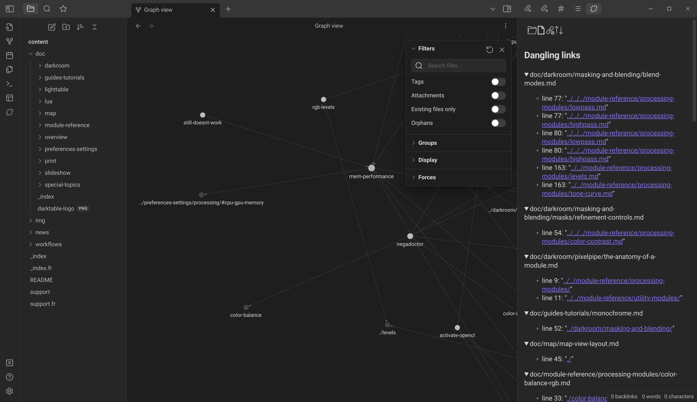
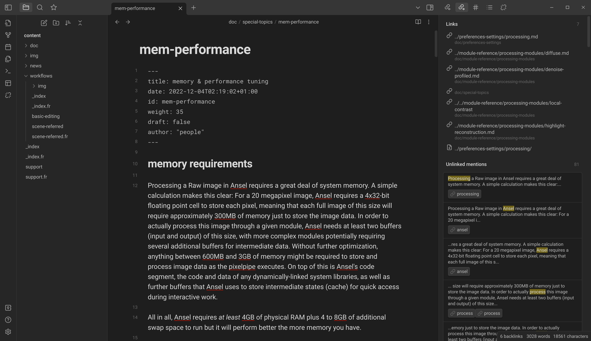
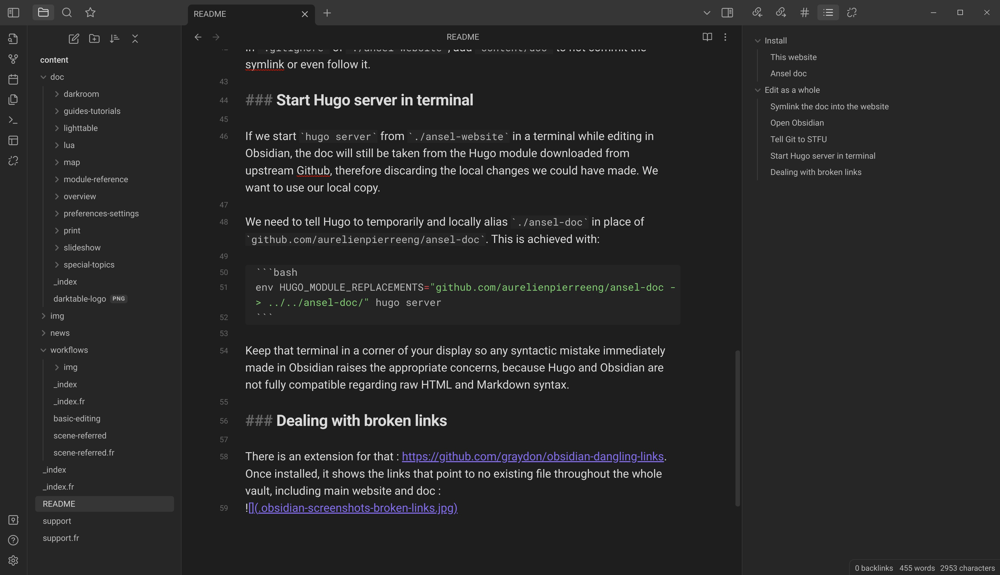

## Install

You will need Hugo v0.124.x minimum to build. You may have to install it manually because it probably isn't what you have in your distribution repository.

### This website

```bash
$ git clone https://github.com/aurelienpierreeng/ansel-website
# Stored for example in /home/user/dev/ansel-website
$ cd ansel-website
$ sh build-translations.sh
```

### Ansel doc

Ansel Doc is an important part of the Ansel website, but since it's under a different license and forked from GNU/GPL dtdocs, it can't be on this repo. We want to edit both as a pack but we need to be able to commit them separately on different repositories. Here is the solution.

Ansel doc is fetched automatically on your disk as part of the `build-translations.sh` above, which also auto-generates the translated pages through `.po` files. You will find it in the local folder of the website, under `_vendor/github.com/aurelienpierreeng/ansel-doc/_gen/LANG` (with `LANG`, the 2-letters language code). No file should be manually edited there, this is only for auto-generated content.

To edit Ansel docs, do

```bash
$ git clone https://github.com/aurelienpierreeng/ansel-doc
# Stored for example in /home/user/dev/ansel-doc
$ cd ansel-doc
```

And then, edit the (English) content of `ansel-doc/content`. Once you finished editing, you can update translations by running `tools/generate-translations.sh --no-translations` from the directory of the doc, and regenerate the translations with `tools/generate-translations.sh --no-update`.

## Interactive editing/Live preview

### Start the development server

Hugo lets you open a rendered version of the website, on a local server, to preview your changes into your web browser.

If you only want to edit this website, run from `./ansel-website` directory:

```bash
hugo server --disableFastRender
```

If you want to edit the docs as part of this website, after you cloned the docs (see previous step), run from `./ansel-website` directory:

```bash
env HUGO_MODULE_REPLACEMENTS="github.com/aurelienpierreeng/ansel-doc -> ../../ansel-doc/" hugo server --disableFastRender
```

This trick will load the docs module from your local folder rather than from Github, which means the local changes done to the docs will immediately appear into the main website.

### Open Obsidian

Open `./ansel-website/content` as an Obsidian vault. Obsidian is able to resolve folder symlinks as if they were local folders, so we basically see the website as a whole, which makes it easier to make internal links between doc and website in the editor.

Working in Obsidian is significantly nicer than working in VS Code to edit "text" text (as opposed to code text in monospace), since the editor is less bloated and monospace fonts are eye-straining after a couple of hours for full paragraphs.


### Start Hugo server in terminal

If we start `hugo server` from `./ansel-website` in a terminal while editing in Obsidian, the doc will still be taken from the Hugo module downloaded from upstream Github, therefore discarding the local changes we could have made. We want to use our local copy.

We need to tell Hugo to temporarily and locally alias `./ansel-doc` in place of `github.com/aurelienpierreeng/ansel-doc`. This is achieved with:

```bash
env HUGO_MODULE_REPLACEMENTS="github.com/aurelienpierreeng/ansel-doc -> ../../ansel-doc/" hugo server --disableFastRender
```

Keep that terminal in a corner of your display so any syntactic mistake immediately made in Obsidian raises the appropriate concerns, because Hugo and Obsidian are not fully compatible regarding raw HTML and Markdown syntax.

### Dealing with broken links

There is an extension for that : https://github.com/graydon/obsidian-dangling-links. Once installed, it shows the links that point to no existing file throughout the whole vault, including main website and doc :



In the node graph view, broken links also appear by their path `../../stuff.md` instead of appearing by their filename.

In each page editor, it is possible to see what pages are linking the page currently opened, including the headings anchor, which is useful before changing headings and therefore destroying internal links :


### Improving content meshing

Horizontal linking, through tags and internal links, is just as important as vertical linking, following hierarchical trees.

Obsidian can show the vault-wise available tags for reuse:


It can also show the best candidate internal links for each keyword in the page, under the "Unlinked mentions" collapsible:




### Checking content organization

It's often hard to follow the chaining of headings in a Markdown page, when using a typical code editor. Obsidian has an "outline" widget that allows to keep the table of contents in sight when writing, to ensure the hierarchy of headings is consistent :


