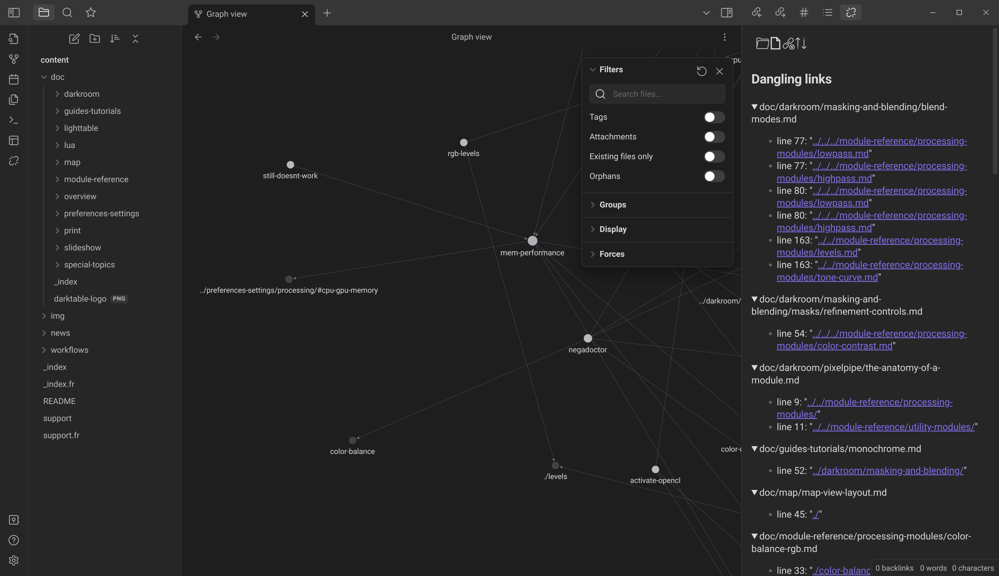
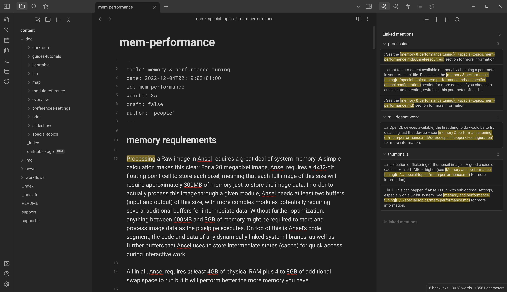
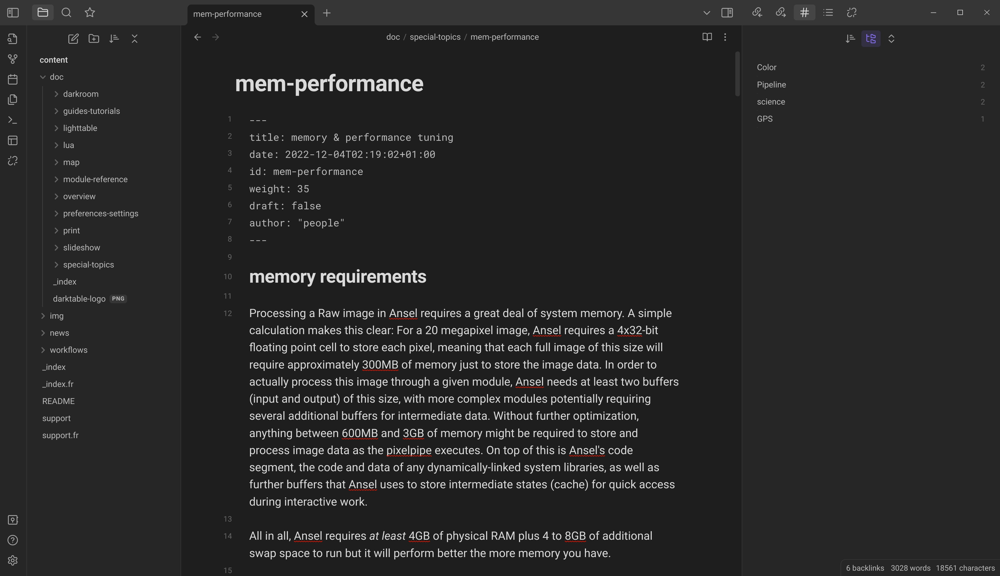
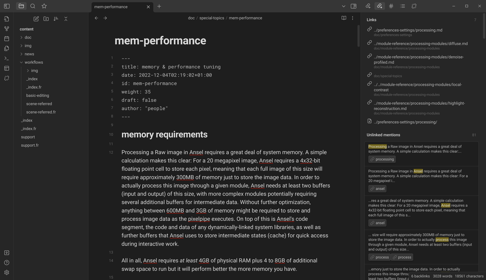
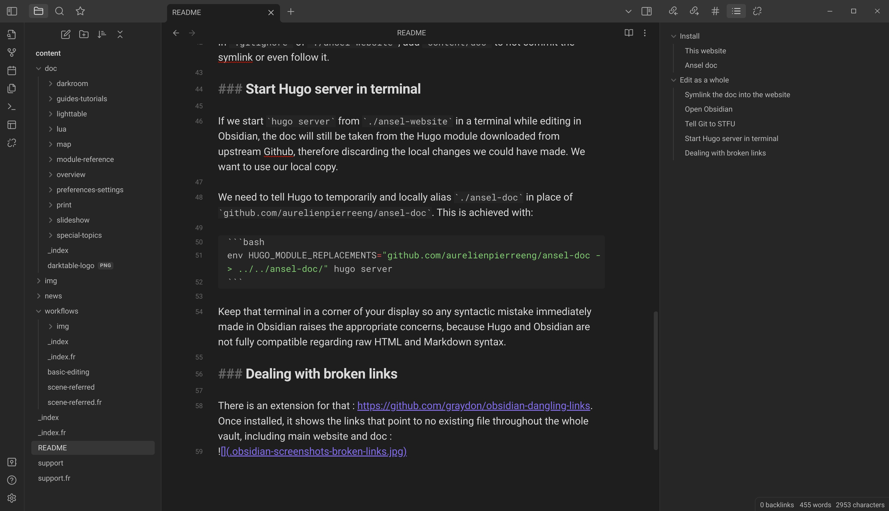
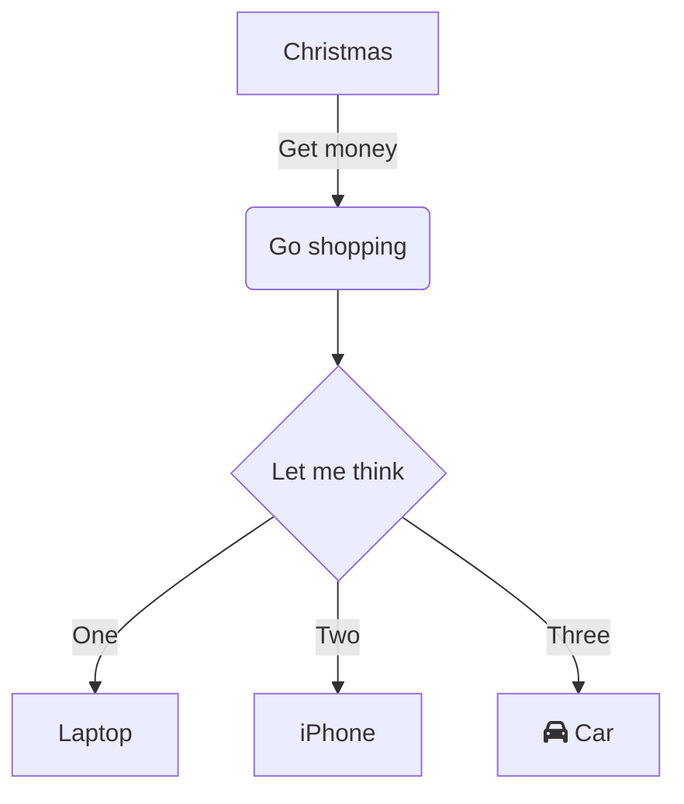

Ansel website is built using [Hugo 0.146](https://github.com/gohugoio/hugo/releases/tag/v0.146.7). This is a static website generator that allows to build very fast website from Markdown files. A custom template and a lot of custom shortcodes have been built for Ansel. You will need to [install Hugo extended version](https://gohugo.io/installation/) on your computer first, although minor changes can be made directly to the Markdown files without building the whole website.

## Getting the source code

### This website

```bash
$ git clone https://github.com/aurelienpierreeng/ansel-website
# Stored for example in /home/user/dev/ansel-website
$ cd ansel-website
$ sh build-modules.sh
```

### Ansel doc

Ansel Doc is an important part of the Ansel website, but since it's under a different license and forked from GNU/GPL dtdocs, it can't be on this repo. We want to edit both as a pack but we need to be able to commit them separately on different repositories. Here is the solution.

Ansel doc is fetched automatically as a module of this website on your disk as part of the `build-modules.sh` script above, which also auto-generates the translated pages through `.po` files. You will find it in the local folder of the website, under `_vendor/github.com/aurelienpierreeng/ansel-doc/`. No file should be manually edited there, this is only for auto-generated content.

To edit Ansel docs, do

```bash
$ git clone https://github.com/aurelienpierreeng/ansel-doc
# Stored for example in /home/user/dev/ansel-doc
$ cd ansel-doc
```

And then, edit the (English) content of `ansel-doc/content`.

## Interactive editing/Live preview

### Start the development server

Hugo lets you open a rendered version of the website, on a local development server, to preview your changes into your web browser.

If you only want to edit this website, run from `./ansel-website` directory:

```bash
hugo server --disableFastRender
```

If you want to edit the docs and see the results in realtime as part of this website, after you cloned the docs (see previous step), run from `./ansel-website` directory:

```bash
env HUGO_MODULE_REPLACEMENTS="github.com/aurelienpierreeng/ansel-doc -> ../../ansel-doc/" hugo server --disableFastRender
```

This trick will dynamically load the docs module from your local folder rather than from Github, which means the local changes done to the docs will immediately appear into the main website through your development server.

### Updating websites translations

See [Translating](./translating.md).

## Editing files

### Open Obsidian

Open `./ansel-website/content` as an Obsidian vault. Obsidian is able to resolve folder symlinks as if they were local folders, so we basically see the website as a whole, which makes it easier to make internal links between doc and website in the editor.

Working in Obsidian is significantly nicer than working in VS Code to edit "text" text (as opposed to code text in monospace), since the editor is less bloated and monospace fonts are eye-straining after a couple of hours for full paragraphs.

- Hugo Markdown doesn't support [Obsidian call-outs](https://help.obsidian.md/How+to/Use+callouts). You have to use the alerts boxes shown above as Hugo shortcodes, but they will not render in Obsidian,
- Hugo doesn't support [Obsidian wikilinks](https://help.obsidian.md/How+to/Internal+link), so you will have to stick to usual Markdown links with relative pathes. That said, Obsidian provides paths auto-completion for those.
- Obsidian doesn't support [Markdown definition lists](https://www.markdownguide.org/extended-syntax/#definition-lists), but you can still use them (they will just not be rendered in previews),
- Obsidian doesn't support [Markdown headings IDs](https://www.markdownguide.org/extended-syntax/#heading-ids),

However:

- Obsidian supports Hugo tags in Yaml frontmatter, and implements them in a much nicer way that gives a lot more sense to horizontal content linking,
- Obsidian supports Hugo [aliases](https://help.obsidian.md/How+to/Add+aliases+to+note) for pages redirection,

### Dealing with broken links

There is an extension for that : https://github.com/graydon/obsidian-dangling-links. Once installed, it shows the links that point to no existing file throughout the whole vault, including main website and doc :



In the node graph view, broken links also appear by their path `../../stuff.md` instead of appearing by their filename.

In each page editor, it is possible to see what pages are linking the page currently opened, including the headings anchor, which is useful before changing headings and therefore destroying internal links :




### Improving content meshing

Horizontal linking, through tags and internal links, is just as important as vertical linking, following hierarchical trees.

Obsidian can show the vault-wise available tags for reuse:



It can also show the best candidate internal links for each keyword in the page, under the "Unlinked mentions" collapsible:




### Checking content organization

It's often hard to follow the chaining of headings in a Markdown page, when using a typical code editor. Obsidian has an "outline" widget that allows to keep the table of contents in sight when writing, to ensure the hierarchy of headings is consistent :




## Guidelines

The documentation is not a manual or a course. It should answer the questions :

- "what is the GUI doing ?"
- "how can I configure the software ?"
- "what are the bottlenecks, caveats, limitations and traps ?".

The documentation expects the reader to know **what** to do and will explain **how** to do it. Start-to-end workflows, tutorials, scientific background etc., aka the **what** and the **why** go on the website ([resources](../../resources/_index.md), [workflows](../../workflows/_index.md)).

### Content folder

The content folder is located in the `content/` directory and the structure of folders and sub-folders will produce the structure of sections and sub-sections on the website. Files are written in Markdown and end with `.md` extension. Each file should have the following header (frontmatter):

```yaml
---
title: This page title
date: 2022-12-04T02:19:02+01:00
lastmod: 2022-12-31
draft: false
weight: 120
tags:
    - color science
    - pipeline
---
```

- The title is mandatory. Please use initial capitals, like in real language.
- The date is set once for all at the creation of the page and should never change after.
- Update the `lastmod` date with today's date everytime you update a file, and add it if not present. On the internet, every content is perishable and this helps readers to guess wether the page is still relevant at the time of reading or not.
- `draft` set to `true` means the page will be on the repository (in the source code) but will not appear on the website front-end. Set to `false`, the page is visible on front-end.
- `tags` are optional but welcome. The content is, by default, organized vertically (hierarchically). Tags help to create horizontal (thematic) links between pages. Relevant tags could be "film processing", "HDR", "monochrome", etc. Reuse existing tags in priority. Tags should always be a list, even when there is only one (otherwise Hugo build breaks).


### Internal links

Internal links should use relative paths from the current file whenever possible, which is not Hugo default behaviour. The purpose is to be able to follow relative links on the local file system from any modern text editor, like in any `README.md` file. We use our own code to reconnect those relative links to files with Hugo website structure (after compilation).

When building the website, internal links are checked and a critical error (aborting compilation) will be thrown if a page can't be found from internal links. You need to watch them out. Non-critical errors (aka `WARNING [languages] REF_NOT_FOUND`) can also be shown in a console because we twist the Hugo linker in a non-standard way, but those can be disregarded.

Example of internal links:

```markdown
[Filmic](../../module-reference/processing-modules/filmic-rgb.md)
[Filmic](./filmic-rgb.md)
[Some page](./section/index.md)
```

#### Page anchors

If you make links to page anchors, like `/my-post.md#some-heading`, be sure to __not__ insert a slash `/` between the page slug and the hashtag `#` in your Markdown code, or else the file will be taken for a directory and not found.

#### Absolute links

Say you want to link to the [support](../../support.md) page. Here are all the possibilitie to create a link to that page:

- `[support](/support/)` -> valid for Hugo, but works only after the website is compiled, so it can't be debugged easily in code editor. __please avoid__
- `[support](/support.md)` -> invalid for Hugo, will work as a side-effect of our custom link processing, but can't be debugged at all in code editor. __please avoid__
- `[support](./support.md)` -> invalid for Hugo, works as intended by our custom link processing if called from the index page, for example. __please use this__
- `[support](../support.md)` -> invalid for Hugo, works as intended by our custom link processing if called from a subfolder of the site, like `/contribute`. __please use this__

If a page is in what Hugo calls a [page or section bundle](https://gohugo.io/content-management/page-bundles/), please use the link to its `index.md` or `_index.md` file.

Do:
:   ```markdown
    [user manual](/doc/_index.md)
    [user manual](./doc/_index.md)
    [user manual](../../doc/_index.md)
    ```

Don't (even if it technically works):
:   ```markdown
    [user manual](/doc)
    [user manual](/doc/)
    ```


### External links

External links are not checked because that would take too much time at building, and building may happen without network access anyway. Always use `https://` in the external URLs when possible.

### Titles (headings)

H1 titles (encoded `# Title` in Markdown) are reserved for page titles and each page should have exactly one H1. darktable-doc messed up big time here by using H1 as section titles, this is both a SEO and an accessibility mistake. The web is semantic because it's designed for crawlers and screen readers just as much as for humans.

Be aware that Hugo automatically generates anchor links for headings, using the text of the heading. Thus, refrain from using symbols in headings, especially (back)slashes, which will mess-up the anchor links.

Also be aware that these headings anchors may be used in other pages to make direct links. Changing the text of an heading will break its anchor and may break external links. To avoid breaking anchors in external links, you can change the heading text but force their ID to the previous, like so:

```markdown
### My New Heading {#my-old-heading}
```

This will preserve external links to `/my-post/#my-old-heading`. [See the details…](https://www.markdownguide.org/extended-syntax/#heading-ids)

### Embedding images

Hugo treats images as page assets. There are global assets, for images reused on several pages, stored in an `assets/` subfolder of the main source code folder, and local assets, stored in the same folder as the page using them.

As for internal links, everything needs to be linked relatively to the source code as hosted on the local filesystem, not relatively to the compiled HTML.

See [how to translate images](../translating.md#translating-images).

### Screenshots

Screenshots are the basics of any front-end software documentation. The darktable-doc maintainers refuse them on the ground that they can't be translated and they will be soon be obsolete given the frequency of GUI hanges, but it's a huge pedagogic mistake. Even in the wrong language, screenshots help to see what to look for in the window. Use them. They will get obsolete and may not be translated, just as the rest of the text.

### Info, Warnings, Alerts

The Ansel theme from the main website provides shortcodes to create alerts and info boxes using Hugo templating system. Here is the code:

```html

This is where you say what users should be aware of, because what may sound like a good idea in general may be really bad in some circumstances.

```

```html

Your side note here.

```

```html

Your friendly advice here.

```

```html

This is where you remind users that they are free to do shit but there will be consequences.

```

The content of the boxes can use Markdown too.


### Before/after sliders

Again, using Hugo templating system, you can display before/after sliders where both images are overlayed. This resembles the Ansel & darktable darkroom snapshot feature and can efficiently explain the effect of modules and settings in a way that users can reproduce in the GUI. Both before and after images need to have the same size in pixels.

```html

Your slider legend goes here.

```

### Maths

The docs support MathJax configured for LaTeX syntax support. Though the goal is not to write scientific litterature, there are some algorithms made of multiplications and additions that are more easily shown as equations rather than writing blocks of texts.

Inline LaTeX should be enclosed in `$`, block equations enclosed in `$$`. If you use LaTeX, you need to notify Hugo to append the Mathjax script on the page by setting `latex: true` in the header/frontmatter of the Markdown page.

### Mermaid graphs

Ansel makes an heavy use of pipelines, and those are best described with flowcharts. Mermaid.js is now supported natively on Github and within Visual Studio Code and is great for that purpose. You can [try it visually here](https://mermaid.live/edit#pako:eNpVkE1rhDAQhv9KmFML-gc8FLra7sXSQvdU9TDVcRPWfBBHlkX97002FNqcQp73mQzvCr0dCAo4e3RSnKrWiHCem1J6NbPGuRN5_rQdiYW2hm6bODwcrZildU6Z82PKH2JIlGsdYyRYKnPZEyrv_ruhTVRNjY6t6_6S09Vu4qVRHzKM_0-kp2C9NiMWI-Y9elGi7yADTV6jGsLaaxRaYEmaWijC1dDCHqcWsoTGyV57iZ4jXtP8FiTrqcZvmuZksV-CH2lYew9f4ML282Z6KCLKYHEDMlUKQ1H695EGxda_pQbvRWbg0HxZGyIjTjPtPxIKcek) and copy-paste the code of the graphs within Markdown code blocks like this:

```markdown
    ```mermaid
    graph TD
        A[Christmas] -->|Get money| B(Go shopping)
        B --> C{Let me think}
        C -->|One| D[Laptop]
        C -->|Two| E[iPhone]
        C -->|Three| F[fa:fa-car Car]
    ```
```

This renders:



Icons from [Font Awesome v5](https://fontawesome.com/v5/search?o=r&m=free&s=solid) are supported by Ansel main website and documentation, using the syntax `fa:fa-YOUR-ICON-CODE` as shown in the example above. Use [Font Awesome v5 search engine](https://fontawesome.com/v5/search?o=r&m=free&s=solid) to get the `fa-` code of the icons you may use.

Mermaid graphs are rendered client-side in SVG at display size and can be translated as text. Hugo is configured to detect these graphs automatically and load the javascript library only when needed. Github can also render Mermaid graphs natively, when displaying Markdown files.


### Changing pages URL

Sometimes, it makes sense to reorganize the content and to changes the path of some pages. To not break external links, you must record the old url of the new page as an alias, in the frontmatter of the new page like so:

```toml
aliases:
    - /my-old-url/
    - /another-even-older-url
```

## Notes

### RSS feed

The documentation has an RSS localized feed, for now :

- https://ansel.photos/en/doc/index.xml,
- https://ansel.photos/fr/doc/index.xml.

This is unusual and is meant to help users keep track of changes and evolutions, by subscribing to the RSS feed or by connecting it with bots.

The date of the documentation pages set in the RSS feed is the `lastmod` parameter, aka the time of last modification. Since RSS doesn't have a `jast modified date`, it's the best I have found for the time being.
