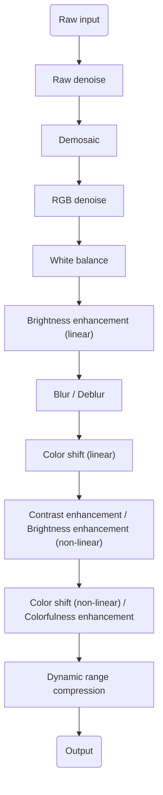
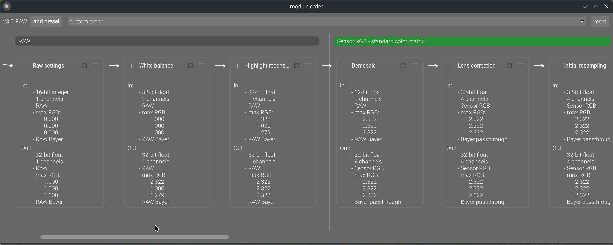
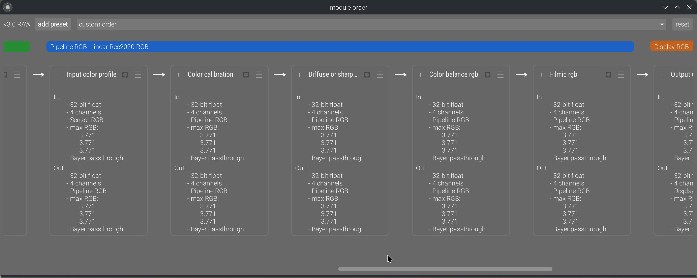

## Introduction

### Tools vs. Machines, Crafts vs. Industry

In his book, [_The Technological Society_](https://en.wikipedia.org/wiki/The_Technological_Society) (1954), Jacques Ellul presents the difference between the pre- and post-industrial revolution as follows:

The pre-industrial era is the reign of the tool and of craftsmanship. The foremost property of tools is to be generic, versatile, and adaptable. It is up to the craftsman to develop his skills to make the tools follow his intent, so the hand will make up for the limitations of the instrument. This concept is still well known to musicians today: you have to practice, learn, try, fail, retry… there are no shortcuts. Ellul emphasizes the idea of parsimony that comes with tools: resources are limited, so your toolset is pretty much defined by what you can afford, carry, master, and build locally. Trends change slowly and are local, because they use local resources and adapt to local needs, and tools follow the same pattern.

The industrial era is the reign of the machine. It comes from a culture of standardization and massification. The machine is much more productive because it is specialized for one task, but it is useless for everything else and can rarely be adapted to another use. When production needs change, the machine is replaced by another because it is good for nothing. This is not a parsimonious scheme anymore, and it is allowed because resources are much cheaper and mass production allows economies of scale. Then, humans become the servants of the machine, and handcrafts become a luxury.

Productions that use to be made at home or in small shops, in a family context, are moved to big factories, where there is enough room for machines. By the way, that had very concrete effects on how we organize our daily life, including when and how many times we eat[^2], as well as sleeping patterns[^1]. So it is not a stretch to say that the industrial revolution also deeply changed the way we think, what we consider normal or evident.

[^1]: Ekirch AR. Segmented Sleep in Preindustrial Societies. Sleep. 2016 Mar 1;39(3):715-6. doi: 10.5665/sleep.5558. PMID: 26888454; PMCID: PMC4763365. [URL](https://pmc.ncbi.nlm.nih.gov/articles/PMC4763365/)

[^2]: Grignon, Claude. La règle, la mode et le travail : la genèse sociale du modèle des repas français contemporain. In Le temps de manger, édité par Maurice Aymard, Claude Grignon, et Françoise Sabban. Paris: Éditions de la Maison des sciences de l’homme, 1993. doi:10.4000/books.editionsmsh.8155. [URL](https://books.openedition.org/editionsmsh/8155)

That spoke to me because it's how I had been developing color-editing tools, intuitively, since I started: trying to build generic tools that relied on the fewest assumptions to stay versatile, while giving fine-grained control over image parameters, and ultimately relying on craftsmen's abilities rather than on half-broken, unvalidated, auto-magical tools that only work in ideal cases.

### Digital photography : automating or enjoying the process ?

I have never understood the passion of many photographers, especially the most technophile, for push-button workflows and automated procedures. I have learned and taught the piano, and I'm used to the _shut up and practice_ paradigm : training to develop and maintain agility, and then repeating the same few bars again and again until the sound is right. Working the quality, the texture and the expressivity of the sound, through the amount of weight you put on the keys, the speed of the attack, the motion of the wrist and forearm. Using your body for fine motion and training it beyond its current abilities, turning very unnatural gestures into reflexes. And finally, learning to hear in your mind the sound you are reaching for, before even moving your hands. All those things that will never be reducible to GUI sliders and buttons, metrics, variables, or algorithms.

The way many photographers approach photo editing sounds like they got punished by digital photography because they now have to use a software to get their photos. So it should be reduced to a soulless procedure where everything should be automated if it can be. We exchange presets and recipes, some even sell them. And now we have AI to emulate one style or another. Where is the joy in industrialising artistic creation ? What is the point of having a hobby that feels like the burden of having to develop your photos ? Art is a process, not a procedure. What sick mind would design a robot that does pottery, engraving or floral arrangements in your place ? What about using software as an opportunity to finish the look of your images according to your taste and sensibility ? Have we lost the raw pleasure of doing things ourselves, even badly ? At what age is this appetite lost ?

Granted, fighting against a photo-editing software is a frustrating experience, but you need to understand what you are fighting against. Is it just the intrinsic difficulty of your craft and your lack of skills, or is it the poor design of the tool ? When you struggle on a 25 k€ piano that just saw the piano technician, you know the instrument is not the problem. But with software, how do you know ? Well, you can't until you fully commit to the _shut up and practice_ paradigm. Good retouchers will get good results out of any software, the difference is in how much time that will take them. And, well, sometimes you have to do a lot of cover up for the broken color models of editing applications.

### Tools in the photo-editing GUI

In terms of UI design, the parsimony of generic, versatile tools is the best way to avoid getting overwhelmed by dozens of features that hide each other, overlap in functionality, and just pollute your visual field. It's software feng shui. But then, the nature of the tools shifts a bit. 

There are two ways of thinking of image processing color controls : from their functional use, and from the way they allow to manipulate color properties. From their functional use :


| Function | Methods |
| ----------- | ------ |
| __Denoise__ | Wavelets filtering, non-local means, bilateral filter, guided filter, diffusion, |
| __Deblur__  | Richardson-Lucy deconvolution, Gaussian/Laplacian pyramid, high-pass filter, wavelets filtering, counter-diffusion, unsharp mask |
| __Blur__ | Wavelets filtering, diffusion, bilateral filter, guided filter |
| __Brighten__ | Exposure correction, tone curve, power ("gamma") transfer function, channel mixer |
| __White balance__ | Channel-wise normalisation, chromatic adaptation transform, channel mixer |
| __Color shift__ | Channel mixer, lift-gamma-gain, slope-offset-power, hue rotation, LUT |
| __Colorfulness enhancement__ | Saturation, chroma, vibrance, LUT |
| __Contrast enhancement__ | Tone curve, sigmoidal transfer functions, range normalization ("levels"), LUT |
| __Dynamic range compression__ | Same as contrast, but in "reduce" mode instead of "increase" mode |


Note that color shift could be resplit into two modes: corrective (which calls for light models) and creative (which calls for perceptual models). We won't go that far.

If we approach the same list from the other entry point, the way they allow to manipulate color properties, we get :


| Method | Functions |
| ------ | -------- |
| Wavelets filtering | __Denoise__, __Deblur__, __Blur__ |
| Diffusion |  __Denoise__, __Deblur__, __Blur__ |
| Channel mixer | __Brighten__, __Color shift__, __White balance__ |
| LUT | __Contrast enhancement__, __Color shift__, __Colorfulness enhancement__ |
| Tone curve | __Brighten__, __Contrast enhancement__, __Dynamic range compression__ |


I did not redo the whole list but you get the idea : whether you want to classify your list of tools by method or by function, you don't end up with a 1:1 match, except for a few ones. So none of these mappings allows you to systematically factorize your tools into unit GUI elements, as to honour the principle of parsimony.

And then, image processing is not just a set of tools in a box, it's actually a pipeline of pixel filters that need to be inserted as graph nodes in an order that matches the input requirements of the filters. Here you go (simplified):

And, last but not least, the problem nobody sees: the math. For example, a guided filter applied to an opacity mask and guided by the RGB image (as in Ansel/Darktable mask refinement) doesn't have the same math as a guided filter applied to a luminance mask and guided by itself (as in the tone equalizer), or a full RGB image guided by itself (as in dehaze). Those need to be implemented several times, with different types of inputs and different kinds of optimizations. The same applies to methods working on non-demosaiced images: we have to account for the fact that we don't have a full RGB signal at each sensel, and XTrans arrays need special math different from Bayer.

So, given that:

1. functionalities have different methods,
2. methods can't be reduced to a single functionality,
3. all of them are inserted as nodes in a pipeline where order matters,
4. methods have implementation variations depending on their input signal, i.e. their position in the pipeline,
5. users want to have fun without having to learn anything,
6. GUI clutter serves nobody and tires everyone,

__…we have a problem: how to split features and organize them as a coherent GUI?__

In a professional setup, where you can expect users to know how to build a pipeline by themselves and understand the ins and outs of its nodes, you can go the DaVinci Resolve way and build a nodal editor. Then you build one node per method, and handle internally the implementation variants by checking input signal type. This is the most minimalistic way, because there is zero GUI duplication: just a bank of nodes, and nodes can be set in parallel rather than forced sequentially. But it requires expert users.

The Lightroom/Capture One way is to completely hide that there is even a pipeline, and provide a flat GUI. Then multi-instantiation of nodes is done through masks: adding new masks lets you assign them a subset of the software controls to selectively edit the masked regions. But that also comes with the fact that none of these applications allow scene-referred linear editing, which makes blurring, deblurring, denoising, and actual mask transitions wonky.

Ansel is on a middle path. First, there is a prototype nodal editor now:

This allows us to explicitly show the pipeline order, reorder it manually, and change ordering presets, in a way that also shows inputs and outputs. Previously, we only had the stack of GUI modules in the right sidebar, which sort-of suggested pipeline order if read as a layer stack, but it was often misused by users as a mere GUI toolbox reordering convenience.

And then, the feature splitting is hybrid:

- _Contrast equalizer_, _local contrast_ and _diffuse or sharpen_ modules are intrinsically dual in their nature: they can increase or decrease local contrast and sharpness depending on their parameters. The _contrast equalizer_ even has a denoising method, which makes sense because sharpening increases noise, so the right place to keep it under control is where it gets created. __Those are method-first modules__.
- _White balance_ duplicates the functionality of the _color calibration_ chromatic adaptation part. _White balance_ is a simple channel-wise normalization that happens in sensor RGB, and is needed by some demosaicing methods (especially for XTrans sensors), while _color calibration_ performs a much more perceptually accurate illuminant compensation in CIE CAT16 space. That space is defined from CIE XYZ 1931 space, which we get only after input color profiling (and that requires a demosaiced image to work). There are different reasons and needs for both, and they must sit in different places in the pipeline. __Those are pipeline-first modules__: while they seem functionally similar, their reasons for existence and their internal requirements (and completely different math) make them much more different than you might think. The same applies to the various denoising modules: some work on RAW input, some don't, and some work better on non-linear signals.
- _Color balance_ was designed as a one-stop color module, applying an extended [ASC CDL](https://en.wikipedia.org/wiki/ASC_CDL) (slope-offset-power), and then handling global and luminance-wise saturation and chroma, therefore replacing previous Darktable modules like _contrast-brightness-saturation_, _vibrance_, and _velvia_ (all working in CIE Lab 1976). Taken alone, __it is a functionality-first module__, but it is not the only color-shifting module. The other color-shifting modules use very different methods (matrices, LUTs, or hue-wise controls), that are [3 to 9 times](../complete-pipeline-overhaul/index.md) less computationally expensive to run, and operate in different color spaces.

Ansel inherits its concept of modules from Darktable: modules are at the same time a GUI toolbox widget and a pixel filter inserted somewhere in the pipeline. So, designing very small modules (feature-wise) will spawn a lot of high-level GUI widgets in the right sidebar, while designing very large modules will make fewer high-level widgets but they will be higher or use more internal tabs. The second option might still be preferable because high-level GUI modules act as trays, so fewer trays that are functionally consistent help better understanding the high-level feature split (like a table of contents).

But it doesn't stop there, because again… nodes. A module should be a set of color controls that are consistent as a multi-instantiated masked node in the pipeline. It's no good to pack a module with dozens of features where half of them are meaningful as global settings, and the rest only in the mask locality; they will only consume CPU cycles for nothing once instantiated.

And finally, there is performance. Color controls that need to work in some particular color space will need a back-and-forth color conversion, which will consume CPU cycles, so it's better for them to all run in the same module if they make sense together functionality-wise. Also, any new module will run a new loop over pixels, meaning it will move the image once more into CPU memory cache from/to the RAM. So, collapsing features into the same loop prevents additional I/O bandwidth abuse and helps with performance.

So, if we recap the whole list of constraints, here, it's a really difficult challenge to solve:

1. we should always strive to build the fewest GUI elements because a cluttered GUI makes __everything__ hard to find (and cognitively overwhelming): the best place to hide a tree is in the forest,
2. the clutter we build should be organized from global to local, generic to specific, frequently-used to niche, because it's the easiest way to reason about: thinking of the GUI structure as a "table of contents" is the best I have come up with so far,
3. but making it a rule of systematically splitting features based on functionality or based on method still ends up with duplications in both cases, unless we go in the full-node-editor direction, do everything method-based, and defer the responsibility of building pipelines to the expert user,
4. modules should be designed as __functionality-first__ whenever possible, but a lot of limitations apply :
    1. the input signal type, which determines the position in pipeline, and may force us to prioritize __pipeline-first__ and duplicate tools,
    2. the relevance and consistency of the set of module controls when multi-instantiated and masked: a module should be a consistent unit of editing workflow, not a holdall to squeeze everything. Especially, if it makes sense (workflow-wise) to apply a mask on only a subset of the module features, then this subset should be its own module,
    3. performance issues (color space roundtrip, gamut mapping of the output, I/O bandwidth): we can't think of user ergonomics solely from the UI side; runtime speed is part of ergonomics too,
    4. the mathematical nature of the operations realized : some methods (especially sharpening/local contrast) can have opposite effects depending on the sign of their parameters, some methods are poorly suitable to be grouped together in the same pixel filter,
5. finally, the amount of clicks/scroll steps needed to reach a frequently-used feature needs to be considered, because the generic -> specific axis is not always parallel to the frequently-used -> niche axis. So, while the generic -> specific high-level organization makes sense cognitively, it's not always the most ergonomic one.

All these adversarial requirements need to be arbitrated on a case-by-case basis, by looking at the entirety of the pipeline, otherwise we don't build a workflow application but a plugins registry. They live at the cross-roads between low-level programming, math, retouching workflow and UI ergonomics, and not one of these concepts is more important in general than the others. However, some of these constraints are more easily understood than others, which will make them receive a lot more attention, in a typical [streetlight effect](https://en.wikipedia.org/wiki/Streetlight_effect): keep chasing problems in the layer you understand while completely discarding their true origin because it touches a layer you don't understand/know nothing about. This is why it is a real pain-in-the-ass to work with "UX designers", because they typically don't have the background to look beyond the GUI and often don't care that there is an engine to control underneath the UI. You can't just choose to cancel gravity because you would like to remove the [pitch](https://en.wikipedia.org/wiki/Aircraft_principal_axes#/media/File:Aileron_pitch.gif) controller for simpler UI.

Design is a process of iterative refinements under user feedback. Some of these iterations will redesign macro to micro (global application architecture to module inner controls), and some will redesign micro to macro, until it converges towards unified semantics and coherent feature splitting. It's foolish to think that anybody will get in right in one pass, or to think that only one of the micro/macro levels need fixing. It's a bridge to build from both ends at the same time, and find a way to make them meet in the middle.

### The properties of good color controls

From my 17 years of experience editing pictures, and 8 years of experience studying and experimenting image-processing math, there are a couple of things I have learned about what is a good or a bad color control. By "color control", I mean some way to feed an user intent to a pixel algorithm that will edit a visual property of an image. Good color controls :

1. are orthogonal to each other, meaning one control changes one color dimension at any given time and doesn't force you to compensate on another control,
2. are evenly-scaled from a perceptual perspective, meaning going from "0" to "1" will change the visual result by the same amount as going from "1" to "2". This is unfortunately not always possible, because math and physics hate you.
3. scale gracefully as dynamic range increases, which discards pretty much all color appearance models (CIE Lab 1976, CIECAM 16, dt UCS 22), built for SDR on datasets recorded for painted colorpatches.
4. degrade gracefully as we increase the magnitude of changes, meaning they can get overcooked but can't change the image content and create artifacts,
5. preserve image gradients, meaning they keep the tonal and chromatic local variations as variations, instead of flattening them, making them overshoot (creating halos, fringes, noise, etc.), or reversing them.
6. allow artists to get as close as possible to their intent in the least amount of time.
7. are not duplicated.

From 1., we deduce for example that any kind of RGB tone curve is bad, because it will desaturate highlights and saturate shadows as a byproduct of the amount of (luminance) contrast you added, and you can't control (or decorrelate) the amount of saturation change you will get for the amount of contrast change you asked for, except by hacks like RGB ratios preservation or manually massaging saturation/desaturation through the tone curve application. This is the reason of existence for the _tone equalizer_, which corrects contrast by using a selective exposure adjustment instead of a tone curve.

From 2., we deduce that GUI controls should use color appearance models whenever possible.

From 3., we deduce that the color appearance models used in GUI __should not be used on pixel__ but should be converted so pixels are handled in RGB. This is a typical [model-view-controller](https://en.wikipedia.org/wiki/Model%E2%80%93view%E2%80%93controller) paradigm that is consistently ignored in all image processing applications. Apparently, there is a belief among developers that the pixel color model should match 1:1 the GUI controller colorspace.

From 4., we deduce that controls that are practically usable only on a small subset of their value range are using bad math, bad color models, bad priors. The failure modes are just as important as what happens when using the controls in their sweet spot.

From 5., we just confirm the point 3.

From 6., we raised a new problem : many photographers don't have a retouching/editing intent (as in: a visual endgoal), but only push and pull sliders in the direction that seems to make the image look nicer, and end up with an happy accident they would be unable to reproduce (or ditch the image for being unable to work it). In this case, there is no metric of success for the controls because there is no difference to compute between intent and result, since the intent is undefined. Which is why, when working with users feedback, we need to be critical and investigate who is speaking and from where. That is to say : not every user feedback is good user feedback (and years of experience is not a proof of anything by itself).

And 7. is merely a recall of the previous section : having to duplicate a setting is usually indicative of bad feature splitting, or you need to have a good reason to do so.

All of these are obviously the ideal cases to tend to. In practice, you have to evaluate different candidates and pick the best one, which will rarely fit all the requirements. But to evaluate competing candidates, you first need objective checkpoints and scales. Those are the checkpoints that have become obvious to me over the years.

### The properties of good editing workflows

I recall endless email chains, 9 years ago on the Darktable mailing list (now defunct), regarding how best to reorganize the GUI, in which I was told : "there is no right or wrong workflow, only personal preferences". Absolute relativism is always more dumb than it sounds. That stupidity now carries on on discuss.pixls.us. It's really the same discussions, saying the same things about the same issues, going in loops for 9+ years, and still no tangible solution whatsoever.

First there is the obvious case where you define a parametric mask on, say, _color balance RGB_, and set it to mask-in RGB values between whatever and whatever + epsilon. Then, you are happy with colors, but your image looks a bit dark, so you go raise exposure. Now your parametric mask is invalid and you have to redo it again, because _exposure_ seats earlier in the pipeline than _color balance RGB_, so you shifted your whole range of RGB code values. __This is circular editing__, it is the most preventable loss of time, and if you want to prevent it, there is not much choice : you have to mind your pipeline order. __Circular editing is an objectively bad workflow__. Do I need to justify it ?

It doesn't stop to masks, because many color modules need to normalize HDR white to be able to use color models that can work only with the assumption that white = {1, 1, 1}. Which is why I put those later in the pipeline, after the global brightness and contrast adjustments.

And then, there is the __batch editing case__ : you have a series of images to edit, you want them to look consistent throughout the whole series, but they have minor variations in lighting, contrast, and color temperature. The only way to make that work is to have a first step of image normalization, to handle individual image variations and convert them to a constant state. Once this is done, you can batch-apply the same style or copy-paste the later modules history on top, because that next step will get normalized "constant" inputs and should therefore produce consistent (if not constant) outputs. Failing to achieve that first step of normalization will make the next one completely unreliable and unpredictable, which will defeat the purpose of batch editing. And even with that seemingly-rigid workflow, you will still end up having to do individual fine-tuning if you really want consistent results. __This is not my opinion, it's a simple fact : if you want consistent outputs for a set of image modifications with rigid settings, you need consistent inputs.__

But there is a limitation to that, because when working on HDR signal, you need to setup your HDR -> SDR tonemapping early, so you can actually see what you are doing in your image, without highlights clipping. So there is a first step of taking a view over your content, and then a step of finalizing the bounds of the dynamic range. Which means that you should always setup the global exposure first, looking at midtones (and nothing else), and then setup your working tonemapper for now. So that rule of trying to anchor your workflow 1:1 on pipeline order (itself anchored on input requirements of modules) has some exceptions and can't be applied without discernment.

Which means you should have learned all that. Good workflows come from people who thought about how to adapt to the tools they were using, by looking at them both from the practical and the theoretical vantage point, and not from the happy campers who misconstructed all the habits they took over the years for a workflow. Again, there are things happening beneath the GUI surface, we are not writing letters in a word processing app. For 9+ years, I have been yelling in loops on forums: IT'S A PIPELINE, NOT A DISCONNECTED SET OF RANDOM IMAGE CONTROLS. Order matters. If there is only one thing you understand in this whole blabbering, it should be this one.

And I think Lightroom has done a lot of damage to user's expectations and comprehension by hiding its internal pipeline. But it works for Lightroom because it removes a lot of degrees of freedom to users. Darktable has reused a lot of Lightroom UI semantics while proposing gradually more freedom and direct control over the pipeline nodes (introducing over the years module-wise masking, then module multi-instanciation and relative instances reordering, then raster masks reusable between non-consecutive modules, and finally full module reordering), which has confused old-timers and newcomers alike.

The idea of a pipeline is not even specific to digital photography. Oil painting also has a pipeline of sorts, where you start by preparing your support, coat it with primer to make it less absorbing, then put the outlines, then prepare the background, then layer [your glazing](https://evolveartist.com/blog/how-to-glaze-an-oil-painting/) and finally put the varnish coat. Nobody in his right mind would start with the varnish and end with the primer. Analog photography has obviously a pipeline of chemical bathes, timers, and such. And painting apps like Photoshop, Gimp or Krita have an explicit pipeline, materialized by layers which occlude each other, down to top, with effect layers that are nothing else than parametric pixel filters producing dynamic outputs.

But somehow, raw photo-editing software making it seems disconnected from material realities, it seems ok in digital to work without structure nor method. The "non-destructive" editing workflow might also have been interpreted liberally as [YOLO](https://en.wikipedia.org/wiki/YOLO_(aphorism)) here, which is not helping either. Just because you got <kbd>Ctrl+Z</kbd> doesn't mean everything is suddenly forgiving.

To summarize, good editing workflows are the ones that give you predictable results at each step while avoiding circular editing. They need to be informed by pipeline order, but they can't stick 1:1 to it all the time, and you have to use your judgment to distinguish when to stick to pipeline and when to drift. That leaves very little room for personal preferences.

### The ethics of digital image processing

In analog times, artists worked with physical media, and could perform all sorts of hacks and find new techniques to achieve custom results. It was accessible because you could physically touch the medium you were working with. Artists were free.

Digital art is inherently violent, insofar as it has removed freedom from artists: now they can't find new techniques by themselves, because their art exists as pure information on some computer memory, so they are limited to what the applications propose, and can either beg software editors/developers to consider their needs, or learn how to code and code them themselves (which is quite an entry fee if you have no technical background in applied sciences or computer science). The loss of freedom can be hidden by the fact that anything done in software is reversible, so photographers don't permanently damage negatives, for example. Worse, software can make you more productive, so it's a net win from a business point of view. But it shouldn't hide the fact that artists are put in a more passive consumer position than before, and dominated by those who know how and want to code for them, who get to decide how they will do art from now on.

"Violence", "suppression of freedom", "domination"… You know where this is headed: it's called oppression. A sexy oppression that promises you to achieve professional results in just a few clicks without having to go to photography school. Or, in the context of free software, an oppression that seems benevolent and harmless because nothing to pay and built-in data privacy. But none of that is incompatible with the fact that, _we, the developers_ control what you have the right to do in/to your images, or not, because we control the code. Not because we have been elected by users, not because we are competent for the task at hand (by now, I have demonstrated many times here that the Darktable "team" was nothing but a bunch of clueless idiots with too much freetime), just because we have admin rights on some Github repository. That gives us power, and power comes with accountability.

This has been in the back of my mind for several years now, because it becomes an ethical conundrum too (on top of all the technical ones previously mentioned) to decide what features to add, or to remove, or to refactor. At the same time, trying to please everybody is not possible and would end up overwhelming everybody with lots of niche tools they will never use (again: hiding a tree in the forest). Then, it's also more code to maintain, so more work and a burden for the maintainers in the future, with more threats to the stability of the software. Building a Swiss-army knife that is constantly half-broken is not going to help anybody.

But it remains that removing controls for the sake of simplifying the GUI might just be removing freedom, if we are not sure that similar functionality continues to exist, one way or another, in the software. Artistic freedom is not a commodity, it's a necessary breath of fresh air in societies that are increasingly drifting into (techno-)fascism, once again.

Again, all that has to be arbitrated on a case-by-case basis. Letting image-processing apps go in all directions at once, trying to accommodate all needs in a single app, even the most peculiar, is going to build 5-legged sheep that are impractical to use for anybody. Which circles back to my first section: building generic, versatile and assumption-free tools that can be adapted to many different needs in a factorized way. Industry vs. craftsmanship.

Productivity is achieved through specialization (which, combined with standardization, unlocks automation), specialization is achieved through duplication, duplication creates GUI bloat and clutter, bloat and clutter are the enemies of UX and creativity. The conclusion of all that is: let's choose what is worth specializing, and thus hinder users' freedom. Therefore, productivity is the wrong paradigm: its natural conclusion is oppression.

The opposite of productivity is robustness and versatility. It might be slower (is it though ?), but we can handle a larger variety of cases with the same number of tools, without arbitrarily removing options, thus user's freedom. The concept of robustness has already been developed in the context of social and climate instability by Olivier Hamant, in his book [_Antidote to the cult of performance. Robustness from nature_](https://tracts.gallimard.fr/collections/olivier-hamant/products/tracts-n-50-antidote-to-the-cult-of-performance-robustness-of-nature) (2024). One of his main takeaways is that the cult of performance (or efficiency) only leads to competition, which promotes violence, and in the unstable times to come, we need cooperation. In a society that produces more than enough to cover everybody's needs (but poorly distributes it), performance doesn't win us anything except more profits (again, poorly distributed). But what it surely produces is burn-out, both in people and in ecosystems.

In software, burn-out can come from several things :

1. [technostress](https://en.wikipedia.org/wiki/Technostress) linked to too many applications, tools, standards and paradigms to adapt to,
2. [information overload](https://en.wikipedia.org/wiki/Information_overload), linked to a glut of GUI widgets and tools to navigate,
3. [change fatigue](https://en.wikipedia.org/wiki/Change_fatigue) linked to too frequent updates changing workflows.

To sum up, chasing up performance cascades into a series of drawbacks:

1. from a technical point of view, it means having to build more specialized tools cluttering GUI, which produces information overload,
2. from an UX point of view, keeping clutter and overload reasonable implies arbitrarily choosing whose needs will be covered (probably the majority) and whose needs will be ignored, which is removing artistic freedom to anybody deviating too much from mainstream : this is a first in art history, and no amount of software freedom makes it any less violent,
3. from a marketing point of view, only professionals need productivity, and right now they seem to prefer commercial software in large majority. There is no benefit for open-source to go "win new markets", it should rather strive to cover the left-behind niches. And also, professional photography is slowly dying since the 1980's, so I'm not sure it will stay a substantial market for much longer.

---

_That was a long introduction, but in a World where everybody thinks they can be a designer, it's necessary to completely state the full list of antagonistic design requirements in order to calm down those who think they are the next Leonardo Da Vinci, and give them a sense that the simple idea they got seems bright only because they don't have the full specification note. I have had too many of them in my mailbox and on my issue trackers._

---

## How it is handled in Ansel

_All screenshots have been done on a 15.6'' laptop._

### Global modules presentation

First of all let's recall how the general darkroom presentation [was redone](../modules-groups-redesign/index.md) :



- modules tabs got explicit names instead of cryptic icons,
- tabs are ordered (externally) in suggested workflow order, left to right, so users just have to follow the UI as a guide,
- inside tabs, modules are ordered in pipeline order (with a layer "over" logic, bottom to top), which is also the generally advised workflow order. The new "basic" tab is an exception, having modules sections : inside sections, modules are ordered pipeline-wise, but sections themselves are ordered workflow-wise (again, layer "over" logic, so bottom to top),
- the "pipeline" tab or the module order nodal graph disambiguate everything and show a direct view of the pipeline nodes with no intermediate reordering,
- the "favorite" tabs has been entirely removed, as it only pretends to solve bloat by adding more of it.

Meanwhile, central toolbars have been entirely removed, freeing a maximum amount of space for portrait images, on 16:9 and 16:10 screen where vertical real-estate is really more precious than horizontal. The use of a global menu has again allowed to remove many weird icon buttons from the toolbars, and replace them with explicit, textual menu items. So, in full-screen mode, you now loose only the global menu bar height :



Blending and masking options, being unified between modules, have been moved to the left sidebar. This frees up a lot of vertical space for modules, reducing the need for inner tabs and preventing a lot of clicking around. Note that the blending options are currently being rewritten, after the mask API has been entirely refactored, simplified and extended, so this is only a temporary view.

Ansel views are quite verbose, so to help distinguishing between constant text (labels) and variables (values), a syntax coloring has been introduced :

- constant labels are white,
- variable values are orange.

### Color calibration

In _color calibration_, the 3 tabs _R_, _G_, and _B_ have been merged into the same _mixer_ tab, which now fits entirely vertically. Same for _brightness_, _colorfulness_ and _B&W_ which are now merged into _outputs_.

The _mixer_ tab has now 2 alternative GUI modes, in addition of the typical one (now dubbed _complete_) ;

{}



{}

The _primaries_ view has been taken to upstream Darktable, except they made it a stand-alone module, which is stupid : the internal pixel maths are exactly a 3×3 matrix multiplication, which is what _color calibration_ is too, so there was no need for an additional module. This is again a problem solved in the wrong layer : it needed an additional GUI layer in an existing module, they made it a duplicated module.

Instead, Ansel implements it as a GUI layer, meaning the typical channel mixer parameters are converted back and forth to the primary view parameters, and the pixel maths of the module have not changed since 2021. For the sake of a fully invertible transform from the 3×3 matrix to the primaries view, an extra _gain_ parameter had to be added to mathematically close the transform.

The _simple_ view is something that I had on the backburner for several years : re-expressing the not-user-friendly mixer parameters in terms of hue rotation, chroma plane stretching (color contrast) and achromatic resizing. The _U/V stretch_ replace the legacy Darktable module [_color contrast_](https://docs.darktable.org/usermanual/development/en/module-reference/processing-modules/color-contrast/) that works in CIE Lab 1976, and push/pulled the a and b chromaticity. The _simple views_ goes further and lets you define your own uv chromaticity space using the _chroma (uv) axes rotation_ : when set to 0°, u is a green-magenta axis and v is a blue-yellow axis (similar to _color contrast_). But then, you can turn it in whatever you need, for example around -20°, the v axis becomes quite close to a color temperature axis, and the u axis to the orthogonal tint axis. I'll let you with the [documentation](doc/views/darkroom/modules/color-calibration/#simple-mode).

This mode is particularly well-suited to recover overwhelming blue stage lights, much more easily than with the typical channel mixer UI :


Photo © Reinout Nonhebel, 2018


1. through compressing the V axis, we compress the gamut heavily on the blue-yellow axis, which is much more gentle on the rest of the gamut than using a global chroma compression,
2. through compressing the U axis, we also compress the gamut on the magenta-green axis, but much gentler,
3. the achromatic coupling hue is set to deep blue. By increasing the amount of coupling, we remap a portion of blue into the achromatic axis, meaning we desaturate and brighten it at once, which helps a lot recovering it in gamut, while still preserving the overall blue feeling. Conversely, the complementary color gets darkened and resaturated, but since that opponent color is yellow, and we compressed the yellow-blue axis through V, then we end up roughly in the same place.

So this _simple_ coordinates rewrite of the channel mixer parameters yields 6 controls instead of 9, and they are much more meaningful and easier to control. This is a UX issue that was tackled purely from the mathematical side, because this is nothing more than re-expressing a 3×3 matrix in a new orthogonal eigenvector basis, rotated on the achromatic RGB axis, meaning it started purely from a linear algebra intuition. Because of the properties of this new eigenvector basis (which are imposed by design), I was able to remove dimensions and turn the remaining ones into more meaningful controls. Which is what I mean when I repeat that you can't solve UX issues by merely looking at the GUI.

### Split-toning RGB

The legacy Darktable [_split-toning module_](https://darktable-org.github.io/dtdocs/en/module-reference/processing-modules/split-toning/) worked in HSL space, which doesn't support RGB code values greater than 1 (so, no scene-referred). Also, mixing colors in HSL is wonky and feels like a toy filters when you start increasing the settings.

At the same time, the current chromatic adaptation scheme in Ansel assumes a single illuminant. However, real scenes always have at least two illuminants :

1. the main light source, which is the primary illuminant, and will mostly weigh on highlights and midtones,
2. colored surfaces bouncing light from the main source, and tinting it, which act as secondary illuminants, and will mostly weigh on shadows up to midtones.

So far, to handle this mixed-illuminants situation, you had to duplicate instances of _color calibration_ and mask them in/out. But trying to cut a binary mask (one region attributed to one illuminant, and the rest to the other illuminant) is brittle because it doesn't account for the light mix happening around midtones.

So the new _split-toning_ module in Ansel proposes two channel mixers and two color temperature corrections, and duplicates the new GUI modes from the _color calibration_. It lets you define the brightness of each illuminant, associates one color matrix to each, and computes a mix of both matrices to apply to each pixel depending on its luminance.


© Luc Viatour, 2016


_At that point, you may think I'm obsessing about concert photography, but it's only because stage lights are the most demanding setup and forgive no mistake in the color pipeline. Those have been unsolved issues for decades; blue lights have been known to break into magenta, and they are the ultimate color benchmark_.

Here, we adjusted highlights temperature for more natural skin tones, while preserving the overall blue surround in shadows. In such a scene, there is no white that you can sample, so targeting natural skin tones is the only guide. Then, you do your best to preserve the spirit of the stage lighting (keep blue blue), while minding the limits of your RGB gamut. For more details, see the [documentation](doc/views/darkroom/modules/split-toning-rgb).

### Color primaries

As I mentioned earlier, the Darktable _primaries_ module is a mere duplicate of the channel mixer with a different UI. But there are cases where massaging the whole color space through its primaries is damaging too much the low-saturation range that was perfectly valid. So, there was a need to affect primary and secondary colors (at the vertices of the gamut cube) in a way that excluded the center of the gamut, but still blending the effects smoothly between both regions and preserving image gradients.

This was achieved by building an RGB LUT in new module : _color primaries_.

{}
© Andrea ([source](https://discuss.pixls.us/t/sunset-on-brusvikken-darktable-filmic-vs-sigmoid/))
{}

This example was designed to make red and orange less overwhelming, but dramatically deepen blues, to showcase how stable the color transform is along edges between diffently-colored surfaces.

Since, internally, the module dynamically builds a LUT by shifting the color of control nodes, users get the possiblity to decide how far from the RGB cube vertices the control nodes sit, through the _gamut coverage_ slider. Then, 3 smoothing parameters allow to blend more or less heavily the color shifts in RGB, and protect more or less neutral colors from the shift. Finally, the module has a 3D LUT viewer:



The LUT viewer shows color shifts across the whole RGB cube from origin to destination. It can be rotated around the achromatic axis (azimut), or put in a chromaticity plane view (axis tilt = 90°). It can be zoomed, panned and rotated in 3D from mouse events, and sliced to get a better view at a certain depth. Finally, the generated 3D LUT can be exported under a `.cube` cLUT file to be reused in any software supporting those. For more details, see the [documentation](doc/views/darkroom/modules/color-primaries).

### Color equalizer

The Darktable "team" took my [second (unworking) prototype](https://github.com/aurelienpierreeng/ansel/pull/283) for _color equalizer_, didn't understand why it was not working, added post-filtering steps to hide the problems, and released it as if it was their own work, without as much as crediting me. They can keep it : it's shit. And I don't sign my name on shit anyway.

See, the problem of that prototype is that it applied the saturation shift in dt UCS 22 HSB color space, which [I designed in 2021](https://eng.aurelienpierre.com/2022/02/color-saturation-control-for-the-21th-century/). This color space is already used in _color balance RGB_ for saturation, and aimed at finding the right amount of darkening that should be applied to a color when increasing its "saturation" (actually, its chroma, in rigorous color-science terms), as to avoid degrading into unnatural fluo and neon colors, which are the typical pitfalls when adding a lot of "saturation". So, instead of the typical chroma setting that reduces colorfulness at constant luminance or lightness, this saturation formula darkens too. And while that works very well on flat color patches, the issue is images are not flat colored surfaces, but have gradients.

It was reported to me circa 2022 that the _color balance RGB_ dt UCS HSB saturation created a weird achromatic bright fringe between bright, saturated yellow autumn leaves and the deep blue sky behind them. The issue was, at the edge, yellow light from the leaves and blue light from the sky mixed into achromatic (as they should, being complementary colors) due to a slightly soft lens or atmospheric haze. The saturation algorithm darkened yellow and blue on each side of the achromatic fringe, but not the fringe itself, which now stood out brighter. And there is no fix to that; it's not an algorithmic bug: the issue is the color model, that accounts for perception but not for light mixing. So I was yet another author of another broken color space that took me months to develop and 20 hours of computation to numerically fit the parameters of the model.

Trying to implement a color equalizer reusing that same colorspace made these issues even worse because now the effect was driven hue-wise, which meant problems on two dimensions instead of one. To alleviate the problem, I tried to smoothen things out using RGB guided filters. But I couldn't quite find the magic formula to have a proper, robust blend. That's when the Darktable team decided to scavenge the shiny new thing off the shelf, and when I understood that this could only happen in RGB if it was to blend properly and preserve gradients.

{}
© baongoc124 ([source](https://discuss.pixls.us/t/sunset-scene-with-darktable-rawtherapee/23139))
{}

The _color equalizer_ inherits the same interactive cursor as the _tone equalizer_, for direct editing on the image by sampling the hue of the pixel under the cursor, and scrolling will automatically update the graph. Nodes can be freely added anywhere, and from the interactive cursor, adding a node at the current hue is done on right click. 

The _color equalizer_ allows to define a hue-wise color shift for shadows, midtones, and highlights. The color picker allows to see where a region sits between the tonal controls. This allows very fine-grained control which, along with the same 3D smoothing as _color primaries_ provides a very robust way of blending color shifts. The chroma noise that was the main issue, when defining dramatic color shifts, with the legacy Darktable _color zones_ (working in CIE Lab 1976) or with the previous prototype of _color equalizer_ don't show up anymore.

As with _color primaries_, this module dynamically creates a 3D RGB LUT that can be viewed and saved to `.cube` files just the same. For more details, see the [documentation](doc/views/darkroom/modules/color-equalizer).

### Drawing



Do I need to say more ?

Ansel implements now a prototype drawing module that allows you to draw raster images in a scene-referred pipeline from 32-bit brushes supporting HDR colors (>100%). Brushes support opacity and flow (same as Photoshop), random sprinkles, path smoothing, edge feathering, and can be used in painting, erasing, smudging and blurring modes. Brush size, opacity, flow and hardness can be mapped to Wacom pen pressure and tilt, or to generic cursor acceleration. They use proper premultiplied alpha and save layers into 16-bit float TIFF sidecar files that can be edited in most major drawing apps.

Several layers can be used by instantiating multiple instances of the _drawing_ module and composited to the image using generic Ansel blending & masking options. It can also be used to composite any kind of arbitrary layer coming from any software, as long as it is saved in 16-bit float as a layer in the Ansel TIFF sidecar file. The background image (before the module) can be exported as a background layer if you need a reference image to draw in another software and import the result back.

This was made possible by the new [pipeline architecture](../complete-pipeline-overhaul/index.md) that enabled a real-time mode. Granted, it is still not as fast as Photoshop because, at each brush stroke refresh, there are other modules running after _drawing_ in the pipeline.

That's the ultimate freedom of achieving everything buttons and sliders will never get you, whether it's dodging and burning, fixing damaged parts (clipped highlights, missing areas) or simply mixing photography and painting. For more details, see the [documentation](doc/views/darkroom/modules/drawing).

### Photographic grain

The legacy Darktable _grain_ module was really unsatisfactory, as it allowed only luminance grain and was applied on the lightness channel of CIE Lab 1976 color space. The results were odd, not matching silver halide in any way. I finally implemented the [stochastic grain synthesis](https://eng.aurelienpierre.com/2023/07/stochastic-photographic-grain-synthesis-from-crystallographic-structure-simulation/) that I developed in 2023 in a new module: _photographic grain_. This splits the light field into virtual silver halide crystals and simulates grain sensors stacked on layers. It works for B&W and color grain alike, though I had to take some distances with my initial article to handle color.

{}
© Alessandro Amato del Monte ([source](https://discuss.pixls.us/t/positano-boring-landscape-using-filmic-dt-3-0/14836))
{}

{}
© Alessandro Amato del Monte ([source](https://discuss.pixls.us/t/positano-boring-landscape-using-filmic-dt-3-0/14836))
{}

### Filmic

For several years, people have been telling me that the stupid Darktable modules _sigmoid_ and more recent _AgX_ were giving them a bit more control. And none of them has been able to tell me exactly _control over what_. So it took me a long time to figure it out.

_Sigmoid_ and _AgX_ are not revolutions, they are other filmics : 

1. you convert colors using a logarithm or a power shaper, 
2. you slap some S-shaped curve on top, 
3. then you do your best to unfuck what the tone curve has been doing to chroma throughout the process, 
4. and finally you undo the shaper. 

_Sigmoid_ and _AgX_ could have been alternative modes __inside filmic__ : they all go through the same steps with slightly different priorities and strategies. Doing so would have provided one single module for dynamic range compression, whith different modes depending on how much fine-grained control users wanted. Instead of that, they duplicated functionality and added GUI bloat, so users now have to choose between _base curve_, _filmic (RGB)_, _sigmoid_ and _AgX_ to achieve the same task, while none of those actually state the functionality they provide.

The one thing that _filmic_ does best is handling explicitely the boundaries of the dynamic range, which allows to use it for [black point compensation](../../workflows/printing/) when printing. The two others handle them as a byproduct of the contrast setting. Since the developers of the two others don't care about prints, you bet that relieves some constraints on the design, and removes some sliders in the GUI. The one thing that the two others do better is to provide manual color controls to unfuck saturation and hue shift issues through the tone mapping, but I really don't think that level of color granularity belongs in a __tone__ mapping feature : it's a completely flawed workflow and feature split.

Anyway, I finally figured out that the finer contrast control went from the fact that _sigmoid_ directly provides a _toe_ and _shoulder_ nodes control, while _filmic_ uses a global _latitude_ and _offset_ that is cumbersome to use since it links both. This was originally designed to map it to actual film stocks datasheets, because the latitude is a real film thing, in order to maybe emulate real filmstocks one day. That day never came.

So I solved the problem __in the GUI layer__ by adding a conversion between latitude/offset and highlights/shadows settings, and now _filmic RGB_ allows you to manipulate the toe/shoulder nodes position directly : 



No pixel math was changed in the process, the module parameters are still the same as before, no new module was created, it's just an intermediate GUI conversion step.

## Conclusion

All of the new modules support GPU offloading through OpenCL. They have been designed for robustness, and I think that goal has been achieved. They have replaced worse previous modules, working in CIE Lab 1976, that have shown their limits and flaws for a long time. You now run a full RGB pipeline in Ansel. Legacy modules are still in the program and will still run for old edits. Also, the colored sliders and hue graphs are color-managed using the display color profile.

The modules I have recently introduced are not shiny new toys to get excited about. They are the conclusion of years of thinking about a consistent, coherent feature splitting that helps the [scene-referred workflow](../../workflows/scene-referred/index.md). That scene-referred workflow is more complex than the previous display-referred one, if only because we need to normalize "white" before going into any LUT or perceptual colorspace, but it's the only way to tackle HDR images, proper alpha blending for masks, and physically-accurate pixel filters that simulate light mixing. Physically-accurate filters are robust and produce organic results, even pushed to dramatic settings. But they are often less accessible to newcomers and disturbing for experienced retouchers used to Lightroom and the likes.

This will be my last post on this website because I retire from development. It has cost me too much : too much stress, too many burn-outs, too many years spent fixing other people's shit and suffering from their bad decisions. I am tired beyond what you can imagine. I hate programming and I hate programmers. I know very few of them who program to build things or to solve problems, most just enjoy too much spending quality time with a computer, and turn into pyromaniac firefighters that you can't trust to design things. I hate technology and so-called "innovation": all of this is just a capitalistic scam designed for infinite growth in a World where resources are limited, and we pretend to solve problems created by technology with even more technology. That's insane. The open-source world inherits the same mindset, including the [techno-solutionism](https://en.wikipedia.org/wiki/Technological_fix), because that's the kind of brainrot 350 years of capitalism produce, even though FLOSS doesn't have the profits to justify it. It is full of lies and full of shit, because _libre_ means freedom only for engineers, and users can go to hell. The problem is, I use to believe in those lies, in those values : they were (and still are) mine. But realizing they are only empty words repeated in toxic "communities" of middle-aged white men with B.Eng, M.Sc and Ph.D was a brutal wake-up call. What do we _actually_ do to empower users who _actually_ need it ? At what point casually requiring to use the CLI is it empowering anybody who can't read code ? We are just contributing to deepen the divide between the computer-litterate elites and the peasants. Remember, we are doing photography software here, not a backend library, not a server infrastructure, but an end-user desktop application.

I have emptied my brain here, to log everything I have learned about image processing design, how I did it, and why. It's important to understand that users, and most developers, know only how one application behaves on their own images. For 8 years, I have received many pathological images that people sent me, showcasing flaws and limitations of the tools. I have around 45 GB of those images on my harddrive, right now. That gives a completely different perspective over actual problems than what all the happy campers may have : I'm the guy who knows what breaks and when. I'm the guy that problems find. I'm the project [Cassandra](https://en.wikipedia.org/wiki/Cassandra). And it's annoying to have to justify all the time, to people who don't see the problems, why _that thing that could be much simpler_ can't be much simpler because there are pathological cases where we need to adapt to input variability. To adapt to input variability, you need user parameters instead of hard-coded constants. Thus GUI bloat. The kind of GUI bloat you cannot avoid without harming usability.

__You can't evaluate the quality of a design if you don't know its requirements__. "Me likes" or "me no likes" is irrelevant. Nobody likes to wear a seat belt, it's still good design if you consider how many lives it saved. Any real critics can only be about how the proposed solution reached the goal, which can happen only if you know the goal. In image processing, the mixed nature of the requirements makes it hard to avoid diving into math and their hieroglyphs at some point, which is where you loose people. But that still doesn't prevent them from giving their useless opinion, starting by "I'm not a programmer"/"I'm not a mathematician"/"I'm not a color scientist"… "BUT"… [cue some random brain noise]. Doing open-source code, where everything is public, allows for that kind of noise all over the place : it's really tiring, and there are many times where I whished the source was closed, just to be able to work in peace. Most of those guys mean well and just want to be part of something, but contributing to information overload is not helping and only contributes to creating fatigue. Communication is where all teamworks looses productivity

Design is not about listening to what people like. If 65% of your test panel likes text written in red, and 72% likes text written over red background, do you write red text over red background ? That makes no sense. We are not doing politics and trying to please electors during a campaign, we are looking for long-term/future-proof solutions to problems. Design is about listening to what people need, which they rarely can clearly express, and finding ways to __factorize those needs__. So the only stats worth computing are on the usecases : how the software is used, what are the most common painpoints, and what is their root cause. Then fix the root cause, which may be far away from the actual manifestation of the problem. That too is a real and precious skill : following the thread of the issue, through hints and smells, to uncover the real origin, and not just patch the end issue or work around it. __"Listening to users"__ doesn't mean listening to every individual and giving them what they individually want : we are not providing therapy. It means listening to the whole userbase, and identifying the commonly-shared needs and pain points as to devise a factored solution that will cover the most needs with the least amount of technology. This doesn't imply to discard anybody deviating from the average by more than a standard-deviation, but those people may have to resort to methods that are not custom-taylored and optimized for their needs.

Design does not exist on an island : there are other image editing apps around. It is again difficult to assess when your design should copy others because users will be used to their UI semantics, and when you should drift apart because the problem you are trying to solve is too different from what the competition does, or your typical user is too different. Open-source is constantly torned between the temptation of copying 1:1 the commercial leaders they so dearly hate (but silently aspires to be), and the craving for outsmarting everyone while reinventing the wheel (often in a worse way). In all that, your Polar Star is to ask yourself, every hour of every day : what is the problem we are trying to solve, and who are the people who face it ? That's how you can adapt things to your audience, rather than falling into [cargo cults](https://en.wikipedia.org/wiki/Cargo_cult) and adopting solutions because they have been successful in a context you don't really understand and is not necessarily yours. 

My main takeaway from all those years is that applying color transforms to pixels in any other space than RGB is doomed to fail, as the _colorbalance RGB_ example shows : while it might sound like a great idea to decorrelate "color" (as in hue/chroma) work from tonal work, it will only ever be a matter of choosing your pain. Increasing chroma at constant lightness degrades colors into fluo, increasing saturation at constant brightness (thus darkening altogether) doesn't respect light mixing theory, and both produce chroma noise due to the instable nature of hue angles. But then RGB is not perceptually-even, and the green-ish range of any HSL/HSV hue scale takes up roughly 30 % of the space, while green is only 1/6th of the perceptual hue ring. The only solution is to handle GUI in perceptual color models, and convert, one way or another into RGB before applying to pixels. Which requires additional abstraction gymnastics for developers. And that's clearly not their strong suit, since the math level is quite low.

I already have a successor, but the future of Ansel will have to be [a cooperative](../../contribute/democracy.md) where users guarantee developers fair working conditions, and developers guarantee users their needs will be covered, reciprocating mutual responsibilities. We can't continue like that, it's not healthy. And, by "like that", I mean on one hand, the "hobbyist developer" with zero accountability, and on the other, the burning-out single dev living under poverty threshold to kinda make things happen. That paradigm has delivered everything it could, it can't be tweaked. The same causes will only lead to the consequences we already know : open-source sucks. If you want more, that paradigm will have to change. Open-source, on one side, is a dictature of developers (those who know and can) over users (those who need), but on the other side, it is exploitation of those who work by those who take. That only feeds mutual resentment, low-key despise and patronizing. Everybody looses.

The alternative is the current enshitification of corporate platforms and the technofascism it is currently enabling. You have been warned.