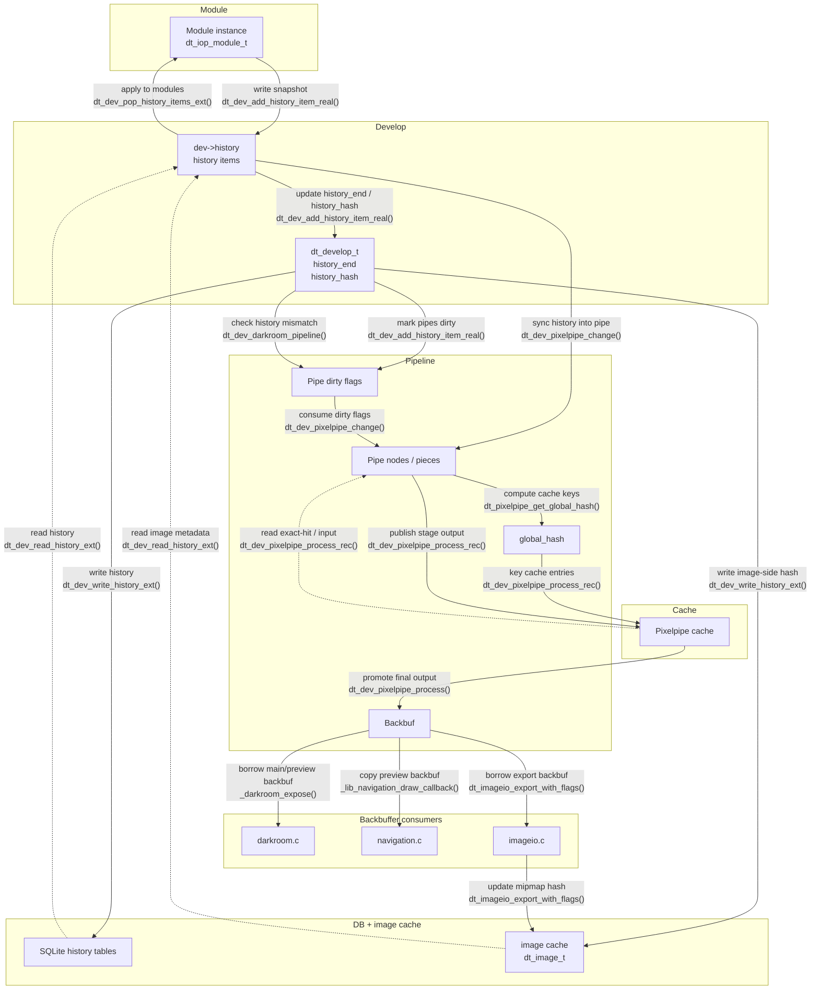
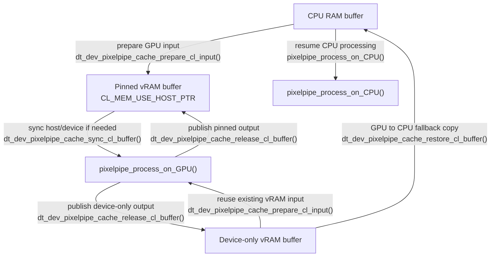
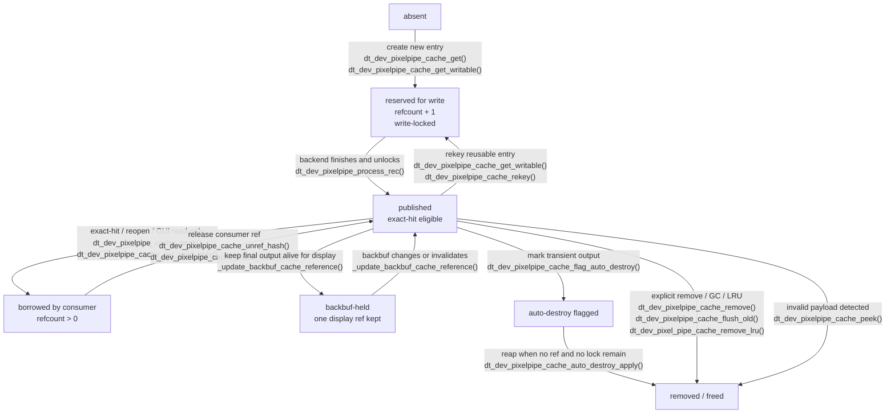

Since I started using Darktable, circa 2012, I have always been surprised by how little RAM it used. People think it is a good thing that an application uses the memory sparingly, and that is surely true if we talk about your desktop environment. But talking of a production software that does heavy pixel rendering on images from 12 to 54 Mpixels, this means the same heavy computations are done again and again instead of being saved to be reused later. That's what a cache is for : avoiding expensive computations. And it should use all the available RAM for that, because computing is wasting power, and that has a concrete impact if you are working on battery. Also, you paid for that RAM and using it doesn't empty your battery. The CPU/GPU on the other end…

Yes, photo-reporters and many digital nomads retouch on battery-running laptops, on location. It's time the opensource world realizes that not all photographers are sitting at their desk on evenings and week-ends, after their "real" daytime job. So, computing and recomputing the same things over and over again is simply wasting energy, whether your are plugged in the wall or runnnig on battery.

In the meantime, Darktable has always had that weird little RAM setting that allowed you to defined how much you wanted it to use. Except it had zero way of actually tracking how much RAM it used, so it was a guide more than a rule. That was later replaced by a completely idiotic qualitative "resources" preference that both means nothing and actually doesn't tell you how much RAM you allocate to the software.

So, the Darktable RAM cache has never really worked, was underused and there was a need to fix it. Because, as a result, everything was recomputed all the time for no reason.

But… There was a reason why the cache was underused and not really working : that software had zero visibility over the data lifecycle, which is kind of the prerequisite if you want to store data to be reused. That came from a pixel pipeline that was really convoluted (I truly wonder if anybody is able to draw the flowchart of what we do to pixels, start to end, among Darktable "developers"), but also from image metadata that were computed in several places, copied and stored (and then partially updated) in several places…

The pipeline cache had one purpose : allocating modules input and output buffers, and possibly reuse them if already available. But its size was defined in number of entries, which was really limited, and not in amount of memory allocated. That made it mildly useful and forced to use it way too conservatively, because its actual memory size was fully unpredictable.

Needless to say, "fixing the cache" implied "fixing the pipeline", which in turn implied "making the data lifecycle visible, trackable and managed globally", which implied to redesign the high-level architecture of the software. As we will see, this had unexpected benefits on performance, which largely surpass the module-wise internal optimizations that Darktable did in the same time.

## What changed since 2022

This article is the direct sequel to [Fixing the pipeline cache and 10 years-old bugs](/news/fixing-pipe-cache-10-yo-bugs.md). That previous chapter was about finding the rot and stopping the most embarrassing failures. This one is about what happened after that, when it became obvious that the cache bugs were not isolated bugs at all, but symptoms of a renderer whose responsibilities had been mixed together for far too long.

### Where this fits historically

The original problem was not merely "the cache does not cache enough". The actual problem was that the whole pipeline stack had grown around accidental behavior. GUI redraws could end up starting image processing, in an unregulated fashion. Mask preview leaked GUI state into the renderer. Histogram and picker logic depended on special pipeline side effects. Export, thumbnails, preview and darkroom all had their own little variations of "surely we can just copy that buffer one more time". And whenever consistency became hard to prove (during mask display or cropping changes), the fallback strategy was often to flush cache lines and recompute everything, because apparently "set it on fire and start over" counted as architecture for a while.

Some of the code comments were already saying as much. There were warnings about redraw-driven recomputation. There was even an old note saying the cache should eventually become global. So the last few years were not about inventing a new theory from scratch. They were mostly about finally doing the cleanup that the code had been begging for since the 2010's.

The key historical shift is that the pipeline stopped being treated as one recursive blob expected to discover its own needs while running. It was progressively split into clearer execution paths for interactive rendering, headless rendering, GPU processing, CPU processing and GUI-side consumers. At the same time, GUI behavior was pushed back to the GUI. Drawing became drawing again. Processing became processing again. That sounds banal, which is usually a sign that the previous design had become absurd.

### Checksums, or how validity stopped being a guessing game

Once the renderer was no longer entangled with every widget and every side channel, it became possible to define image state explicitly. Each history item now carries a module checksum built from module parameters, blend parameters and any relevant mask forms. That gives every module state a canonical fingerprint as soon as it enters history, instead of leaving validity to be inferred later from whatever happened to run.

That alone was not enough, because a pipeline is not just a pile of module settings. It also depends on order, region of interest, buffer contracts and display-related state. So the planning stage accumulates those module-level fingerprints through the whole chain and folds in the rest of the runtime contract before any pixels move. The result is a stable per-stage identity and a final pipeline identity.

This is where visibility finally appears. The pipeline can know whether it is still valid by comparing its history hash. The displayed backbuffer can know whether it still matches the current pipe and history state. A cache line can know whether it really belongs to the exact stage, ROI and parameters currently requested. That sounds almost offensively reasonable, but it required a lot of cleaning first: history synchronization with pipeline had to be made explicit, cache bypass had to be declared ahead of time (for mask preview and cropping edits), mask display could no longer mutate the rules halfway through execution, and the old redraw-triggered side effects had to go. You do not get reliable hashes on top of unreliable control flow.

The practical benefit is that consistency is no longer maintained by superstition. We no longer need to ask "did the GUI probably invalidate the right thing at the right time?" The answer is in the checksums. Either the state matches, or it does not. And we can grab any module output from the GUI layer, without running a pipeline, because the module checksum is predictable and can be computed ahead of rendering, or in parallel.

### The cache-first architecture

Reliable hashes change the architecture almost by force. Once every meaningful pipeline state has a stable identity known in advance, the cache stops being a best-effort optimization and becomes the center of the dataflow.

That is why the pipeline now has a real planning phase before execution. History is synchronized first. Regions of interest are propagated through the full chain. Each stage gets an explicit input and output contract. Host-side cache policy is sealed before runtime. Global hashes are computed before execution. In other words, the engine knows what it is about to do before it starts doing it, which is a refreshing break from the older method of finding out mid-flight and compensating with hacks.

From there, cache lookups become deterministic. A stage can reopen exactly the buffer that matches its state, so a module can bypass computations entirely by merely looking on the cache if a cacheline already matches its internal state as a checksum lookup. Downstream consumers can reopen published results by hash instead of asking the renderer to perform one more special dance just for them. The cache ceases to be a pile of vaguely reusable memory and becomes the authoritative registry of valid intermediate and final results.

This also explains why so much code could be removed or simplified. Once validity is centralized, you need fewer heuristics, fewer special branches, fewer "except when the GUI is in this mode" clauses, and fewer emergency flushes. The code gets shorter not because the problem got smaller, but because it stopped being solved in six contradictory places at once.

Cachelines also bind GPU and CPU memory, which allowed to use OpenCL pinned memory. There was an OpenCL user preferences that allowed to use pinned memory or not, since forever, but I discoreverd that option was used only for tiled processing, when modules couldn't fit their whole memory needs on the GPU. Pinned memory has been extended to normal operations too, as it allows to map RAM with vRAM memory without copy. Using pinned memory on a fully cached GPU pipeline reduces the time spent moving memory buffers by up to a factor 7.

But force-caching OpenCL module outputs, even with zero-copy pinned buffers, still has some cost, and is more costly than just skipping cache entirely. For some heavy modules (_denoise profiled_, _diffuse or sharpen_, _contrast equalizer_) the caching overhead is definitely worth it, but for fast ones (_white balance_, _exposure_, _input color profile_) the cost of caching OpenCL buffers made the whole modules run actually slower on GPU than on CPU.

So we have now per-module heuristics that decide whether an OpenCL module will publish its output buffer on the RAM cache. Heavy modules and all modules capturing color-picker or histograms are published by default. For the others, users can decide for themselves :



This will allow users to also disable OpenCL selectively on some modules when they have recurring problems with them. For example, _denoise profiled_ and _dehaze_ consume a lot of GPU memory and may fail during runtime for lack of available memory, even though the initial memory planning found it should be enough. When that happens, the module had already started computing for some time and will fallback to CPU. If that happens frequently, rather bypass GPU on that module all the time then take twice the penalty.

But it doesn't stop there. GPU buffers are kept alive on the GPU too. It means that restarting a partial pipeline from an OpenCL module gets the input from GPU directly when possible, without any copy from RAM. It also means that the lightweight modules are able to reuse their previous GPU buffer if it fits, instead of allocating a new one. This alone opens the possibility to have a realtime pipeline, needed for the new module [_Drawing_](../../doc/views/darkroom/modules/drawing/), with around 60-80 ms of latency between brush strokes and image updates. I would never have thought this would be possible at all.

The same memory reallocation is done on RAM since Ansel now hosts the whole cache on its own [memory arena](https://en.wikipedia.org/wiki/Region-based_memory_management). This scheme not only allows to pre-reserve a contiguous memory block from the OS when starting the application, leading to faster allocations, it also allows to ensure that we don't overflow the user-defined memory volume. So, when you decide to allocate 8 GB of RAM to Ansel, we now are able to ensure that this actually happens : we will fill all that volume until it's full, from where we start recycling the oldest buffers. All pixel buffers, module input, output, but also temporary internal scratchpads, are allocated on our memory arena.

And, last but not least, there is only one pipeline cache for the whole application, meaning all pipeline types (darkroom preview, darkroom main image, thumbnail export and file export) share the same cache. While this needed to be managed for multithreaded concurrent access, it means that if a pipeline needs a module output that was already computed at the same size by another pipeline, it can directly grab the cacheline and bypass its own recomputation.

To take advantage of that, the previously fixed-size darkroom "preview" (aka the downscaled version of the full image, used in the navigation widget, to sample histograms and color-pickers, and as a transient "blurry" fill-in when the main image is being recomputed) has been changed to be dynamically sized to the "fit" zoom level of the main image (the one displayed in the center of the darkroom). The result is only one image needs to be computed when you enter the darkroom, and zooming back to "fit" zoom is instant.

But, since that fixed-sized preview had been lazily used in many places in the GUI to remap cursor coordinates in widget space to full-resolution RAW image coordinates, by means of copy-pasting the same ugly block of code everywhere (copying even the comment saying "I don't understand what this does"), the whole coordinates system had to be redone to accomodate this change. And, again, those coordinates were computed only inside a pipeline, so the GUI had to wait for the pipeline to recompute (new) sizes to know where to position objects, which triggered GUI glitches especially when changing the cropping. But now, all that is computed ahead from an unified API, so no more silly copy-pasting times the number of modules.

### What that changed outside the core

The first external consequence is that copies stopped masquerading as features. Darkroom no longer needs a dedicated GUI backbuffer to display what the renderer already produced. It can grab the published image directly from the cache, bind a Cairo surface on it, and display it in a few milliseconds. Previously, the path was slower and copy-busy for no good reason beyond inherited design confusion. The Darkroom can also directly check if a given pipeline backbuffer is up-to-date with current development history, through checksums. Previously, that relied on a "dirty" flag that could be overwritten by several threads and prevented any "best effort" darkroom redrawing (as in: slap the last-known valid backbuffer pending the recomputation of the up-to-date one). This was important when user changed module parameters faster than the pipeline could recompute : we still need something to fill the view to avoid flickering.

The same logic now extends to export and thumbnails, which can reopen the final published result instead of rebuilding their own private reality. Histogram and picker code also moved away from piggybacking on pipeline execution. Scopes follow explicit completion signals from the preview path, cache their own Cairo surface against source state, and sample from cache-backed backbuffers directly. Raw histogram (sampled after _demosaic_ module) has been added to the old pipeline output on : switching between both doesn't require a pipeline recompute, neither does color-picking in either. That is a much more boring design, which is exactly why it is better.

Another major consequence is that pipeline flavors no longer live in isolated cache silos. Preview, darkroom, export, thumbnails and histogram consumers can now share cache state. That was the intent already hinted at long ago in the cache code; it just took a full cleanup of validity tracking to make it real. Once all those consumers agree on the same hashes, they can finally agree on the same buffers too. The benefit is one pipeline can reuse the already-computed cacheline from another pipe if it fits (same parameter, same input and output size). So the start of the darkroom pipelines have been switched to full-resolution : demosaicing and denoising will be slower when entering darkroom, but then zooming and panning become instant. And exporting an image will grab these early stages straight from cache too. By the way, exporting the same image twice at two different resolutions only recomputes from the scaling module, at the end of the pipeline.

Memory handling followed the same logic. Cache lines became refcounted, lockable, reusable objects instead of disposable blobs passed around through ad-hoc side storage. CPU and GPU paths now share far more of the same ownership model. On the OpenCL side, host and device buffers are managed with explicit lifetime rules, pinned memory is reused instead of churned, and RAM and VRAM stay synchronized through pinned and zero-copy transfers where possible instead of being mirrored through pointless intermediate copies. This does not make the GPU magically faster at math. It mostly stops the surrounding plumbing from wasting the gains.

The benefit is not just benchmark speed. It is also latency, robustness and energy use. Darkroom startup gets shorter because there are fewer copies and fewer duplicated passes. Zoom, pan, mask preview and history navigation stop invalidating half the universe just because proving correctness used to be too hard. OpenCL becomes less random because fallback, tiling and memory ownership are stated more explicitly. The software spends less time moving pixels around just to reassure itself that they still exist somewhere.

As a side effect, error handling has been improved in the pipeline. Modules that failed to allocate memory now immediately throw an error and abort the pipeline. Previously, allocation failures were not checked everywhere, and a whole pipeline could carry `NULL` buffer up to the end… or crash fair and square on `segmentation fault` errors. This is now prevented upstream in an uniform way across the whole software.

Color-picker sampling and histograms can sample data without triggering a pipeline recompute, by directly fetching the cache, if the requested cacheline exists. The global _scopes_ toolbox allows to choose from RAW RGB (sampled after _demosaicing_) or final pipeline RGB (either sampled after _output color profile_ in 32 bits float or in the backbuffer in 8 bits integers) : changing from one to another doesn't restart a pipeline but simply loads a different cacheline, and color-picking happens on that cacheline transparently.

### What was actually fixed by doing it properly

A lot of visible annoyances trace back to this redesign more than to any one micro-optimization. High-DPI ROI handling improved because geometry ownership became clearer and coordinates mapping between GUI and RAW image are now handled in a central API. History-to-pipeline resynchronization became less fragile because history stopped being an incidental side effect of GUI flow and became a first-class input to planning. Real-time mask preview no longer has to fight a cache model designed for another era. Histogram refresh became predictable because it now consumes published data instead of hoping the right intermediate buffer happens to be alive somewhere. Infinite loops, stale cache lines, invalid backbuffers and the classic "preview recomputed the full pipe from module 0 for no obvious reason" all become easier to diagnose once the lifecycle is explicit.

So the interesting part here is not that one big refactor happened in isolation. It is that a long series of cleanups finally aligned around one idea: validity should be computed, named and shared ahead of time. Once that happened, the rest followed almost mechanically. The cache became central because hashes were trustworthy. External consumers could stop copying because cache-published buffers became authoritative. CPU and GPU paths could share more state because ownership became explicit. And the renderer stopped behaving like a haunted house where changing one slider could wake up three unrelated subsystems and a redraw callback from 2013.

## Benchmarks

Benchmarks are done on both applications compiled locally with _Release_ build and GCC14 using their respective `build.sh --build-type Release` script. The hardware is a Thinkpad P51, with 8 × Intel® Xeon® CPU E3-1505M v6 @ 3.00GHz and GPU Quadro M2200, running on Fedora 41 Plasma with Wayland. Nvidia driver version is 580.105.08. Both Ansel and Darktable config files are set with [this script](https://github.com/aurelienpierreeng/ansel/blob/master/tools/benchmark_darkroom_rc.sh) to ensure the same config baseline. We show here the output of `ansel -d perf` and `darktable -d perf`. Those benchmarks can be reproduced on any computer.

The 45 Mpx test picture is taken from [here](https://discuss.pixls.us/t/backlit-hardcore-flaring-vintage-lens-fun/31270) and the editing XMP can be downloaded [here](./2022-06-17__DSC00078.arw.xmp).

### Initial loading in darkroom

Warning: in Ansel, it is important to run this test with no module focused in the GUI (that is, uncollapsed). In this situation, Ansel always caches the output of the previous module so we ensure that, when modifications are made in that focus module, we always restart computations from the immediate input. But forcing the cache like this triggers memory overhead that can be visible for lightweight modules.




```
4.474793 [dev_pixelpipe] took 0.000 secs (0.000 CPU) to load the image.
4.739267 [dev_pixelpipe] pipeline resync with history took 0.029 secs (0.026 CPU) for pipe virtual-preview
4.806027 [dev_pixelpipe] pipeline resync with history took 0.000 secs (0.000 CPU) for pipe virtual-preview
4.806089 [dev_pixelpipe] pipeline resync with history took 0.000 secs (0.000 CPU) for pipe virtual-preview
4.872758 [dev_pixelpipe] pipeline resync with history took 0.026 secs (0.036 CPU) for pipe preview
4.889006 [dev_pixelpipe] took 0.016 secs (0.037 CPU) initing base buffer [preview]
4.922294 [dev_pixelpipe] took 0.033 secs (0.031 CPU) processed `Raw settings' on GPU, blended on  [preview]
4.938778 [dev_pixelpipe] took 0.015 secs (0.018 CPU) processed `white balance' on GPU, blended on  [preview]
8.456387 [dev_pixelpipe] took 3.518 secs (3.549 CPU) processed `highlight reconstruction' on GPU, blended on GPU [preview]
9.052687 [dev_pixelpipe] took 0.596 secs (0.308 CPU) processed `demosaic' on GPU, blended on  [preview]
9.401928 [dev_pixelpipe] took 0.349 secs (0.201 CPU) processed `lens correction' on GPU, blended on  [preview]
9.498531 [dev_pixelpipe] took 0.097 secs (0.095 CPU) processed `Initial resampling' on GPU, blended on  [preview]
9.499987 [dev_pixelpipe] took 0.001 secs (0.001 CPU) processed `exposure' on GPU, blended on GPU [preview]
9.502353 [dev_pixelpipe] took 0.002 secs (0.002 CPU) processed `input color profile' on GPU, blended on  [preview]
9.503926 [dev_pixelpipe] took 0.002 secs (0.001 CPU) processed `color calibration' on GPU, blended on GPU [preview]
10.658713 [dev_pixelpipe] took 1.155 secs (1.115 CPU) processed `diffuse or sharpen' on GPU, blended on GPU [preview]
10.667555 [dev_pixelpipe] took 0.009 secs (0.009 CPU) processed `color balance rgb' on GPU, blended on GPU [preview]
10.673614 [dev_pixelpipe] took 0.006 secs (0.003 CPU) processed `filmic rgb' on GPU, blended on GPU [preview]
10.695368 [dev_pixelpipe] took 0.022 secs (0.012 CPU) processed `output color profile' on GPU, blended on  [preview]
10.742278 [dev_pixelpipe] took 0.047 secs (0.034 CPU) processed `dithering' on CPU, blended on  [preview]
10.753262 [dev_pixelpipe] took 0.011 secs (0.048 CPU) processed `display encoding' on CPU, blended on  [preview]
10.753354 [pixelpipe] preview internal pixel pipeline processing took 5.880 secs (5.464 CPU)
10.753476 [dev_process_preview] pipeline processing thread took 5.881 secs (5.464 CPU)
10.820855 [dev_pixelpipe] pipeline resync with history took 0.056 secs (0.406 CPU) for pipe full
10.824477 [dev_process_full] pipeline processing thread took 0.000 secs (0.000 CPU)
```



```
10,5815 [dt_dev_process_image_job] loading image. took 0,000 secs (0,000 CPU)
10,6799 [dev_pixelpipe] took 0,018 secs (0,029 CPU) initing base buffer [full]
10,6968 [dev_pixelpipe] took 0,017 secs (0,020 CPU) [full] processed `rawprepare' on GPU, blended on GPU
10,7094 [dev_pixelpipe] took 0,013 secs (0,011 CPU) [full] processed `temperature' on GPU, blended on GPU
14,4091 [dev_pixelpipe] took 3,700 secs (3,719 CPU) [full] processed `highlights' on GPU with tiling, blended on CPU
14,8078 [resample_cl] plan 0,000 secs (0,000 CPU) resample 0,010 secs (0,002 CPU)
14,8988 [dev_pixelpipe] took 0,490 secs (0,349 CPU) [full] processed `demosaic' on GPU, blended on GPU
14,9094 [dev_pixelpipe] took 0,010 secs (0,001 CPU) [full] processed `lens' on GPU, blended on GPU
14,9200 [dev_pixelpipe] took 0,010 secs (0,002 CPU) [full] processed `exposure' on GPU, blended on GPU
14,9516 [dev_pixelpipe] took 0,032 secs (0,010 CPU) [full] processed `colorin' on GPU, blended on GPU
14,9654 [dt_ioppr_transform_image_colorspace_cl] IOP_CS_LAB-->IOP_CS_RGB took 0,013 secs (0,000 GPU) [channelmixerrgb]
14,9902 [dev_pixelpipe] took 0,039 secs (0,006 CPU) [full] processed `channelmixerrgb' on GPU, blended on GPU
16,6800 [dev_pixelpipe] took 1,690 secs (1,745 CPU) [full] processed `diffuse' on GPU, blended on GPU
16,6923 [dev_pixelpipe] took 0,012 secs (0,007 CPU) [full] processed `colorbalancergb' on GPU, blended on GPU
16,7037 [dev_pixelpipe] took 0,011 secs (0,005 CPU) [full] processed `filmicrgb' on GPU, blended on GPU
16,7100 [dt_ioppr_transform_image_colorspace_cl] IOP_CS_RGB-->IOP_CS_LAB took 0,006 secs (0,000 GPU) [colorout]
16,7555 [dev_pixelpipe] took 0,052 secs (0,020 CPU) [full] processed `colorout' on GPU, blended on GPU
16,8435 [dev_pixelpipe] took 0,088 secs (0,052 CPU) [full] processed `dither' on CPU, blended on CPU
16,8525 [dev_pixelpipe] took 0,009 secs (0,066 CPU) [full] processed `gamma' on CPU, blended on CPU
16,8594 [dev_process_image] pixel pipeline took 6,197 secs (6,048 CPU) processing `2022-06-17__DSC00078.arw'

16,8918 [dt_dev_process_image_job] loading image. took 0,000 secs (0,000 CPU)
16,9470 [dt_dev_process_image_job] loading image. took 0,000 secs (0,000 CPU)
16,9968 [dev_pixelpipe] took 0,000 secs (0,000 CPU) initing base buffer [preview]
16,9986 [dev_pixelpipe] took 0,002 secs (0,002 CPU) [preview] processed `rawprepare' on GPU, blended on GPU
16,9995 [dev_pixelpipe] took 0,001 secs (0,001 CPU) [preview] processed `temperature' on GPU, blended on GPU
17,0698 [dev_pixelpipe] took 0,070 secs (0,081 CPU) [preview] processed `highlights' on GPU, blended on GPU
17,0811 [dev_pixelpipe] took 0,011 secs (0,005 CPU) [preview] processed `demosaic' on GPU, blended on GPU
17,0829 [dev_pixelpipe] took 0,002 secs (0,000 CPU) [preview] processed `lens' on GPU, blended on GPU
17,0853 [dev_pixelpipe] took 0,002 secs (0,001 CPU) [preview] processed `exposure' on GPU, blended on GPU
17,0886 [dev_pixelpipe] took 0,003 secs (0,001 CPU) [preview] processed `colorin' on GPU, blended on GPU
17,0915 [dt_ioppr_transform_image_colorspace_cl] IOP_CS_LAB-->IOP_CS_RGB took 0,003 secs (0,000 GPU) [channelmixerrgb]
17,0952 [dev_pixelpipe] took 0,007 secs (0,002 CPU) [preview] processed `channelmixerrgb' on GPU, blended on GPU
17,4667 [dev_pixelpipe] took 0,371 secs (0,354 CPU) [preview] processed `diffuse' on GPU, blended on GPU
17,4702 [dev_pixelpipe] took 0,003 secs (0,001 CPU) [preview] processed `colorbalancergb' on GPU, blended on GPU
17,4748 [dev_pixelpipe] took 0,004 secs (0,001 CPU) [preview] processed `filmicrgb' on GPU, blended on GPU
17,4776 [dt_ioppr_transform_image_colorspace_cl] IOP_CS_RGB-->IOP_CS_LAB took 0,002 secs (0,000 GPU) [colorout]
17,4939 [dev_pixelpipe] took 0,019 secs (0,009 CPU) [preview] processed `colorout' on GPU, blended on GPU
17,5141 [dev_pixelpipe] took 0,020 secs (0,007 CPU) [preview] processed `dither' on CPU, blended on CPU
17,5195 [dev_pixelpipe] took 0,005 secs (0,021 CPU) [preview] processed `gamma' on CPU, blended on CPU
17,5355 [dt_ioppr_transform_image_colorspace_rgb] `Système' -> `sRVB' took 0,016 secs (0,067 CPU) [final histogram]
17,6218 [dev_process_image] pixel pipeline took 0,625 secs (0,657 CPU) processing `2022-06-17__DSC00078.arw'
```



```
3.695922 [dev_pixelpipe] took 0.000 secs (0.000 CPU) to load the image.
4.101947 [dev_pixelpipe] pipeline resync with history took 0.023 secs (0.031 CPU) for pipe preview
4.113447 [darkroom] took 0.015 secs (0.024 CPU) redraw
4.117058 [dev_pixelpipe] took 0.015 secs (0.025 CPU) initing base buffer [preview]
4.149378 [dev_pixelpipe] took 0.032 secs (0.086 CPU) processed `Raw settings' on CPU, blended on  [preview]
4.181609 [dev_pixelpipe] took 0.032 secs (0.096 CPU) processed `white balance' on CPU, blended on  [preview]
10.424658 [dev_pixelpipe] took 6.243 secs (44.074 CPU) processed `highlight reconstruction' on CPU, blended on CPU [preview]
10.778340 [dev_pixelpipe] took 0.354 secs (2.622 CPU) processed `demosaic' on CPU, blended on  [preview]
10.858075 [dev_pixelpipe] took 0.080 secs (0.481 CPU) processed `lens correction' on CPU, blended on  [preview]
11.004742 [dev_pixelpipe] took 0.147 secs (0.916 CPU) processed `Initial resampling' on CPU, blended on  [preview]
11.011701 [dev_pixelpipe] took 0.007 secs (0.036 CPU) processed `exposure' on CPU, blended on CPU [preview]
11.015201 [dev_pixelpipe] took 0.003 secs (0.016 CPU) processed `input color profile' on CPU, blended on  [preview]
11.077223 [dev_pixelpipe] took 0.062 secs (0.349 CPU) processed `color calibration' on CPU, blended on CPU [preview]
14.953074 [dev_pixelpipe] took 3.876 secs (28.821 CPU) processed `diffuse or sharpen' on CPU, blended on CPU [preview]
15.225196 [dev_pixelpipe] took 0.272 secs (1.627 CPU) processed `color balance rgb' on CPU, blended on CPU [preview]
15.361886 [dev_pixelpipe] took 0.137 secs (0.772 CPU) processed `filmic rgb' on CPU, blended on CPU [preview]
15.374734 [dev_pixelpipe] took 0.013 secs (0.071 CPU) processed `output color profile' on CPU, blended on  [preview]
15.400044 [dev_pixelpipe] took 0.025 secs (0.040 CPU) processed `dithering' on CPU, blended on  [preview]
15.410297 [dev_pixelpipe] took 0.010 secs (0.054 CPU) processed `display encoding' on CPU, blended on  [preview]
15.410353 [pixelpipe] preview internal pixel pipeline processing took 11.308 secs (80.087 CPU)
15.410383 [dev_process_preview] pipeline processing thread took 11.308 secs (80.087 CPU)
15.479787 [dev_pixelpipe] pipeline resync with history took 0.059 secs (0.426 CPU) for pipe full
15.479850 [dev_process_full] pipeline processing thread took 0.000 secs (0.000 CPU)
```



```
4,5577 [dt_dev_load_raw] loading the image. took 0,131 secs (0,040 CPU)
5,4913 [dt_dev_process_image_job] loading image. took 0,000 secs (0,000 CPU)
5,6087 [dev_pixelpipe] took 0,017 secs (0,029 CPU) initing base buffer [full]
5,6491 [dev_pixelpipe] took 0,040 secs (0,120 CPU) [full] processed `rawprepare' on CPU, blended on CPU
5,6782 [dev_pixelpipe] took 0,029 secs (0,061 CPU) [full] processed `temperature' on CPU, blended on CPU
12,0060 [dev_pixelpipe] took 6,328 secs (45,005 CPU) [full] processed `highlights' on CPU, blended on CPU
12,6762 [resample_plain] plan 0,001 secs (0,001 CPU) resample 0,249 secs (1,829 CPU)
12,7230 [dev_pixelpipe] took 0,717 secs (4,499 CPU) [full] processed `demosaic' on CPU, blended on CPU
12,7370 [dev_pixelpipe] took 0,013 secs (0,029 CPU) [full] processed `lens' on CPU, blended on CPU
12,7487 [dev_pixelpipe] took 0,012 secs (0,029 CPU) [full] processed `exposure' on CPU, blended on CPU
12,7637 [dev_pixelpipe] took 0,015 secs (0,045 CPU) [full] processed `colorin' on CPU, blended on CPU
12,7693 [dt_ioppr_transform_image_colorspace] IOP_CS_LAB-->IOP_CS_RGB took 0,006 secs (0,028 CPU) [channelmixerrgb]
12,8473 [dev_pixelpipe] took 0,084 secs (0,438 CPU) [full] processed `channelmixerrgb' on CPU, blended on CPU
17,0570 [dev_pixelpipe] took 4,210 secs (32,406 CPU) [full] processed `diffuse' on CPU, blended on CPU
17,3181 [dev_pixelpipe] took 0,261 secs (1,872 CPU) [full] processed `colorbalancergb' on CPU, blended on CPU
17,4583 [dev_pixelpipe] took 0,140 secs (0,898 CPU) [full] processed `filmicrgb' on CPU, blended on CPU
17,4634 [dt_ioppr_transform_image_colorspace] IOP_CS_RGB-->IOP_CS_LAB took 0,005 secs (0,033 CPU) [colorout]
17,4792 [dev_pixelpipe] took 0,021 secs (0,116 CPU) [full] processed `colorout' on CPU, blended on CPU
17,5381 [dev_pixelpipe] took 0,059 secs (0,037 CPU) [full] processed `dither' on CPU, blended on CPU
17,5472 [dev_pixelpipe] took 0,009 secs (0,061 CPU) [full] processed `gamma' on CPU, blended on CPU
17,5543 [dev_process_image] pixel pipeline took 11,962 secs (85,649 CPU) processing `2022-06-17__DSC00078.arw'

17,5861 [dt_dev_process_image_job] loading image. took 0,000 secs (0,000 CPU)
17,6428 [dt_dev_process_image_job] loading image. took 0,000 secs (0,000 CPU)
17,6993 [dev_pixelpipe] took 0,000 secs (0,000 CPU) initing base buffer [preview]
17,7004 [dev_pixelpipe] took 0,001 secs (0,002 CPU) [preview] processed `rawprepare' on CPU, blended on CPU
17,7015 [dev_pixelpipe] took 0,001 secs (0,004 CPU) [preview] processed `temperature' on CPU, blended on CPU
17,8101 [dev_pixelpipe] took 0,109 secs (0,570 CPU) [preview] processed `highlights' on CPU, blended on CPU
17,8261 [dev_pixelpipe] took 0,016 secs (0,071 CPU) [preview] processed `demosaic' on CPU, blended on CPU
17,8308 [dev_pixelpipe] took 0,005 secs (0,006 CPU) [preview] processed `lens' on CPU, blended on CPU
17,8345 [dev_pixelpipe] took 0,004 secs (0,006 CPU) [preview] processed `exposure' on CPU, blended on CPU
17,8393 [dev_pixelpipe] took 0,005 secs (0,016 CPU) [preview] processed `colorin' on CPU, blended on CPU
17,8411 [dt_ioppr_transform_image_colorspace] IOP_CS_LAB-->IOP_CS_RGB took 0,002 secs (0,008 CPU) [channelmixerrgb]
17,8670 [dev_pixelpipe] took 0,028 secs (0,144 CPU) [preview] processed `channelmixerrgb' on CPU, blended on CPU
19,0763 [dev_pixelpipe] took 1,209 secs (8,091 CPU) [preview] processed `diffuse' on CPU, blended on CPU
19,1926 [dev_pixelpipe] took 0,116 secs (0,708 CPU) [preview] processed `colorbalancergb' on CPU, blended on CPU
19,2628 [dev_pixelpipe] took 0,070 secs (0,342 CPU) [preview] processed `filmicrgb' on CPU, blended on CPU
19,2667 [dt_ioppr_transform_image_colorspace] IOP_CS_RGB-->IOP_CS_LAB took 0,003 secs (0,012 CPU) [colorout]
19,2758 [dev_pixelpipe] took 0,012 secs (0,045 CPU) [preview] processed `colorout' on CPU, blended on CPU
19,2860 [dev_pixelpipe] took 0,010 secs (0,003 CPU) [preview] processed `dither' on CPU, blended on CPU
19,2907 [dev_pixelpipe] took 0,005 secs (0,020 CPU) [preview] processed `gamma' on CPU, blended on CPU
19,3052 [dt_ioppr_transform_image_colorspace_rgb] `Système' -> `sRVB' took 0,014 secs (0,071 CPU) [final histogram]
19,3928 [dev_process_image] pixel pipeline took 1,694 secs (10,211 CPU) processing `2022-06-17__DSC00078.arw'
```




First of all, when entering the darkroom, __Darktable computes 2 pipelines for the same result as Ansel, that computes only one__. So, regardless of actual runtimes, already it's half useless computations.

Then, Ansel computes the full-resolution image up to the _initial resampling_ module, while Darktable does it only until before _demosaic_. This is important to the comparison :


| Software | GPU | CPU |
|----------|-----|-----|
| Ansel    | 5.880 s | 11.308 s |
| Darktable 5.4.1 | 6.822 s | 13.66 s |


Darktable manages to be slower than Ansel on GPU even looking only at the single _main pipeline_ rendering and even downscaling the picture to display resolution earlier in the pipeline. But we actually see the same effect on CPU, despite all the alleged "optimizations" done on CPU-only modules circa 2023-2024 in Darktable. Overall, Darktable will freeze your computer 0.94 s longer on GPU (16 % more) and 2.35 s more on CPU (21 % more).

That gives us the following side-by-side module comparisons (we compare only modules running at the same resolution for the main image pipeline only) :






| Module / chip | Ansel Master | Darktable 5.4.1 | Ansel speed-up |
| ------------- | ------------ | --------------- | -------------- |
| Exposure / CPU | 7 ms | 12 ms | ×1.71 / +42 % |
| Exposure / GPU | 1 ms | 10 ms | ×10 / +90 % |
| Input color profile / CPU | 3 ms | 15 ms | ×5 / +80 % |
| Input color profile / GPU | 2 ms | 32 ms | ×16 / +94 % | 
| Color calibration / CPU | 62 ms | 84 ms | ×1.35 / +26 % |
| Color calibration / GPU | 2 ms | 39 ms | ×19.5 / +95 % |
| Diffuse or sharpen / CPU | 3.88 s | 4.21 s | ×1.09 / +8 % |
| Diffuse or sharpen / GPU | 1.16 s | 1.69 s | ×1.46 / +32 % |
| Color balance RGB / CPU | 272 ms | 261 ms | ×0.96 / -4.2 % |
| Color balance RGB / GPU | 9 ms | 12 ms | ×1.33 / +25 % |
| Filmic RGB / CPU | 137 ms | 140 ms | ×1.02 / +2.1 % |
| Filmic RGB / GPU | 6 ms | 11 ms | ×1.83 / +45 % |
| Output color profile / CPU | 13 ms | 21 ms | ×1.62 / +38 % |
| Output color profile / GPU | 22 ms | 52 ms | ×2.36 / +58 % |
| Dithering (CPU only) / CPU pipeline | 25 ms | 59 ms | ×2.36 / +58 % |
| Dithering (CPU only) / GPU pipeline | 47 ms | 88 ms | ×1.87 / +47 % |
| Gamma / display encoding (CPU only) / CPU pipeline | 10 ms | 9 ms | ×0.9 / -11 % |


On GPU, what we see is clearly the benefit of the high-level memory management, using pinned OpenCL memory or plain device-only memory buffers where relevant. I'm not aware of any changes between Darktable and Ansel GPU code for these modules, so the only explanation is the cache-first redesign with proper memory handling. But that gives us __speed-ups between 25 and 95 % with no internal algorithmic change__.


On CPU, things get interesting because Darktable is supposed to have received a lot of module-wise, pixel loops optimisations between 4.0 and 5.2. And yet it performs worse than Ansel for almost all listed modules, with _gamma/display encoding_ being the exception. Ansel backported _filmic RGB_ algorithmic optimizations from Darktable 5.0, _diffuse or sharpen_ actually computes 9 more divisions per pixel in Ansel code than in Dartable's (bug fix), _dithering_ still uses the Darktable 4.0 code (whereas the 5.4 code was allegedly optimized), and _input/output color profiles_, _color balance RGB_ and _color calibration_ have been optimized in Ansel using compiler vector types explicitely (different kind of optimization than the one done in Darktable using OpenMP and compiler hints).

In Daktable, [Ralf Brown optimized modules](https://github.com/darktable-org/darktable/pulls?q=is%3Apr+is%3Aclosed+author%3Aralfbrown+performance) for a 64-cores AMD Threadripper CPU and I'm running a good old Intel Xeon having 4 × 2 cores on Hyperthreading. So, despite all the misleading hype and lies spread in release notes these past years, Darktable has degraded on Intel and all the agitation is ultimately worth nothing. I know far more people running Intel i5/i7 hardware than any kind of 64-cores CPU. So we are very happy to see that performance has improved for those who needed it the least. The others just need to buy new hardware, I guess. Opensource has become just the same consumerist crap as commercial software, now.

But it is of course easier to tackle module-wise optimizations because modules are… modular, meaning self-enclosed and self-reliant. There is little chance to mess up the software as a whole when working on modules because they are isolated from the rest. Application-global architecture changes, on the other hand, are dangerous, complicated and demanding. And they impose to stop the development of any new module at all while the architecture is getting stabilized. Which Darktable will never have the discipline to do, because the project is unmanaged and random pull requests pop up on Github at random times from random contributors.

But the magnitude of the speed-ups reached here only confirms what I have been saying for years : the module level is the wrong level, the problem in this application is its pipeline. Ralf Brown reports individual speed-ups of 5 to 15 %, inconsistent depending on the number of cores used (often resulting in regressions for 8 cores and fewer). __On CPU, for color matrix maths, we get a speed-up range between 31 and +80 %.__

### Zooming at 100%

In darkroom, from the "zoom to fit" size, zoom at 100% in one click using the middle button of the mouse



```
12.083270 [dev_pixelpipe] pipeline resync with history took 0.000 secs (0.000 CPU) for pipe virtual-preview
12.111607 [dev_pixelpipe] pipeline resync with history took 0.000 secs (0.000 CPU) for pipe full
12.177976 [dev_pixelpipe] took 0.066 secs (0.095 CPU) processed `Initial resampling' on GPU, blended on  [full]
12.179976 [dev_pixelpipe] took 0.002 secs (0.002 CPU) processed `exposure' on GPU, blended on GPU [full]
12.183194 [dev_pixelpipe] took 0.003 secs (0.005 CPU) processed `input color profile' on GPU, blended on  [full]
12.185327 [dev_pixelpipe] took 0.002 secs (0.002 CPU) processed `color calibration' on GPU, blended on GPU [full]
14.887725 [dev_pixelpipe] took 2.702 secs (2.705 CPU) processed `diffuse or sharpen' on GPU, blended on GPU [full]
14.899213 [dev_pixelpipe] took 0.011 secs (0.013 CPU) processed `color balance rgb' on GPU, blended on GPU [full]
14.907159 [dev_pixelpipe] took 0.008 secs (0.008 CPU) processed `filmic rgb' on GPU, blended on GPU [full]
14.940617 [dev_pixelpipe] took 0.033 secs (0.039 CPU) processed `output color profile' on GPU, blended on  [full]
15.005967 [dev_pixelpipe] took 0.065 secs (0.057 CPU) processed `dithering' on CPU, blended on  [full]
15.030966 [dev_pixelpipe] took 0.025 secs (0.036 CPU) processed `display encoding' on GPU, blended on  [full]
15.031021 [pixelpipe] full internal pixel pipeline processing took 2.919 secs (2.963 CPU)
15.031080 [dev_process_full] pipeline processing thread took 2.919 secs (2.963 CPU)
```


```
89,3415 [dt_dev_process_image_job] loading image. took 0,000 secs (0,000 CPU)
89,3440 [dev_pixelpipe] took 0,002 secs (0,001 CPU) initing base buffer [full]
89,3544 [dev_pixelpipe] took 0,010 secs (0,008 CPU) [full] processed `rawprepare' on GPU, blended on GPU
89,3573 [dev_pixelpipe] took 0,003 secs (0,001 CPU) [full] processed `temperature' on GPU, blended on GPU
89,8611 [dev_pixelpipe] took 0,504 secs (0,511 CPU) [full] processed `highlights' on GPU, blended on GPU
89,9200 [dev_pixelpipe] took 0,059 secs (0,023 CPU) [full] processed `demosaic' on GPU, blended on GPU
89,9251 [dev_pixelpipe] took 0,005 secs (0,003 CPU) [full] processed `lens' on GPU, blended on GPU
89,9346 [dev_pixelpipe] took 0,009 secs (0,003 CPU) [full] processed `exposure' on GPU, blended on GPU
89,9480 [dev_pixelpipe] took 0,013 secs (0,003 CPU) [full] processed `colorin' on GPU, blended on GPU
89,9576 [dt_ioppr_transform_image_colorspace_cl] IOP_CS_LAB-->IOP_CS_RGB took 0,009 secs (0,002 GPU) [channelmixerrgb]
89,9736 [dev_pixelpipe] took 0,026 secs (0,008 CPU) [full] processed `channelmixerrgb' on GPU, blended on GPU
94,9286 [dev_pixelpipe] took 4,955 secs (5,096 CPU) [full] processed `diffuse' on GPU, blended on GPU
94,9528 [dev_pixelpipe] took 0,024 secs (0,007 CPU) [full] processed `colorbalancergb' on GPU, blended on GPU
94,9836 [dev_pixelpipe] took 0,031 secs (0,009 CPU) [full] processed `filmicrgb' on GPU, blended on GPU
94,9925 [dt_ioppr_transform_image_colorspace_cl] IOP_CS_RGB-->IOP_CS_LAB took 0,009 secs (0,000 GPU) [colorout]
95,0700 [dev_pixelpipe] took 0,086 secs (0,028 CPU) [full] processed `colorout' on GPU, blended on GPU
95,2184 [dev_pixelpipe] took 0,148 secs (0,093 CPU) [full] processed `dither' on CPU, blended on CPU
95,2404 [dev_pixelpipe] took 0,022 secs (0,104 CPU) [full] processed `gamma' on CPU, blended on CPU
95,2537 [dev_process_image] pixel pipeline took 5,912 secs (5,904 CPU) processing `2022-06-17__DSC00078.arw'
95,2634 [dev_process_image] pixel pipeline took 0,010 secs (0,004 CPU) processing `2022-06-17__DSC00078.arw'
```



Because Ansel processes the early stages of the pipeline at full-resolution, they are also __cached__ at full resolution, meaning panning and zooming fetch the cache upstream of the _initial resampling_ module, and recomputes only downstream. So it takes 2.9 s to render. Darktable, on the other hand, has a non-working cache, so it recomputes everything from the beginning, taking 5.9 s to render the same thing. It's __a ×2 performance penalty for Darktable__.

### Panning at 100%



```
55.456510 [dev_pixelpipe] pipeline resync with history took 0.000 secs (0.000 CPU) for pipe full
55.536149 [dev_pixelpipe] took 0.080 secs (0.121 CPU) processed `Initial resampling' on GPU, blended on  [full]
55.541720 [dev_pixelpipe] took 0.005 secs (0.003 CPU) processed `exposure' on GPU, recycled cacheline, blended on GPU [full]
55.551346 [dev_pixelpipe] took 0.009 secs (0.006 CPU) processed `input color profile' on GPU, recycled cacheline, blended on  [full]
55.559669 [dev_pixelpipe] took 0.008 secs (0.005 CPU) processed `color calibration' on GPU, recycled cacheline, blended on GPU [full]
58.290943 [dev_pixelpipe] took 2.731 secs (2.819 CPU) processed `diffuse or sharpen' on GPU, blended on GPU [full]
58.310400 [dev_pixelpipe] took 0.016 secs (0.017 CPU) processed `color balance rgb' on GPU, recycled cacheline, blended on GPU [full]
58.322514 [dev_pixelpipe] took 0.012 secs (0.014 CPU) processed `filmic rgb' on GPU, recycled cacheline, blended on GPU [full]
58.364803 [dev_pixelpipe] took 0.042 secs (0.054 CPU) processed `output color profile' on GPU, blended on  [full]
58.411730 [dev_pixelpipe] took 0.045 secs (0.052 CPU) processed `dithering' on CPU, recycled cacheline, blended on  [full]
58.440432 [dev_pixelpipe] took 0.029 secs (0.042 CPU) processed `display encoding' on GPU, blended on  [full]
58.440478 [pixelpipe] full internal pixel pipeline processing took 2.984 secs (3.133 CPU)
58.440516 [dev_process_full] pipeline processing thread took 2.984 secs (3.133 CPU)
```


```
253,1082 [dev_pixelpipe] took 0,003 secs (0,004 CPU) initing base buffer [full]
253,1132 [dev_pixelpipe] took 0,005 secs (0,004 CPU) [full] processed `rawprepare' on GPU, blended on GPU
253,1152 [dev_pixelpipe] took 0,002 secs (0,001 CPU) [full] processed `temperature' on GPU, blended on GPU
253,5743 [dev_pixelpipe] took 0,459 secs (0,441 CPU) [full] processed `highlights' on GPU, blended on GPU
253,6257 [dev_pixelpipe] took 0,051 secs (0,022 CPU) [full] processed `demosaic' on GPU, blended on GPU
253,6307 [dev_pixelpipe] took 0,005 secs (0,002 CPU) [full] processed `lens' on GPU, blended on GPU
253,6394 [dev_pixelpipe] took 0,009 secs (0,003 CPU) [full] processed `exposure' on GPU, blended on GPU
253,6521 [dev_pixelpipe] took 0,013 secs (0,003 CPU) [full] processed `colorin' on GPU, blended on GPU
253,6610 [dt_ioppr_transform_image_colorspace_cl] IOP_CS_LAB-->IOP_CS_RGB took 0,008 secs (0,001 GPU) [channelmixerrgb]
253,6760 [dev_pixelpipe] took 0,024 secs (0,005 CPU) [full] processed `channelmixerrgb' on GPU, blended on GPU
258,6306 [dev_pixelpipe] took 4,954 secs (4,882 CPU) [full] processed `diffuse' on GPU, blended on GPU
258,6548 [dev_pixelpipe] took 0,024 secs (0,005 CPU) [full] processed `colorbalancergb' on GPU, blended on GPU
258,6857 [dev_pixelpipe] took 0,031 secs (0,009 CPU) [full] processed `filmicrgb' on GPU, blended on GPU
258,6945 [dt_ioppr_transform_image_colorspace_cl] IOP_CS_RGB-->IOP_CS_LAB took 0,009 secs (0,000 GPU) [colorout]
258,7725 [dev_pixelpipe] took 0,087 secs (0,034 CPU) [full] processed `colorout' on GPU, blended on GPU
258,9198 [dev_pixelpipe] took 0,147 secs (0,086 CPU) [full] processed `dither' on CPU, blended on CPU
258,9373 [dev_pixelpipe] took 0,017 secs (0,110 CPU) [full] processed `gamma' on CPU, blended on CPU
258,9407 [dev_process_image] pixel pipeline took 5,859 secs (5,614 CPU) processing `2022-06-17__DSC00078.arw'
258,9735 [dev_process_image] pixel pipeline took 0,033 secs (0,014 CPU) processing `2022-06-17__DSC00078.arw'
```



Panning leads to the same situation as zooming : Ansel has the full-resolution image in cache, so we recompute from _initial resampling_, which takes 3 s. Darktable can't manage a cache properly so you are on for a full recomputation and 5,9 s of frozen computer.

### Going back and forth to lighttable



```
184.536988 [dev_pixelpipe] took 0.000 secs (0.000 CPU) to load the image.
184.574776 [dev_pixelpipe] pipeline resync with history took 0.019 secs (0.016 CPU) for pipe virtual-preview
185.012395 [dev_pixelpipe] pipeline resync with history took 0.020 secs (0.017 CPU) for pipe virtual-preview
185.046379 [dev_pixelpipe] pipeline resync with history took 0.000 secs (0.000 CPU) for pipe virtual-preview
185.046424 [dev_pixelpipe] pipeline resync with history took 0.000 secs (0.000 CPU) for pipe virtual-preview
185.049883 [dev_pixelpipe] pipeline resync with history took 0.026 secs (0.049 CPU) for pipe preview
185.049931 [dev_pixelpipe] pipeline resync with history took 0.000 secs (0.000 CPU) for pipe preview
185.068516 [dev_pixelpipe] pipeline resync with history took 0.019 secs (0.020 CPU) for pipe full
185.068568 [dev_process_full] pipeline processing thread took 0.000 secs (0.000 CPU)
```


```
3324,5295 [histogram] took 0,006 secs (0,005 CPU) scope draw
3324,5837 [dt_dev_process_image_job] loading image. took 0,000 secs (0,000 CPU)
3324,6371 [dev_process_image] pixel pipeline took 0,002 secs (0,001 CPU) processing `2022-06-17__DSC00078.arw'

3324,7352 [dt_dev_process_image_job] loading image. took 0,000 secs (0,000 CPU)
3324,8074 [dev_pixelpipe] took 0,000 secs (0,000 CPU) initing base buffer [preview]
3324,8155 [dev_pixelpipe] took 0,008 secs (0,005 CPU) [preview] processed `rawprepare' on GPU, blended on GPU
3324,8165 [dev_pixelpipe] took 0,001 secs (0,001 CPU) [preview] processed `temperature' on GPU, blended on GPU
3324,8178 [dev_pixelpipe] took 0,001 secs (0,003 CPU) [preview] processed `highlights' on GPU, blended on GPU
3324,8337 [dev_pixelpipe] took 0,016 secs (0,021 CPU) [preview] processed `demosaic' on GPU, blended on GPU
3324,8351 [dev_pixelpipe] took 0,001 secs (0,002 CPU) [preview] processed `lens' on GPU, blended on GPU
3324,8387 [dev_pixelpipe] took 0,003 secs (0,013 CPU) [preview] processed `exposure' on GPU, blended on GPU
3324,8440 [dev_pixelpipe] took 0,005 secs (0,015 CPU) [preview] processed `colorin' on GPU, blended on GPU
3324,8491 [dt_ioppr_transform_image_colorspace_cl] IOP_CS_LAB-->IOP_CS_RGB took 0,005 secs (0,012 GPU) [channelmixerrgb]
3324,8545 [dev_pixelpipe] took 0,010 secs (0,019 CPU) [preview] processed `channelmixerrgb' on GPU, blended on GPU
3325,6440 [dev_pixelpipe] took 0,789 secs (0,921 CPU) [preview] processed `diffuse' on GPU, blended on GPU
3325,6482 [dev_pixelpipe] took 0,004 secs (0,003 CPU) [preview] processed `colorbalancergb' on GPU, blended on GPU
3325,6534 [dev_pixelpipe] took 0,005 secs (0,003 CPU) [preview] processed `filmicrgb' on GPU, blended on GPU
3325,6569 [dt_ioppr_transform_image_colorspace_cl] IOP_CS_RGB-->IOP_CS_LAB took 0,003 secs (0,002 GPU) [colorout]
3325,6747 [dev_pixelpipe] took 0,021 secs (0,008 CPU) [preview] processed `colorout' on GPU, blended on GPU
3325,6979 [dev_pixelpipe] took 0,023 secs (0,009 CPU) [preview] processed `dither' on CPU, blended on CPU
3325,7061 [dev_pixelpipe] took 0,008 secs (0,029 CPU) [preview] processed `gamma' on CPU, blended on CPU
3325,7263 [dt_ioppr_transform_image_colorspace_rgb] `Système' -> `sRVB' took 0,020 secs (0,068 CPU) [final histogram]
3325,7357 [dev_process_image] pixel pipeline took 0,935 secs (1,152 CPU) processing `2022-06-17__DSC00078.arw'
```



Ansel pipeline cache survives the pipelines themselves, meaning that leaving the darkroom and entering it again is nearly-instant : it takes only 60 ms to resynchronize all pipelines with the development history and figure out that we already have the pipeline output in cache through its checksum. Note that there is no special handling of any sort here, it's generic cache behaviour.

For Darktable, it almost works for the main image, but not for the preview one, so you are on for 1 s of useless recomputation. Given that this works on one pipe but not on the other, I'm going to bet it's handled through special cases. Compared to Ansel, it's __a ×1.75 performance penalty__.

### Disabling a module mid-pipeline

I disabled _diffuse or sharpen_ zoomed in "fill" size.



```
124.206298 [dev_pixelpipe] pipeline resync with history took 0.011 secs (0.010 CPU) for pipe virtual-preview
124.237640 [dev_pixelpipe] pipeline resync with history took 0.011 secs (0.028 CPU) for pipe preview
124.290940 [dev_pixelpipe] took 0.023 secs (0.028 CPU) processed `color balance rgb' on GPU, recycled cacheline, blended on GPU [preview]
124.303176 [dev_pixelpipe] took 0.012 secs (0.012 CPU) processed `filmic rgb' on GPU, recycled cacheline, blended on GPU [preview]
124.331334 [dev_pixelpipe] took 0.028 secs (0.030 CPU) processed `output color profile' on GPU, blended on  [preview]
124.370193 [darkroom] took 0.007 secs (0.011 CPU) redraw
124.382425 [dev_pixelpipe] took 0.051 secs (0.055 CPU) processed `dithering' on CPU, blended on  [preview]
124.410053 [dev_pixelpipe] took 0.028 secs (0.028 CPU) processed `display encoding' on GPU, blended on  [preview]
124.410088 [pixelpipe] preview internal pixel pipeline processing took 0.172 secs (0.197 CPU)
124.410115 [dev_process_preview] pipeline processing thread took 0.172 secs (0.197 CPU)
124.433186 [dev_pixelpipe] pipeline resync with history took 0.013 secs (0.017 CPU) for pipe full
124.433286 [dev_process_full] pipeline processing thread took 0.000 secs (0.000 CPU)
```


```
300,9771 [dt_dev_process_image_job] loading image. took 0,000 secs (0,000 CPU)
301,0564 [dev_pixelpipe] took 0,016 secs (0,028 CPU) initing base buffer [full]
301,0936 [dev_pixelpipe] took 0,037 secs (0,037 CPU) [full] processed `rawprepare' on GPU, blended on GPU
301,1102 [dev_pixelpipe] took 0,017 secs (0,017 CPU) [full] processed `temperature' on GPU, blended on GPU
304,8700 [dev_pixelpipe] took 3,760 secs (3,786 CPU) [full] processed `highlights' on GPU with tiling, blended on CPU
305,2630 [resample_cl] plan 0,001 secs (0,000 CPU) resample 0,010 secs (0,001 CPU)
305,3543 [dev_pixelpipe] took 0,484 secs (0,284 CPU) [full] processed `demosaic' on GPU, blended on GPU
305,3648 [dev_pixelpipe] took 0,010 secs (0,002 CPU) [full] processed `lens' on GPU, blended on GPU
305,3764 [dev_pixelpipe] took 0,012 secs (0,001 CPU) [full] processed `exposure' on GPU, blended on GPU
305,4083 [dev_pixelpipe] took 0,032 secs (0,007 CPU) [full] processed `colorin' on GPU, blended on GPU
305,4220 [dt_ioppr_transform_image_colorspace_cl] IOP_CS_LAB-->IOP_CS_RGB took 0,013 secs (0,001 GPU) [channelmixerrgb]
305,4460 [dev_pixelpipe] took 0,038 secs (0,008 CPU) [full] processed `channelmixerrgb' on GPU, blended on GPU
307,1388 [dev_pixelpipe] took 1,693 secs (1,645 CPU) [full] processed `diffuse' on GPU, blended on GPU
307,1500 [dev_pixelpipe] took 0,011 secs (0,003 CPU) [full] processed `colorbalancergb' on GPU, blended on GPU
307,1612 [dev_pixelpipe] took 0,011 secs (0,003 CPU) [full] processed `filmicrgb' on GPU, blended on GPU
307,1675 [dt_ioppr_transform_image_colorspace_cl] IOP_CS_RGB-->IOP_CS_LAB took 0,006 secs (0,001 GPU) [colorout]
307,2185 [dev_pixelpipe] took 0,057 secs (0,020 CPU) [full] processed `colorout' on GPU, blended on GPU
307,3095 [dev_pixelpipe] took 0,091 secs (0,056 CPU) [full] processed `dither' on CPU, blended on CPU
307,3235 [dev_pixelpipe] took 0,014 secs (0,065 CPU) [full] processed `gamma' on CPU, blended on CPU
307,3333 [dev_process_image] pixel pipeline took 6,293 secs (5,969 CPU) processing `2022-06-17__DSC00078.arw'
307,3843 [dev_process_image] pixel pipeline took 0,051 secs (0,018 CPU) processing `2022-06-17__DSC00078.arw'

307,4258 [dt_dev_process_image_job] loading image. took 0,000 secs (0,000 CPU)
307,4875 [dev_pixelpipe] took 0,000 secs (0,000 CPU) initing base buffer [preview]
307,4895 [dev_pixelpipe] took 0,002 secs (0,002 CPU) [preview] processed `rawprepare' on GPU, blended on GPU
307,4906 [dev_pixelpipe] took 0,001 secs (0,001 CPU) [preview] processed `temperature' on GPU, blended on GPU
307,5609 [dev_pixelpipe] took 0,070 secs (0,072 CPU) [preview] processed `highlights' on GPU, blended on GPU
307,5722 [dev_pixelpipe] took 0,011 secs (0,005 CPU) [preview] processed `demosaic' on GPU, blended on GPU
307,5740 [dev_pixelpipe] took 0,002 secs (0,000 CPU) [preview] processed `lens' on GPU, blended on GPU
307,5765 [dev_pixelpipe] took 0,002 secs (0,001 CPU) [preview] processed `exposure' on GPU, blended on GPU
307,5798 [dev_pixelpipe] took 0,003 secs (0,002 CPU) [preview] processed `colorin' on GPU, blended on GPU
307,5827 [dt_ioppr_transform_image_colorspace_cl] IOP_CS_LAB-->IOP_CS_RGB took 0,002 secs (0,002 GPU) [channelmixerrgb]
307,5864 [dev_pixelpipe] took 0,007 secs (0,003 CPU) [preview] processed `channelmixerrgb' on GPU, blended on GPU
307,9576 [dev_pixelpipe] took 0,371 secs (0,356 CPU) [preview] processed `diffuse' on GPU, blended on GPU
307,9613 [dev_pixelpipe] took 0,003 secs (0,002 CPU) [preview] processed `colorbalancergb' on GPU, blended on GPU
307,9659 [dev_pixelpipe] took 0,005 secs (0,000 CPU) [preview] processed `filmicrgb' on GPU, blended on GPU
307,9686 [dt_ioppr_transform_image_colorspace_cl] IOP_CS_RGB-->IOP_CS_LAB took 0,002 secs (0,000 GPU) [colorout]
307,9847 [dev_pixelpipe] took 0,019 secs (0,008 CPU) [preview] processed `colorout' on GPU, blended on GPU
308,0043 [dev_pixelpipe] took 0,020 secs (0,011 CPU) [preview] processed `dither' on CPU, blended on CPU
308,0103 [dev_pixelpipe] took 0,006 secs (0,023 CPU) [preview] processed `gamma' on CPU, blended on CPU
308,0244 [dt_ioppr_transform_image_colorspace_rgb] `Système' -> `sRVB' took 0,014 secs (0,081 CPU) [final histogram]
308,0353 [dev_process_image] pixel pipeline took 0,553 secs (0,604 CPU) processing `2022-06-17__DSC00078.arw'
```



Again, Ansel cache just works : disabling _diffuse or sharpen_ leads to recomputing only the downstream modules, which takes 172 ms. Again, Darktable cache does __not__ work, which leads to recomputing the whole 2 pipelines (preview and main), for a total cost of 6.9 s. __That's a ×40 performance penalty folks !__ That makes all the +15 % spurious speed-ups of Ralf Brown completely irrelevant ! But hey ! [Keep looking for your lost keys where you can see your feet instead of where you lost them !](https://en.wikipedia.org/wiki/Streetlight_effect).

### Color-picking in a module

We set white balance in color calibration using the color picker, at the "zoom to fit" zoom level.



```
colorpicker stats reading took 0.020 secs (0.088 CPU)
colorpicker stats reading took 0.018 secs (0.087 CPU)
12.128030 [dev_pixelpipe] pipeline resync with history took 0.024 secs (0.037 CPU) for pipe virtual-preview
12.137829 [dev_pixelpipe] pipeline resync with history took 0.024 secs (0.056 CPU) for pipe preview
12.157665 [dev_pixelpipe] took 0.020 secs (0.048 CPU) processed `color calibration' on GPU, blended on GPU [preview]
13.327326 [dev_pixelpipe] took 1.170 secs (1.231 CPU) processed `diffuse or sharpen' on GPU, blended on GPU [preview]
13.336618 [dev_pixelpipe] took 0.009 secs (0.008 CPU) processed `color balance rgb' on GPU, recycled cacheline, blended on GPU [preview]
13.345393 [dev_pixelpipe] took 0.009 secs (0.007 CPU) processed `filmic rgb' on GPU, recycled cacheline, blended on GPU [preview]
13.368053 [dev_pixelpipe] took 0.023 secs (0.030 CPU) processed `output color profile' on GPU, blended on  [preview]
13.418643 [dev_pixelpipe] took 0.050 secs (0.061 CPU) processed `dithering' on CPU, blended on  [preview]
13.435846 [dev_pixelpipe] took 0.017 secs (0.024 CPU) processed `display encoding' on GPU, blended on  [preview]
13.435919 [pixelpipe] preview internal pixel pipeline processing took 1.298 secs (1.408 CPU)
13.435949 [dev_process_preview] pipeline processing thread took 1.298 secs (1.408 CPU)
13.526316 [dev_pixelpipe] pipeline resync with history took 0.080 secs (0.376 CPU) for pipe full
13.526443 [dev_process_full] pipeline processing thread took 0.000 secs (0.000 CPU)
colorpicker stats reading took 0.185 secs (0.741 CPU)
image colorspace transform RGB-->RGB took 0.000 secs (0.000 CPU) [[histogram] sample swatch]
image colorspace transform RGB-->RGB took 0.000 secs (0.000 CPU) [[histogram] sample swatch]
image colorspace transform RGB-->RGB took 0.000 secs (0.000 CPU) [[histogram] sample swatch]
```


```
16,1190 [dt_dev_process_image_job] loading image. took 0,000 secs (0,000 CPU)
16,1364 dt_color_picker_helper stats reading 4 channels (filters 2492765332) cst 2 -> 2 size 1118880 denoised 0 took 0,001 secs (0,005 CPU)
16,1396 [dev_pixelpipe] took 0,020 secs (0,025 CPU) [preview] processed `channelmixerrgb' on GPU, blended on GPU
16,2071 [dt_dev_process_image_job] loading image. took 0,000 secs (0,000 CPU)
16,6064 [dev_pixelpipe] took 0,467 secs (0,567 CPU) [preview] processed `diffuse' on GPU, blended on GPU
16,6106 [dev_pixelpipe] took 0,004 secs (0,004 CPU) [preview] processed `colorbalancergb' on GPU, blended on GPU
16,6160 [dev_pixelpipe] took 0,005 secs (0,001 CPU) [preview] processed `filmicrgb' on GPU, blended on GPU
16,6192 [dt_ioppr_transform_image_colorspace_cl] IOP_CS_RGB-->IOP_CS_LAB took 0,003 secs (0,002 GPU) [colorout]
16,6364 [dev_pixelpipe] took 0,020 secs (0,010 CPU) [preview] processed `colorout' on GPU, blended on GPU
16,6513 [dev_pixelpipe] took 0,015 secs (0,005 CPU) [preview] processed `dither' on CPU, blended on CPU
16,6572 [dev_pixelpipe] took 0,006 secs (0,023 CPU) [preview] processed `gamma' on CPU, blended on CPU
16,6584 dt_color_picker_helper stats reading 4 channels (filters 2492765332) cst 2 -> 2 size 1118880 denoised 0 took 0,001 secs (0,005 CPU)
16,6586 [dt_ioppr_transform_image_colorspace] IOP_CS_RGB-->IOP_CS_LAB took 0,000 secs (0,000 CPU) [gamma]
16,6587 [dt_ioppr_transform_image_colorspace_rgb] `Système' -> `sRVB' took 0,000 secs (0,000 CPU) [primary picker]
16,6754 [dt_ioppr_transform_image_colorspace_rgb] `Système' -> `sRVB' took 0,017 secs (0,063 CPU) [final histogram]
16,6843 [histogram] took 0,026 secs (0,093 CPU) final waveform
16,6847 [dev_process_image] pixel pipeline took 0,566 secs (0,733 CPU) processing `2022-06-17__DSC00078.arw'

16,6854 [dt_dev_process_image_job] loading image. took 0,000 secs (0,000 CPU)
20,3395 [dev_pixelpipe] took 3,606 secs (3,778 CPU) [full] processed `highlights' on GPU with tiling, blended on CPU
20,7350 [resample_cl] plan 0,001 secs (0,000 CPU) resample 0,010 secs (0,001 CPU)
20,8263 [dev_pixelpipe] took 0,487 secs (0,285 CPU) [full] processed `demosaic' on GPU, blended on GPU
20,8389 [dev_pixelpipe] took 0,012 secs (0,002 CPU) [full] processed `lens' on GPU, blended on GPU
20,8505 [dev_pixelpipe] took 0,012 secs (0,002 CPU) [full] processed `exposure' on GPU, blended on GPU
20,8812 [dev_pixelpipe] took 0,031 secs (0,008 CPU) [full] processed `colorin' on GPU, blended on GPU
20,8972 [dt_ioppr_transform_image_colorspace_cl] IOP_CS_LAB-->IOP_CS_RGB took 0,016 secs (0,004 GPU) [channelmixerrgb]
20,9551 [dev_pixelpipe] took 0,074 secs (0,023 CPU) [full] processed `channelmixerrgb' on GPU, blended on GPU
21,8137 [dev_pixelpipe] took 0,000 secs (0,000 CPU) initing base buffer [preview]
21,8160 [dev_pixelpipe] took 0,001 secs (0,005 CPU) [preview] processed `rawprepare' on CPU, blended on CPU
21,8173 [dev_pixelpipe] took 0,001 secs (0,001 CPU) [preview] processed `temperature' on CPU, blended on CPU
21,9879 [dev_pixelpipe] took 0,171 secs (0,758 CPU) [preview] processed `highlights' on CPU, blended on CPU
22,0020 [dev_pixelpipe] took 0,014 secs (0,080 CPU) [preview] processed `demosaic' on CPU, blended on CPU
22,0103 [dev_pixelpipe] took 0,008 secs (0,016 CPU) [preview] processed `lens' on CPU, blended on CPU
22,0127 [dev_pixelpipe] took 0,002 secs (0,014 CPU) [preview] processed `exposure' on CPU, blended on CPU
22,0155 [dev_pixelpipe] took 0,003 secs (0,015 CPU) [preview] processed `colorin' on CPU, blended on CPU
22,0172 [dt_ioppr_transform_image_colorspace] IOP_CS_LAB-->IOP_CS_RGB took 0,002 secs (0,009 CPU) [channelmixerrgb]
22,0457 dt_color_picker_helper stats reading 4 channels (filters 2492765332) cst 2 -> 2 size 1118880 denoised 0 took 0,002 secs (0,013 CPU)
22,0458 [dev_pixelpipe] took 0,030 secs (0,180 CPU) [preview] processed `channelmixerrgb' on CPU, blended on CPU
22,6461 [dev_pixelpipe] took 1,691 secs (5,549 CPU) [full] processed `diffuse' on GPU, blended on GPU
22,6595 [dev_pixelpipe] took 0,013 secs (0,079 CPU) [full] processed `colorbalancergb' on GPU, blended on GPU
22,6725 [dev_pixelpipe] took 0,013 secs (0,073 CPU) [full] processed `filmicrgb' on GPU, blended on GPU
22,6824 [dt_ioppr_transform_image_colorspace_cl] IOP_CS_RGB-->IOP_CS_LAB took 0,007 secs (0,041 GPU) [colorout]
22,7443 [dev_pixelpipe] took 0,072 secs (0,398 CPU) [full] processed `colorout' on GPU, blended on GPU
22,8624 [dev_pixelpipe] took 0,118 secs (0,664 CPU) [full] processed `dither' on CPU, blended on CPU
22,8878 [dev_pixelpipe] took 0,025 secs (0,172 CPU) [full] processed `gamma' on CPU, blended on CPU
22,8894 [dev_process_image] pixel pipeline took 6,637 secs (11,596 CPU) processing `2022-06-17__DSC00078.arw'
23,4204 [dev_pixelpipe] took 1,374 secs (8,556 CPU) [preview] processed `diffuse' on CPU, blended on CPU
23,5271 [dev_pixelpipe] took 0,106 secs (0,617 CPU) [preview] processed `colorbalancergb' on CPU, blended on CPU
23,5788 [dev_pixelpipe] took 0,051 secs (0,291 CPU) [preview] processed `filmicrgb' on CPU, blended on CPU
23,5817 [dt_ioppr_transform_image_colorspace] IOP_CS_RGB-->IOP_CS_LAB took 0,003 secs (0,011 CPU) [colorout]
23,5870 [dev_pixelpipe] took 0,008 secs (0,037 CPU) [preview] processed `colorout' on CPU, blended on CPU
23,5913 [dev_pixelpipe] took 0,004 secs (0,004 CPU) [preview] processed `dither' on CPU, blended on CPU
23,5964 [dev_pixelpipe] took 0,005 secs (0,021 CPU) [preview] processed `gamma' on CPU, blended on CPU
23,5973 dt_color_picker_helper stats reading 4 channels (filters 2492765332) cst 2 -> 2 size 1118880 denoised 0 took 0,001 secs (0,006 CPU)
23,5976 [dt_ioppr_transform_image_colorspace] IOP_CS_RGB-->IOP_CS_LAB took 0,000 secs (0,000 CPU) [gamma]
23,5977 [dt_ioppr_transform_image_colorspace_rgb] `Système' -> `sRVB' took 0,000 secs (0,000 CPU) [primary picker]
23,6099 [dt_ioppr_transform_image_colorspace_rgb] `Système' -> `sRVB' took 0,012 secs (0,067 CPU) [final histogram]
23,6215 [histogram] took 0,024 secs (0,097 CPU) final waveform
23,6219 [dev_process_image] pixel pipeline took 6,889 secs (15,651 CPU) processing `2022-06-17__DSC00078.arw'
```



Ansel does not need to start a new pipeline rendering to sample the color-picker because the module input and output are still in cache, so it takes a total of 40 ms to sample. Then the new parameters are committed to the module, which changes the history and triggers a recompute of the _color calibration_ module and all downstream modules. __Total time spent : 1.4 s.__

Darktable needs to restart a new pipeline rendering to sample the color-picker because why not ? That takes 0.6 s. You will be pleased to learn that Darktable samples color on GPU which takes only 1 ms (in the middle of those 0.6 s of pipeline runtime), while Ansel samples on CPU in 20 ms. Then the color-picker parameters are committed to history which restarts a full recomputation of the 2 pipelines. __Total time spent : 7.5 s.__

That's a __×5.4 penalty for Darktable__, all that because they are not improving their pipelines but going on every possible wild goose chase there is.


### Exporting at full resolution

We export after having opened the image in darkroom. This is important. The "high quality" sampling is used in Darktable, in Ansel it is the only mode.



```
18.917740 [dev_pixelpipe] took 0.000 secs (0.000 CPU) to load the image.
18.970877 [export] creating pixelpipe took 0.054 secs (0.074 CPU)
19.215438 [dev_pixelpipe] took 0.244 secs (0.222 CPU) processed `exposure' on GPU, blended on GPU [export]
19.241544 [dev_pixelpipe] took 0.026 secs (0.025 CPU) processed `input color profile' on GPU, blended on  [export]
19.267887 [dev_pixelpipe] took 0.026 secs (0.026 CPU) processed `color calibration' on GPU, blended on GPU [export]
56.171662 [dev_pixelpipe] took 36.904 secs (36.592 CPU) processed `diffuse or sharpen' on GPU with tiling, blended on CPU [export]
56.364588 [dev_pixelpipe] took 0.193 secs (0.156 CPU) processed `color balance rgb' on GPU, blended on GPU [export]
57.293819 [dev_pixelpipe] took 0.929 secs (0.468 CPU) processed `filmic rgb' on GPU with tiling, blended on CPU [export]
57.516252 [dev_pixelpipe] took 0.222 secs (0.176 CPU) processed `output color profile' on GPU, blended on  [export]
57.534628 [dev_pixelpipe] took 0.018 secs (0.017 CPU) processed `Final resampling' on GPU, blended on  [export]
58.462789 [dev_pixelpipe] took 0.928 secs (0.544 CPU) processed `dithering' on CPU, blended on  [export]
58.462829 [pixelpipe] export internal pixel pipeline processing took 39.492 secs (38.227 CPU)
58.462898 [dev_process_export] pixel pipeline processing thread took 39.492 secs (38.227 CPU)
[export_job] exported to `/home/aurelienpierre/Téléchargements/2022-06-17__DSC00078_08.jpg'
```


```
526,9861 [export] creating pixelpipe took 0,063 secs (0,091 CPU)
526,9862 [dev_pixelpipe] took 0,000 secs (0,000 CPU) initing base buffer [export]
527,0072 [dev_pixelpipe] took 0,021 secs (0,020 CPU) [export] processed `rawprepare' on GPU, blended on GPU
527,0237 [dev_pixelpipe] took 0,016 secs (0,007 CPU) [export] processed `temperature' on GPU, blended on GPU
530,7560 [dev_pixelpipe] took 3,732 secs (3,868 CPU) [export] processed `highlights' on GPU with tiling, blended on CPU
531,1444 [dev_pixelpipe] took 0,388 secs (0,201 CPU) [export] processed `demosaic' on GPU, blended on GPU
531,9899 [dev_pixelpipe] took 0,845 secs (0,493 CPU) [export] processed `lens' on GPU with tiling, blended on CPU
532,1378 [dev_pixelpipe] took 0,148 secs (0,139 CPU) [export] processed `exposure' on GPU, blended on GPU
532,1968 [dev_pixelpipe] took 0,059 secs (0,047 CPU) [export] processed `colorin' on GPU, blended on GPU
532,2287 [dt_ioppr_transform_image_colorspace_cl] IOP_CS_LAB-->IOP_CS_RGB took 0,031 secs (0,019 GPU) [channelmixerrgb]
532,3206 [dev_pixelpipe] took 0,124 secs (0,089 CPU) [export] processed `channelmixerrgb' on GPU, blended on GPU
575,5645 [dev_pixelpipe] took 43,244 secs (43,220 CPU) [export] processed `diffuse' on GPU with tiling, blended on CPU
575,7422 [dev_pixelpipe] took 0,178 secs (0,167 CPU) [export] processed `colorbalancergb' on GPU, blended on GPU
576,2975 [dev_pixelpipe] took 0,555 secs (0,474 CPU) [export] processed `filmicrgb' on GPU with tiling, blended on CPU
576,3897 [resample_cl] took 0,000 secs (0,000 CPU) 1:1 copy/crop of 7968x5320 pixels
576,4081 [dev_pixelpipe] took 0,111 secs (0,101 CPU) [export] processed `finalscale' on GPU, blended on GPU
576,4403 [dt_ioppr_transform_image_colorspace_cl] IOP_CS_RGB-->IOP_CS_LAB took 0,032 secs (0,020 GPU) [colorout]
576,5618 [dev_pixelpipe] took 0,154 secs (0,120 CPU) [export] processed `colorout' on GPU, blended on GPU
577,0202 [dev_pixelpipe] took 0,458 secs (0,456 CPU) [export] processed `dither' on CPU, blended on CPU
577,0204 [dev_process_export] pixel pipeline processing took 50,034 secs (49,403 CPU)
578,2407 [export_job] exported to `/home/aurelienpierre/Téléchargements/2022-06-17__DSC00078_06.jpg'
```



In Ansel, since we opened the image previously in darkroom, the early stages of the pipeline are still in cache, so the export starts from the _exposure_ module and takes 39.5 s. In Darktable, well… business as usual : it's a full pipeline recompute that takes 50 s.

## Exporting again at half resolution

We export at half resolution straight after having exported at full resolution.



```
65.601240 [dev_pixelpipe] took 0.000 secs (0.000 CPU) to load the image.
65.658874 [export] creating pixelpipe took 0.060 secs (0.079 CPU)
65.912677 [dev_pixelpipe] took 0.254 secs (0.233 CPU) processed `output color profile' on GPU, blended on  [export]
65.972780 [dev_pixelpipe] took 0.060 secs (0.073 CPU) processed `Final resampling' on GPU, blended on  [export]
66.160165 [dev_pixelpipe] took 0.187 secs (0.238 CPU) processed `dithering' on CPU, blended on  [export]
66.160184 [pixelpipe] export internal pixel pipeline processing took 0.501 secs (0.544 CPU)
66.160202 [dev_process_export] pixel pipeline processing thread took 0.501 secs (0.545 CPU)
[export_job] exported to `/home/aurelienpierre/Téléchargements/2022-06-17__DSC00078_09.jpg'
```


```
607,7584 [export] creating pixelpipe took 0,064 secs (0,088 CPU)
607,7586 [dev_pixelpipe] took 0,000 secs (0,000 CPU) initing base buffer [export]
607,7918 [dev_pixelpipe] took 0,033 secs (0,028 CPU) [export] processed `rawprepare' on GPU, blended on GPU
607,8083 [dev_pixelpipe] took 0,016 secs (0,007 CPU) [export] processed `temperature' on GPU, blended on GPU
611,5555 [dev_pixelpipe] took 3,747 secs (3,865 CPU) [export] processed `highlights' on GPU with tiling, blended on CPU
611,9454 [dev_pixelpipe] took 0,390 secs (0,201 CPU) [export] processed `demosaic' on GPU, blended on GPU
612,7083 [dev_pixelpipe] took 0,763 secs (0,462 CPU) [export] processed `lens' on GPU with tiling, blended on CPU
612,8559 [dev_pixelpipe] took 0,148 secs (0,137 CPU) [export] processed `exposure' on GPU, blended on GPU
612,9149 [dev_pixelpipe] took 0,059 secs (0,045 CPU) [export] processed `colorin' on GPU, blended on GPU
612,9468 [dt_ioppr_transform_image_colorspace_cl] IOP_CS_LAB-->IOP_CS_RGB took 0,032 secs (0,021 GPU) [channelmixerrgb]
613,0390 [dev_pixelpipe] took 0,124 secs (0,090 CPU) [export] processed `channelmixerrgb' on GPU, blended on GPU
656,1897 [dev_pixelpipe] took 43,151 secs (42,852 CPU) [export] processed `diffuse' on GPU with tiling, blended on CPU
656,3673 [dev_pixelpipe] took 0,178 secs (0,167 CPU) [export] processed `colorbalancergb' on GPU, blended on GPU
656,9163 [dev_pixelpipe] took 0,549 secs (0,467 CPU) [export] processed `filmicrgb' on GPU with tiling, blended on CPU
657,0078 [resample_cl] plan 0,001 secs (0,000 CPU) resample 0,001 secs (0,000 CPU)
657,1070 [dev_pixelpipe] took 0,191 secs (0,181 CPU) [export] processed `finalscale' on GPU, blended on GPU
657,1233 [dt_ioppr_transform_image_colorspace_cl] IOP_CS_RGB-->IOP_CS_LAB took 0,016 secs (0,004 GPU) [colorout]
657,1792 [dev_pixelpipe] took 0,072 secs (0,030 CPU) [export] processed `colorout' on GPU, blended on GPU
657,3186 [dev_pixelpipe] took 0,139 secs (0,136 CPU) [export] processed `dither' on CPU, blended on CPU
657,3187 [dev_process_export] pixel pipeline processing took 49,560 secs (48,669 CPU)
657,8107 [export_job] exported to `/home/aurelienpierre/Téléchargements/2022-06-17__DSC00078_07.jpg'
```



Because Ansel always exports at full resolution until _Final resampling_ module (the mode called "high quality" in Darktable), the pipeline stays the same for the most part no matter the final size. Since Ansel's cache works, the previously-exported full-res image is still in cache, so we only recompute the last stages : _output color profile_, _downsampling_, _dithering_. That takes 0.5 s.

Darktable, as usual, doesn't manage what it previously computed, so you are on for another ~50 s full export. Aka a __×100 performance penalty__.

Note that Ansel pipeline cache has a garbage collection that empties all unused cachelines older than 5 minutes, so this wouldn't work if you wait for too long.

## Conclusion

It is hilarious to read, on tech-bros forums like [discuss.pixls.us](https://discuss.pixls.us), that people trust more Darktable than Ansel because the former has a lot more monkeys waving their hands in the air and pretending to work, which is apparently enough to give a completely wrong sense of reliability and trust. It's just the ultimate proof that people have no idea what's going on in the code. But it's a capitalistic disease to mistake agitation for work, and work that doesn't create value can still be sold as progress with the proper marketing.

I don't do opinions, I do benchmarks. The numbers I published here can be entirely reproduced :



- individual modules are in average __26 % faster on Ansel CPU__ compared to Darktable CPU,
- individual modules are in average __61 % faster on Ansel GPU__ compared to Darktable GPU,
- full pipelines are anywhere between __×1.16 and ×100 faster on Ansel GPU__ compared to Darktable GPU, because __Ansel has a working cache__,
- Ansel is not just faster, it's also more energy-efficient, because fewer things are (re)computed.

All this was achieved by removing GUI code from pipeline rendering code, by making the data lifecycle clearer, simpler and more robust, not by adding more special-cases handling and workarounds. Ansel is able to use a lot more RAM than Darktable, while doing the book-keeping necessary to know how much it actually uses and if it should start recycling memory.

All this is the proof that the Darktable "team" is not making the software better, that its (lack of) management is actively harming the software. There have been a lot of "optimizations" announced in releases notes since 2022. And yet their software is still a painfully slow beast of inefficiency.

Note that the module-wise optimizations done in Darktable __can__ be backported to Ansel, although not all of them seems like actual speed-up from what is shown here. Some already have. But Darktable cannot backport the Ansel's pipeline architecture, which is where most of our speed-ups come.

During this work, I also lost faith in [Vkdt](https://jo.dreggn.org/vkdt/). Vkdt is a renewed attempt, by the founder of Darktable, Johannes Hannika, to reboot a RAW photo software from scratch and running entirely on GPU through Vulkan. But from 4 years of cleaning up other people's shit, there is a couple of things I have learned : 

1. The slow-downs of Darktable are not to blame on the GTK stack or the OpenCL stack. Granted, those are not great, but that can be managed. They are programmer errors and bad design that wasn't re-evaluated as the needs and requirements of the software changed.
2. A cache-first design allows to hide many latencies by __avoiding__ recomputations, and a full-GPU workflow will soon face the memory limitations of GPUs.
3. GPUs are becoming increasingly expensive, after the rush of crypto-currencies and now the rush of AI.
4. What killed Darktable was a lack of management and a lack of vision, a culture of _"laissez faire"_ and happy randomness, that only works with a handful of developers that all know each other. Vkdt is headed in the same direction. If code and features are allowed to grow without priorities and API tightening, it's a crashing train in slow motion. "newer = better" is only a transient state. The real challenge is to manage growth.

From a developer perspective, Darktable has 3 main diseases :

1. Its developers completely lack (and have for a long time) the abstraction skills to cognitively split what belongs to the GUI layer and what belongs to the backend layer. As such, you will find GUI/GTK states incrusted deep into backend layers, which is all the more annoying that `darktable-cli` runs headless and forces to manage both modes. But you also repeatedly find GUI problems solved in the backend layer, and the other way around. Those trigger real reliability issues, on top of making the whole thing complicated, unlegible and entangled.
2. Its developers don't understand the concept of private APIs and enclosure : all data structures are public, all header files are imported throughout the whole software, so the whole software knows about the whole software and is allowed to modify data structures in-place from anywhere in the code. 
3. Complexity is "solved" by more complexity, and nobody seems to see that as a problem called _technical debt_.

Sane codebases protect data by making them private and forcing interactions through getters/setters functions defined as public APIs. This allows easy management of thread-safety when the time comes, but also allows to track what is writing where and when from a central place. And then, you include the minimal set of API into each file, to isolate code as much as possible. 

Instead of that, Darktable sourcecode writes anywhere from everywhere, without proper interfaces. So any kind of change into the Darktable codebase systematically triggers edge-effects and breaks something unexpected at the other end of the software, in depressing sessions of _whack-a-mole_ born from laziness and stupidity.

So, a lot of tedious work in Ansel has been done to tighten APIs, privatize as many data structures as possible, and isolate libraries from each other to de-entangle somewhat the dependency graph.

## Annex : the plans

### Whole architecture

Here is the high-level flowchart of the whole architecture, from database to backbuffers. Now we can finally draw a flowchart of this mess.



### RAM/vRAM memory management

Cache buffers management :



If the module output is planned for caching (because of user preference, need for this buffer for histogram/color-picker, or the next module is the one active in GUI), OpenCL uses a pinned memory buffer (pinned on the RAM cache). We also pin input memory buffers, when the GPU takes input from the RAM cache. This is slightly more expensive than using a pure device-only buffer, but less expensive than copying that device-only buffer to the host. If the OpenCL output is not planned for caching, we use a device-only buffer that may be recycled later but will never be copied to RAM.

In case of an OpenCL error for a particular module (most obvious one : out of memory), the GPU input buffer is transparently copied back on the RAM cache before falling back to the pure-CPU path.

All those buffers are tracked by cache entries, which binds a RAM buffer with an vRAM one (if we use both in a pinned situation), or simply keep track of what is allocated. If a GPU memory allocation fails, we first browse the cache to release all previously-allocated buffers. If the GPU memory allocation fails again after that, we fallback to CPU.

### Cache entries

The cache is a hashtable of cache entries. Their key is a hash/checksum. We have 2 kinds of cache entries :

- internal ones, used as reusable buffers for module inputs/outputs,
- external ones, used as disposable buffers for modules intermediate computations.

Internal cache entries are keyed by the `global_hash` of their parent module, and can be found again later (even from the GUI) because that hash is stable across runs and pipelines. They can be rekeyed if we reuse their memory buffer, so the new key matches the new state of their parent module. Those cache entries can be locked in read or write mode for safe concurrent access between parallel threads. A write lock can be captured by only one thread if no other thread is reading, a read lock can be captured by several threads if no other thread is writing. Since the write lock is released by the module writing its output earlier than the read lock is acquired by the module using the same cache entry as its input, and there is a risk of deletion in-between, they also have a `refcount` mechanism : the producer of the cache entry increments it, the consumer decrements it. The same mechanism is used by the darkroom to fetch the backbuffer with no copy. 

External cache entries are keyed by the memory address of their data buffer. They are supposed to be short-lived.

Adding/removing cache entries automatically increment/decrement the global cache size. We keep adding new entries for as long as the global cache size is below the allowed threshold, after which we start destroying the oldest entries if their `refcount` is 0 and they are not locked.



__A cache entry doesn't know the kind of data it holds__. It knows only the addresses of the buffers, their size, their refcount and their lock state. So it is a generic abstraction of stuff contained in memory.