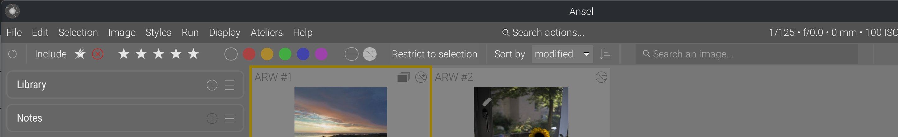
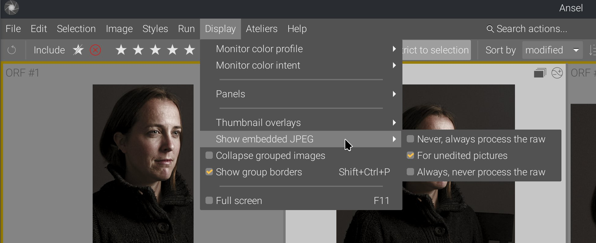

Between January 2022 and March 2026, Ansel landed 297 non-merge commits regarding the lighttable grid, its thumbnails, and their rendering pipeline and caching. I tried to make do with the scruffy Darktable lighttable code, only degreased, for as long as I could but unfortunately, it was pure technical debt and it was painfully slow.

Indeed, Darktable "manages" the crappiness of its lighttable by reducing its size: the left and right side panels take a lot of display surface, which leaves even less area for the lighttable to repaint. Since Ansel removed the right side panel, merging its content with the left one and the global menu, there was more surface to paint, more CPU work to do, and the terrible design of the lighttable became all the more harmful.

That project is now complete. This article is a map of what changed, what was removed, what was redesigned, how the new behavior works, and what users actually gain from it.


Some application slang used below, for readers who don't live in the source code:

- **Lighttable**: Ansel's browsing view, where you manage, sort, select and inspect many images at once.
- **Darkroom**: Ansel's editing view, where you work on one image in detail.
- **Filmstrip**: the horizontal strip of thumbnails shown below or alongside another view, used for quick navigation through the current collection.
- **Thumbnail**: the small preview image shown in the lighttable or filmstrip, along with badges, overlays and metadata.
- **Thumbtable**: the internal widget managing a whole grid or strip of thumbnails, including scrolling, selection, redraw and thumbnail lifetime.
- **Overlay**: the extra information drawn on top of a thumbnail, such as stars, reject marks, color labels, group borders or metadata.
- **Collection**: the current set of images shown by the lighttable after applying the active filters, search and grouping rules.
- **Grouped images**: several images linked together so they can be shown as one collapsed stack or as expanded members of the same group.
- **Collection filter**: the lighttable tool that narrows the current collection by text, rating, color labels or other criteria. In Ansel, this also absorbed what used to be called culling mode.
- **Mipmap cache**: the subsystem that stores and retrieves precomputed preview images at several sizes, so Ansel does not have to decode and render the source file from scratch every time a thumbnail is shown.
- **History hash**: an internal fingerprint of the editing history of an image, used to know whether a cached thumbnail still matches the current edit state.


## A brief history of bad design

To understand why the 2022-2026 rewrite ended up touching so many files, it helps to look one step further back.

The lighttable view, `src/views/lighttable.c`, had been accumulating responsibilities for more than a decade. It started as the place handling the file-manager grid and basic zooming, then gradually absorbed full preview, sticky preview, culling, panel-state memory, grouping, drag-and-drop reordering, keyboard navigation, overlay policies, filmstrip coordination and a lot of shortcut routing. If you look at the pre-2022 history, many commits are just about keeping these from fighting each other: offset jumps when zooming, preview scrolling bugs, selection not staying in sync, culling and preview re-entering in a half-broken state, panel visibility not being restored properly, group borders glitching, and ratings or color labels moving the grid unexpectedly.



- 2015 : [redraw the whole lighttable because some thumbnails didn't refresh properly](https://github.com/darktable-org/darktable/commit/887f2abd07#diff-534e323acd0fde20f32cd1b23cadb652755759d9fdfb348a3866d0112aac6ddaR757-R812)… (also note the Cairo drawing code painting group borders just before SQLite queries and thumbnail fetching from cache… at the discounted price of 3 for 1).
- … [later reverted because it drained CPU](https://github.com/darktable-org/darktable/commit/15f3e2c45f) (no joke…),
- 2020, refactoring: … [made it again at some point as a timeout function](https://github.com/darktable-org/darktable/commit/1c2ae21831#diff-534e323acd0fde20f32cd1b23cadb652755759d9fdfb348a3866d0112aac6ddaL426), which is no more guaranteed to succeed (why 250 ms?), and removed it in February 2020,
- … [made it again and was re-removed in April 2020](https://github.com/darktable-org/darktable/commit/cfe219a700#diff-534e323acd0fde20f32cd1b23cadb652755759d9fdfb348a3866d0112aac6ddaL1050),
- … [because it was moved to the thumbnail](https://github.com/darktable-org/darktable/commit/4f917685fc#diff-2a4577c2a16d72e0dd7c03a4a592660c5acabc169e538d92b11b519ccfedbf60R93-R124),
- … [hardened in October 2020](https://github.com/darktable-org/darktable/commit/0cb239aff4#diff-2a4577c2a16d72e0dd7c03a4a592660c5acabc169e538d92b11b519ccfedbf60R422-R425), aka simply used as a `g_timeout` should be, because it could call a removed thumbnail and cause a segmentation fault (then crash),
- … [until I definitively got rid of it in February 2025](https://github.com/aurelienpierreeng/ansel/commit/609eb38012#diff-2a4577c2a16d72e0dd7c03a4a592660c5acabc169e538d92b11b519ccfedbf60L611), to handle that by… you know, feeding directly the thumbnail pointer to the background job supposed to create the image and let it [call the targeted redrawing when it's ready](https://github.com/aurelienpierreeng/ansel/blob/master/src/dtgtk/thumbnail.c#L394-L552) (and gracefully handle the case where the thumbnail was removed before the pipeline completed).

So this shows a complete inability to keep track of the lifecycle of a cached image (or any data in that godforsaken software, for that matter), while being completely comfortable and relaxed with it. I tackled this issue by simplifying the background asynchronicity, but another option would have been to use a signal. I can't get over the fact that the 3 guys who worked on this over 10 years have been writing C code for twice as long as I have. In 2018, I didn't even know what GLib was.

In case you are interested, the way I tackled it is :

- thumbnail widgets keep a state variable representing their own image validity,
- when GTK wants to redraw the thumbnail, if the state variable says "invalid", the thumbnail widget spawns a background thread computing a pipeline to create the missing image,
- when the background thread returns, it puts the output image into the thumbnail that called it, by pointer, in a (cached) surface, updates the state variable to "valid", then sends a GTK queue redraw event on the widget (not the whole grid),
- if the widget is invisible, nothing happens (GTK doesn't queue redraw events to invisible widgets). The next time GTK wants to redraw the image, it uses the cached surface from within the widget,
- history and metadata changes send an "image info changed" signal that publishes the image ID. The thumbtable has one signal handler listening to that, which finds the thumbnail by ID in the grid (from a hashtable, so `O(N)`) and resets its state variable to "invalid". Again, if 100 images are targeted by the change and all of them are invisible, nothing happens.

The architecture seems more complex, but it's actually less code and it's simply robust: there is no guessing.



A COVID-era rewrite attempted to refactor that into `src/dtgtk/thumbtable.c`, which soon became part of the same drift. Once the dedicated thumbtable abstraction appeared, it became the traffic controller between collection state, scrolling, offsets, active images, keyboard navigation, drag-and-drop, smooth scrolling, overlay visibility, zoomable layout, culling synchronization and filmstrip synchronization, __reinventing many native GTK features in a worse and incomplete way__ (the typical Darktable way). The pre-2022 history is full of commits fixing mouse-over after scroll, recalculating rows and offsets, keeping selected images visible after collection changes, avoiding quadratic lag on Home/End, fixing zoomable alignment, making hidden or collapsed images not break the active-image logic, and limiting the number of signals emitted because too many independent updates were being chained together. In other words, `thumbtable.c` had already become the place where view logic, thumbnail lifetime and collection navigation were forced to meet, long before the 2022 rewrite started.

The thumbtable refactor made a new file appear, when the old lighttable and filmstrip code started being factored into a common thumbnail widget and thumbtable as the base object of all that : `src/dtgtk/thumbnail.c`. That was the right direction in principle: instead of drawing thumbnails separately in several places, one widget could centralize activation, selection, overlays, stars, reject flags, drag-and-drop, group borders and zoomable behavior. But it followed a similar path very quickly : the pre-2022 history shows how fast that common widget became overloaded. It was soon dealing with extended overlays, MIPMAP-updated callbacks, culling junctions, scrollbars, active-image handling, filmstrip callbacks, full-preview navigation and CSS-tuned icon placement. In other words, `thumbnail.c` did not merely draw a thumbnail. It became the shared fault line between lighttable, filmstrip, culling and preview.

The filmstrip started as a dedicated navigation strip, then gained centering on the active image, drag-and-drop, map interactions, copy/paste operations, smooth scrolling, HiDPI fixes, CSS customization and eventually parts of the new thumbnail callback system. Again, none of those features is unreasonable on its own. The problem is that filmstrip ended up with just enough custom behavior to diverge from lighttable while still trying to reuse part of the same thumbnail machinery.

On top of that, there was the inconsistent "selection" paradigm in Darktable, sold as a "no click workflow", so many write operations could be handled without explicitly selecting the image(s) to affect. That led to a lot of unwanted effects and accidents, resulting in data loss (attributing the wrong star rating to the wrong image, which would make it disappear from the current collection if you filtered it by rating) and tedious undo sessions. But the whole heuristic of image selection was brittle too: moving the mouse in the window could steal the focus from the picture you explicitly locked with a click or a keyboard selection, but not always.

Not to mention, that "act on mouse hover" triggered several SQL queries into the library database, when hovering a new image, to get updated image metadata and refresh the content of the metadata modules (_metadata_, _EXIF & IPTC metadata_, _tags_). This is all because they couldn't be cached, and they couldn't be cached because Darktable is unable to track the lifecycle of its data, so it needs to refresh everything all the time. And it will drain your battery doing so.

So when the rewrite started after having forked Ansel in 2022, the issue was not that one bad commit had broken the lighttable. The issue was that three layers of history were stacked on top of each other:

- `lighttable.c` still carrying the baggage of several (useless) browsing modes, coded there as second thoughts,
- `thumbtable.c` concentrating scroll, offset, active-image and collection-navigation logic, that partly overlapped with the collection and selection backend,
- `thumbnail.c` concentrating more and more shared GUI behavior plus SQL code.

That is why the later work had to be architectural. At that point, there was no realistic way to keep fixing the symptoms one by one.

## Front-end changes

### Culling was never really (conceptually) a separate view

One important piece of that subtraction was the [culling mode](https://docs.darktable.org/usermanual/development/en/lighttable/lighttable-modes/culling/). In February 2023, the dedicated culling and preview views were removed because they had become badly interleaved with shortcuts, view switching and special-case branching. The code was entangled and cumbersome, but the real problem was in the design itself: it was an over-engineered solution to a much simpler problem, solved in the wrong layer.

The need was to isolate an arbitrary set of pictures that weren't necessarily contiguous in the current collection, in order to decide which one would be the keeper. That didn't need a new layout (or two…); it needed a filter to restrict the collection to an arbitrary selection. We already had filters to restrict collections by rating, color label, edited/unedited status, etc.

That difference matters. A dedicated culling view duplicates problems that the lighttable already has to solve: which image set is active, how selection is restored when exiting the culling view, how shortcuts are routed, how zoom and thumbnail state are initialized, and what happens when you move back to the grid. Every improvement then has to be implemented twice, once in lighttable logic and once in culling logic, and both versions drift apart. Not to mention, the culling mode had a static mode and a dynamic mode, which differed both in how you interacted with them and in their implementation, and very few users understood what they were about.

In Ansel, the culling came back as a collection filter, first as a simple way to narrow the current set, then later explicitly as the _Restrict to selection_ filter button. That means the user-facing intent stayed the same (reducing current collection to an arbitrary selection of images), but the implementation changed completely: instead of entering a special view, you stay in the lighttable and tell the filtering tool to show only the currently selected images or only the images matching the current narrowing criterion.


The new, unified filtering toolbar. Filtering criteria are inclusive, and the icons behave as check buttons: uncheck to hide matching images, check everything to show everything (a contextual menu on right click gives you a shortcut to do so in one step). Tooltips appear on hover for more details. The first icon refreshes the current collection depending on filters. For example, if you show images rated 3 stars and you demote an image to 2 stars, it will not be evicted automatically from the current collection until you manually refresh it.


For users, the benefit is practical. Culling is now composable with the rest of the filtering logic instead of living outside it. You can combine it with ratings, color labels or text search because it is just another collection filter. Shortcut handling is simpler because there is one fewer special view competing for shortcuts ownership. And fixes to scrolling, selection, thumbnail lifetime or overlay behavior automatically benefit culling too, because culling is now using the same lighttable infrastructure instead of a parallel one.

That was also an opportunity to overhaul the filtering toolbar, which mixed buttons and logic: a combobox list for ratings (from _rejected_ to _5 stars_), associated with a comparison combobox list (`≠ = > < >= <=`), but toggle buttons for color labels. Darktable 4.0 replaced that with an over-engineered set of configurable widgets using non-standard GUI paradigms that needed to be explained in tooltips. Ansel has flattened the design: everything is a toggle button working in an "include" mode inside its group, allowing complex selections without complex GUI:

1. you have 3 groups (ratings, color labels, edited status), plus _restrict to selection_ and text search,
2. between those groups, the filters are exclusive, meaning they are a logical `AND`,
3. inside those groups, the filters are additive, meaning they are a logical `OR`.

For example, in the screenshot above, everything is toggled on, so the filtering is in practice disabled (we let everything in). In the example below, we filter in all images that have a color label set and have already been edited, regardless of their rating (all rating buttons are toggled on):

### Selection : mixing backend and GUI states always bites you in the ass

Grouped images were another hidden fault line. Part of the old logic tried to account for grouping in SQL queries, when generating collections of images from the library database, but group borders, hover states, selection behavior and actual visibility are GUI concepts. That mismatch created subtle bugs: all images from a group could be selected, or some ignored according to heuristic rules that did not match what the user saw on screen.

I fixed that by moving group-display decisions back into GUI code. SQL provides the list of images; the interface decides which grouped members are visible, collapsed or hovered. After that, the features added in 2025 became much simpler: group borders could be re-implemented, made optional, extended to the filmstrip, and made more visible on hover. Tooltips could be populated lazily only when the user hovers them. One SQL request per thumbnail at init time could also disappear because the interface already had enough local state to know when group information was actually needed.

For users, the benefit is not abstract. Group borders now mean what they show, selections match exactly the visible group state, and grouped images no longer feel like they are half managed by the database and half by the interface.

Another hidden problem was selection. In the old code, selection was too entangled with collection internals, raw SQL access and fallback logic. That sounds harmless until an image is evicted from the current collection, a group is collapsed, or a view switch happens while another part of the code still assumes the previous selection model. In Darktable, image selections were handled as a SQL backend since they are stored in the library to be restored at the next session. This is not a problem until the selection __backend__ is hacked to guess what images are visible __in the GUI__, and the GUI actually handles the selection through the backend. This is the worst possible split of functionality between backend and GUI layers.

This is why 2025 contains a whole cluster of selection-related commits: rewriting the selection API, removing the old `main_image` notion, unifying the active-image getters/setters, fixing range selection, restoring selection state across view switches, and adding rowid fallbacks when `scroll_to_selected` can no longer find the original image id. The rewrite changed the architecture: the thumbtable now computes visible, user-meaningful selections and passes a list of image ids to the selection layer, instead of the GUI trying to reverse-engineer meaning from collection state after the fact. The selection SQL API has become a simple "save to/restore from database" backend.

The concrete user benefit is that `Shift` + click range selection and "image to act on" are _What You See Is What You Get_: you can't select an image that is not visible on screen, and the backend doesn't have to guess what is visible. And scrolling back to the selected image now fails much less often in edge cases. The hidden problem was not one broken shortcut; it was that selection semantics lived in the wrong layer.

The fix is to clearly split what belongs to backend and library management from what belongs to GUI states and interactions, and to provide a rigid interface between both. That makes the different parts of the code better enclosed, immune to changes in the other parts, and managed centrally.

### Hover and focus glitches came from several valid systems colliding

Mouse hover, keyboard hover, focus and click handling were each implemented for legitimate reasons, but they did not share a single arbitration point. Darktable now even has a proud marketing pitch written in the background of the lighttable, when the collection is empty, praising that "click-less" workflow that allows you to overwrite image metadata without wanting or even knowing it. That feels to me like a car company advertising a car designed so you can use the steering wheel with your knees (and use your hands to drink beer).

That is why older lighttable behavior could feel inconsistent without any single obvious bug: it was broken by design. Clicking on an overlay button to rate the image could also select the whole thumbnail, but rating from keyboard would not. Keyboard movement and mouse movement could both think they owned the "current" image and trigger all sorts of destructive metadata changes merely by hovering the picture and without asking for confirmation. Filtering images by star rating and inadvertently changing the rating of an image could make it disappear unexpectedly. Hidden widgets could still receive hover-related logic. GTK focus could decide one thing while the view layer expected another.

The fixes here were less about adding new features than about choosing one owner for the state. Over-state dispatch was centralized. Keyboard browsing gained a sensible starting point and an explicit cancel path with <kbd>Shift</kbd>+<kbd>Ctrl</kbd>+<kbd>A</kbd>. Focus display was made explicit. Hidden widgets stopped participating in hover logic they could not display. Clicking on overlay buttons stopped leaking into thumbnail selection. No more metadata (over)writing is done without an explicit button push, hover events are all read-only.

Ansel has two simple rules : 

- any action that will (over)write (meta)data is made only on explicitly selected images,
- explicit selection is made only by interacting with something "hard": a mouse click or a keyboard keystroke.

Then, hover events are reserved to read-only events.

The benefit for users is that the lighttable reacts more like a single interaction model. The hidden problem was not that hover was broken. It was that several kinds of hover were simultaneously "right" and therefore collectively wrong.

## Backend changes

### Reparenting the thumbtable between lighttable and filmstrip

One of the more deeply hidden problems was widget ownership. In Darktable, the same thumbtable grid was reparented between lighttable and filmstrip contexts. On paper, that avoided code duplication and widget proliferation, and that sounds clever. In practice, it made scrolling state, thumbnail initialization, garbage collection and event lifetime depend on where the widget had most recently lived. Not to mention, reparenting was slow, so going back and forth between lighttable and darkroom was delayed by around 1 s, the time needed for GTK to recompute new thumbnail sizes, possibly ask the cache for new thumbnails, and redraw widgets.

This surfaced in very concrete ways. Scroll position could jump or become inconsistent. Thumbnails could be hidden, shown or destroyed at the wrong moment. Garbage collection became harder to reason about because the widget hierarchy was not stable. Of course, all that was solved commit after commit, but leaving the code in a state of unmaintainable complexity.

The real fix was to stop trying to be clever. Lighttable and filmstrip now have separate thumbtables. That means a little more explicit structure in code, but far fewer accidental states. The benefit for users is visible in steadier scrolling, fewer layout glitches on view changes, and a filmstrip that behaves like a proper sibling of the lighttable instead of like a reused fragment.

### Menu and layout changes were not cosmetics

The global menu becoming truly global in April 2025 was not a branding exercise. Before that, many commands were implemented as if they belonged to local modules even when they were really application-level actions. Some of them were hidden entirely behind keyboard shortcuts and known only to those who read the documentation. Many of them, I discovered only when removing their code. The same was true of image information, view switching and old view toolboxes. They lived in places that were easy to code around once, but hard to maintain coherently across views.

Moving image information into the global menu bar, moving the view switcher to a clearer top-level location, and later removing the bottom-center toolbar were all consequences of the same diagnosis: the center of the interface should belong to image interaction, not to historical leftovers. The timeline removal and the decision not to show an empty filmstrip are smaller examples of the same logic. Even `Enter` opening the selected image in darkroom fits here: it aligns behavior with the primary job of the lighttable instead of preserving accidental historical habits.

The user benefit is not "the menu is nicer". It is that commands are found in places matching their scope, and the lighttable itself has fewer controls competing with the grid. Not to mention, "modules" that are actually (non-uniform) grids of buttons are just menus in disguise with a worse design, so they are turned into menu entries now.

The global menu was also the opportunity to bring to the GUI features that only lived in hidden shell scripts (!) until now: preloading the thumbnails for the current collection and purging thumbnails from disk cache. Those were requested for years in the GUI, but fit nowhere in the module-first Darktable UI design.

But… that right sidebar of modules that didn't want to be menus was a blessing, because it removed a lot of area to be painted with images and made the thumbnails smaller. Removing it made the bad performance of thumbnail drawing appear in all its glory: nothing was cached, neither image surfaces nor metadata, and everything was refetched all the time. The rewrite was inevitable; the architecture was broken.

### Zoom only became usable after thumbnail sizes were made consistent

The early zoomable-lighttable attempt failed for a structural reason: thumbnail geometry, cached mipmap sizes and view-level navigation did not share the same model. That is why the feature had to be removed first. If I had kept polishing it in place, the result would only have been a better-looking broken feature.

The later work fixed the dependency chain in the opposite order. The view backend gained the scaffolding for lighttable zoom, then the thumbnail cache was taught to reason more coherently about thumbnail sizes, a full-resolution thumbnail API was prepared, then clamping, panning and barycenter-based auto-pan were added on top of that. Only once the lower layers agreed on image size and retrieval strategy did 200% zoom become a defensible feature.

The benefit for users is that zoom is now tied to the cache and to navigation instead of fighting them. Dragging to pan, `Shift` + drag across visible thumbnails, and automatic pan toward the details barycenter all work because the underlying pipeline knows what zoomed thumbnails are supposed to be.

The confusing meaning of "zoom" in the lighttable has been updated: the term "zoom" was used both for outer zooming (number of images per row, which indirectly affects their visible size) and for inner zooming (magnification within the image frame). So now we have _columns_ for the outer zoom, and _zoom_ for magnification.

{}
Don't mind the cross in place of the `-` symbol in the columns spinbutton, it's a [bug of GTK with KDE/Plasma theme Breeze](https://gitlab.gnome.org/GNOME/gtk/-/issues/7080).
{}

This made it possible to implement a feature that had been in my mind for a long time: barycentric auto-panning upon thumbnail magnification.




You can see that, when enabling 100% zoom, images are automatically aligned on their content despite having completely different framing and aspect ratios. This uses wavelet-decomposition feature analysis, from which we compute the coordinates of the details barycenter. It's not perfect because it doesn't get the same part of the face across images, but it gives us the face in all instances. That's a project I had on the back burner for a long time, but it was not possible with the previous lighttable design.

Needless to say, dragging into zoomed-in thumbnails has been reinstated, and dragging into __all zoomed-in thumbnails__ has been added too (<kbd>Shift</kbd>+Drag). This feature has been long asked in Darktable but was clearly not possible in their shitty design.

### Self-inflicted metadata slowdown

The old lighttable kept asking the database the same questions one thumbnail at a time. On a small collection this is easy to miss. On a larger one, it surfaces as micro-stutters when opening the view, showing overlays, hovering groups or refreshing history-sensitive data. The hidden problem was not raw SQL being slow in absolute terms; it was the repetition and timing of those queries.

The fix came in stages. Read-only metadata started being cached from image structures. Then, in February 2026, metadata for a whole collection could be fetched with one SQL query instead of one query per image. The thumbtable could seed the image cache from the collection it was about to display. Thumbnail info caching was refactored into a helper and later merged back into `dt_image_t` so metadata did not have to bounce between parallel structures. Even small changes such as removing history-hash pings on redraw matter here, because they cut invisible round-trips from hot paths.

A lot of useless per-thumbnail SQL queries have been removed, along with SQL code in lighttable GUI code, so functional layers are now split properly.

The user benefit is exact: opening large collections stalls less, overlay-heavy displays hesitate less, and history or metadata updates propagate with fewer visible pauses.

### The mipmap cache needed to be fixed too

The mipmap cache is the layer that loads RAW images and pre-generated thumbnails into the RAM, and empties them when memory becomes scarce. That was one of the deepest hidden sources of visible bugs. When everything aligned, it worked well enough. When the source file was smaller than expected, when an embedded JPEG preview was odd, when the history hash was undefined, or when disk cache invalidation lagged behind edits, the user would not experience "a cache bug". They would see stale thumbnails, broken previews or images that refused to refresh.

That is why so much of the 2025 work in the cache looks surgical. Buffer allocation logic was rewritten because ownership was too tangled. Handling of undersized inputs was improved because input size assumptions leaked too far. Embedded previews stopped being discarded so aggressively because too-small previews were still useful for consistency across zoom levels. Sidecar JPEG previews started being used when present instead of the RAW embedded thumbnails. Cache invalidation was hardened, and cached thumbnails were really removed from disk when they should be. Regenerated mipmaps started writing their hash back to the database in sync with history state, and the undefined-history-hash case stopped leaving mipmaps unsaved.

The sneakiest bug I found was buried in the nonsensical complexity of thumbtable, view and mipmap cache interleaving. While rendering thumbnails was deferred to a separate thread for performance (as it should), and more than one thread could be started to (allegedly) process several thumbnails at once (possibly using several GPUs), all the processing threads and the GUI were actually competing to lock the mipmap and image caches, which only made the GUI stall while pipelines were running. It's only because I worked under the assumption that I rewrote things by the book, and I knew the by-the-book way _should be faster than that_, that I kept digging until I found why it still wasn't as fast as expected, simplifying everything layer by layer in the process.

The benefit for users is that the cache is more trustworthy. After edits, the lighttable is less likely to show an obsolete thumbnail. On awkward files, preview generation fails less often. On repeated visits to the same collection, the disk cache behaves more like a cache and less like a stale screenshot archive. But all that, without having to refresh/recompute/redraw everything all the time just to be sure.

Also, the options to use embedded JPEGs or force a recompute were moved from preferences to the global menu and can be changed during runtime:

This is another example where cleaning up and simplifying the backend paved the road for frontend extension and new features that just make sense.

### Thread-safety and race conditions

A classic reason these bugs lasted so long is that they required the user to be faster than the code: scroll quickly, leave a view while thumbnails are still being built, resize while a background surface is still being produced, or close a widget just before a worker thread pushes an update.

That is why the 2025-2026 thread-safety work matters. Thumbnail fetching was moved deeper into background jobs, then later explicitly deferred so darkroom rendering could keep priority. Thumbnail destruction was moved to safer cleanup points. Background jobs producing thumbnails learned to cancel themselves when the widget they served disappeared. Image surfaces were protected by mutexes. Freed pointers were nullified. Image buffers moved to better-managed allocation paths. The point of all this was not "more threads"; it was to stop old threads from writing into dead state or competing for locks.

The user-facing result is fewer segfaults, fewer random glitches during fast scrolling, and fewer cases where the interface appears to race itself under load.

Several thread locks, added throughout the years to patch problems, were removed too. Many were redundant (but didn't show it under the crazy complexity of the whole thing), some were actively damaging performance, and all of them hid bad design. We now have fewer locking points, but the result is more legible and more robust.

As a result, thumbnail widgets are now fully enclosed objects. They manage internally their own thumbnail rendering pipeline threads, which interact directly with their own cached image surface, so they can spawn or kill them themselves. This cached image is invalidated only when the image history changes, which is made explicit by the development history backend. Because the thumbnail widget knows its own state (visible or not, in need of image refresh or not, size, focus-peaking mode, etc.), it becomes a lot more robust than trying to handle all those things from higher-level layers that fail to communicate with each other.

This was not possible with Darktable design because it kept adding/removing thumbnail widgets dynamically to the current lighttable view, depending on the floating line position, which was an attempt to handle the slowdowns from all the threads that competed for cache access. But also, Darktable thumbnail widgets tried to immediately acquire an image from the mipmap cache, when they were created, which made CPU and memory I/O usage spike, and effectively froze the UI. But "fixing" that by reducing the life-expectancy of thumbnail widgets made it impossible to let them manage their own state internally, so it had to be done by high-level layers, which had to communicate between each other to update states, which did happen in some places but at the expense of unbearable complexity.

Instead of that, Ansel thumbnails are all initialized at once, but they lazily acquire an image from the mipmap cache only once they become visible, and then cache it internally. This keeps scrolling the thumbtable responsive, even with a collection of 500 images that are all generating their image.

### Import previews improved as a side effect

The import window was affected by this work for the same reason the lighttable was: it needs fast preview extraction, metadata inspection and sane fallback behavior on partially-supported files. Once the mipmap and thumbnail paths were rewritten, raw preview loading in import became faster, and TIFF/DNG support improved too.

This is a good example of why the rewrite had to happen low in the stack. If the underlying preview machinery is inefficient or fragile, both lighttable and import inherit the same pain. Once that machinery was rewritten, both benefited.

## Global architectural changes

In my [previous article](../complete-pipeline-overhaul/index.md), I showed how the working pipeline cache makes going back and forth between lighttable and darkroom nearly instant, because it doesn't need to recompute the whole image. The work done here on the GUI solves the same problem of view switching delays, but at the GUI level. So there is no lag when switching between both views.

This is important because the lag of view switching has been used as an excuse to duplicate features (modules/toolboxes) between the lighttable and the darkroom, which only increases GUI clutter. So this whole backend improvement makes it possible to improve the GUI design by specializing each view for a single task:

- metadata handling for the lighttable (plus obviously culling),
- image editing for the darkroom.

As a result, the _metadata_ and _tags_ toolboxes have been removed from darkroom.

## How many lines of code did the rewrite spare?

Counting only non-comment, non-blank lines with `cloc`, and comparing the last tree before January 1, 2022 to the current tree for the main files discussed here, the rewrite spared **4,714 lines of code** overall.

The scope for that count is:

- the whole `data/themes/` directory before 2022, compared to today's `data/themes/ansel.css`,
- `src/common/mipmap_cache.[ch]`,
- `src/dtgtk/thumbtable.[ch]`,
- `src/dtgtk/thumbnail.[ch]`,
- `src/views/view.[ch]`,
- `src/views/lighttable.c`,
- `src/libs/collect.c`,
- `src/libs/tools/filter.c`,
- plus files deleted outright by the redesign or collection-GUI cleanup: `src/dtgtk/culling.[ch]`, `src/libs/tools/view_toolbox.c`, `src/libs/collect.h` and `src/libs/recentcollect.c`.

Within that scope, the total went from **15,257** code lines before 2022 to **10,543** today. The rewrite therefore spared **4,714** code lines overall. The biggest savings came from deleting the culling view (`src/dtgtk/culling.c`) outright (-1,406 lines), shrinking the lighttable (`src/views/lighttable.c`) (-976), removing 7 old theme stylesheets and collapsing them into one (-864 across `data/themes/`), shrinking `src/dtgtk/thumbnail.c` (-460), `src/dtgtk/thumbtable.c` (-458), deleting `src/libs/recentcollect.c` (-358), and shrinking `src/views/view.c` (-314). Some files did grow, especially `src/libs/tools/filter.c` (+215) and `src/libs/collect.c` (+157), because part of the point was to move special-case behavior such as culling and old collection GUI branches back into simpler shared infrastructure rather than keeping them in parallel views and side modules.

Line count is not a quality metric by itself. Plenty of rewrites merely move code around. But here the number matches the design change: less duplicated behavior, fewer parallel views, fewer compensating hacks, and fewer places where the GUI, the view layer and the cache all had to solve the same problem twice.

Everything I fixed, I fixed it by simplifying the logic and the code. There was no workaround allowed.

## Benchmarks

All runtimes were computed on a Lenovo ThinkPad P51 laptop (Intel Xeon CPU E3-1505M v6 @ 3.00GHz, Nvidia Quadro M2200 GPU with 4 GB VRAM, 32 GB RAM, 4K display), CPU in performance mode, Linux Fedora 41 with KDE/Plasma desktop. Pixel pipeline runtimes are not compared (out of scope; see [the previous article](../complete-pipeline-overhaul/index.md)). Ansel Master is taken at commit [09749f1d](https://github.com/aurelienpierreeng/ansel/commit/09749f1da2c97cd54b62a67e169310f0d304724c) (Feb. 21, 2026).


| Description | Ansel Master | Darktable 5.0 |
| ----------- | ------------ | ------------- |
| Time from app startup to last lighttable thumbnail drawing (same collection) | 2.12 s | 7.49 s |
| Time to switch from lighttable to darkroom (same image) | 0.2 s | 1.2 s |
| Time to scroll (start->end) through the same collection of 471 images* | 0.7 s | 5.0 s |

*: thumbnails preloaded in disk cache in both cases, 5 thumbnail columns per row, 4K resolution, no right sidebar.


As a "fix", Darktable 5.x blessed us with a gorgeous splash screen, which is a confession more than anything.

The following have been measured on battery, in powersave mode, with the application sitting idle (no user interaction) for 5 minutes, using Intel Powertop. The baseline consumption of the whole idle OS is 1.6 % CPU. (Power is given for the app only, % CPU is given for the whole system):


| View | Ansel Master | Darktable 5.0 |
| ---- | ------------ | ------------- |
| Lighttable | 1.8 % CPU, power: 0.85 mW | 2.7 % CPU, power: 103 mW |
| Darkroom   | 1.8 % CPU, power: 7.65 mW | 1.8 % CPU, power: 22 mW |


These figures represent the baseline power consumption of the GUI alone (GTK, background workers, scheduled timers, etc.). Darktable is leaking performance through the GUI, and the tedious work done in 2023-2024 on optimizing pixel processing modules for an extra 15-50 ms is completely irrelevant.

## Conclusion

At this point, I am firmly convinced that the Darktable "project" only attracts "developers" who wouldn't be able to make a cognitive distinction between _GUI_ and _backend_ even if their life depended on it. So GUI issues are solved in the backend, backend issues are solved in the GUI, and this makes code complexity grow out of control with time, which later justifies adding new features by hacking the least amount of code in a codebase that nobody understands anymore. Not to mention, none of that was documented, so I had to reverse-engineer it painfully over several years, recursively simplifying a bit here and a bit there, until it finally converged to a clean overall logic.

Needless to say, all the workarounds and "quick fixes" that were added have been removed. All of them dated from after 2020, which shows a concerning trend in code quality degradation.

This cleanup project stole 4 years of my life, gave me no pleasure, and the people who introduced all the regressions I painfully fixed need to be held accountable for the consequences of their actions. There is a huge difference between not having enough time to do things properly and consuming a lot of man-hours to make things worse. And then, refusing to admit that you made things worse, refusing to accept that there is a problem, and feeding your confirmation bias by listening only to happy-camper feedback is the ultimate proof of stupidity.

Darktable has degraded into shit, and I just explained, technically, why. The Darktable team and its [sidecar forum of tech bros](https://discuss.pixls.us) would like to make people believe that I got angry at them because they wouldn't accept my changes, and that it's all an interpersonal problem. For the layman who doesn't understand what I wrote here and in the previous articles, it's easier to believe in interpersonal anger than to understand how a succession of bad technical decisions over several years made me the victim of the problems they created, because I was the only full-time guy here, depending on it for a living. I got angry at them because they were shitting again and again on my doorstep, and I had to repeatedly clean up. This is a form of violence that is really hard to see and to recognize because it doesn't manifest materially: it's a way of making your life harder, daily, step by step, just because a bunch of amateur middle-aged guys with no skills wanted to be part of something cool without realizing the detrimental effect of their contributions on the whole project.

And it fell to me to clean up the mess because I was apparently the only one to care about the regressions, the weird random bugs and crashes, the worst GUI "innovations" that deterred even my own wife from using Darktable because it's just overwhelming, and all the new slowdowns that keep piling up over the years. As Chris Elston said to me on the Darktable IRC chat, in 2022, before I left it forever, about stuff I had fixed in 2019 and they broke again in 2022: "shut up and fix it". If that's not violence, I don't know what is. And now they are trying to spread the word that I was the toxic one. The whole team is toxic. Their careless working culture is toxic. Their way of getting excited about everything, as long as it's new, without pondering the maintenance cost, feature duplication and overall user overwhelming is toxic. Their lack of concern for the future of the project and for the consequences of the choices they make is toxic.

And what is especially toxic is that, on discuss.pixls.us, every post that says my praise or the praises of Ansel gets flagged and hidden. There is no free speech on a free software forum. They just turned communism into stalinism. 
