Ansel inherits from Darktable its database backbone: the non-destructive editing histories are saved per-picture into an SQLite database, along with metadata and other user-defined data. Making the database aware of new pictures is done through "importing" pictures from a disk or a memory card. That's where the import tool comes.

Unfortunately, the Darktable importer is another thing that was butchered circa 2020 and turned into something deeply disconcerning, as it is a file browser that resembles no previously-known file browser, and manages to lack basic features (like Ctrl+F or EXIF preview) while still being bloated with useless ones (see below). This is where we loose many a future user, and it is only step 0 of the workflow. What a great showcase of what a "workflow app" can do !

## A design review of what design by commitee will get you

So Darktable has the import button<em>s</em> on a sidebar widget. There are 3 of them if you plugged-in a camera through USB, 2 otherwise:

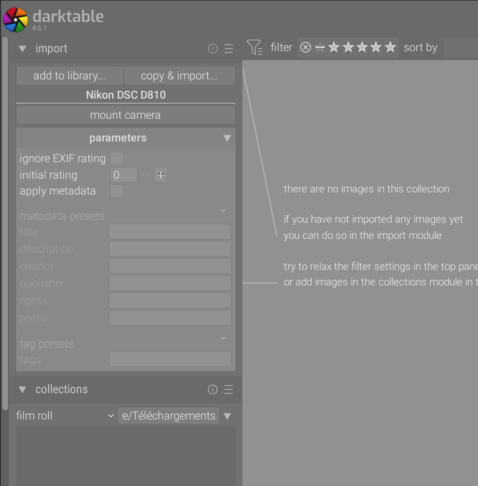

Many forum posts have been lost on explaining times and times again what the difference was between _add to library_ and _import and copy_ (_import_ actually means _add to library_). It is also worth mentionning that the _mounting camera_ button does nothing more than what any system-wide [PTP](https://en.wikipedia.org/wiki/Picture_Transfer_Protocol) or [MTP](https://en.wikipedia.org/wiki/Media_Transfer_Protocol) driver does for you: mounting the internal SD card as an external USB storage, through the USB port of the camera. On Windows this requires installing a custom USB driver that will prevent your camera to work with the rest of the OS. On Linux, depending whether your OS has "auto-mount" enabled, you might have to dismount the camera from your desktop file browser first, otherwise it will lock the link. On all OS, this requires listening to new devices in background all the time so the application can react to hot-plugging, whether or not you are going to use the feature.

And then, there is the _parameters_. Since 2022, the Darktable team has fell madly in love with those collapsible trays that hide the bloat under more bloat. And the bloat you can find in there does nothing more than hitting <kbd>Ctrl+A</kbd> (select all pictures), and then <kbd>0</kbd> or <kbd>1</kbd> (to assign an initial rating of 0 or 1 star) or filling the metadata info (in batch) in the eponymous module, which stands in the lighttable GUI whether you like it or not, and supports presets in case you always reuse the same metadata. The reason why adding these parameters there was even a requirement in the first place is beyond me. Someone, somewhere, is probably sparing 0.5 s per import session, which the rest of the world is losing by scrolling more height.

So, provided you understood the differences between all those options, now you click _import and copy_, which is probably the most used since any photographer needs to empty the SD cards to a more permanent stofrage. And then…

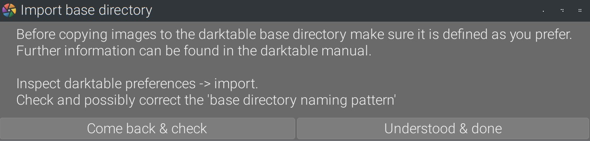

This is basically admitting that the design is so terrible that it's verging on unsable without reading the doc. But wait, what are we doing again ? We are copying pictures. We are copying pictures ? So did you pass your picture-copying exam and got your picture-copying degree ? If you didn't, you should. Watch out, they might turn this into a quizz in a future version and disable the feature if you fail it.

So you click on that ominious button saying that you take full responsibility for whatever harm may happen from copying pictures. Or you don't, given that it looks kinda scary. But let's say you do…

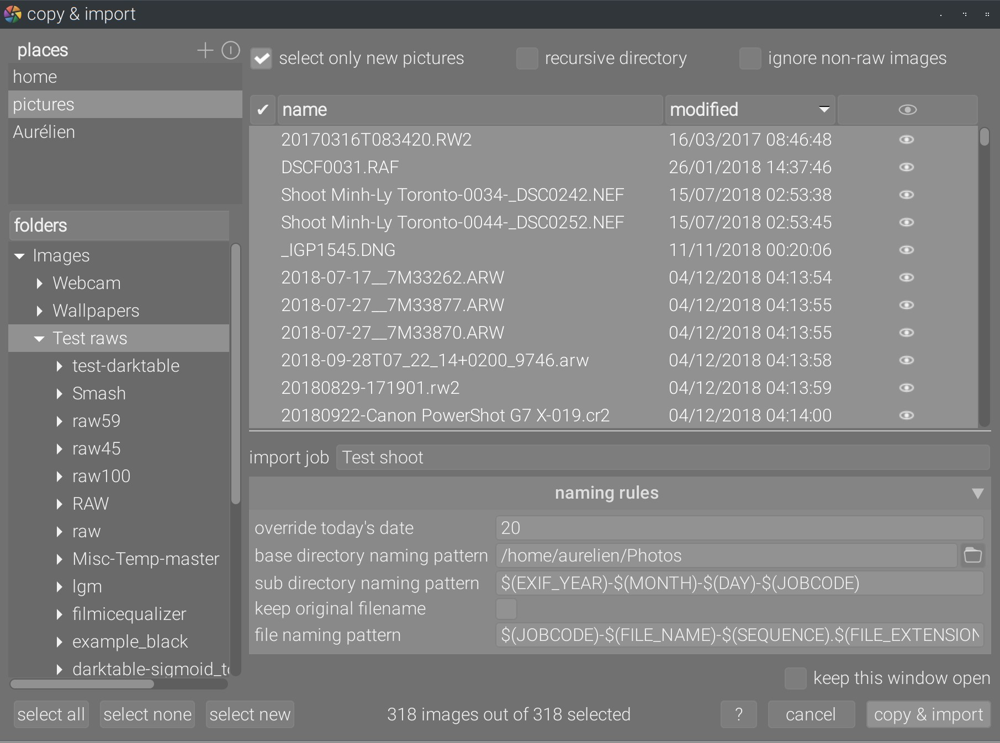

Wait, where are the pictures ? Is that a log reader ? Throw a 12 dice, and if you do an 8, you will figure out that those eyes icon are responsive and, once clicked, display a thumbnail. Hell, if you click on the eye in the column header, it will show all thumbnails at once. And mess up the row spacing, but we run for the chocolate medal here, so it's fair enough:

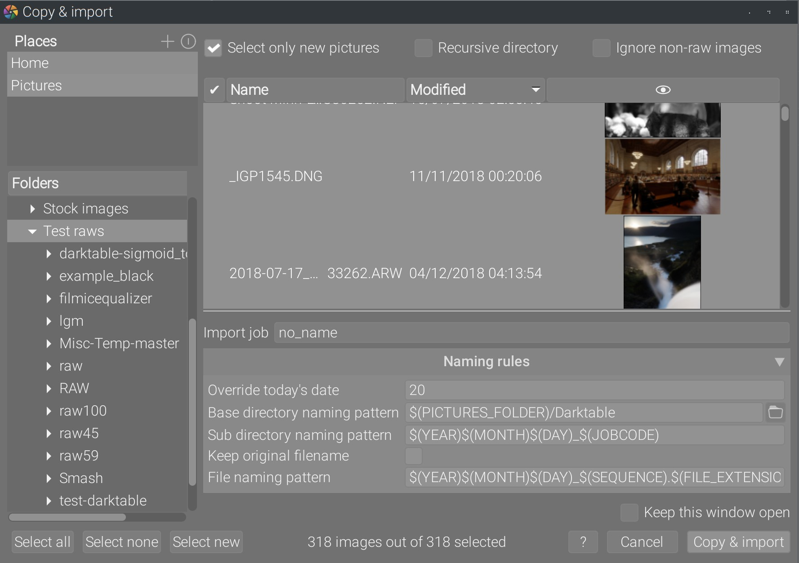

Be seated for the rest, you are not ready:

1. The _folders_ thingy on the left column is actually a button: when you click it, that changes the order of appearance of those folders.
2. The _places_ frame tries to emulate the _favourite_ or _bookmarks_ from your OS desktop manager, but don't import them.
3. The _recursive directory_ checkbox is not an option, it's an action. But then it doesn't act on whatever you selected on the right column, because those are only pictures. What it does is take the folder selected on the left column, and populates the list of pictures by recursively crawling the selected folder and its children.
4. The _select new pictures_ is, once again, not an option but an action, aka something that the rest of the world puts in a button.
5. The field _override today's date_ is a workaround for the fact that the picture `EXIF` date can't be used in folder patterns, so by default we use today's date. Except if this field is filled. But it needs to be filled with a datetime following ISO 8601 format. Which I didn't here, and the window is not complaining at all because form inputs validation is less fun than letting users find out at the next step that they have to start again from scratch because of bad datetime format. Boy, that's a lot of background knowledge to have to fill out a goddam date, I'm very lucky I learned all that from reading the source code.
6. The _keep original filename_ option is fully redundant with using the naming pattern `$(FILE_NAME).$FILE_EXTENSION)`,
7. The naming patterns use variables masks `$()` that get replaced at runtime by actual file's properties, but you need to know them to be able to use them. As if a guy named Houz didn't write a library circa 2011 to implement auto-completion in text inputs for those variables, that you can simply call in your code to make it work in 2 lines (it is used in export module).
8. The naming patterns found there are duplicated in Darktable's preferences popup because you might need to change them when you are not importing anything.

This is made of the material of frustration. What is truly amazing is how many persons have worked on this feature over the years to get there. Some would call it [collective intelligence](https://en.wikipedia.org/wiki/Collective_intelligence), but it's actually called [design by commitee](https://en.wikipedia.org/wiki/Design_by_committee).

## A new take, or erasing scruffiness out of step 0

Importing images is truly the step 0 of working with any image editing application. It's unacceptable to lose users so early, especially since we expect so much from them later, when it comes to understanding light and color. But I will argue that light and color are the bread and butter of any graphic artist, and it seems fair to expect from photo-editing users to master the basics of their craft at some point.[^4] On the other side, asking users to get their master's degree in file copying is unacceptable.

[^4]: Yes, I know it's already too much to ask in most cases.

Guillaume Stutin and myself have therefore rewritten the import tool entirely, first the front-end and then the back-end. Here is the result.

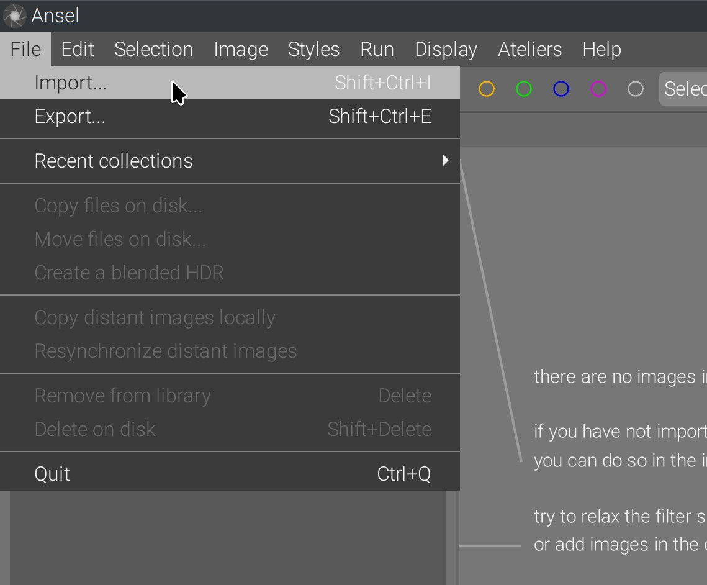

The option to directly mount cameras memory card from GPhoto2 has been removed entirely, since OS can handle this step directly if needed. There is only one entry point to import. Then you get the filechooser window:

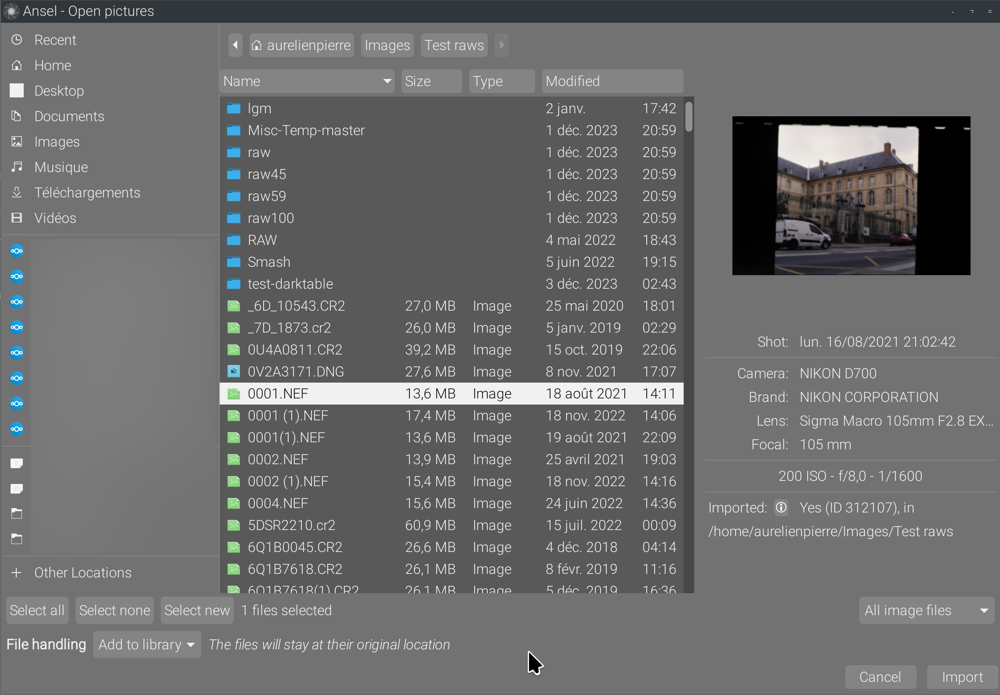

The file browser is a native Gtk filechooser widget, meaning the OS bookmarks (and even here the Nextcloud synchronized folders) are automatically imported from the desktop environment. The picture preview has been extended with EXIF metadata as to better identify images. A look-up into the library database shows whether or not the picture was already imported into Ansel or Darktable, and where.[^1]

[^1]: This reuses the Darktable code but with a clearer display.

Image types (raw, non-raw or all) are filtered using native Gtk filters and the full list of files to import is built straight in the GUI, without second-guessing in the back-end. When folders are selected, their content is automatically crawled recursively and the first image of the collection is shown. The final number of images detected is displayed below the file chooser:

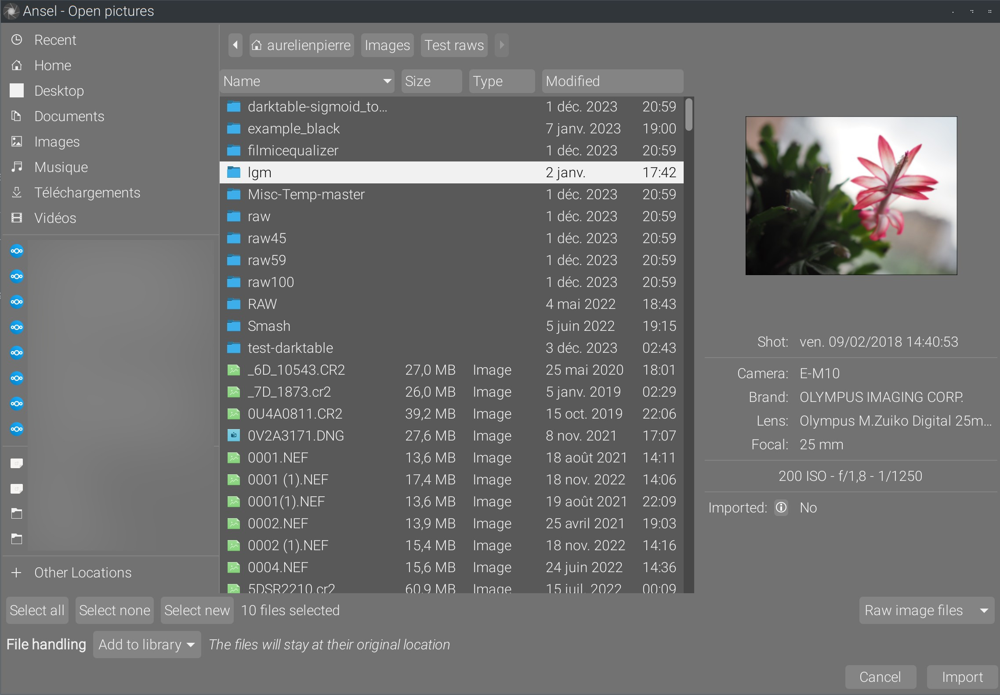

Many sorting and display options are natively handled by the Gtk filechooser, including search (through <kbd>Ctrl+F</kbd>), without additional work:

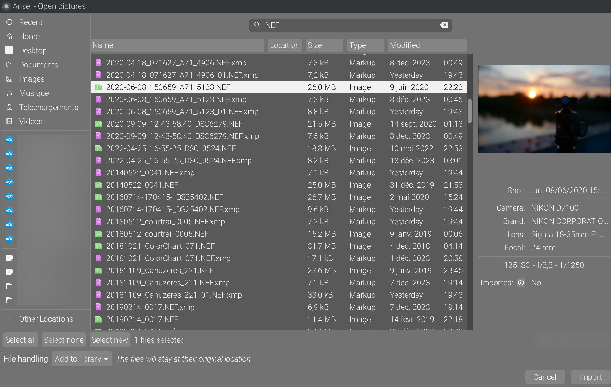

The file handling option enables the import with or without copy, the label explains the difference in full words:

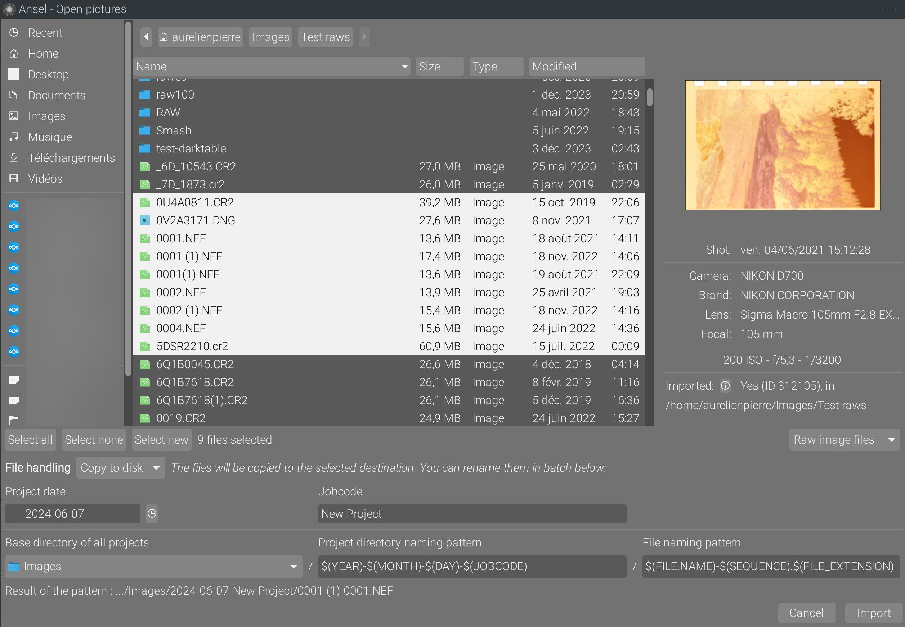

The _project date_ is automatically set to today's, no override or anything that would suggest something undisclosed is otherwise happening by default. To set the date, a calendar widget is provided which automatically formats date in the right ISO format. If the date is typed directly in the text input, a format validation is performed and an error feedback is displayed:


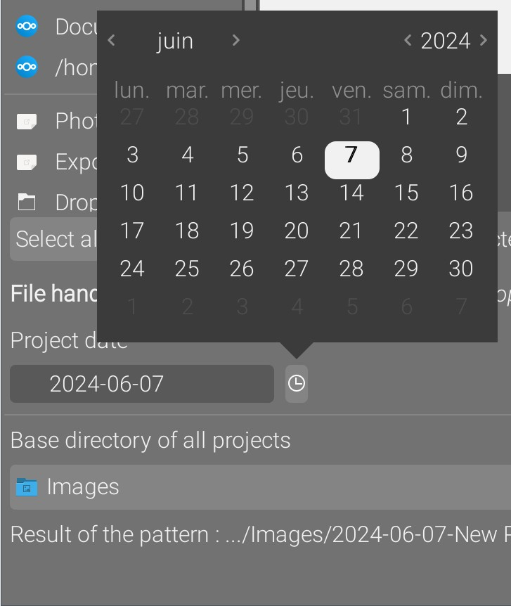
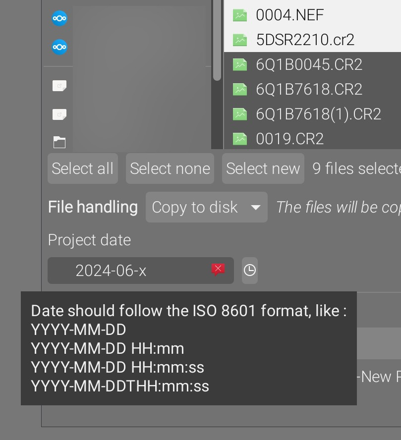


Note that only the date (year, month, day) is supported by the calendar widget. Setting the time (hour, minute, second) needs to be done manually in the text field. Surveys show this is rarely needed.

The folder and file naming patterns support variables auto-completion automatically, when `$(` is typed. The new import back-end supports using EXIF fields of images to define folders names, for example a folder pattern like `$(JOBCODE)-$(EXIF.ISO)` would split pictures into several folders named after their ISO metadata. When this happens, the lighttable opens the last created folder when the import window closes:

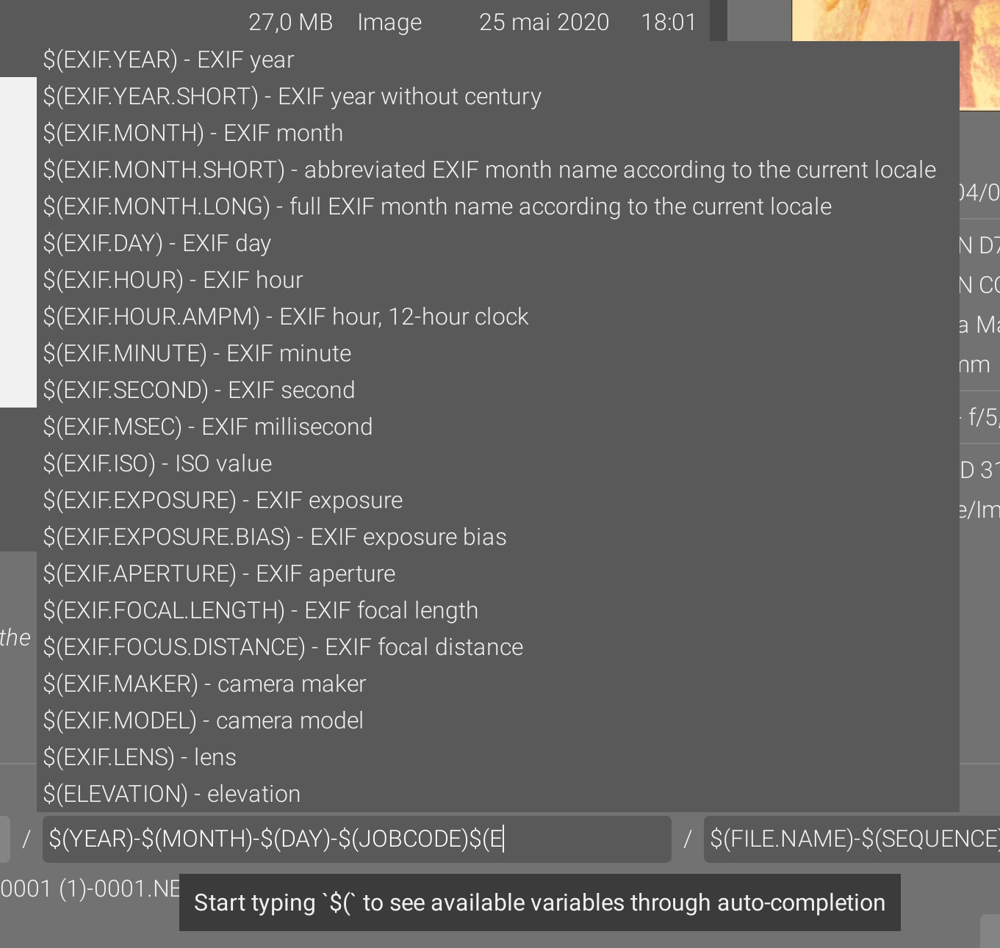

Last but not least, an user-requested feature: being able to preview the result of the patterns defined on the currently-selected picture:

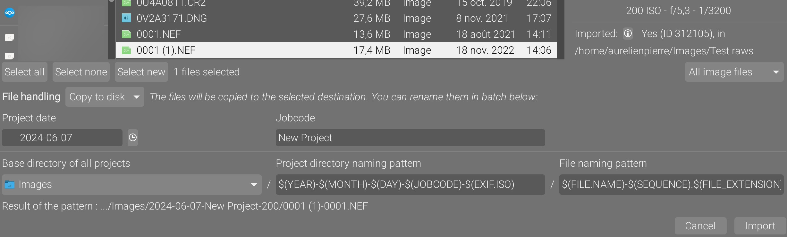

The pattern result follows the selected files and folders, as well as any change in the main folder and patterns. Note that the base directory (for all projects) doesn't accept patterns anymore, since there is no reason to put patterns everywhere, which allows to use a safe and simple Gtk folder list widget. This way, at least the top-level Ansel folder is set in a robust and user-friendly manner, and if harms happens from naming patterns, it will be enclosed within something predictable.

## Conclusion

It should be noted that this simpler graphical design comes also with a much simpler code structure, fewer lines and a more linear logic. The front-end needs 1200 lines, and the back-end around 400 lines (comments included, _the new backend has Doxygen docstrings almost everywhere_). A lot of the front-end volume of code comes from the recursive folder crawler, which runs in a separate thread to not block the GUI thread, but still updates the file counts periodically for feedback. This has been tested with folders of more than 60.000 images.

Darktable has more than 2700 lines of front-end and more than 800 lines of back-end (no docstrings). Also, the Darktable architecture expects one target folder per import session, which forbids to use per-picture EXIF in folder's naming patterns, and has completely different code pathes to handle the with copy/without copy discrepancies. This makes it difficult to keep both pathes in sync because they still share some bits (adding to the database and initializing metadata). In Ansel, we merged both pathes with only an optional initial I/O to copy the files if needed.

Ansel's front-end and back-end import communicate through a stupid-simple list of file pathes, which means the back-end is not second-guessing whatever user decision was made in the GUI. Also, all GUI code has been removed from the backend. This is a generic and robust design that will allow alternative ways to produce a list of files to import, for example headless (from a script). Previously, things like JPG filtering or files re-ordering happened in the back-end.[^3]

[^3]: The whole notion of back-end vs. front-end is new to the Darktable ecosystem, as you will find GUI (Gtk) functions pretty much everywhere, protected by a recurring `if(darktable.gui)` to prevent segmentation faults when the software runs from CLI.

The main appeal of the scrubbed design is that all the info needed to understand what's what is accessible right into the window, without having to open a documentation. In case of destination filename conflicts during import with copy, users are warned with a popup window and the existing files are never overwritten. Not to mention, the whole thing resembles a typical file browser.

Some users have also expressed the wish to use the editing features of the software without being bothered with the oddity of the internal digital assets management (the lighttable, mostly). This new importer allows them to open single images directly into the darkroom through double-click on file or click on file + click on the _import_ button, effectively bypassing the lighttable entirely.

The naming patterns have, of course, been removed from the preferences popup (which, by the way, can be found from the global menu, through _Edit_ → _Preferences_, as in any sane software).

_Many thanks to Guillaume Stutin for his tedious work on this topic_.


The new importer is available for Ansel build versions > 0.0.0+780.

