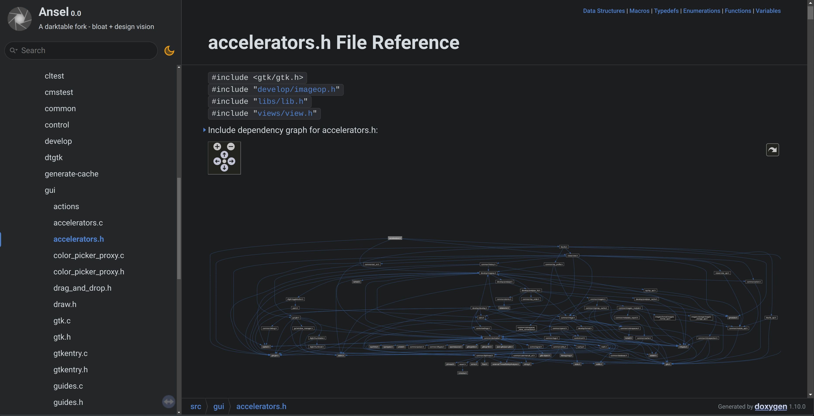
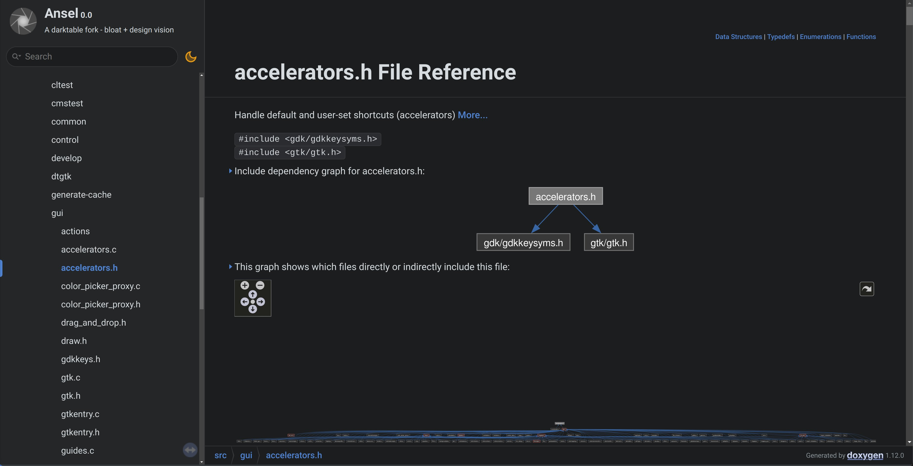
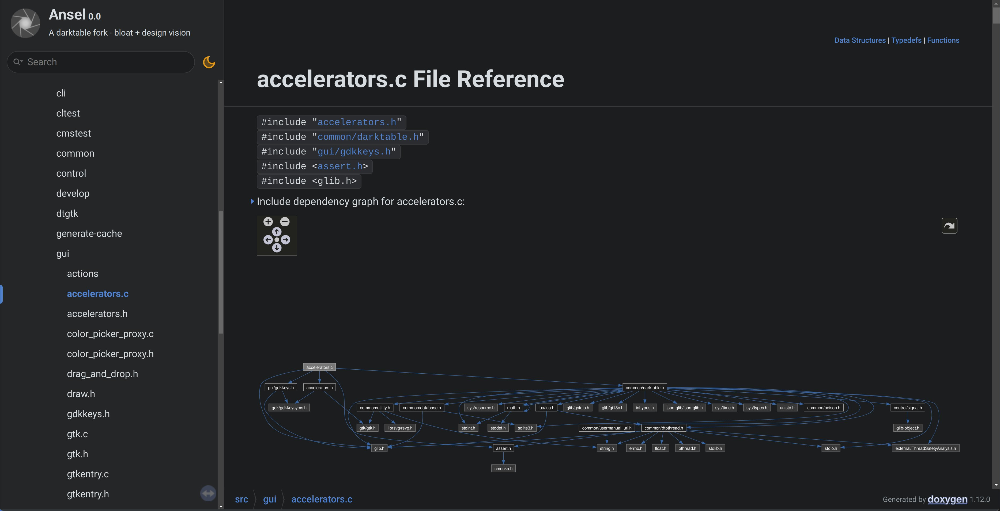

Back in December 2019, I asked that someone [took care of providing AppImages packages](https://github.com/darktable-org/darktable/issues/3925) for Darktable. The obvious benefit would have been enabling early testing, prior to release, from people who can't build the source code themselves, as to _hopefully_ provide early feedback and help debugging __before__ releasing. This has never been a priority, which means that it was ok to have a pre-release __and__ a post-release rush to fix bugs.

I was not joking when I said that Darktable was a burn-out factory, managed like the worst start-ups, except nobody will do an exit and it's basically a dry loss for everybody involved. I'm all the more angry about it that a lot of man-hours have been wasted on cluttering the UI with cosmetics, while having nightly builds for general use would have improved both the quality of the software, but also the comfort and quality of life of its maintainers. These goals obviously didn't matter.

So, since one is never better served than by his own bugs, [I had to do it myself](https://github.com/aurelienpierreeng/ansel/commit/3852b1ba2c0be84c5130d4c21844f3199b3624b2), and in mid-December 2022, Ansel got AppImage nightly builds scripts that Darktable re-used a month later. With the cohorts of IT guys "with no pixel math skills" roaming around Darktable's hype and asking how they could help, of course, the best possible resource management was to divert man-hours from one of the very few math-able guys available on a purely IT task. That only took me something around 50 hours, because having a locally-working script is really not the same as whispering [YAML scripts](https://en.wikipedia.org/wiki/YAML) to Github Action's ears, and I had to learn it as I was doing it. Plus, I hate programming, but I make do for maths and physics, and that kind of menial server configuration is really the worst kind of programming there is, insofar that it is neither creative nor cognitively challenging, it's only a time-consuming way of working around the design limitations of third-party APIs.

So, finally, Ansel was a semi-organized software project, able to include an userbase larger than just the die-hard geeks who look down on everyone unable to get GCC and CMake in building order, with a big "download" button on the [front page](/) that would always point to the latest build, without users having to figure out what the latest one was. Because a photo editor software should not filter out users based on their computer litteracy, whether or not it comes from the Linux world (which really is no excuse), or there is a memo from the free software Fundation that I didn' get.

But the last major issue was the lack of a developer documentation. Back in 2018, when I started contributing to Darktable, I had a very hard time grasping how the internals were wired, from just reading the code. 7 years later, even with all my experience, I still have to reverse-engineer my way through the code, using as much [`grep`](https://en.wikipedia.org/wiki/Grep) as my intuition, because the code is not modular, few places use APIs, comments are lacking, and line-by-line [Git blame](https://git-scm.com/docs/git-blame) doesn't always allow to go back in the history of design changes when someone committed (useless) code formatting changes.

That lack of developer documentation led to many features being implemented more than once, in several places, by several developers (and sometimes even by the same, over the years). At the time of writing, there are still 4 or 5 different ways, in Ansel, to write a picture history from library database to a sidecar XMP file. Some of these ways are rarely used, thus barely tested, and bugs there could go unnoticed for years, until someone reports the super-peculiar bug hidden in the forest of options. Then, for the maintainer in charge, it's a silly game of figuring out why XMP fail only in a some circumstances, which requires archaeology into the code base to figure out that it doesn't use the main XMP writing method. XMP are a specific, and still current, example, but there were many others. You get the idea.

I had noted for several years that (old) Darktable C header files had pretty much all [Doxygen docstrings](https://www.doxygen.nl/manual/docblocks.html). This is a very lazy way of doing documentation: run the command `doxygen -g <config-file>` against your source code directory, and Doxygen will build you an HTML static website of all APIs. Then you can dump all HTML files to a webserver directory, and call that your dev docs : the only tedious bit is to write the configuration file, which you do only once. So I did that: [dev.ansel.photos](https://dev.ansel.photos). API that I have rewritten (like [`selection.h`](https://dev.ansel.photos/selection_8h.html)) are documented as I made progress. Higher-level descriptions of the software architecture are incoming.

The great thing about Doxygen is it also produces dependency graphs of "modules" and APIs. And that's where you can actually see why I call Darktable's code spaghetti. This is the dependency graph of `accelerators.h`, the keyboard and MIDI shortcuts backend:

That shows you that the accelerators backend is absolutely not modular: it inherits the whole software. So any change elsewhere may have unforseen effects in there, and the other way around. Which is all the more concerning since this file has the [highest cyclomatic complexity of the whole software](https://sonarcloud.io/component_measures?id=aurelienpierre_darktable&metric=complexity&view=list), which makes it the most challenging file to maintain (I don't even dare to say _extend_, at that point it would be irresponsible). But it's also completely twisted in terms of direction of includes : shortcuts are a basic block that should __be included__ (aka _inherited_) in the GUI places that will implement shortcuts (darkroom/lighttable views, sliders and comboboxes, modules). Instead, the graph (and the file `#include` header) shows that shortcuts are also including (_inheriting_) their "children", so we have a double dependency and that's the worst possible way of doing it.

It's like building a house : the house should be aware of its walls, the walls should be aware of their bricks. Why ? Because the house is _made of_ walls, and the walls are _made of_ bricks, so every sub-component determines the nature and behaviour of the assembly, therefore the assembly has to know its immediate components. You don't make bricks aware of the house, because they won't change their nature depending on the assembly they belong to, and that would be a terribly flawed design. Same as it's an unnecessary level of micro-management to make the house aware of the bricks: once it's aware of its walls, it's up to the walls to account for the behaviour of their bricks, and maybe dispatch relevant info to the house. Object-oriented languages have builtin (and mandatory) ways of dealing with all that cleanly. But it's C, so you can do whatever the fuck you want to do. Doesn't mean it's a good idea, doesn't mean you should. And, well, C __not__ being an intrisincally object-oriented language is not an obstacle to using object patterns, inheritance and modularity. It's just that the developer will get no help from the language syntax to do so.

This is the same file after my complete rewrite of the shortcuts backend:

That clearly shows that the new shortcuts handler is a thin wrapper over Gtk native shortcuts, it doesn't know the rest of the software and doesn't care. We can look at the `accelerators.c` file too:

Now, there are lots of includes there from `darktable.h`, which is used only to get the debug helpers (they should be refactored away from that file), and includes a lot of unneeded crap too. Anyway, `accelerators.c` is aware only of Gtk/Gdk, which means it is a real module: it's completly isolated from the rest of the software. GUI widgets that implement shortcuts will declare their shortcut path, like `Ansel/Global/Menu/File/Import`, their default keys, and a reference (pointer) to themselves. Widget-less actions that have shortcuts will declare a callback function and input data to the shortcuts handler, instead of a pointer to a widget.

We save/restore the pathes and keys associations to/from the `keyboardrc` file, and that's it. There is no window to define shortcuts in GUI at this time, but making one will only have to list (loop over) known pathes and their associated keys. When the shortcuts handler catches a known combination of keys:

- for the widget-attached actions, it will send an `activate` Gtk signal to the relevant widget, and that widget will do its own thing through a callback (which is the same as the callback handling clicks, so the code is uniform between clicks and keyboard activation),
- for the widget-less actions, it will directly call the declared callback function over the declared data.

Both ways, the `accelerators` module communicates with the rest of the application through an interface exchanging 4 data fields, in a completely opaque way. As long as the interface doesn't change, changes can be made everywhere: they will stay enclosed into their module. With proper skills, this logic _could have_ been extended to MIDI devices support. But that's the difference between engineering and prototyping proof of concepts that should never make it into production.

This is unfortunately a trademark of the Darktable's way of doing things: GUI code is incrusted everywhere, even in SQL code. The other way around, SQL code is found in many GUI places (lighttable, history management, image tagging, etc.). Dependency graphs, embedded in Doxygen, are a very nice side-effect that shows the depth of the problem and make the spaghetti very obvious, because, apparently, problems don't exist until you actually see them yourself.

But it doesn't stop there. As I was writing my own Doxygen config file, I got an error: Doxygen reported 2 config files and was confused. It turns out that Darktable had everything wired for automated developer documentation generation [since 2010](https://github.com/darktable-org/darktable/commits/master/doc/doxygen.conf). Why it was never put into production, and actually hosted on some server, is not merely wrong priorities: it's negligence.

Of course, it doesn't help that the guy owning the `darktable.org` domain is not the same as the one managing the server where it's actually hosted. And the guy having actual commit rights over the `darktable.org` website is yet another one. The most pressing thing to do, when you are an open-source project making zero dollar of income, is to reproduce __all__ the mistakes of the corporate world, from the pressure to release half-baked shit at an irresponsible frequency, to the scattering of responsibilities between "services" that don't really communicate with each other (or with great delays). Because, in software (whether opensource or not), mistakes are meant to be reproduced. And since software has taken over the world, even in places that didn't need it, that says a lot about the world we live in.

The one thing I still truly don't get, though is : why the urgency ? Why keep working that badly given that there is no pressure nor financial incentive to do so ? Open-source is (could have been) the one place where we could actually work properly and take the necessary time to produce long-term quality. And even there, the shortsightedness of capitalism has taken over.

_If only users knew the state of deep shit this project fell into and how all the man-hours invested on it are actively making it worse…_
