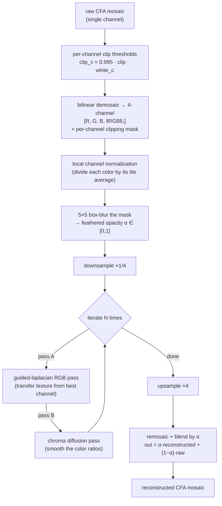
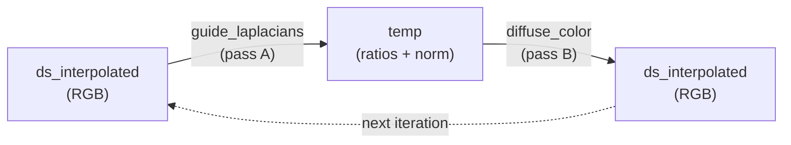

This article documents the mathematics of the `guided laplacians` method implemented in Ansel's
`_highlight reconstruction` module, as found in `src/iop/highlights.c`, `data/kernels/basic.cl`,
and `src/common/bspline.h`. It is not a usage guide. It is a reconstruction of the numerical model
from the source code, with the scientific claims traced back to the references cited in the code
comments and to the original design report published on the *pixls.us* forum.[^impl][^forum]

<!--more-->

## Abstract

When a camera sensor saturates, the three color channels do not saturate at the same time, so the
recorded color of a clipped highlight drifts — usually toward magenta. The `guided laplacians`
method reconstructs the missing information *before demosaicing*, treating the raw mosaic as a
sparse collection of gradients rather than as colorimetric data. It borrows the well-exposed
channels' texture into the clipped ones using Kaiming He's **guided filter**, then diffuses the
resulting **color** to fill the holes smoothly, all inside the same full-resolution à-trous
wavelet framework used by Ansel's [*diffuse or sharpen*](/resources/diffuse-or-sharpen-math/) module. The
two operations are the local update rules of two coupled energies — a cross-channel affine
consistency prior and a chroma Dirichlet (smoothness) energy — solved coarse-to-fine and iterated
to a fixed point.[^he][^qin][^impl]

## The problem : why clipped highlights turn magenta

A digital sensor is an array of photosites, each covered by one colored filter of a **color filter
array** (CFA) — the Bayer pattern (2×2 of R, G, G, B) or Fuji's X-Trans (6×6). Each photosite is a
potential well that fills with photo-electrons during the exposure and saturates at a fixed
capacity. Because the well capacity is a property of the silicon, **all three colors saturate at
roughly the same raw code value**.

The trap is white balance. A neutral grey subject does not produce equal raw signals in the three
channels: the CFA transmissions, the sensor's spectral sensitivity, and the scene illuminant all
differ per channel. To render such a subject as neutral, the raw developer multiplies each channel
by a **white-balance coefficient** — typically the green channel is left near $1$ while red and
blue are multiplied up by $1.5$ to $2$.

Now follow a neutral highlight as it gets brighter. The channel with the largest raw response (here
green) reaches the well's ceiling first and stops climbing. The other two keep rising until they
saturate in turn. Past the first saturation the recorded ratios are no longer neutral: after white
balance, red and blue overshoot green, and the "white" highlight reads as **magenta**.




This is a purely mechanical, colorimetric artifact of the capture apparatus. There is no magenta in
the scene. Any reconstruction that works in a color space *after* demosaicing is already fighting a
hue error that a demosaicing algorithm will have smeared across neighboring pixels. Reconstructing
*before* demosaicing, while the data is still a clean per-channel mosaic, is the whole point of the
guided-laplacian method.


The value at which a channel is declared clipped is not the numeric maximum but a per-channel
threshold derived from the raw white point:

```math
\text{clip}_c = 0.995 \times \texttt{clip} \times \text{white}_c,
```

where $\text{white}_c$ is the module's `processed_maximum` for channel $c$ (the per-channel raw
white level surviving the earlier pipeline stages) and `clip` is a user safety factor around $1$.
The $0.995$ margin keeps almost-saturated photosites — whose response has already gone nonlinear
near the top of the well — out of the "valid" set.[^impl]

## The landscape of simpler fixes

Ansel's module offers three cheaper reconstruction modes before the guided-laplacian one, and they
are worth stating because they frame what the expensive method buys:

* **Clip** simply crushes every channel to the common threshold $\min_c \text{clip}_c$. No magenta,
  but every clipped region becomes a flat, textureless white blob.
* **Reconstruct in LCh** converts each Bayer block to a luminance/chroma/hue triple, rescales the
  chroma of clipped blocks to match the unclipped luminance, and converts back. It removes the hue
  drift but cannot invent texture.[^impl]
* **Reconstruct color (inpaint)** propagates color *ratios* from neighboring unclipped pixels along
  rows and columns, using the exponential-decay ratio update of Magic Lantern's algorithm. It is
  fast and directional but one-dimensional and easily fooled by complex edges.[^impl]

The `guided laplacians` mode is the only one that restores **texture** inside the clipped region,
by transporting gradients from the channels that did survive.

## First principles : the building blocks

The method is an assembly of four ideas. Two of them — discrete Laplacians and the à-trous
B-spline pyramid — are shared verbatim with [*diffuse or sharpen*](/resources/diffuse-or-sharpen-math/) and
are only summarized here. The other two — the guided filter and chroma diffusion — carry the
reconstruction and are derived in full.

### Gradients and Laplacians

For a discrete image $u(i,j)$, the **gradient** measures the local slope,

```math
\nabla u = \left( \frac{u(i+1,j) - u(i-1,j)}{2}, \; \frac{u(i,j+1) - u(i,j-1)}{2} \right),
```

and the **Laplacian** measures the local curvature — how much a pixel departs from the average of
its neighbors,

```math
\Delta u = \frac{\partial^2 u}{\partial x^2} + \frac{\partial^2 u}{\partial y^2}.
```

The Laplacian is the workhorse here because it isolates *texture* as oscillation around a local
average — it is zero on flat regions and responds only to local contrast — and because it is
**linear**: over- or under-exposing the image simply rescales it (a property we lean on below).
Isolating texture this way is what lets us transplant it between channels without dragging along the
guide's absolute brightness; the difference in overall magnitude between a clipped channel and its
guide is absorbed by the guided filter's slope, not by the Laplacian itself. Ansel uses the
rotationally-symmetric 9-point stencil

```math
\mathbf{K}_{\text{iso}} =
\begin{bmatrix}
\tfrac14 & \tfrac12 & \tfrac14 \\
\tfrac12 & -3       & \tfrac12 \\
\tfrac14 & \tfrac12 & \tfrac14
\end{bmatrix},
```

whose angular error is much smaller than the naive 5-point cross, so diffusion does not privilege
the pixel-grid axes.[^oono][^patra][^ripl]

### The à-trous B-spline pyramid

To act on structures of many sizes, the image is split into frequency bands by repeatedly blurring
it with the separable cardinal B-spline kernel

```math
h_0 = \frac{1}{16}[1,4,6,4,1],
```

a compact approximation of a Gaussian of parameter $\sigma_B \approx 1.0554$.[^unser] At scale $s$
the taps are spread apart by a stride of $2^s$ pixels ("à-trous" = "with holes"), so the same tiny
kernel reaches ever farther without ever growing in cost. Writing $G_s$ for the successive
low-pass images and $H_s$ for the **detail bands**,

```math
G_{-1} = u, \qquad G_s = h_{2^s} * G_{s-1}, \qquad H_s = G_{s-1} - G_s,
```

the image is exactly the sum of its bands, $u = \sum_{s=0}^{n-1} H_s + G_{n-1}$. A detail band $H_s$ is a
difference of Gaussians, which is itself a scaled approximation of a Laplacian-of-Gaussian — so
"filtering the band $H_s$" and "applying a Laplacian at scale $s$" are two views of the same
operation. The full derivation, including how the equivalent Gaussian radius grows as

```math
\sigma_{G,s} = \sigma_B \sqrt{\frac{4^{s+1}-1}{3}},
```

is given in the [companion article on *diffuse or sharpen*](/resources/diffuse-or-sharpen-math/#the-à-trous-b-spline-pyramid).[^impl][^dreggn]


The detail band $H_s$ scales **linearly** with exposure, exactly like the Laplacian: over- or
under-exposing the image multiplies every $H_s$ by the same factor. This is what makes gradient
transfer between channels legitimate, and it is used below to build an exposure-invariant guide.


### The guided filter, from first principles

The **guided filter** of He, Sun and Tang is the engine that borrows texture from a good channel
into a clipped one.[^he] Suppose we want to produce an output image $q$ that stays faithful to some
target $p$ but wears the *edges and texture* of a **guide** $I$. Assume that, inside any small
window $\omega_k$ around pixel $k$, the output is an **affine function of the guide**:

```math
q_i = a_k \, I_i + b_k, \qquad \forall i \in \omega_k.
```

This single assumption — a *local color line* — is the whole model. It says that within a small
patch the channel we are rebuilding is just a scaled, shifted copy of the guide. It is the same
prior that underlies cross-channel demosaicing, dehazing, image matting and colorization: natural
surfaces trace *color lines* — locally, their channels are affinely related — because most edges are
changes in *reflectance* that scale all channels together.[^colorline] Under an affine map,
$\nabla q = a_k \nabla I$, so $q$ inherits every edge of $I$, merely rescaled by $a_k$.

We fit $(a_k, b_k)$ by least squares, keeping $a_k$ small to avoid amplifying noise (a ridge term
$\varepsilon a_k^2$):

```math
E(a_k, b_k) = \sum_{i \in \omega_k} \Big[ (a_k I_i + b_k - p_i)^2 + \varepsilon \, a_k^2 \Big].
```

Setting the derivatives to zero gives the closed form that appears, almost verbatim, in the code:

```math
\begin{aligned}
a_k &= \frac{\operatorname{cov}_{\omega_k}(I, p)}{\operatorname{var}_{\omega_k}(I) + \varepsilon}, \\
b_k &= \bar{p}_{\omega_k} - a_k \, \bar{I}_{\omega_k}.
\end{aligned}
```

The covariance in the numerator is the key: where guide and target move together, $a_k \to 1$ and
the guide's texture is copied through; where the guide is flat ($\operatorname{var} \to 0$), $a_k
\to 0$ and the output falls back to the local mean $\bar p$. The ridge parameter $\varepsilon$ sets
the scale below which variations are treated as noise and smoothed rather than transferred.


He's guided filter has a second step that Ansel drops: it averages the per-window coefficients
$(a_k, b_k)$ over all windows covering a pixel before applying them. Ansel uses the cheaper
*pointwise* variant — it fits the single $3\times3$ window centered on the pixel and applies those
coefficients there directly. The local-affine prior is identical; only the coefficient smoothing is
omitted.[^impl]


### Diffusion as color inpainting

Filling the *color* of a hole is a different problem from filling its *texture*. A hole's color
should vary **smoothly** and match its rim; it should not carry high-frequency detail of its own.
The natural formalism is the **Dirichlet energy**

```math
E[u] = \int_\Omega \lVert \nabla u \rVert^2 \, \mathrm{d}x,
```

whose minimizer over the hole $\Omega$, with the surrounding pixels as boundary condition, is the
**harmonic** function satisfying $\Delta u = 0$. The gradient descent of this energy is precisely
the **heat equation**

```math
\partial_t u = \Delta u,
```

i.e. isotropic diffusion. Running it spreads the boundary color inward until the hole is filled by
a smooth, curvature-free surface. This is the same anisotropic-heat-transfer inpainting model of
Qin et al. that Ansel already uses for *diffuse or sharpen*, restricted here to its isotropic
case.[^qin] We will apply it not to the pixels but to the **color ratios**, so that only chroma is
smoothed while the reconstructed luminance is left alone.

## The algorithm, end to end

Putting the blocks together, the module runs the following pipeline on the raw mosaic. Everything
happens in linear, scene-referred, pre-demosaic RGB.



Three preparatory stages deserve a note.

**Bilinear demosaic and the norm channel.** The mosaic is turned into a temporary 4-channel buffer
$[R, G, B, N]$ per pixel, where the fourth channel is the Euclidean norm $N = \sqrt{R^2+G^2+B^2}$.
This is a *throwaway* demosaic — its only job is to give every channel a value everywhere so the
guided filter and the diffusion have data to work on; the final module output is remosaiced back to
a single channel. A parallel 4-channel **clipping mask** records, per channel, whether the pixel
was saturated, with the fourth channel being the logical OR.[^impl]

**Local channel normalization.** Each color is divided by the *average value of that color in the
current tile*, a crude local white balance computed on the spot:

```math
\text{norm}_c = \frac{1}{|\text{tile}|}\sum_{p \in \text{tile},\, \text{color}(p)=c} u(p).
```

This equalizes the channel magnitudes so the guided filter's variance comparison (below) is not
biased toward whichever channel happens to carry the largest raw numbers. It deliberately does
*not* reuse the white balance declared upstream, keeping the normalization explicit and local to
the data being reconstructed.[^impl]

**Feathering the mask.** The binary mask is passed through a single $5\times5$ box average
(`dt_box_mean` with radius $2$), turning the hard $\\{0,1\\}$ edges into a smooth opacity $\alpha \in
[0,1]$. This $\alpha$ is used twice: as the final compositing opacity, and — crucially — as the
per-pixel *strength* of the guided transfer, so the reconstruction fades in gradually across the
boundary between valid and clipped pixels instead of leaving a seam.[^impl]

The whole reconstruction then runs on a **quarter-resolution** copy (`DS_FACTOR = 4`). Highlight
holes are large, smooth objects; solving the PDE on a downsampled grid is far cheaper and the
result is bilinearly upsampled before remosaicing with negligible loss.

## Pass A — the guided-laplacian texture transfer

The first pass is `guide_laplacians`. It decomposes the downsampled RGB into à-trous bands and, at
every scale, rebuilds the detail band $H$ of each channel from the detail band of the
**best-exposed** channel.

### Choosing the guide

For each pixel it gathers the $3\times3$ neighborhood on the current band's sub-lattice (stride
$2^s$) and computes the per-channel raw moments — mean, variance, and the covariance of each
channel with the others:

```math
\bar{H}_c = \frac{1}{9}\sum_{q} H_c(q), \qquad
\operatorname{var}(H_c) = \frac{1}{9}\sum_{q} H_c(q)^2 - \bar{H}_c^{\,2}.
```

The **guide channel** $g$ is the one with the largest variance among R, G, B:

```math
g = \arg\max_{c \in \{R,G,B\}} \operatorname{var}(H_c).
```

This is the heart of the method's robustness. The channel with the most local variance is the one
that still carries genuine texture — i.e. the channel that did *not* clip here (a clipped channel
is flat, hence low-variance). The reconstruction therefore always borrows from a surviving channel,
automatically and per pixel, with no fixed assumption about *which* channel that is.

### Transferring the band

With the guide chosen, each channel gets its own local affine model fitted against the guide,
exactly the guided-filter formulas derived above (here $\varepsilon = 0$; a small variance floor
guards the division in its place — the transfer is skipped where the guide is essentially flat — and
the slope is clamped non-negative so texture is never inverted):

```math
\begin{aligned}
a_c &= \max\!\left( \frac{\operatorname{cov}(H_c, H_g)}{\operatorname{var}(H_g)},\; 0 \right), \\
b_c &= \bar{H}_c - a_c \, \bar{H}_g.
\end{aligned}
```

The reconstructed detail band is the affine image of the guide's detail band at the current pixel,
blended with the original band by a scale-dependent opacity:

```math
H_c \leftarrow \beta_s \, \big( a_c \, H_g + b_c \big) + (1 - \beta_s)\, H_c,
\qquad
\beta_s = \frac{\alpha_c}{r_s^2}.
```

Here $\alpha_c$ is the feathered mask and $r_s$ is a scale radius the code computes as
$r_s = \sigma_{G}(\texttt{DS\\_FACTOR} \cdot s)$ — the equivalent Gaussian sigma of $4s$ stacked
B-spline blurs (the sigma recursion is advanced by `DS_FACTOR` steps per downsampled scale, rather
than the one step a plain à-trous ladder would use). Its practical effect matters more than its
exact calibration to pixels: $r_s$ grows by roughly $16\times$ per scale, so the denominator $r_s^2$
grows by roughly $256\times$ per scale, and the guided transfer collapses almost entirely onto the
finest band.[^impl]

### The transfer lives at the finest scale

Because $\beta_s \propto 1/r_s^2$ and $r_s$ grows very fast, the guided transfer is overwhelmingly
a **fine-scale** operation:


| scale $s$ | stride $2^s$ | radius $r_s$ (full-res px) | transfer opacity $1/r_s^2$ |
|-----------|--------------|----------------------------|-----------------------------|
| 0 | 1 | 1.06 | $8.98\times10^{-1}$ |
| 1 | 2 | 19.5 | $2.63\times10^{-3}$ |
| 2 | 4 | 312 | $1.03\times10^{-5}$ |
| 3 | 8 | 4991 | $4.01\times10^{-8}$ |


The division of labor this creates is deliberate. At the **finest** band the transfer runs almost at
full strength; and because a detail band has near-zero local mean, the intercept $b_c \approx 0$, so
the transfer is essentially $a_c H_g$ — a rescaled copy of the guide's texture. At the **coarser**
bands $\beta_s \approx 0$, the guided transfer switches off and the bilinearly-interpolated detail is
passed through unchanged; nothing at coarse scale borrows from the guide. The smooth, large-scale
*color* fill is carried instead by the low-pass residual $G_{n-1}$ of the interpolated image and —
above all — by the **chroma diffusion of pass B**, which, unlike pass A, carries no $r_s^2$
attenuation and therefore acts at every scale. Texture is a fine-scale loan from the guide; color is
filled across all scales by diffusion.

### Synthesis and the ratio/norm split

The bands are summed back coarse-to-fine. The code tags each scale with `FIRST_SCALE` /
`ANY_SCALE` / `LAST_SCALE` flags so that a single loop initializes the accumulator at the first
band, adds each subsequent band, and adds the residual low-pass at the last:

```math
u' = \sum_{s=0}^{n-1} H_s + G_{n-1}.
```

At the last scale the pass hands off to pass B by splitting each reconstructed pixel into a
**magnitude** and a **chroma ratio**:

```math
N = \max\!\Big( \sqrt{R^2+G^2+B^2},\; 10^{-6} \Big), \qquad
(R,G,B) \leftarrow \frac{(R,G,B)}{N}, \qquad \text{store } N \text{ in the 4th channel}.
```

This is a linear-RGB luminance/chrominance separation: $N$ is the achromatic magnitude, and the
unit vector $(R,G,B)/N$ is pure color. Pass A reconstructed the *magnitude and its texture*; pass B
will smooth the *color* while leaving $N$ untouched.

### Blending in noise

On the very last iteration only, and only where the mask is open, `guide_laplacians` adds
**Poissonian** noise of amplitude proportional to the local value:

```math
\sigma_c = \texttt{noise_level} \cdot u'_c,
```

folded to be strictly brightening ($u'_c + |{\text{noise}} - u'_c|$) and composited by $\alpha$.
Photon shot noise is Poissonian and signal-dependent, so a smooth reconstructed patch dropped into
a high-ISO image looks unnaturally plastic; matching the grain lets the repair disappear.[^impl]

## Pass B — diffusing the color

The second pass is `diffuse_color`. It reads pass A's ratio/norm buffer, decomposes it into à-trous
bands, and applies **isotropic diffusion to the color ratios only**, band by band. For each channel
$c \in \\{R,G,B\\}$ it evaluates the 9-point Laplacian of the detail band and takes one explicit
Euler step:

```math
H_c \leftarrow H_c + \alpha_c \, \kappa \, \big( \Delta H_c - \lambda \, H_c \big),
\qquad
\kappa = \frac{1}{\texttt{B_SPLINE_TO_LAPLACIAN}} \approx 0.314 .
```

The constant $\kappa$ is the difference-of-Gaussians-to-Laplacian normalization
($\texttt{B\\_SPLINE\\_TO\\_LAPLACIAN} = 2\sqrt{\pi}/\sigma_B^2 \approx 3.18$, so $\kappa \approx
0.31$) that rescales the à-trous detail band — a difference of B-splines — into a correctly-scaled
continuous Laplacian; it also sets the effective time step of the explicit diffusion.[^ripl][^impl]
The norm channel is explicitly excluded from the stencil and restored afterward, so diffusion never
touches the reconstructed magnitude.

Two things are worth reading off this update:

* With $\lambda = 0$ it is the pure **heat equation** $\partial_t r = \kappa \Delta r$ on the color
  ratios — harmonic inpainting that fills the hole's color smoothly from its rim, the Dirichlet
  minimizer derived above.
* The term $-\lambda H_c$, controlled by the `solid_color` parameter, is a **first-order reaction**
  that damps the ratio *detail* toward zero. The Euler–Lagrange equation becomes the screened-Poisson
  / modified-Helmholtz equation $\Delta r - \lambda \\, r = 0$; driving the detail bands to zero
  pulls the interior chroma toward its local low-frequency mean, and larger $\lambda$ also makes the
  surrounding valid color decay faster into the hole — a flatter, more uniform "solid color" fill.
  This is why its tooltip warns it "may produce non-smooth boundaries between valid and clipped
  regions."[^impl]

Unlike *diffuse or sharpen*, this diffusion is purely **isotropic** — there is no steering along
isophotes. That is a design choice, not an omission: texture (pass A) should follow structure, but
color (pass B) should fill without regard to direction, so a rotationally-symmetric smoother is
exactly what is wanted. At the last scale the ratios are renormalized to unit norm and multiplied
back by the untouched magnitude $N$ to restore RGB:

```math
(R,G,B) \leftarrow \frac{(R,G,B)}{\lVert (R,G,B)\rVert} \cdot N.
```

### The two passes alternate

One iteration is *pass A then pass B*, ping-ponging between two buffers so the output of one is the
input of the next:



Pass A rebuilds magnitude and texture; pass B smooths color; the reassembled RGB feeds the next
sweep. Successive iterations are fixed-point sweeps that let information propagate deeper into large
holes — which is why the `iterations` parameter is the knob to turn when "magenta highlights don't
get fully corrected."[^impl]

## The optimization objective

The code never assembles a global energy and calls a named solver. But each operator above *is* the
local update rule of a well-defined variational problem, and reading them together makes the
objective explicit. The reconstruction on the clipped region $\Omega$ minimizes the sum of two
coupled energies.

**1. Cross-channel affine consistency (pass A).** For every window $\omega_k$ and every channel
$c$, the reconstruction should be an affine function of the guide $g$ — the guided filter is the
exact minimizer of

```math
E_{\text{affine}} = \sum_{k}\sum_{c}\sum_{i \in \omega_k}
\Big[ \big( a_{k,c} H_g(i) + b_{k,c} - H_c(i) \big)^2 + \varepsilon\, a_{k,c}^2 \Big].
```

This is the prior that clipped channels share the surviving channel's texture — the "sparse
collection of gradients" view of the raw image.[^he][^forum]

**2. Chroma Dirichlet energy (pass B).** The reconstructed color ratios $r = (R,G,B)/N$ should be
smooth inside the hole and match its boundary, optionally biased toward flatness:

```math
E_{\text{chroma}} = \int_\Omega \Big( \lVert \nabla r \rVert^2 + \lambda \, \lVert r \rVert^2 \Big)\, \mathrm{d}x,
\qquad
r\big|_{\partial \Omega} = r_{\text{valid}} .
```

Its Euler–Lagrange equation is the screened Poisson equation the diffusion pass integrates.[^qin]

The full objective is $E_{\text{affine}} + E_{\text{chroma}}$, and the two are **decoupled onto
complementary degrees of freedom**: $E_{\text{affine}}$ acts on the achromatic magnitude and its
texture, $E_{\text{chroma}}$ acts on the chroma ratios, and the ratio/norm split is what keeps them
from fighting. The à-trous pyramid solves each band from coarse to fine; the outer loop is a
block-coordinate descent alternating the two — Jacobi-style sweeps toward the joint minimizer. This
is the same engineering philosophy as *diffuse or sharpen*: a stack of local, physically-motivated
update rules whose *combined* fixed point is the reconstruction, rather than a single monolithic
inverse problem.[^impl]

## Parameters, mapped to the math


| GUI control | symbol | role in the model |
|-------------|--------|-------------------|
| `clipping threshold` | `clip` | scales the per-channel saturation thresholds $\text{clip}_c$ that define the hole $\Omega$ |
| `iterations` | $N$ | number of block-coordinate sweeps (pass A + pass B); raise to fill larger holes |
| `diameter of reconstruction` | — | target radius → number of à-trous scales $n$ (2 px … 4096 px) |
| `noise level` | `noise_level` | amplitude of the signal-dependent Poisson grain blended in at the last iteration |
| `inpaint a flat color` | $\lambda$ | strength of the first-order reaction term; pulls the chroma fill toward a uniform solid color |


Note that the number of scales adapts to the darkroom **zoom level**: radii are defined in
full-resolution raw space, and a downscaled preview simply starts the wavelet ladder from the
finest scale still available, so the preview stays faithful to the full-resolution result. This is
the same zoom-aware scale selection described for *diffuse or sharpen*.[^impl]


The clipping threshold has a mask-visualization toggle (the icon next to the slider). When active,
the module renders a **false-color** overlay — valid pixels dimmed, clipped pixels flagged — so you
can see exactly which region $\Omega$ the reconstruction will act on before committing to it. You
should almost never need to move the threshold itself.


## What is specific to Ansel

The scientific references supply the pieces:

* the guided filter and its local affine model,[^he]
* the cross-channel "color-line" affine prior behind it,[^colorline]
* anisotropic heat-transfer inpainting,[^qin]
* the à-trous B-spline wavelet transform,[^dreggn][^unser]
* rotationally-invariant discrete Laplacians.[^oono][^patra][^ripl]

What is specific to Ansel is the assembly:

* reconstruction is done **before demosaicing**, on the raw mosaic, where the per-channel clipping
  is still clean;
* the guide is selected **per pixel and per scale** as the maximum-variance channel, so texture is
  always borrowed from a survivor with no fixed channel assumption;
* the guided transfer is **scale-feathered** ($\beta_s \propto 1/r_s^2$), concentrating texture at
  fine scales while color is filled by a separate diffusion at coarse scales;
* magnitude and chroma are **split** and reconstructed by two different operators that do not
  interfere;
* it runs on a downsampled grid inside a **zoom-aware** wavelet ladder, with identical CPU and
  OpenCL mathematics.[^impl]

## Perspectives and limitations

The method restores texture where every prior mode could only flatten it, and it does so without
any colorimetric assumption — its worst failure mode is a plausible-looking hallucination rather
than a hue error. But it is not free of caveats, several of which were flagged in the original
design report:[^forum]

* It reconstructs *within* the clipped region but does not by itself repair the demosaicing color
  artifacts (residual magenta fringing, chromatic aberration) that a clipped edge produces
  downstream; those still want a dedicated correction later in the pipeline.
* It is **expensive** — two full wavelet decompositions per iteration, iterated — which is why the
  reconstruction diameter and iteration count carry explicit "slow" warnings.
* The guide-selection heuristic assumes at least one channel survives locally; where *all three*
  clip over a region larger than the coarsest scale, there is no texture left to borrow and the
  result degrades to a smooth diffusion fill.

The broader lesson mirrors the one from *diffuse or sharpen*: a reconstruction built as a stack of
transparent, physically-grounded local rules — guided-filter transfer plus screened-Poisson
diffusion in a multiscale wavelet frame — can outperform monolithic, heuristic highlight
recovery, and it fails gracefully when it fails. The price is a set of controls whose meaning is
mathematical rather than photographic; this article is an attempt to make that meaning legible.

[^impl]: Current implementation in the Ansel source tree: `src/iop/highlights.c` (functions
`_interpolate_and_mask`, `_compute_laplacian_normalization`, `guide_laplacians`,
`heat_PDE_diffusion`, `wavelets_process`, `process_laplacian_bayer` / `_xtrans`),
`data/kernels/basic.cl` (kernels `guide_laplacians`, `diffuse_color`, `highlights_false_color`),
and `src/common/bspline.h` (`B_SPLINE_SIGMA`, `B_SPLINE_TO_LAPLACIAN`, `equivalent_sigma_at_step`).

[^forum]: Aurélien Pierre, "Guiding Laplacians to restore clipped highlights," design report and
discussion, *pixls.us* community forum, 2021.
[URL](https://discuss.pixls.us/t/guiding-laplacians-to-restore-clipped-highlights/28493).

[^he]: Kaiming He, Jian Sun, and Xiaoou Tang, "Guided Image Filtering," *IEEE Transactions on
Pattern Analysis and Machine Intelligence*, 35(6), 1397-1409, 2013. DOI:
[10.1109/TPAMI.2012.213](https://doi.org/10.1109/TPAMI.2012.213). Originally in *ECCV 2010*.

[^colorline]: The local-affine "color-line" prior — within a small patch, a surface's color channels
are affinely related. Canonical sources: Ido Omer and Michael Werman, "Color Lines: Image Specific
Color Representation," *CVPR 2004*; and the matting Laplacian of Anat Levin, Dani Lischinski, and
Yair Weiss, "A Closed-Form Solution to Natural Image Matting," *IEEE TPAMI* 30(2), 228-242, 2008,
DOI [10.1109/TPAMI.2007.1177](https://doi.org/10.1109/TPAMI.2007.1177). The related "Colorization
using Optimization" (SIGGRAPH 2004, DOI
[10.1145/1015706.1015780](https://doi.org/10.1145/1015706.1015780)) uses a softer intensity-affinity
prior.

[^qin]: Chuan Qin, Shuozhong Wang, and Xinpeng Zhang, "Simultaneous inpainting for image structure
and texture using anisotropic heat transfer model," *Multimedia Tools and Applications*, 56(3),
469-483, 2012. DOI: [10.1007/s11042-010-0601-4](https://doi.org/10.1007/s11042-010-0601-4).

[^dreggn]: Holger Dammertz, Daniel Sewtz, Johannes Hanika, and Hendrik P.A. Lensch,
"Edge-Avoiding À-Trous Wavelet Transform for fast Global Illumination Filtering," Ulm University,
2010. [PDF](https://jo.dreggn.org/home/2010_atrous.pdf).

[^unser]: Michael Unser, "Splines: A Perfect Fit for Signal and Image Processing," *IEEE Signal
Processing Magazine*, 16(6), 22-38, 1999. DOI:
[10.1109/79.799930](https://doi.org/10.1109/79.799930).

[^oono]: Y. Oono and S. Puri, "Computationally efficient modeling of ordering of quenched phases,"
*Physical Review Letters*, 58(8), 836-839, 1987. DOI:
[10.1103/PhysRevLett.58.836](https://doi.org/10.1103/PhysRevLett.58.836).

[^patra]: M. Patra and M. Karttunen, "Stencils with isotropic discretization error for differential
operators," *Numerical Methods for Partial Differential Equations*, 22(4), 936-953, 2006. DOI:
[10.1002/num.20129](https://doi.org/10.1002/num.20129).

[^ripl]: Aurélien Pierre, "Rotation-invariant Laplacian for 2D grids," 2021, which derives the
9-point stencil, the B-spline Gaussian-equivalent $\sigma_B$, and the difference-of-Gaussians to
Laplacian normalization constant used as `B_SPLINE_TO_LAPLACIAN`.
[URL](https://eng.aurelienpierre.com/2021/03/rotation-invariant-laplacian-for-2d-grids/).
