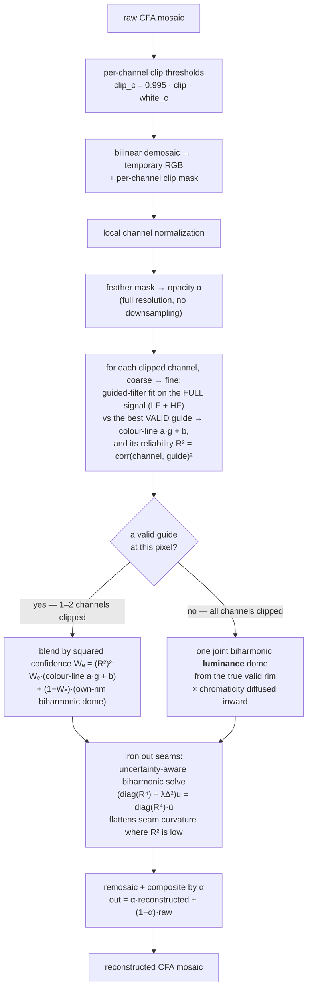

This article presents the mathematics of Ansel's `guided laplacians` highlight reconstruction — the
method behind the `_highlight reconstruction` module (`src/iop/highlights.c`,
`data/kernels/basic.cl`, `src/common/bspline.h`). It starts from first principles, derives the
reconstruction and its optimization objective, and validates it numerically on synthetic images.
The scientific claims trace back to the references cited in the code and to the original design
report on the *pixls.us* forum.[^forum] It describes the method as it is *meant* to work; a
magnitude-recovery bug in the current implementation — found during the numerical validation — is
documented in the closing section.[^impl]

<!--more-->

## Abstract

When a camera sensor saturates, the three color channels do not clip at the same time, so a blown
highlight drifts in color — usually toward magenta. The `guided laplacians` method reconstructs the
missing data *before demosaicing*, treating the raw mosaic as a collection of gradients rather than
colorimetric data. Its principle is the cross-channel **colour-line**: inside a small neighborhood
the color channels are affinely related, so a channel that clipped can be rebuilt from the channels
that survived by fitting a local affine model — Kaiming He's **guided filter**. Applied across
scales *on the full signal*, this recovers both the texture **and the magnitude** of a clipped
channel. How far to trust that borrow is decided per pixel by the local **inter-channel
correlation** — a strong colour-line follows the guide, a weak one extends the channel's own
gradient instead. Where every channel clips and no guide survives, the fine detail is lost, but a
single shared **luminance dome** — biharmonic (gradient-continuing) inpainting of the summed
brightness — restores the magnitude while the **hue** is diffused inward from the rim, so a blown
neutral highlight is rebuilt as a neutral dome rather than an off-colour disk. A final
confidence-weighted biharmonic pass irons out the seams left where these operators meet — since, as we
show, no local statistic cleanly tells a colour-line from noise, it is cheaper to regularize the
output than to perfect the metric. We derive the model from first principles, state it as the
minimization of four coupled energies — cross-channel affine consistency, magnitude curvature, chroma
smoothness, and uncertainty-aware output smoothness — and validate it on synthetic clipped
gradients.[^he][^qin]

## The problem : why clipped highlights turn magenta

A digital sensor is an array of photosites, each covered by one colored filter of a **color filter
array** (CFA) — the Bayer pattern (2×2 of R, G, G, B) or Fuji's X-Trans (6×6). Each photosite is a
potential well that fills with photo-electrons during the exposure and saturates at a fixed
capacity. Because the well capacity is a property of the silicon, **all three colors saturate at
roughly the same raw code value**.

The trap is white balance. A neutral grey subject does not produce equal raw signals in the three
channels: the CFA transmissions, the sensor's spectral sensitivity, and the scene illuminant all
differ per channel. To render such a subject as neutral, the raw developer multiplies each channel
by a **white-balance coefficient** — typically the green channel is left near $1$ while red and
blue are multiplied up by $1.5$ to $2$.

Now follow a neutral highlight as it gets brighter. The channel with the largest raw response (here
green) reaches the well's ceiling first and stops climbing. The other two keep rising until they
saturate in turn. Past the first saturation the recorded ratios are no longer neutral: after white
balance, red and blue overshoot green, and the "white" highlight reads as **magenta**.




This is a purely mechanical, colorimetric artifact of the capture apparatus. There is no magenta in
the scene. Any reconstruction that works in a color space *after* demosaicing is already fighting a
hue error that a demosaicing algorithm will have smeared across neighboring pixels. Reconstructing
*before* demosaicing, while the data is still a clean per-channel mosaic, is the whole point of the
guided-laplacian method.


The value at which a channel is declared clipped is not the numeric maximum but a per-channel
threshold derived from the raw white point:

```math
\text{clip}_c = 0.995 \times \texttt{clip} \times \text{white}_c,
```

where $\text{white}_c$ is the module's `processed_maximum` for channel $c$ (the per-channel raw
white level surviving the earlier pipeline stages) and `clip` is a user safety factor around $1$.
The $0.995$ margin keeps almost-saturated photosites — whose response has already gone nonlinear
near the top of the well — out of the "valid" set.[^impl]

## The landscape of simpler fixes

Ansel's module offers three cheaper reconstruction modes before the guided-laplacian one, and they
are worth stating because they frame what the expensive method buys:

* **Clip** simply crushes every channel to the common threshold $\min_c \text{clip}_c$. No magenta,
  but every clipped region becomes a flat, textureless white blob.
* **Reconstruct in LCh** converts each Bayer block to a luminance/chroma/hue triple, rescales the
  chroma of clipped blocks to match the unclipped luminance, and converts back. It removes the hue
  drift but cannot invent texture.[^impl]
* **Reconstruct color (inpaint)** propagates color *ratios* from neighboring unclipped pixels along
  rows and columns, using the exponential-decay ratio update of Magic Lantern's algorithm. It is
  fast and directional but one-dimensional and easily fooled by complex edges.[^impl]

The `guided laplacians` mode is the only one that restores both the **texture and the magnitude** of
a clipped region, by borrowing from the channels that did survive along the local colour-line.

## First principles : the building blocks

The method is an assembly of four ideas. Two of them — discrete Laplacians and the à-trous
B-spline pyramid — are shared verbatim with [*diffuse or sharpen*](/resources/diffuse-or-sharpen-math/) and
are only summarized here. The other two — the guided filter and chroma diffusion — carry the
reconstruction and are derived in full.

### Gradients and Laplacians

For a discrete image $u(i,j)$, the **gradient** measures the local slope,

```math
\nabla u = \left( \frac{u(i+1,j) - u(i-1,j)}{2}, \; \frac{u(i,j+1) - u(i,j-1)}{2} \right),
```

and the **Laplacian** measures the local curvature — how much a pixel departs from the average of
its neighbors,

```math
\Delta u = \frac{\partial^2 u}{\partial x^2} + \frac{\partial^2 u}{\partial y^2}.
```

The Laplacian is the workhorse here because it isolates *texture* as oscillation around a local
average — it is zero on flat regions and responds only to local contrast — and because it is
**linear**: over- or under-exposing the image simply rescales it (a property we lean on below).
Isolating texture this way is what lets us transplant it between channels without dragging along the
guide's absolute brightness; the difference in overall magnitude between a clipped channel and its
guide is absorbed by the guided filter's slope, not by the Laplacian itself. Ansel uses the
rotationally-symmetric 9-point stencil

```math
\mathbf{K}_{\text{iso}} =
\begin{bmatrix}
\tfrac14 & \tfrac12 & \tfrac14 \\
\tfrac12 & -3       & \tfrac12 \\
\tfrac14 & \tfrac12 & \tfrac14
\end{bmatrix},
```

whose angular error is much smaller than the naive 5-point cross, so diffusion does not privilege
the pixel-grid axes.[^oono][^patra][^ripl]

### The à-trous B-spline pyramid

To act on structures of many sizes, the image is split into frequency bands by repeatedly blurring
it with the separable cardinal B-spline kernel

```math
h_0 = \frac{1}{16}[1,4,6,4,1],
```

a compact approximation of a Gaussian of parameter $\sigma_B \approx 1.0554$.[^unser] At scale $s$
the taps are spread apart by a stride of $2^s$ pixels ("à-trous" = "with holes"), so the same tiny
kernel reaches ever farther without ever growing in cost. Writing $G_s$ for the successive
low-pass images and $H_s$ for the **detail bands**,

```math
G_{-1} = u, \qquad G_s = h_{2^s} * G_{s-1}, \qquad H_s = G_{s-1} - G_s,
```

the image is exactly the sum of its bands, $u = \sum_{s=0}^{n-1} H_s + G_{n-1}$. A detail band $H_s$ is a
difference of Gaussians, which is itself a scaled approximation of a Laplacian-of-Gaussian — so
"filtering the band $H_s$" and "applying a Laplacian at scale $s$" are two views of the same
operation. The full derivation, including how the equivalent Gaussian radius grows as

```math
\sigma_{G,s} = \sigma_B \sqrt{\frac{4^{s+1}-1}{3}},
```

is given in the [companion article on *diffuse or sharpen*](/resources/diffuse-or-sharpen-math/#the-à-trous-b-spline-pyramid).[^impl][^dreggn]


Two products of this pyramid are used below. The **low-pass** $G_s$ is a local weighted mean at
scale $s$ — exactly the local average the guided filter needs, at a whole ladder of window sizes.
The **detail band** $H_s$ is a scaled Laplacian, the operator the chroma-diffusion fallback
integrates. The reconstruction proper works on the $G_s$ (which carry the color's magnitude); the
fallback works on the $H_s$.


### The guided filter, from first principles

The **guided filter** of He, Sun and Tang is the engine that borrows texture from a good channel
into a clipped one.[^he] Suppose we want to produce an output image $q$ that stays faithful to some
target $p$ but wears the *edges and texture* of a **guide** $I$. Assume that, inside any small
window $\omega_k$ around pixel $k$, the output is an **affine function of the guide**:

```math
q_i = a_k \, I_i + b_k, \qquad \forall i \in \omega_k.
```

This single assumption — a *local color line* — is the whole model. It says that within a small
patch the channel we are rebuilding is just a scaled, shifted copy of the guide. It is the same
prior that underlies cross-channel demosaicing, dehazing, image matting and colorization: natural
surfaces trace *color lines* — locally, their channels are affinely related — because most edges are
changes in *reflectance* that scale all channels together.[^colorline] Under an affine map,
$\nabla q = a_k \nabla I$, so $q$ inherits every edge of $I$, merely rescaled by $a_k$.

We fit $(a_k, b_k)$ by least squares, keeping $a_k$ small to avoid amplifying noise (a ridge term
$\varepsilon a_k^2$):

```math
E(a_k, b_k) = \sum_{i \in \omega_k} \Big[ (a_k I_i + b_k - p_i)^2 + \varepsilon \, a_k^2 \Big].
```

Setting the derivatives to zero gives the closed form that appears, almost verbatim, in the code:

```math
\begin{aligned}
a_k &= \frac{\operatorname{cov}_{\omega_k}(I, p)}{\operatorname{var}_{\omega_k}(I) + \varepsilon}, \\
b_k &= \bar{p}_{\omega_k} - a_k \, \bar{I}_{\omega_k}.
\end{aligned}
```

The covariance in the numerator is the key: where guide and target move together, $a_k \to 1$ and
the guide's texture is copied through; where the guide is flat ($\operatorname{var} \to 0$), $a_k
\to 0$ and the output falls back to the local mean $\bar p$. The ridge parameter $\varepsilon$ sets
the scale below which variations are treated as noise and smoothed rather than transferred.


He's guided filter has a second step — averaging the per-window coefficients $(a_k, b_k)$ over all
windows covering a pixel — that keeps the output from looking blocky. Ansel gets the same smoothing
for free by computing the window statistics with a **smooth** kernel (a Gaussian, or the à-trous
B-spline low-pass) rather than a hard box: overlapping smooth windows make $a$ and $b$ smoothly
varying fields, so $a\,I + b$ is already artifact-free without a separate averaging pass. This is not
a cosmetic detail — using a hard box window here leaves visible **blocky/diamond artifacts** in the
reconstructed highlights; the smooth window is what removes them.[^impl]


### Diffusion as color inpainting

Filling the *color* of a hole is a different problem from filling its *texture*. A hole's color
should vary **smoothly** and match its rim; it should not carry high-frequency detail of its own.
The natural formalism is the **Dirichlet energy**

```math
E[u] = \int_\Omega \lVert \nabla u \rVert^2 \, \mathrm{d}x,
```

whose minimizer over the hole $\Omega$, with the surrounding pixels as boundary condition, is the
**harmonic** function satisfying $\Delta u = 0$. The gradient descent of this energy is precisely
the **heat equation**

```math
\partial_t u = \Delta u,
```

i.e. isotropic diffusion. Running it spreads the boundary color inward until the hole is filled by
a smooth, curvature-free surface. This is the same anisotropic-heat-transfer inpainting model of
Qin et al. that Ansel already uses for *diffuse or sharpen*, restricted here to its isotropic
case.[^qin] We will apply it not to the pixels but to the **color ratios**, so that only chroma is
smoothed while the reconstructed luminance is left alone.

### Biharmonic inpainting: continuing gradients, not flattening

Harmonic inpainting is the right tool for a signal that *should* go flat inside the hole — a smooth
chroma. It is the wrong tool for one that was still *rising* when the sensor clipped it: a blown
highlight's magnitude kept climbing, and filling it flat ($\Delta u = 0$) leaves a matte disk where a
bright dome belongs. To carry the surrounding **slope** inward instead of erasing it, penalize the
signal's *bending* rather than its gradient — minimize the thin-plate (biharmonic) energy

```math
E_{\text{bihar}}[u] = \int_\Omega \lVert \Delta u \rVert^2 \, \mathrm{d}x
\qquad \Longrightarrow \qquad
\Delta^2 u = 0 \ \text{ on } \Omega, \quad u\big|_{\partial\Omega} = u_{\text{valid}} ,
```

whose Euler–Lagrange equation is the **biharmonic** equation $\Delta^2 u = 0$. Where the harmonic
solution forces $\Delta u = 0$ (a flat minimal surface), the biharmonic solution makes $\Delta u$
*itself* harmonic — the curvature at the rim is carried into the interior, so the boundary's rising
gradient is extrapolated into a dome (a thin-plate spline). It is the higher-order,
gradient-*extending* counterpart of diffusion, in the same spirit that *diffuse or sharpen* flips the
sign of the Laplacian to sharpen rather than smooth. We solve it as a direct sparse linear system on
the hole, and use it below to rebuild a clipped channel's magnitude from its own valid rim wherever
no correlated channel survives to guide it.[^ripl]

## The algorithm, end to end

Everything happens on the raw mosaic, in linear scene-referred RGB, before demosaicing, and at full
resolution. The method rebuilds each clipped channel from the channels that *survived* — along the
local colour-line, trusting it in proportion to how well it actually holds — and where **no** channel
survived it rebuilds one joint luminance dome and carries the surrounding hue inward.



Three preparatory stages deserve a note.

**Bilinear demosaic.** The mosaic is bilinearly demosaiced to a temporary RGB image — a *throwaway*
demosaic whose only job is to give every channel a value everywhere for the per-channel guided fit;
the final output is remosaiced back to a single channel. For the all-clipped cores a scalar
**magnitude** $L$ (the summed luminance $R+G+B$) is split from the **chromaticity** $\text{RGB}/L$, so
the two can be reconstructed by different means (a dome for the magnitude, diffusion for the hue).
A per-channel **clip mask**, together with its logical OR (feathered into the compositing opacity
$\alpha$), records which channels saturated.[^impl]

**Local channel normalization.** Each color is divided by the *average value of that color in the
current tile*, a crude local white balance computed on the spot. This equalizes channel magnitudes
so the guide-selection variance comparison is not biased toward whichever channel carries the
largest raw numbers; it deliberately does not reuse the white balance declared upstream.[^impl]

**Feathering the mask.** The binary mask is smoothed by a small $5\times5$ box average into an
opacity $\alpha \in [0,1]$, used as the final compositing weight. Feathering softens the seam where
the reconstruction meets untouched pixels; in the [numerical tests](#numerical-validation) it
lowered boundary error rather than raising it.

## Reconstructing the clipped channels

The core step applies the guided filter derived above at a ladder of scales, coarse to fine. Two
choices make it recover *magnitude*, not merely texture.

### Choosing the surviving guide

At each pixel and scale, among the channels that are **not clipped there**, pick the one with the
largest local variance — the channel that still carries genuine structure:

```math
g(x) = \arg\max_{c \,\in\, \text{valid}(x)} \operatorname{var}_\omega(u_c).
```

A clipped channel is rebuilt **only where such a valid guide exists**. Where a pixel keeps at least
one surviving channel (one- or two-channel clipping — the common case), that survivor guides the
reconstruction. Where *all three* channels clip, there is no guide and the pixel is handed to the
joint core below.

Selecting a single guide (rather than blending both) keeps the correlated case maximally sharp: where
a colour-line actually holds, the two candidate guides *agree*, so which one wins does not matter and
the estimate is smooth regardless. Where no colour-line holds the hard choice would **jump** as the
winner flips — but there the cross-channel estimate is untrustworthy anyway, and the correlation
weighting of the [next section](#trusting-the-guide--correlation-weighting) has already routed those
pixels to the smooth per-channel fallback, so the jump never reaches the output.

### Fitting the colour-line on the full signal

For a clipped channel $c$, fit the affine colour-line against the guide over a window $\omega$ of
radius $r_s$, using **only the samples where both channels are valid**, and — the crucial point —
on the **full pixel values**, not the mean-subtracted detail:

```math
a_c = \frac{\operatorname{cov}_\omega(u_g, u_c)}{\operatorname{var}_\omega(u_g) + \varepsilon},
\qquad
b_c = \bar u_{c,\omega} - a_c\, \bar u_{g,\omega},
```

then reconstruct the clipped pixels by

```math
u_c \leftarrow a_c\, u_g + b_c .
```

Because the fit is on values, the intercept $b_c$ carries the **DC level** of the color: a channel
clipped at the white point is *extrapolated back above it* along the colour-line the surviving
channels define. This is precisely what lets the method recover a highlight's true magnitude, not
just re-texture it at the clip level. The slope is clamped non-negative (color-lines do not invert),
and $\varepsilon$ / a variance floor guard the division where the guide is flat.


Fitting from the **valid samples only** is essential. The clipped samples are pinned at the white
point; including them in the fit would flatten the observed slope, and the model would reproduce the
clipped value instead of extrapolating past it. This is the single subtlety that separates a working
reconstruction from one that merely re-paints the clip.


### Trusting the guide : correlation weighting

The colour-line borrow is only as good as the assumption behind it — that the clipped channel and
its guide are, locally, affinely related. On a natural surface they are; on pathological content —
independent per-channel gradients, or a boundary between two differently-colored materials — they
are not, and forcing $u_c = a_c u_g + b_c$ would paint in structure that does not belong. The fit
itself reports how far to trust it: the coefficient of determination

```math
R^2 = \frac{\operatorname{cov}_\omega(u_g, u_c)^2}{\operatorname{var}_\omega(u_g)\,\operatorname{var}_\omega(u_c)} \in [0,1],
```

the squared correlation of guide and channel over the valid samples. $R^2 \to 1$ where the
colour-line explains the data (trust the cross-channel estimate); $R^2 \to 0$ where it does not
(the borrow is meaningless).

So the method does not *switch* between cross-channel and single-channel filling — it **blends them
by confidence**. Where the colour-line is weak, it falls back to extending the clipped channel's
*own* gradient inward: per-channel **biharmonic** inpainting ([above](#biharmonic-inpainting-continuing-gradients-not-flattening)),
anchored to that channel's *true* valid rim.
For a clipped channel that still has a surviving guide at the pixel,

```math
u_c \leftarrow W_e \underbrace{\,(a_c u_g + b_c)\,}_{\text{cross-channel guide}}
            + (1 - W_e)\, \underbrace{u_c^{\text{self}}}_{\text{own gradient}} ,
\qquad
W_e = (R^2)^2 .
```

The weight is the **squared** confidence, not $R^2$ itself. Measured over the clipped pixels, $R^2$
separates the two regimes but only with a soft margin: on natural-like content it averages
$\approx 0.9$, on decorrelated content $\approx 0.65$ — and the distributions overlap by $\sim\!15\%$.
(No cheaper statistic does better: cross-scale slope stability and inter-guide agreement both
separate *worse*, so $R^2$ is the honest ceiling.) Used linearly, the decorrelated case would still
take $\sim\!65\%$ of a cross-channel estimate that is both wrong and — because the hard guide
selection flips there — *discontinuous*. Squaring pulls the regimes apart: $0.9^2 \approx 0.81$ barely
moves the trustworthy case, while $0.65^2 \approx 0.42$ halves the untrustworthy one, so decorrelated
pixels lean on the **smooth** own-gradient fill. This improves the decorrelated reconstruction (it now
leans on the more accurate self-fill) and leaves the correlated case essentially untouched. Because
the margin is soft, though, a *faint* seam still survives on the most adversarial content — squaring
cannot fully hide a discontinuity in the quantity it weights. That residue is removed not by chasing a
sharper metric but by regularizing the finished output, [below](#ironing-out-the-seams--uncertainty-aware-regularization).

Where **no** channel survives — the all-clipped core of a blown highlight — there is no guide and no
$R^2$ to weigh, so the reconstruction hands off to the joint core of the [next
section](#filling-holes-with-no-survivor). The blend is thus gated by **guide-validity** and weighted
by squared correlation, not by a hard count of clipped channels: one mechanism spans the whole range
from a one-channel clip (mostly cross-channel) through a two-channel clip (the surviving channel
guides) to a fully-blown core (the joint dome), and in every case it is the reconstructed/true edges
that drive the central fill — which is what rebuilds a large all-clipped centre instead of leaving it
flat.

This is what makes the method degrade gracefully as inter-channel correlation falls. On the
natural-like test images $R^2$ averages about $0.9$ and the cross-channel term dominates; on the
adversarial random-gradient images it averages far lower and the self-extension takes over, so the
reconstruction never fabricates a colour-line that is not there. It is the *correlation*, not the
number of survivors, that decides whether the guide can be trusted — a two-survivor pixel on
decorrelated content is no better guided than a one-survivor pixel on a clean colour-line.

### Coarse to fine

One window size cannot serve both a one-pixel specular fringe and a hundred-pixel blown cloud. The
à-trous B-spline pyramid supplies the local means the guided filter needs at every scale — the
low-passes $G_s$, at window radii $r_s = 2^s$ — and we sweep them **coarse to fine**. Coarse windows
reach across a large hole to its valid rim and fill the bulk; successive finer windows refine the
detail near the edges, where valid samples are close. Each scale updates only the clipped pixels for
which its window can actually see a valid guide, so the estimate sharpens inward without ever
inventing a guide that is not there.

### Adding grain

As a final touch, and only where the mask is open, the reconstruction receives **Poissonian** noise
of amplitude proportional to the local value ($\sigma_c = \texttt{noise\_level}\cdot u_c$), folded to
be strictly brightening and composited by $\alpha$. Photon shot noise is signal-dependent, so a
perfectly smooth patch dropped into a high-ISO frame looks plastic; matching the grain lets the
repair disappear.[^impl]

## Filling holes with no survivor

Where *every* channel clips, no colour-line can be fit: the highlight's fine detail and its exact
peak are genuinely lost. But two things can still be salvaged from the surroundings — the hole's
low-frequency **magnitude** curvature and its **hue** — provided they are reconstructed *jointly*.

The naive move is to dome each channel independently: run the per-channel biharmonic self-inpaint of
the confidence fallback, now unweighted, on all three channels. It fails in an instructive way.
Because the channels clip at **different radii** (each has its own white level, and a near-neutral
highlight crosses them in turn), each channel is domed from a rim at a *different* distance from the
centre, and the three domes reach *different* heights. The last channel to clip saturates flat right
at its rim, so it carries almost no inward slope and its dome barely rises — while the first channel
to clip is domed across a wide radius and rises steeply. The core therefore drifts **off-hue**: a
neutral sun blown out over an orange sky reconstructs as a **yellow** disk, because blue (the last to
clip here) collapses while red over-recovers. Three correct-looking 1-D domes, one wrong colour.

The fix is to separate what is shared from what is not. **Magnitude** is common to all three channels
— they are all bright because the same light overflowed them — so it is reconstructed **once**, as a
single dome. **Hue** varies smoothly and is carried inward from the rim. Concretely, split the
summed luminance $L = R+G+B$ from the chromaticity $\text{RGB}/L$, reconstruct each by its proper
operator, and recombine $\text{core}_c = L_{\text{dome}}\cdot (\text{RGB}/L)_c$.

### One shared magnitude dome

The luminance $L$ is domed over the all-clipped core by the [biharmonic
inpainting](#biharmonic-inpainting-continuing-gradients-not-flattening) introduced in first
principles — the solve $\Delta^2 L = 0$, anchored to the **true valid rim** of the core (the
already-reconstructed partial-clip annulus that surrounds it). Filling the magnitude by plain
diffusion would flatten it into a matte disk; the biharmonic solve instead continues the rim's slope,
so a large all-clipped core **rises into a dome** rather than collapsing to a plateau. Because all
three channels ride on this one dome, none can collapse relative to the others — the failure above is
structurally impossible. It cannot reach the exact peak — the steepest part of the gradient was
clipped away, and the true summit is simply unobserved — but it recovers roughly $75$–$80\%$ of the
clipped rise, as a smooth dome of the correct width. Solving a *single* scalar field rather than three
also makes the biharmonic system a third the size.

### Hue, by diffusion

The chromaticity $r = \text{RGB}/L$ is diffused inward from the core rim — harmonic inpainting of the
hue, $\Delta r = 0$ with $r$ fixed on the rim. Crucially the rim here is the **reconstructed annulus**
immediately around the core, not the distant sky: as the surviving channels were guided back toward
neutral approaching the highlight, the annulus is already near-neutral, so the diffused core comes out
**near-neutral too** — the blown sun is repainted white, not the sky's orange. (This is the essential
difference from the shipped code, whose chroma diffusion pulled from too far out and yellowed the
core.) The recombined $\text{core}_c = L_{\text{dome}}\cdot r_c$ is then a correctly-coloured dome.

Ansel's shipped diffusion realises this $\Delta r = 0$ solve not as one linear system but as an
iterated à-trous relaxation: decomposing the ratios into wavelet bands, each detail band takes one
explicit Euler step of

```math
r \leftarrow r + \kappa \, \big( \Delta r - \lambda \, r \big),
\qquad
\kappa = \frac{1}{\texttt{B\_SPLINE\_TO\_LAPLACIAN}} = \frac{\sigma_B^2}{2\sqrt{\pi}} \approx 0.31 ,
```

with $\Delta$ the isotropic 9-point Laplacian $\mathbf{K}_{\text{iso}}$. The constant $\kappa$
rescales the à-trous detail band (a difference of B-splines) into a correctly-scaled continuous
Laplacian and sets the effective diffusion time step.[^ripl]

Two things are worth reading off this update:

* With $\lambda = 0$ it is the pure **heat equation** $\partial_t r = \kappa \Delta r$ on the color
  ratios — harmonic inpainting that fills the hole's hue smoothly from its rim, the Dirichlet
  minimizer derived above (equivalent to the direct $\Delta r = 0$ solve, iterated).
* The term $-\lambda\, r$, controlled by the `solid_color` parameter, is a **first-order reaction**
  damping the ratio detail toward zero. Its Euler–Lagrange equation is the screened-Poisson /
  modified-Helmholtz equation $\Delta r - \lambda\, r = 0$; larger $\lambda$ pulls the interior hue
  toward a flatter, more uniform "solid color" fill.

The diffusion is purely **isotropic**: texture should follow structure, but hue should fill without
regard to direction, so a rotationally-symmetric smoother is what is wanted. The whole joint fill is
**gated to the all-clipped pixels**, so it never disturbs a channel the guided step already recovered.


The desperate all-clipped case: a bright sun blown past every channel's (per-channel) white point,
over an orange sky. The sensor records a flat **magenta** disk; the current implementation returns a
dim, over-sized **yellow** disk with a hard edge (its per-channel fills drift off-hue and never dome);
the corrected method rebuilds a **neutral** dome of the right size from one shared luminance dome plus
rim-diffused hue. Over the clipped core, RMSE $0.87 \to 0.27$ and SSIM $0.61 \to 0.95$; the fill's
chroma moves from magenta $(0.37, 0.27, 0.36)$ to a near-neutral $(0.39, 0.33, 0.28)$, essentially the
ground truth's $(0.36, 0.33, 0.31)$ (the current implementation lands at a yellow $(0.51, 0.34, 0.15)$).


## Ironing out the seams : uncertainty-aware regularization

Everything so far recovers *magnitude* well, but it stitches together operators of different
character — the cross-channel colour-line, the own-gradient self-fill, the joint core — and the
reconstruction leaves faint **seams** where it crosses from one to another: the hard guide selection
is discontinuous where it flips (decorrelated content), and the core/annulus handoff meets with a
slope break. The natural instinct is to find a better *confidence metric* that switches between
operators without a jump. That instinct fails: as [measured above](#trusting-the-guide--correlation-weighting),
no cheap local statistic ($R^2$, cross-scale slope stability, inter-guide agreement) separates the
correlated and decorrelated regimes cleanly — they overlap — so any metric-driven switch will
mislabel some pixels and seam there. A discontinuity cannot be hidden by *weighting* it.

So do not hide it — **remove it**, after the fact, with a confidence-weighted smoothness solve on the
finished reconstruction $\hat u$:

```math
u_c = \arg\min_{u}\; \sum_{\Omega} W_d\,(u - \hat u_c)^2 \;+\; \lambda \int_\Omega \lVert \Delta u \rVert^2 ,
\qquad
(\operatorname{diag}(W_d) + \lambda\,\Delta^2)\,u_c = \operatorname{diag}(W_d)\,\hat u_c .
```

Two choices make this behave. First, the data term pulls toward the **reconstruction itself**, not the
(collapsed) guided target — so magnitude is preserved: the already-smooth all-clipped dome is left
essentially unchanged, and a global re-solve that would flatten it (which we tried, and which drove
the sun's centre back to the clip value) is avoided. Second, the regularizer is **biharmonic**
($\Delta^2$, penalizing curvature) rather than harmonic ($\Delta$, penalizing gradient): a seam is a
*curvature* spike, so the biharmonic term flattens it while leaving smooth domes and gradients — which
have low curvature — intact; a harmonic term would sand down the highlights themselves. The fidelity
weight $W_d = (R^2)^2$ preserves the reconstruction where it is trustworthy and lets the smoothness
prior act where it is not (decorrelated annulus, seams, and the all-clipped core, where $W_d \to 0$).

Crucially this needs **no** clean segregation of the two regimes: it is a soft prior that flattens
curvature in proportion to uncertainty, wherever a seam happens to be. On the decorrelated test scene
it roughly **halves** the reconstruction's residual curvature (the measurable signature of the seam)
and lifts SSIM, while the correlated scene — which has no seam — is barely touched. It is the one
place the method regularizes the *output* rather than the model, precisely because the model cannot
know, from local evidence alone, whether a given clipped pixel lives on a colour-line or not.

## The optimization objective

Neither step assembles a global energy and calls a named solver, but each *is* the local update rule
of a variational problem, and together they make the objective explicit. On the clipped region
$\Omega$ the reconstruction minimizes four coupled energies (three on the model, one on the output).

**1. Cross-channel affine consistency.** Where a valid guide $g$ exists, each clipped channel should
be an affine function of the guide — the guided filter is the exact minimizer of

```math
E_{\text{affine}} = \sum_{\omega}\sum_{c}\sum_{i \in \omega}
w_i \Big[ \big( a_{c} \, u_g(i) + b_{c} - u_c(i) \big)^2 + \varepsilon\, a_{c}^2 \Big],
\qquad w_i = [\,i \text{ valid}\,].
```

Fitting on the full values $u$ (not the detail) is what makes the minimizer carry the DC, so
$E_{\text{affine}}$ recovers **magnitude and texture together**.[^he][^colorline] This term is
trusted in proportion to the fit's **squared** correlation $(R^2)^2$; where $R^2 \to 0$ the channel is
instead held to its own second-order smoothness — a per-channel biharmonic term $\int_\Omega \lVert
\Delta u_c \rVert^2$ — so the objective never rewards a colour-line the data do not support. The
squaring sharpens that trade so a middling correlation leans on the smooth fallback rather than a
discontinuous cross-channel guess.

**2. Magnitude curvature (fallback).** Where no guide survives, fine detail is lost but the
low-frequency shape is not: it should *continue* the surrounding curvature rather than flatten. For a
partially-clipped channel this is the per-channel biharmonic term $\int_\Omega \lVert \Delta u_c
\rVert^2$ already invoked above (the $(1-R^2)$ leg of term 1). For the all-clipped core it is applied
**once** to the summed luminance $L = R+G+B$ — one shared dome instead of three divergent ones:

```math
E_{\text{bihar}} = \int_\Omega \lVert \Delta L \rVert^2\,\mathrm{d}x,
\qquad \Delta^2 L = 0,
\qquad L\big|_{\partial \Omega} = L_{\text{valid}} ,
```

anchored to the core's true valid rim; its Euler–Lagrange equation $\Delta^2 L = 0$ is the domed fill
above.

**3. Chroma smoothness (fallback).** Where no guide survives, the reconstructed ratios
$r = \text{RGB}/L$ should be smooth and match the rim, optionally biased toward flatness:

```math
E_{\text{chroma}} = \int_\Omega \Big( \lVert \nabla r \rVert^2 + \lambda \, \lVert r \rVert^2 \Big)\, \mathrm{d}x,
\qquad
r\big|_{\partial \Omega} = r_{\text{valid}} .
```

Its Euler–Lagrange equation is the screened-Poisson equation the diffusion integrates,[^qin] and the
recombination $\text{RGB} = L\cdot r$ closes the joint fill.

**4. Uncertainty-aware smoothness (post-fit).** Finally, one energy acts not on the model but on the
*output* $\hat u$, to remove the seams the operator switches leave behind:

```math
E_{\text{reg}} = \sum_\Omega (R^2)^2 (u_c - \hat u_c)^2 + \lambda \int_\Omega \lVert \Delta u_c \rVert^2 ,
```

a confidence-weighted fidelity to the reconstruction plus a biharmonic smoothness prior. It preserves
$\hat u$ where the fit is trustworthy and flattens the residual seam curvature where it is not —
[above](#ironing-out-the-seams--uncertainty-aware-regularization).

The energies act on **complementary pixels** — the affine term where a channel survives (weighted by
its correlation $R^2$), the per-channel biharmonic term where it does not, the shared luminance dome
plus chroma diffusion only in the all-clipped cores, and the uncertainty-aware smoothness everywhere
as a light finishing prior — and the à-trous ladder solves each coarse to fine.
This is the same
engineering philosophy as *diffuse or sharpen*: a stack of local, physically-motivated update rules
whose combined fixed point is the reconstruction, rather than one monolithic inverse problem.

## Numerical validation

To check the model — and to measure it — the reconstruction was re-implemented in pure NumPy (a
faithful port of the à-trous pyramid, the guided filter, and the diffusion) and exercised on
synthetic images with known ground truth. The scripts are in this page's bundle:
`reconstruct_highlights.py` (the faithful port of the shipped method), `fix_prototype.py` (the
corrected reconstruction, the scene generators, and the metrics), and `make_figures.py` (every figure
here). All numbers reproduce with `python3.12 fix_prototype.py`, all figures with
`python3.12 make_figures.py`.[^impl]

Two families of test images are used, spanning the range from adversarial to natural:

* **Random RGB gradients** — each channel an independent multiscale gradient. There is *no*
  colour-line, so this is the hardest case for a cross-channel method. This case reproduces the 
  situations met in events & concert photography, with narrow-band colored stage lights (LED blue).
* **Correlated gradients** — a multiscale **luminance** field times a smooth random **chromaticity**,
  i.e. $\text{RGB} = L(x)\cdot \mathbf{c}(x)$. This is how natural images actually behave (luminance
  carries the structure, hue varies slowly) and the colour-line holds locally by construction.

Onto each, bright multiplicative highlights of varying size are added and the image is clipped at the
white point, producing regions where one, two, or all three channels saturate. Reconstructing and
comparing to ground truth (RMSE over the clipped cores, mean of several seeds):


| scene | clipped channels | RMSE  (clip · current · **fixed**) | SSIM  (clip · current · **fixed**) |
|-------|:----------------:|:----------------------------------:|:----------------------------------:|
| correlated (natural-like) | 1 | 0.049 · 0.073 · **0.015** | 0.945 · 0.906 · **0.992** |
| correlated | 2 | 0.123 · 0.117 · **0.036** | 0.897 · 0.909 · **0.981** |
| correlated | 3 (all) | 0.221 · 0.215 · **0.065** | 0.744 · 0.775 · **0.959** |
| random | 1 | 0.080 · 0.124 · **0.043** | 0.915 · 0.855 · **0.964** |
| random | 2 | 0.132 · 0.167 · **0.078** | 0.874 · 0.819 · **0.940** |
| random | 3 (all) | 0.184 · 0.193 · **0.076** | 0.741 · 0.755 · **0.918** |


The pattern confirms the theory. When **one or two** channels clip, a surviving guide lets the
colour-line recover the missing channel accurately — on natural-like images RMSE falls by 2–3× and
SSIM approaches $1$. When **all three** clip there is no guide, yet the joint core still helps markedly:
one shared biharmonic luminance dome restores the magnitude and rim diffusion its hue, so RMSE falls
by more than $3\times$ and SSIM jumps ($0.74 \to 0.96$ on natural-like scenes) — only the exact peak
and the finest detail are beyond reach. Throughout, recovery is stronger on correlated (natural-like) scenes than on
random ones, exactly because the colour-line is the operative assumption. On the random scenes the
[uncertainty-aware regularizer](#ironing-out-the-seams--uncertainty-aware-regularization) is what
lifts SSIM (e.g. $0.911 \to 0.918$ at three-channel clip) — it flattens the residual seam curvature
that RMSE, a pointwise average, barely registers but the eye and SSIM do. The current shipping code,
by contrast, is often *worse than doing nothing* on one-channel clips (RMSE $0.049 \to 0.073$) — the
[bug](#the-current-implementation-a-magnitude-recovery-bug) documented below.

{}
A synthetic scene: three saturated single-channel highlights (red, green, blue disks) and a bright
near-neutral one. **Ground truth** is the unclipped scene, **clipped** what the sensor records,
**current implementation** the shipping module, **corrected method** the reconstruction described
above. In the single-channel disks the corrected result climbs back toward the true color (e.g. the
red disk recovers $\approx 1.7$ vs. true $\approx 1.9$, with green and blue matched exactly) where the
current implementation stays *below* the clip ($\approx 0.9$). The all-clipped neutral disk — flat at
the clip in both the sensor and the current implementation — is re-domed by the shared luminance fill
(center $\approx 1.5$ vs. true $\approx 1.6$) and stays near-neutral, its hue carried by the
rim diffusion.
{}

The two scene families behind the table, each as ground truth → sensor clip → current
implementation → corrected method:

{}
**Correlated (natural-like)** — a luminance field times a smooth chromaticity, with highlights
clipping one, two, or three channels. Over the clipped cores of this scene: RMSE $0.127 \to 0.053$,
SSIM $0.835 \to 0.954$.
{}

{}
**Random** — three *independent* per-channel gradients: the adversarial case, with no colour-line to
exploit. RMSE $0.124 \to 0.054$, SSIM $0.875 \to 0.953$ — the reconstruction still helps even here.
Because the channels are uncorrelated there is little to borrow across them; the correlation
weighting detects the low $R^2$ and falls back to extending each channel's own gradient, which is the
only sound thing to do. In the largest all-clipped cores the joint luminance dome — anchored to the
*true* valid rim — fills the centre with a proper bulge rather than the flat plateau a naïve fill
leaves: peak-height recovery roughly doubles (from $\sim35\%$ to $\sim60\%$ of the clipped rise) so the
flat core is domed, not merely shrunk. It still undershoots the exact peak — the steepest part was
clipped away and, without a correlated channel, is genuinely unrecoverable — but the centre reads as a
dome, not a disk. A real photograph is never this
decorrelated; it lives nearer the correlated case above, where the colour-line extrapolates the peak
almost exactly.
{}

One further result from the same harness: the reconstruction is markedly better run at **full
resolution**. The shipped module solves on a quarter-resolution copy for speed, but that
downsampling blurs the reconstruction and, blended back against the sharp original, is the dominant
source of edge error — running full-res lowered boundary RMSE by about 30%. Downsampling is a
speed/quality trade, not a free lunch.

## Parameters, mapped to the math


| GUI control | symbol | role in the model |
|-------------|--------|-------------------|
| `clipping threshold` | `clip` | scales the per-channel saturation thresholds $\text{clip}_c$ that define the hole $\Omega$ |
| `iterations` | $N$ | number of coarse-to-fine sweeps; raise to fill larger holes |
| `diameter of reconstruction` | — | coarsest window radius → number of à-trous scales (2 px … 4096 px) |
| `noise level` | `noise_level` | amplitude of the signal-dependent Poisson grain added to the fill |
| `inpaint a flat color` | $\lambda$ | strength of the first-order reaction term in the chroma fallback; pulls the fill toward a uniform solid color |


Note that the number of scales adapts to the darkroom **zoom level**: radii are defined in
full-resolution raw space, and a downscaled preview simply starts the wavelet ladder from the
finest scale still available, so the preview stays faithful to the full-resolution result. This is
the same zoom-aware scale selection described for *diffuse or sharpen*.[^impl]


The clipping threshold has a mask-visualization toggle (the icon next to the slider). When active,
the module renders a **false-color** overlay — valid pixels dimmed, clipped pixels flagged — so you
can see exactly which region $\Omega$ the reconstruction will act on before committing to it. You
should almost never need to move the threshold itself.


## What is specific to Ansel

The scientific references supply the pieces:

* the guided filter and its local affine model,[^he]
* the cross-channel "color-line" affine prior behind it,[^colorline]
* anisotropic heat-transfer inpainting,[^qin]
* the à-trous B-spline wavelet transform,[^dreggn][^unser]
* rotationally-invariant discrete Laplacians.[^oono][^patra][^ripl]

What is specific to Ansel is the assembly:

* reconstruction is done **before demosaicing**, on the raw mosaic, where the per-channel clipping
  is still clean;
* the guide is selected **per pixel and per scale** as the highest-variance *surviving* channel, so
  a clipped channel is always rebuilt from a channel that is valid there, with no fixed assumption
  about which channel that is;
* the colour-line is fit and applied **across the à-trous scale ladder, coarse to fine**, so holes
  of every size are filled by the smallest window that reaches valid data;
* the cross-channel borrow is **weighted by its own reliability** — the fit's correlation $R^2$ — so
  decorrelated content falls back to per-channel gradient extension instead of inventing a
  colour-line;
* the energies act on **complementary pixels** — guided recovery wherever a channel survives, and a
  joint luminance dome plus chroma diffusion only where none does — so they never fight;
* the whole thing is **zoom-aware** and shares its CPU and OpenCL mathematics.[^impl]

## Perspectives and limitations

The method recovers a clipped channel's magnitude *and* texture wherever a channel survives to guide
it, and it fails gracefully — to a smooth hue fill — only where none does. Its limits follow
directly from that structure:

* **All-channel clipping thins the method out, but is not a total wall.** With no surviving channel
  there is no cross-channel guide, so the fine detail and the exact peak are gone. What survives is
  the *low-frequency* structure: one shared biharmonic luminance dome extends the surrounding
  curvature into a plausible bulge and the diffusion supplies a plausible hue — the
  [validation](#numerical-validation) shows this recovers most of the error even there (SSIM
  $0.74 \to 0.96$ on natural-like scenes). Only the highest frequencies are truly unrecoverable.
* **Downsampling is a speed/quality trade.** Solving on a reduced-resolution copy is much cheaper,
  but it blurs the reconstruction and is the dominant source of edge error; full-resolution
  reconstruction is measurably sharper and more accurate.
* **It does not repair downstream demosaic artifacts.** Residual fringing or chromatic aberration
  around a clipped edge still wants a dedicated correction later in the pipeline.
* **It is expensive** — a multiscale guided fit swept coarse-to-fine and iterated — which is why the
  reconstruction diameter and iteration count carry "slow" warnings.

The broader lesson mirrors *diffuse or sharpen*: a reconstruction built as a stack of transparent,
physically-grounded local rules — a guided colour-line fit plus a screened-Poisson fallback in a
multiscale frame — can outperform monolithic, heuristic highlight recovery, and it fails gracefully
when it fails. The price is a set of controls whose meaning is mathematical rather than photographic;
this article is an attempt to make that meaning legible.

## The current implementation: a magnitude-recovery bug

The numerical validation above surfaced a discrepancy between the method as designed and the code as
written. It is documented here because the fix is not yet in the shipping module.

The colour-line recovery hinges on fitting and applying the guided filter to the **full signal**, so
the intercept $b_c$ carries the color's DC and a clipped channel is extrapolated *back above* the
white point. The current implementation instead runs the guided filter on the à-trous **detail
bands** $H_s$ (the mean-subtracted high frequencies). A detail band has zero local mean, so the
fitted intercept is $\approx 0$: only the *texture* (the slope term $a_c H_g$) transfers, never the
DC. The clipped channel's low-pass residual — pinned near the white point — is then added back
unchanged. Both the CPU (`guide_laplacians`) and OpenCL (`basic.cl`) paths do this identically, so
it is a design bug, not a porting slip.[^impl]

The consequence is visible in the figure's **stock** panel: a single-channel clip is not lifted
toward its true value; it is left at — or, after the chroma pass pulls it toward the neutral
surround, slightly *below* — the clip. In the validation harness the stock reconstruction is often
*worse than doing nothing* on one-channel clips (RMSE 0.073 vs. 0.049 for a natural-like scene),
whereas the corrected method reaches 0.015.

The correction changes the *signal*, not the mathematics. Run the guided filter on the **whole
wavelet scale** — the low-pass and its detail together, i.e. the pixel values themselves — instead of
on the mean-subtracted detail band alone. It is the *same* guided-filter fit derived
[above](#the-guided-filter-from-first-principles), $u_c \leftarrow a_c\, u_g + b_c$, only now the
intercept $b_c$ carries the DC and the clipped channel is lifted back above the white point.
Everything else in this article follows unchanged — the per-pixel guide selection, the correlation
weighting, and the coarse-to-fine sweep.
Two practical riders: the fit must **exclude clipped samples** (or their pinned values flatten the
slope), and the reconstruction is better run at **full resolution** (the stock 4× downsampling is the
dominant edge-error source).

The all-clipped cores need two further changes beyond running on the full signal. First, the shipped
code's chroma diffusion pulls hue from too far out and yellows a blown neutral core; replacing it with
a **rim-anchored** harmonic diffusion (hue carried from the reconstructed annulus that immediately
surrounds the core) keeps it neutral. Second, and the one genuinely different operator, is a
**biharmonic** magnitude dome — and even that is a revival, not an invention. An early design already
tried gradient-extension as a reverse-sign Laplacian, exactly the trick *diffuse or sharpen* uses to
sharpen instead of smooth; but iterating a reverse diffusion is unstable and it was dropped as
artifact-prone. The fix brings the idea back in its stable, direct form — but applied **once to the
summed luminance**, $\Delta^2 L = 0$
([above](#biharmonic-inpainting-continuing-gradients-not-flattening)), rather than independently per
channel. Three per-channel domes reach different heights and tint the core; one shared dome cannot.
It extends the rim gradient into a bulge without the runaway of an iterated reverse diffusion.

A NumPy prototype of the corrected method (`fix_prototype.py` in this bundle) produces the RMSE/SSIM
and figures reported above; porting it to the CPU and OpenCL kernels is the remaining work.

## Conclusion

The guided Laplacian method is one of the very few clipped signal reconstructions that can salvage
gradients instead of inpainting a flat, solid color. It exploits both inter-channel signal correlation
to inpaste rescaled gradients from valid channels onto clipped ones, but also propagates gradients
and color from neighbouring regions when all channels are clipped. As such, it deals with signal
magnitude and high frequencies, which makes it fairly immune to white balance discrepancies.

Its main limitation is that blown blue sky seen through green tree leaves will be recovered
green, by propagating the neighbouring color. It is not a bug, but a situation for which
the method was not designed. Indeed, the guided Laplacian was designed for the 
_unavoidable_ clipping situations where the image contains a primary light source or specular reflections.
The sun or a flame usually create a glowing halo around them, which contains enough color and gradient
information to infer the original content of the clipped area, and this is what we take advantage of
with this gradient propagation method. Other situations will still require the photographer to underexpose
the shot as to protect highlights, then increase exposure back in post-production,
which modern sensors SNR comfortably allow.

The corrected version of 2026 was derived during an attempt to formally document the maths of the initial
version of 2021. The synthetic test cases designed in 2026 from my experience and the methodical verification
of the hypotheses and strategies, coupled with the use of objective reconstruction error metrics (RMSE and SSIM) 
led to not only fix the issues, but also greatly improved the results, 
pushing further the initial mathematical intuition.

This is a lesson learned: the guided Laplacian was the last image processing method that I started 
programming before I had all the maths and theory written down, and it was tested empirically on natural images.
This hacky scheme produces quick results but doesn't allow for methodical studying of the properties
and shortcomings of the method. 

Unfortunately, having research retreats is not compatible with the workflow of an
[unmanaged open-source project](https://darktable.org) where agitation is mistaken for actual work
and communication is completely deregulated. So, when I crawled from under my rock after having
spent months on developing the [Darktable UCS 22](https://eng.aurelienpierre.com/2022/02/color-saturation-control-for-the-21th-century/),
it was only to discover that the "team" had butchered yet another previously-working part of the GUI :
I was told I was too late to oppose to the massive regression introduced behind my back,
and the sunk costs fallacy was used to justify why the crippled product of so much work
would have to make it into production no matter what, otherwise the author(s) of the damages
would cry over their misplaced desire to make a difference in what seemed like a rough mid-life crisis.

So open-source is forever condemned to mediocre hasty hacks, because the very few developers willing
to do their homework before coding anything will be unable to keep up with the devious work
of mindless hackers with too much free time, and their polished changes against an already-obsolete
codebase will be incompatible with the core of the software by the time they are ready to ship.

[^impl]: Current implementation in the Ansel source tree: `src/iop/highlights.c` (functions
`_interpolate_and_mask`, `_compute_laplacian_normalization`, `guide_laplacians`,
`heat_PDE_diffusion`, `wavelets_process`, `process_laplacian_bayer` / `_xtrans`),
`data/kernels/basic.cl` (kernels `guide_laplacians`, `diffuse_color`, `highlights_false_color`),
and `src/common/bspline.h` (`B_SPLINE_SIGMA`, `B_SPLINE_TO_LAPLACIAN`, `equivalent_sigma_at_step`).

[^forum]: Aurélien Pierre, "Guiding Laplacians to restore clipped highlights," design report and
discussion, *pixls.us* community forum, 2021.
[URL](https://discuss.pixls.us/t/guiding-laplacians-to-restore-clipped-highlights/28493).

[^he]: Kaiming He, Jian Sun, and Xiaoou Tang, "Guided Image Filtering," *IEEE Transactions on
Pattern Analysis and Machine Intelligence*, 35(6), 1397-1409, 2013. DOI:
[10.1109/TPAMI.2012.213](https://doi.org/10.1109/TPAMI.2012.213). Originally in *ECCV 2010*.

[^colorline]: The local-affine "color-line" prior — within a small patch, a surface's color channels
are affinely related. Canonical sources: Ido Omer and Michael Werman, "Color Lines: Image Specific
Color Representation," *CVPR 2004*; and the matting Laplacian of Anat Levin, Dani Lischinski, and
Yair Weiss, "A Closed-Form Solution to Natural Image Matting," *IEEE TPAMI* 30(2), 228-242, 2008,
DOI [10.1109/TPAMI.2007.1177](https://doi.org/10.1109/TPAMI.2007.1177). The related "Colorization
using Optimization" (SIGGRAPH 2004, DOI
[10.1145/1015706.1015780](https://doi.org/10.1145/1015706.1015780)) uses a softer intensity-affinity
prior.

[^qin]: Chuan Qin, Shuozhong Wang, and Xinpeng Zhang, "Simultaneous inpainting for image structure
and texture using anisotropic heat transfer model," *Multimedia Tools and Applications*, 56(3),
469-483, 2012. DOI: [10.1007/s11042-010-0601-4](https://doi.org/10.1007/s11042-010-0601-4).

[^dreggn]: Holger Dammertz, Daniel Sewtz, Johannes Hanika, and Hendrik P.A. Lensch,
"Edge-Avoiding À-Trous Wavelet Transform for fast Global Illumination Filtering," Ulm University,
2010. [PDF](https://jo.dreggn.org/home/2010_atrous.pdf).

[^unser]: Michael Unser, "Splines: A Perfect Fit for Signal and Image Processing," *IEEE Signal
Processing Magazine*, 16(6), 22-38, 1999. DOI:
[10.1109/79.799930](https://doi.org/10.1109/79.799930).

[^oono]: Y. Oono and S. Puri, "Computationally efficient modeling of ordering of quenched phases,"
*Physical Review Letters*, 58(8), 836-839, 1987. DOI:
[10.1103/PhysRevLett.58.836](https://doi.org/10.1103/PhysRevLett.58.836).

[^patra]: M. Patra and M. Karttunen, "Stencils with isotropic discretization error for differential
operators," *Numerical Methods for Partial Differential Equations*, 22(4), 936-953, 2006. DOI:
[10.1002/num.20129](https://doi.org/10.1002/num.20129).

[^ripl]: Aurélien Pierre, "Rotation-invariant Laplacian for 2D grids," 2021, which derives the
9-point stencil, the B-spline Gaussian-equivalent $\sigma_B$, and the difference-of-Gaussians to
Laplacian normalization constant used as `B_SPLINE_TO_LAPLACIAN`.
[URL](https://eng.aurelienpierre.com/2021/03/rotation-invariant-laplacian-for-2d-grids/).
