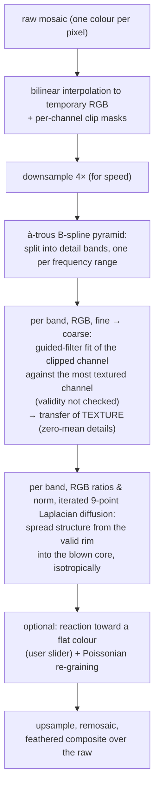
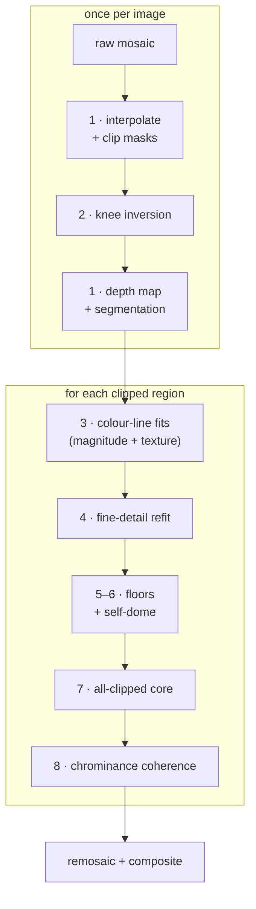

This article presents the mathematics of Ansel's highlight reconstruction : the original 2021
`guided laplacians` design, whose general ideas had only ever been sketched on the *pixls.us*
forum,[^forum] and **harmonic transposition**, the method that replaced it after a ground-truth
study exposed a magnitude-recovery bug.[^impl] It is organized so each reader finds their
section : the [results](#results) and each method's *Intuition & background* need no
mathematics ; developers will find the *Implementation & optimizations* subsections and the
[performance](#performance) study ; the
[theoretical findings](#theoretical-findings) and the
[graveyard annex](#annex--the-graveyard) are written to be
reusable outside photography ; and
[how this work was actually done](#how-this-work-was-actually-done) documents the man–machine
research protocol behind it.

<!--more-->

## Abstract

When a camera sensor saturates, the three colour channels do not clip at the same time, so a blown
highlight drifts in colour, usually toward magenta. This article documents Ansel's highlight
reconstruction end to end and in the order it happened : the original 2021 **guided laplacians**
(wavelet-detail transfer through a guided filter, never fully written down before), the
ground-truth study that exposed its magnitude bug, and the method that replaced it — **harmonic
transposition**, which keeps the guided filter's local colour-line model but carries its
*coefficients* across the blown zone as smooth diffused fields steered by the surviving
channels' structure, debiases the sensor's
saturation rolloff before fitting, and hands each frequency band and pixel class to the estimator
that is measurably best there. Every design decision is backed by a number on a public bench, and
the failures are documented with the same care as the successes, including two results we believe
are general : seam energy at any estimator hand-off equals the estimators' disagreement and cannot
be weighted away, and the validity of a colour-line deep inside a blown zone is undecidable from
the data around it.[^he][^qin]

## The problem

### The magenta cast

A digital sensor is an array of photosites, each covered by one coloured filter of a **colour filter
array** (CFA) : the Bayer pattern (2×2 of R, G, G, B) or Fuji's X-Trans (6×6). Each photosite is a
potential well that fills with photo-electrons during the exposure and saturates at a fixed
capacity. Because the well capacity is a property of the silicon, **all three colours saturate at
roughly the same raw code value**.

The trap is white balance. A neutral grey subject does not produce equal raw signals in the three
channels: the CFA transmissions, the sensor's spectral sensitivity, and the scene illuminant all
differ per channel. To render such a subject as neutral, the raw developer multiplies each channel
by a **white-balance coefficient** : typically the green channel is left near $1$ while red and
blue are multiplied up by $1.5$ to $2$.

Now follow a neutral highlight as it gets brighter. At the sensor there is nothing per-channel
about saturation: the three raw signals climb toward **one shared ceiling — the full well** — and
clip at more or less the same value. The magenta is manufactured *afterwards*, by the
white-balance gains: multiplying each channel changes both its slope on the way up **and** the
level its clipped plateau lands on. Green (gain $\approx 1$) plateaus where the sensor left it ;
blue and red are pushed up by their gains and plateau **above** it. Past saturation the recorded
ratios are no longer neutral — red and blue overshoot green, and the "white" highlight reads as
**magenta**. (On real subjects the channels do still clip in *sequence* — the subject's own colour
and the per-channel sensitivities stagger the onsets, which is why partially-clipped pixels exist
and carry surviving guides — but the magenta of a blown neutral is the work of the gains, not of
per-channel thresholds.)




This is a purely mechanical, colorimetric artifact of the capture apparatus. There is no magenta in
the scene. Any reconstruction that works in a colour space *after* demosaicing is already fighting a
hue error that a demosaicing algorithm will have smeared across neighbouring pixels. Reconstructing
*before* demosaicing, while the data is still a clean per-channel mosaic, is the whole point of the
guided-laplacian method.


The value at which a channel is declared clipped is not the numeric maximum but a per-channel
threshold derived from the raw white point:

```math
\text{clip}_c = 0.995 \times \texttt{clip} \times \text{white}_c,
```

where $\text{white}_c$ is the module's `processed_maximum` for channel $c$ (the per-channel raw
white level surviving the earlier pipeline stages) and `clip` is a user safety factor around $1$.
The $0.995$ margin keeps almost-saturated photosites (whose response has already gone nonlinear
near the top of the well) out of the "valid" set.[^impl]

### Simpler fixes

Ansel's module offers three cheaper reconstruction modes before the guided-laplacian one, and they
are worth stating because they frame what the expensive method buys:

* **Clip** simply crushes every channel to the common threshold $\texttt{clip}\times\min_c \text{white}_c$
  (the same white levels, without the $0.995$ margin). No magenta,
  but every clipped region becomes a flat, textureless white blob.
* **Reconstruct in LCh** converts each Bayer block to a luminance/chroma/hue triple, rescales the
  chroma of clipped blocks to match the unclipped luminance, and converts back. It removes the hue
  drift but cannot invent texture.[^impl]
* **Reconstruct color (inpaint)** propagates colour *ratios* from neighbouring unclipped pixels along
  rows and columns, using the exponential-decay ratio update of Magic Lantern's algorithm. It is
  fast and directional but one-dimensional and easily fooled by complex edges.[^impl]

The `guided laplacians` mode is the only one that restores both the **texture and the magnitude** of
a clipped region, by borrowing from the channels that did survive along the local colour-line.

Upstream Darktable ships two reconstruction modes that Ansel does not carry, and they make an
instructive comparison because they start from a *different assumption* about what a blown
highlight is. Both were developed by the G'mic and Darktable teams and both work, like our method, on the raw mosaic : each colour channel is first
approximated everywhere from its 3×3 photosite neighbourhood, giving a crude but full-resolution
per-channel image.

**Inpaint opposed** rests on one empirical observation : for a clipped channel, the mean of the
two *other* channels (the "opposed" average, computed in cube-root space to compress the
dynamic range) is a good estimate of the missing value in the vast majority of images. The
mechanism is accordingly simple : replace every clipped value by that opposed average, then add
one **global** chrominance offset, measured on the pixels morphologically closest to the clipped
areas, to absorb the overall colour cast. Its documented failure modes are the scenes where one fixed
relationship cannot hold : mixed lighting, white balance far from the pipeline's assumption, or
several light sources with different colours feeding different highlights.

**Segmentation based** refines the same base estimator with spatial adaptation. Each channel's
clipped pixels are flood-filled into connected *segments* (optionally merged by a morphological
closing, the "combine" control) ; for each segment, the algorithm searches its unclipped border
for the best **candidate** pixel (scored by local standard deviation and median in a 5×5
window) and transplants that candidate's pseudo-chrominance (the channel minus the opposed
mean, again in cube-root space) across the whole segment. If no convincing candidate exists, it
falls back to a segment-wide average with a chrominance correction. Where *all* channels clip,
a separate "rebuild" pass extrapolates a luminance surface from the border gradients, gated by a
distance transform — the closest cousin, in this whole landscape, of our biharmonic dome. The
assumptions are thus : one representative chrominance *per segment* (better than one per image,
but still flat within a segment), texture inherited from whatever the surviving channels carry,
and gradient extrapolation where nothing survived.

Both are desperate attempt at filling the damaged area with _something_ plausible, but promote flat colored surfaces at the wrong magnitude.

## First principles

The method is an assembly of four ideas. Two of them (discrete Laplacians and the à-trous
B-spline pyramid) are shared verbatim with [*diffuse or sharpen*](/resources/diffuse-or-sharpen-math/) and
are only summarized here. The other two, the guided filter and chrominance diffusion, carry the
reconstruction and are derived in full.

### Gradients and Laplacians

For a discrete image $u(i,j)$, the **gradient** measures the local slope,

```math
\nabla u = \left( \frac{u(i+1,j) - u(i-1,j)}{2}, \; \frac{u(i,j+1) - u(i,j-1)}{2} \right),
```

and the **Laplacian** measures the local curvature : how much a pixel departs from the average of
its neighbours,

```math
\Delta u = \frac{\partial^2 u}{\partial x^2} + \frac{\partial^2 u}{\partial y^2}.
```

The Laplacian is the workhorse here because it isolates *texture* as oscillation around a local
average (it is zero on flat regions and responds only to local contrast) and because it is
**linear**: over- or under-exposing the image simply rescales it (a property we lean on below).
Isolating texture this way is what lets us transplant it between channels without dragging along the
guide's absolute brightness; the difference in overall magnitude between a clipped channel and its
guide is absorbed by the guided filter's slope, not by the Laplacian itself. Ansel uses the
rotationally-symmetric 9-point stencil from Oono & Puri

```math
\mathbf{K}_{\text{iso}} =
\begin{bmatrix}
\tfrac14 & \tfrac12 & \tfrac14 \\
\tfrac12 & -3       & \tfrac12 \\
\tfrac14 & \tfrac12 & \tfrac14
\end{bmatrix},
```

whose angular error is much smaller than the naive 5-point cross, so diffusion does not privilege
the pixel-grid axes.[^oono][^patra][^ripl]

### The à-trous B-spline pyramid

To act on structures of many sizes, the image is split into frequency bands by repeatedly blurring
it with the separable cardinal B-spline kernel

```math
h_0 = \frac{1}{16}[1,4,6,4,1],
```

a compact approximation of a Gaussian of parameter $\sigma_B \approx 1.0554$.[^unser] At scale $s$
the taps are spread apart by a stride of $2^s$ pixels ("à-trous" = "with holes"), so the same tiny
kernel reaches ever farther without ever growing in cost. Writing $G_s$ for the successive
low-pass (progressively blurred) images and $H_s$ for the **detail bands**,

```math
G_{-1} = u, \qquad G_s = h_{2^s} * G_{s-1}, \qquad H_s = G_{s-1} - G_s,
```

the image is exactly the sum of its bands, $u = \sum_{s=0}^{n-1} H_s + G_{n-1}$. A detail band $H_s$ is a
difference of Gaussians, which is itself a scaled approximation of a Laplacian-of-Gaussian — so
"filtering the band $H_s$" and "applying a Laplacian at scale $s$" are two views of the same
operation. The full derivation, including how the equivalent Gaussian radius grows as

```math
\sigma_{G,s} = \sigma_B \sqrt{\frac{4^{s+1}-1}{3}},
```

is given in the [companion article on *diffuse or sharpen*](/resources/diffuse-or-sharpen-math/#the-à-trous-b-spline-pyramid).[^impl][^dreggn]


Two products of this pyramid are used below. The **low-pass** $G_s$ is a local weighted mean at
scale $s$ — exactly the local average the guided filter needs, at a whole ladder of window sizes.
The **detail band** $H_s$ is a scaled Laplacian, the operator the chrominance-diffusion fallback
integrates. The reconstruction proper works on the $G_s$ (which carry the colour's magnitude); the
fallback works on the $H_s$.


### The guided filter

The **guided filter** of He, Sun and Tang is the engine that borrows texture from a good channel
into a clipped one.[^he] Suppose we want to produce an output image $q$ that stays faithful to some
target $p$ but wears the *edges and texture* of a **guide** $I$. Assume that, inside any small
window $\omega_k$ around pixel $k$, the output is an **affine function of the guide**:

```math
q_i = a_k \, I_i + b_k, \qquad \forall i \in \omega_k.
```

This single assumption, a *local colour line*, is the whole model. It says that within a small
patch the channel we are rebuilding is just a scaled, shifted copy of the guide. It is the same
prior that underlies cross-channel demosaicing, dehazing, image matting and colorization: natural
surfaces trace *colour lines* (locally, their channels are affinely related) because most edges are
changes in *reflectance* that scale all channels together.[^colorline] Under an affine map,
$\nabla q = a_k \nabla I$, so $q$ inherits every edge of $I$, merely rescaled by $a_k$.

We fit $(a_k, b_k)$ by least squares, keeping $a_k$ small to avoid amplifying noise (a ridge term
$\varepsilon a_k^2$):

```math
E(a_k, b_k) = \sum_{i \in \omega_k} \Big[ (a_k I_i + b_k - p_i)^2 + \varepsilon \, a_k^2 \Big].
```

Setting the derivatives to zero gives the closed form that appears, almost verbatim, in the code:

```math
\begin{aligned}
a_k &= \frac{\operatorname{cov}_{\omega_k}(I, p)}{\operatorname{var}_{\omega_k}(I) + \varepsilon}, \\
b_k &= \bar{p}_{\omega_k} - a_k \, \bar{I}_{\omega_k}.
\end{aligned}
```

The covariance in the numerator (a measure of how much guide and target rise and fall together)
is the key: where they move together, $a_k \to 1$ and
the guide's texture is copied through; where the guide is flat ($\operatorname{var} \to 0$), $a_k
\to 0$ and the output falls back to the local mean $\bar p$. The ridge parameter $\varepsilon$ sets
the scale below which variations are treated as noise and smoothed rather than transferred.


He's guided filter has a second step (averaging the per-window coefficients $(a_k, b_k)$ over all windows covering a pixel) that keeps the output from looking blocky. The rebuilt implementation gets the same smoothing for free by computing the window statistics with a smooth kernel (a Gaussian) rather than a hard box : overlapping smooth windows make $a$ and $b$ smoothly varying fields, so $a,I + b$ is already artifact-free without a separate averaging pass. This is not a cosmetic detail : replaying the same fit with a hard box window of comparable support leaves visible axis-aligned streaks and stepped plateaus wherever image structure crosses a window boundary, and costs about a third more error on the bench's edge scene. The 2021 code, for its part, used a hard $3\times3$ box with no averaging at all — it got away with it because the window is three pixels wide and the iterated diffusion smooths whatever it leaves behind.[^impl]


### Diffusion as color inpainting

Filling the *colour* of a hole is a different problem from filling its *texture*. A hole's colour
should vary **smoothly** and match its rim; it should not carry high-frequency detail (fine,
rapidly-varying texture) of its own. The natural formalism is the **Dirichlet energy**, the
total amount of variation the image contains, large where it wiggles and zero where it is
constant :

```math
E[u] = \int_\Omega \lVert \nabla u \rVert^2 \, \mathrm{d}x,
```

whose minimizer over the hole $\Omega$, with the surrounding pixels as boundary condition, is the
**harmonic** function satisfying $\Delta u = 0$.

(Notation, used throughout the article : $\lVert v \rVert$ is the **euclidean norm** of a
vector — for the gradient, $\lVert \nabla u \rVert = \sqrt{(\partial_x u)^2 + (\partial_y u)^2}$,
the local slope magnitude ; $\lvert s \rvert$ is the absolute value of a scalar ; and
$\langle \cdot \rangle$ — angle brackets — is the **average of the enclosed quantity over the
region's pixels**.) The gradient descent of this energy is precisely
the **heat equation**

```math
\frac{\partial u}{\partial t} = \Delta u,
```

i.e. isotropic diffusion, *isotropic* meaning direction-blind, spreading equally in all
directions. Running it spreads the boundary colour inward until the hole is filled by
a smooth, curvature-free surface. This is the same anisotropic-heat-transfer inpainting model of
Qin et al. that Ansel already uses for *diffuse or sharpen*, restricted here to its isotropic
case.[^qin] We will apply it not to the pixels but to the **colour ratios**, so that only chrominance is
smoothed while the reconstructed luminance is left alone.

**Steering the diffusion : the anisotropic extension.** The Dirichlet energy above treats every
direction equally ; it is *isotropic*. It generalizes to a weighted form,

```math
E(u) = \int_\Omega \nabla u^\top D \,\nabla u ,
```

where the **diffusion tensor** $D$ is a small symmetric matrix defined at every pixel whose job
is to re-weight directions : full conductance along one of its eigenvectors, damped conductance
along the other. Minimizing this energy solves $\mathrm{div}(D\\,\nabla u) = 0$ (its
Euler–Lagrange equation), and with $D$ the identity everywhere it reduces exactly to the
isotropic case above. The point of the machinery is *steering* : choose the strong direction
along the image's **isophotes** (the lines of constant brightness) and the damped one across
them, and the diffusion smooths a quantity *along* image structure while refusing to carry it
*across* edges.

Discretizing this safely takes one precaution. Writing the tensor
$D = \begin{pmatrix} a & b \\ b & c \end{pmatrix}$ (averaged between each pixel and its
neighbour, with the cross term clamped to $|b| \leq \min(a, c)$), the divergence
$\operatorname{div}(D\\,\nabla u)$ becomes a sum over the eight neighbours with weights

```math
w_{\pm e_x} = a - |b|, \qquad w_{\pm e_y} = c - |b|, \qquad
w_{\pm(e_x + e_y)} = \max(b,\, 0), \qquad w_{\pm(e_x - e_y)} = \max(-b,\, 0),
```

the nonnegativity-preserving stencil of Weickert : the clamp guarantees **every weight is
nonnegative**, so the anchored relaxation $u_0 \leftarrow \sum_k w_k u_k / \sum_k w_k$
replaces each unknown by a *convex combination* of its neighbours. That is the discrete
maximum principle — the solved values can never leave the range of the anchors, no matter how
hard the tensor steers — and it is what makes anisotropic diffusion safe to run on data that
must stay physical. The shipped method uses this machinery in two places : the **transport of
the colour-line coefficients** across the blown zone (step 3 of the algorithm, where the
tensor additionally blends between isophote and gradient steering by a measured edge
probability), and the **chrominance of fully clipped cores** (step 8), where colours must
follow the recovered luminance's structure and never bleed across it.

### Biharmonic inpainting

Harmonic inpainting is the right tool for a signal that *should* go flat inside the hole : a smooth
chrominance. It is the wrong tool for one that was still *rising* when the sensor clipped it: a blown
highlight's magnitude kept climbing, and filling it flat ($\Delta u = 0$) leaves a matte disk where a
bright dome belongs. To carry the surrounding **slope** inward instead of erasing it, penalize the
signal's *bending* rather than its gradient : minimize the thin-plate (biharmonic) energy

```math
E_{\text{bihar}}[u] = \int_\Omega (\Delta u)^2 \, \mathrm{d}\Omega
\qquad \Longrightarrow \qquad
\Delta^2 u = 0 \ \text{ on } \Omega, \quad u\big|_{\partial\Omega} = u_{\text{valid}} ,
```

whose Euler–Lagrange equation (the condition any minimizer of the energy must satisfy) is the
**biharmonic** equation $\Delta^2 u = 0$. Where the harmonic
solution forces $\Delta u = 0$ (a flat minimal surface), the biharmonic solution makes $\Delta u$
*itself* harmonic : the curvature at the rim is carried into the interior, so the boundary's rising
gradient is extrapolated into a dome (a thin-plate spline). It is the higher-order,
gradient-*extending* counterpart of diffusion, in the same spirit that *diffuse or sharpen* flips the
sign of the Laplacian to sharpen rather than smooth. We solve it as a direct sparse linear system on
the hole, and use it below to rebuild a clipped channel's magnitude from its own valid rim wherever
no correlated channel survives to guide it.[^ripl]

## The 2021 method : guided laplacians

Before following the method's evolution, this section documents the original design, as it
shipped in 2021 and as it still ships today — design unchanged, though it shares one measured
border-gather fix with the new pipeline (documented with the harmonic refinements below) —
under the `guided laplacians` mode (the new
method is a separate, opt-in mode : see the status note further down). It was coded
against intuition and tuned by eye on natural images, and its general ideas were only ever sketched
on the pixls.us forum[^forum] ; this is its first complete write-up.

### Intuition & background

**The intuition.** Unavoidable clipping happens within light sources : the sun, a flame, a
specular reflection. Such sources are surrounded by a glowing halo, and that halo carries three
exploitable kinds of information. First, the colour channels are strongly *correlated* there (they
all rise toward the source), so a channel that clipped can borrow the shape of a channel that did
not. Second, the halo's gradients point at the source, so even a fully blown core can be
plausibly continued by *propagating* the surrounding gradients inward. Third, the halo is coloured like the light source itself, so chrominance can be recovered by propagating RGB ratios inwards. The 2021 design turned each
intuition into an operator : a **guided transfer** of fine structure between channels, and an
**iterated diffusion** that pushes structure from the valid surround into the blown region while diffusing colour ratios inwards.

**The objectives.** Reconstruct *before demosaicing*, on the raw mosaic, so the interpolation
never sees clipped samples ; never rely on white balance or any assumption about what colour the
highlight "should" be (the light source's own colour is unknowable) ; and prefer smooth, physically
plausible continuations over sharp hallucinations, because an error in a blown highlight is far
more visible as a hard artifact than as a soft one.

**Its record.** On its design cases the method worked, and still does : a sun disc or a specular
on water is rebuilt with believable structure and without the flat grey patch that plain clipping
leaves. It preserves gradients where simpler methods (channel ratio scaling, single-colour
inpainting) flatten them, and since it works on gradients rather than colours it tolerates wrong
white balance. Two structural limits were understood and accepted from the start : a blown sky
seen through green leaves is recovered green (the method propagates the *neighbouring* colour, by
design), and heavy chromatic aberration breaks the channel alignment the colour-line needs.

### The optimization problem

**The texture transfer.** The image is decomposed with the [à-trous B-spline
pyramid](#the-à-trous-b-spline-pyramid) described above : at each scale $s$ the signal splits into
a low-frequency approximation and a **detail band** $H_s$. Because the cardinal B-spline is very close to a Gaussian, and the detail band is computed scale-wise as the difference with this approximated Gaussian, $H_s$ is itself already close to a Laplacian, rescaled in magnitude (it actually over-evaluates the Laplacian). On each detail band, each clipped
channel $c$ is fit against a **guide** channel $g$ (chosen per pixel as the channel with the
strongest local variance, that is, the one carrying the most structure — with no check that the
guide itself is valid there) with the guided filter derived
[above](#the-guided-filter) :

```math
H_c \;\leftarrow\; a_c\, H_g + b_c, \qquad
a_c = \frac{\operatorname{cov}(H_c, H_g)}{\operatorname{var}(H_g)},
```

where the covariance and variance are local windowed statistics (a hard 3×3 box that does not
exclude clipped samples), and the division is simply skipped where the guide's variance falls
below $10^{-12}$ — there is no damping term. Because a detail band is
zero-mean, the intercept $b_c$ is essentially zero : the transfer moves *texture* from the guide to
the clipped channel, scaled by their measured local relationship.

**The chrominance diffusion.** The second stage operates on the RGB *ratios* (the chrominance,
$\text{RGB}/n$ with $n = \lVert \text{RGB} \rVert$, the euclidean norm — the symbol the
update rules below use), iterating the nine-point Oono & Puri Laplacian on each ratio plane ;
the norm plane $n$ rides the same pyramid but is explicitly protected from the step (backed up
and restored around it), so it is resynthesized as-is. That iteration is the gradient descent of an explicit variational problem : over the
clipped region $\Omega$, with the valid rim as boundary data, it minimizes

```math
E_{\text{2021}}[u] \;=\; \int_{\Omega} \lVert \nabla u \rVert^2 \,\mathrm{d}\Omega
\;+\; \lambda_{\text{solid}} \int_{\Omega} \lVert u - \bar u \rVert^2 \,\mathrm{d}\Omega ,
\qquad u\big|_{\partial\Omega} = u_{\text{valid}},
```

for each ratio plane and for the norm : a **Dirichlet (harmonic) energy** that carries the rim's
chrominance and level smoothly inward, plus an optional **screening term** pulling the core
toward the mean valid colour $\bar u$ with the user's "inpaint a flat color" weight
$\lambda_{\text{solid}}$. Its Euler–Lagrange equation is the screened-Poisson equation of the
[theory section](#diffusion-as-color-inpainting) ; the 2021 code never solves it to steady
state — the "iterations" slider truncates the descent, so the practical result depends on the
iteration budget as much as on the energy. Two properties follow directly from this objective
and explain the method's signature look : a *harmonic* fill flattens (it penalizes gradients, so
the interior tends to a level plateau — the theory section shows why a *biharmonic* energy is
needed to continue slopes), and nothing in either stage constrains the reconstructed *level* of
a clipped channel, which stage 1 cannot transfer (zero-mean bands) and stage 2 only diffuses
from a rim that sits at the clip.

### The algorithm

The whole procedure, at a glance :



The trade-offs are deliberate. Working on detail bands makes the transfer immune to white-balance
errors (only *shapes* move between channels). The nine-point Laplacian is the isotropic,
rotation-invariant discretization derived in [first principles](#gradients-and-laplacians), so
the diffusion fills the core from the outside in without following the pixel grid's axes.
Smoothness is always preferred over sharpness : an error in a blown highlight reads as a hard
artifact when sharp and as a plausible glow when soft. And the fine-to-coarse band order means
each band is fitted independently within one pass — there is no cross-scale consistency
constraint, which stays harmless precisely because the bands are zero-mean.

Three preparatory stages deserve a note — they are shared by every reconstruction method in this article, the successor included.

**Bilinear demosaic.** The mosaic is bilinearly demosaiced to a temporary RGB image : a *throwaway*
demosaic whose only job is to give every channel a value everywhere for the per-channel guided fit;
the final output is remosaiced back to a single channel.
A per-channel **clip mask**, together with its logical OR (feathered into the compositing opacity
$\alpha$), records which channels saturated.[^impl]

**Local channel normalization.** Each colour is divided by the *average value of that colour in the
current tile*, a crude local white balance computed on the spot. This equalizes channel magnitudes
so the guide-selection variance comparison is not biased toward whichever channel carries the
largest raw numbers; it deliberately does not reuse the white balance declared upstream.[^impl]

**Feathering the mask.** The binary mask is smoothed by a small $5\times5$ box average into an
opacity $\alpha \in [0,1]$, used as the final compositing weight *and* as the per-channel soft
weights of the à-trous reconstruction below. Feathering softens the seam where the
reconstruction meets untouched pixels; in the [numerical tests](#results) it lowered this
method's boundary error rather than raising it — removing it was tested and measurably hurts
here (the soft weights are load-bearing), while the successor method drops feathering entirely
(its masks are binary end to end ; see [the graveyard](#annex--the-graveyard)).

### The update rules

[The optimization problem](#the-optimization-problem) states what this method minimizes and
[the algorithm](#the-algorithm) narrates its stages ; here are the actual **signal updates** of
the shipped 2021 mode, in execution order, for an implementer starting from scratch. Planes :
the four-times-downsampled temporary RGB $u_c$ (bilinear demosaic, channel-normalized), the
feathered per-channel masks $\alpha_c \in [0,1]$ and their any-clip opacity $\alpha$.
Decomposition : the [à-trous B-spline pyramid](#the-à-trous-b-spline-pyramid) with stride
$2^s$ per scale — cascaded blurs $\mathrm{LF}_s$, detail bands
$D\_s = \mathrm{LF}\_{s-1} - \mathrm{LF}\_s$, plus the coarsest residual.

**1. Texture transfer** (the RGB pass), per scale from fine to coarse, at every pixel where
$\alpha > 0$. On the $3\times3$ à-trous neighbourhood (stride $2^s$) of the detail band,
compute the per-channel patch mean and variance, pick the guide $g$ as the channel of
**largest patch variance** (validity is not checked — the root of failure 4), fit the
zero-intercept-biased colour-line on the details,

```math
a_c = \max\!\left( \frac{\operatorname{cov}(D_g, D_c)}{\operatorname{var}(D_g)},\, 0 \right),
\qquad
b_c = \bar D_c - a_c\, \bar D_g,
```

and blend the prediction in, fading quadratically with the scale's equivalent radius — taken
at step $4s$, not $s$ : the code evaluates $\sigma$ at `s * DS_FACTOR`, charging each scale for
the downscale factor as well, so the fade is far steeper than $\sigma_s^2$ alone suggests
($\beta$ is $\alpha/380$ at $s{=}1$ and $\alpha/97\\,000$ at $s{=}2$ — the guided transfer
effectively lives on the finest scales) :

```math
D_c \;\leftarrow\; \beta_c \,\big(a_c\, D_g + b_c\big) + (1 - \beta_c)\, D_c,
\qquad
\beta_c = \frac{\alpha_c}{\sigma_{G,\,4s}^{2}}.
```

Resynthesis sums the processed bands plus the residual, clamped to $\geq 0$ ; on the last
iteration, Poissonian grain of amplitude $\sigma = u_c \cdot \texttt{noise\_level}$ is folded in
(brightening only) under $\alpha$. The result is split into direction and magnitude,
$r_c = u_c / \lVert u \rVert$ and $n = \lVert u \rVert$, for the next pass.

**2. Chrominance diffusion** (the chroma pass), same pyramid over the four planes
$(r_R, r_G, r_B, n)$ : each detail band of the three *ratio* planes takes one explicit Euler
step of the screened heat equation, per pixel where $\alpha > 0$ and per channel — the norm
plane's band is backed up before the step and restored after it, so $n$ crosses the pyramid
undiffused,

```math
D \;\leftarrow\; D + \alpha_c\, \kappa \,\big( \mathbf{K}_{\text{iso}} \!*\! D \;-\; \lambda\, D \big),
```

with $\mathbf{K}_{\text{iso}}$ the nine-point isotropic Laplacian of
[first principles](#gradients-and-laplacians), $\kappa = \sigma_B^2 / (2\sqrt{\pi}) \approx 0.31$
the band-to-Laplacian rescaling, and $\lambda$ the flat-colour reaction (`solid_color`).
Resynthesis as above, then the ratios are renormalized to unit norm and recombined,
$u_c \leftarrow r_c \cdot n$.

**3. Iterate.** Passes 1–2 repeat `iterations` times (the user slider) ; nothing detects
convergence, the count is the budget.

**4. Composite.** The reconstruction is upsampled four times and blended over the raw mosaic
through the feathered opacity, per photosite of colour $c$ :
$\text{out} = \alpha\\, u_c + (1 - \alpha)\\, \text{raw}$.

Nothing else writes a pixel — and, as the ground-truth study found, nothing above transfers a
*level* : every update acts on zero-mean detail bands or on ratios, which is exactly the
structural gap [the successor closes](#the-new-method--harmonic-transposition).

### Implementation & optimizations

The whole reconstruction runs on a **four-times-downsampled** buffer — one sixteenth of the
pixels — and the result is upsampled and composited back over the raw under a feathered mask.
That single decision buys most of the method's speed and costs measurable accuracy : re-running
the same mathematics at full resolution lowers boundary error by about 30 %, because the
upsampled reconstruction is blurry against the sharp original it must join (the successor method
runs at full resolution for exactly that reason). The à-trous detail bands over-evaluate the
Laplacian by a known constant (the B-spline's $\sigma_B = 1.05537$ gives
$1/\kappa = 3.1827$), which the diffusion step compensates ; the diffusion runs
`iterations` × (one RGB-ratio pass + one norm pass) per scale, on the whole frame — there is no
region segmentation, so cost scales with the image, not with the clipped area. Poissonian grain
($\sigma = \text{value} \times \text{noise level}$) is regenerated on the last iteration so
reconstructed areas do not look plastically smooth next to real texture.

### Problems discovered

**What never happens in the flowchart above is a transfer of *level*** — an observation
invisible without ground truth, and where the whole 2026 study starts.

**The issues.** In practice, users kept reporting blown highlights that stayed magenta after
reconstruction — the very defect the method exists to fix. The study documented in the rest of
this article eventually located the root cause in the mathematics above : the guided fit was
applied to the **detail bands only**. A detail band has zero local mean, so the intercept $b_c$
carries no energy, and only texture ever transfers — never the *level*. The clipped channel's
low-frequency component, pinned at the clip value, was added back unchanged ; a blown channel was
left at the clip (or nudged below it by the chrominance handling) and stayed magenta. In the validation
bench built later, this original reconstruction is often *worse than doing nothing* on
single-channel clips : a root-mean-square error (RMSE) of 0.073 against 0.049 for leaving the pixels
clipped, on a natural-like scene where the eventual rebuild reaches 0.015 (these three numbers
come from the Python research prototype's bench — `fix_prototype.py` in the [research repository](https://github.com/aurelienpierre/guided-laplacian-highlights-research) —
whose NumPy port of the 2021 module stands in for the C ; the shipped implementations are
scored in [the results](#results)).

{}
A synthetic scene: three saturated single-channel highlights (red, green, blue disks) and a bright
near-neutral one. **Ground truth** is the unclipped scene, **clipped** what the sensor records,
**previous method** the Python port of the 2021 à-trous module, **corrected method** the same design with the
full-signal repair described just below.

In the single-channel disks the corrected result climbs back toward the true colour (e.g. the
red disk recovers $\approx 1.7$ vs. true $\approx 1.9$, with green and blue matched exactly) where the
previous method stays *below* the clip ($\approx 0.9$). The all-clipped neutral disk, flat at
the clip in both the sensor and the previous method, is re-domed by the shared luminance fill
(centre $\approx 1.5$ vs. true $\approx 1.6$) and stays near-neutral, its chrominance carried by the
rim diffusion.
{}

The one-line repair — apply the same guided fit to the **full signal** (low frequency and detail
together) so the intercept carries the local mean and a blown channel can rise above the clip
(the math is in [the update rules](#the-update-rules-1)) —
fixes that class of failures, and it is the foundation everything later kept : all subsequent
methods in this article fit colour-lines on full values. It was
**necessary but not sufficient**. With ground truth to measure against — on the repaired
design, rebuilt at full resolution around a ladder of window sizes (the
[graveyard annex](#annex--the-graveyard) details it) — four
*structural* failures remained, and they shaped the successor method :

*First*, the window ladder degenerates wherever a window sees mostly clip-level data (fine
windows near the rim, coarse windows deep inside the hole), and a degenerate fit (covariance
near zero, slope near zero) fills flat, at roughly the clip level. Worse, the hand-off between
consecutive scales follows a contour of constant depth into the hole, and the two scales'
disagreement prints a visible **arc** along it.

*Second*, the $\epsilon$ damping above competes with the guide's local variance, so it silently
crushes the slope wherever that variance is small — which protects noisy content by accident and
flattens clean smooth gradients (like sky) by the same mechanism. One constant, two opposite
consequences, no value that serves both.

*Third*, the sensor does not clip abruptly : it compresses the last few percent below
saturation, so the band of pixels the reconstruction treats as trusted anchors is recorded
systematically **too low**.[^knee-sensor] Even an oracle that rebuilt the clipped interior *exactly* would
then sit visibly brighter than the biased ring it must attach to : the seam is in the data, not
in the estimate, and only correcting the data (the knee inversion) can remove it.

*Fourth*, the whole method rests on one hypothesis : neighbouring channels rise and fall
together, so a clipped channel is a measurable affine function of a surviving one. And some
content (a sky whose hue itself drifts, iridescence, colour texture finer than the window)
simply does not satisfy it. There, the guide contains no information about the missing channel
*for any estimator*, so the design must measure that ($R^2$) and change the information source
altogether : spatial smoothness instead of inter-channel transfer.

Fixing those took more than a fix — it took a change of paradigm.

## The new method : harmonic transposition

This section documents the method that ships today — its premises, its optimization problem,
its algorithm, and how the production implementation drifts from the research prototype.
Measured results, performance, and the general findings each have their own section below.
Harmonic transposition ships as its **own reconstruction mode** next to the original
`guided laplacians` : the 2021 à-trous method keeps its historical name and design —
unchanged except for the shared border-gather fix, which improves its own scores — and the new
method is an explicit opt-in.
The reconstruction core is agnostic to the sensor mosaic and runs on Bayer and X-Trans alike, on
the processor and inside an OpenCL pipe, where each clipped region is
solved on whichever side of the bus measured faster
(see [the performance section](#performance)).

### Intuition & background

The repair above changes what the guided filter *transfers* ; harmonic transposition changes how
the model **travels**. Wherever at least one channel survived, reconstruction is a regression
problem, not an inpainting problem : the valid channels are measured data, present at every
pixel of the blown zone, and the only unknown is the local *relationship* (the colour-line)
between them and the clipped channel. The 2021 method — and its corrected, full-signal rebuild —
evaluated that relationship wherever a statistics window could reach, and stitched the
evaluations together ; every stitch was a seam, and windows deep inside a large hole reached
nothing at all. Harmonic transposition inverts the transport : fit the colour-line **once**,
where the data supports it, then diffuse the *coefficients* of the model — not the pixel
values — across the blown zone as smooth fields, and only then evaluate them against the
measured surviving channels at every pixel. Coefficients are smooth by nature where values are
not ; the guides re-inject the full-resolution structure at evaluation time. Why this is a
difference in kind rather than degree — and what it generalizes to — is spelled out in the
[theoretical findings](#theoretical-findings).

Everything else the 2021 method got right is kept, on a sounder footing : the colour-line model
and its windowed weighted least squares (the guided filter's regression), the biharmonic dome for guide-less magnitude, chrominance carried as bounded ratios,
the preference for smooth continuations, and the grain regeneration. What is new besides the
transport : per-region segmentation at **full resolution** (cost scales with the clipped area,
not the image), a measured **sensor-rolloff inversion** that debiases the near-clip band before
anything is fitted (failure 3 above), fits gated and trusted by their own measured quality
$R^2$ (failure 4), and one design rule applied everywhere, derived from the seam-energy law of
the [theoretical findings](#theoretical-findings) : **no step may hand off
between estimators that disagree** (failure 1).

### The optimization problem


Neither step assembles a global energy and calls a named solver, but each *is* the local update rule
of a variational problem, and together they make the objective explicit. On the clipped region
$\Omega$ the reconstruction minimizes four coupled energies on the model.

**1. Cross-channel affine consistency.** Where a valid guide $g$ exists, each clipped channel should
be an affine function of the guide : the guided filter is the exact minimizer of

```math
E_{\text{affine}} = \sum_{\omega}\sum_{c}\sum_{i \in \omega}
w_i \Big[ \big( a_{c} \, u_g(i) + b_{c} - u_c(i) \big)^2 + \varepsilon\, a_{c}^2 \Big],
\qquad w_i = [\,i \text{ valid}\,].
```

Fitting on the full values $u$ (not the detail) is what makes the minimizer carry the local average, so
$E_{\text{affine}}$ recovers **magnitude and texture together**.[^he][^colorline] This term is
trusted in proportion to the fit's **squared** correlation $(R^2)^2$; where $R^2 \to 0$ the channel is
instead held to its own second-order smoothness (a per-channel biharmonic term $\int_\Omega
(\Delta u_c)^2\, \mathrm{d}\Omega$), so the objective never rewards a colour-line the data do not support. The
squaring sharpens that trade so a middling correlation leans on the smooth fallback rather than a
discontinuous cross-channel guess.

**1b. Anisotropic coefficient transport (the shipped form of term 1).** The affine fit of
term 1 defines its coefficients only where a window holds enough trusted data ; across the rest
of the blown zone the *model itself* is the unknown. The shipped method extends it by minimizing
an anisotropic Dirichlet energy on the coefficient planes,

```math
E_{\text{transport}} \;=\; \sum_{p \,\in\, \{a,\, b,\, d,\, R^2\}}
\int_{\Omega} \nabla p^{\top} D \,\nabla p \;\mathrm{d}\Omega,
\qquad p\big|_{\text{anchors}} = p_{\text{fit}},
```

where the anchors are the gated fits of term 1 (enough trusted mass, $R^2 > 0.25$, bounded
slopes) and $D$ is the variance-adaptive steering tensor of
[step 3](#the-algorithm-1), built from the measured guide
structure : gradient-dominant on a clean halo ramp (the model travels radially inward from the
rim), isophote-dominant where a hard edge crosses the zone (colour-lines must not mix across an
object boundary). Its Euler–Lagrange equation $\operatorname{div}(D \\, \nabla p) = 0$ is the
steered fill ; with $D = I$ it reduces to the plain harmonic fill. The evaluation
$\hat u_c = a\\,u_{g_1} + b\\,u_{g_2} + d$ against the *measured* guides closes the term : the
energy transports the model, and the data restores the detail.

**2. Magnitude curvature (fallback).** Where no guide survives, fine detail is lost but the
low-frequency shape is not: it should *continue* the surrounding curvature rather than flatten. For a
partially-clipped channel this is the per-channel biharmonic term $\int_\Omega (\Delta u_c)^2\,
\mathrm{d}\Omega$ already invoked above. For the all-clipped core it is applied
**once** to the summed luminance $L_\text{sum} = R+G+B$, one shared dome instead of three divergent ones:

```math
E_{\text{bihar}} = \int_\Omega (\Delta L_\text{sum})^2\,\mathrm{d}\Omega,
\qquad \Delta^2 L_\text{sum} = 0,
\qquad L_\text{sum}\big|_{\partial \Omega} = L_{\text{sum}}^{\text{valid}} ,
```

anchored to the core's true valid rim; its Euler–Lagrange equation $\Delta^2 L = 0$ is the domed fill
above.

**3. Chrominance smoothness (fallback).** Where no guide survives, the reconstructed ratios
$r = \text{RGB}/L_\text{sum}$ should be smooth and match the rim, optionally biased toward flatness:

```math
E_{\text{chrominance}} = \int_\Omega \Big( \lVert \nabla r \rVert^2 + \lambda \, \lVert r \rVert^2 \Big)\, \mathrm{d} \Omega,
\qquad
r\big|_{\partial \Omega} = r_{\text{valid}} .
```

Its Euler–Lagrange equation is the screened-Poisson equation the diffusion integrates,[^qin] and the
recombination $\text{RGB} = L\cdot r$ closes the joint fill.

The energies act on **complementary pixels** : the affine term where a channel survives (weighted
by its correlation $R^2$), the per-channel biharmonic term where it does not, and the shared
luminance dome plus chrominance diffusion only in the all-clipped cores — the latter minimized
**subject to an inequality** : the diffused ratio of a clipped channel can never drop below its
saturation floor in ratio space, $r_c \geq c_{0,c}/L_\text{sum}$, which turns the chrominance term into an
obstacle problem (the math is in
[the chrominance subsection](#chrominance-by-diffusion)). The reconstructable set itself is
per channel : $\Omega_c$ holds the pixels above the clip threshold — extended down to $0.9$ of
it for channels whose sensor rolloff engaged (the band override of
[step 2](#the-algorithm-1)), where the floor $c_{0,c}$ is the knee-corrected measurement rather
than the saturated reading. Each energy is minimized
by its own stage : the affine term by the guided fits (one window sized to the region's
reconstruction radius) ; the transport term by the anchored, steered relaxation of step 3 ; the
smoothness terms by their direct linear solves. There is deliberately no posterior smoothing
energy acting on the output : an earlier design ironed seams after the fact with an
uncertainty-weighted regularizer, and retiring it is the point — the seams are never created
(see [the graveyard](#annex--the-graveyard)).
This is the same
engineering philosophy as *diffuse or sharpen*: a stack of local, physically-motivated update rules
whose combined fixed point is the reconstruction, rather than one monolithic inverse problem.

### The algorithm

Everything happens on the raw mosaic, in linear scene-referred RGB, before demosaicing, and at full
resolution. The method rebuilds each clipped channel from the channels that *survived* (along the
local colour-line, trusting it in proportion to how well it actually holds), and where **no** channel
survived it rebuilds one joint luminance dome and carries the surrounding chrominance inward.

The mosaic preparation — bilinear demosaic to a throwaway RGB, local channel
normalization, and the per-channel clip mask — is shared with the 2021 method and described
[in its algorithm section](#the-algorithm), with one addition and three refinements. The
addition : for the all-clipped cores a scalar **magnitude** $L_\text{sum}$ (the summed luminance $R+G+B$)
is split from the **chrominance** $\text{RGB}/L_\text{sum}$ — each channel divided by the summed luminance, a
bounded, brightness-free description of the colour that this article uses consistently under
that name — so the two can be reconstructed by different means : a dome for the magnitude,
diffusion for the chrominance. The refinements, each traced from a measured rim artifact :

* **masks are binary, end to end.** The 2021 mode feathers its mask ; the successor keeps
  every validity and compositing mask hard (its one smooth weight is the joint core's
  blurred hand-over, step 7 of the algorithm, which blends two *reconstructions* — it never
  reclassifies measurements). The per-channel validity masks gate every fit and evaluation, and feathering them
  reclassified rim-clipped photosites — whose raw values sit at the detection threshold, biased
  low under sensor rolloff — as valid anchors on oblique contours, dragging the rim
  reconstruction toward the clip level (a $\sim 10$ px sagging ramp against ground truth). The
  compositing weight is a hard switch : valid photosites keep their measurement exactly,
  clipped photosites take the pure reconstruction (a feathered alpha was measured to change
  nothing once the two fixes on this list are in — the retirement is documented in
  [the graveyard](#annex--the-graveyard)).
* **clipped raw values are floors, never blend targets.** On clipped photosites the raw
  reading is a lower bound, not a measurement : the composite writes
  $\max(\text{raw}, \text{reconstruction})$, never a blend toward the biased reading (the old
  feathered blend printed a V-shaped dip through the raw value at every contour).
* **borders mirror.** The bilinear gather's border ring used to copy the centre photosite into
  all three channels and key all three clip flags on the centre's own channel — corrupted
  guides and dashed masks along the first and last rows and columns, which anchored the
  border-row fits at the clip level. Reflected neighbour indexing (the Bayer pattern is
  2-periodic, so mirroring preserves each neighbour's colour) restores the interior logic on
  the borders ; this fix is shared with the 2021 mode.

Every ground-truth scene improved on both metrics from these three refinements alone — the
rolloff sky's error dropped by a third — because the bench's rim rings are exactly where
biased anchors used to leak in.

The reconstruction's conceptual goal can be stated in one sentence : **wherever at least one channel survived, reconstruction is a regression
problem, not an inpainting problem** : the valid channels are measured data, present at every
pixel of the clipped zone, carrying the true structure of the scene. The algorithm's one design
rule, learned the hard way, is that **no step may hand off between estimators that disagree**
(the [seam-energy law](#theoretical-findings) of the theoretical findings).
Every stage below is therefore either seam-free by construction, or debiases the data
so that the estimators agree.

The step-by-step procedure, as implemented in `process_harmonic_bayer` (and its X-Trans twin) :

The numbers in the graph refer to the steps detailed below it.




**1. Detection, interpolation, segmentation.** The raw
colour-filter-array mosaic is bilinearly interpolated, with per-channel clip flags raised at
$0.995\\,c$ for clip level $c$ and a binary per-channel validity mask ; the Euclidean distance transform
then gives each pixel its depth $\delta$ inside the clipped zone, and connected-component
segmentation groups the clipped pixels into regions, each carrying its distance-transform
reconstruction radius.

**2. Sensor rolloff (knee) inversion.** Real sensors compress the last few percent below
saturation, so the near-clip band $[0.8\\,c, 0.995\\,c)$ holds values **biased low**. (The band is cut
generously : on sensors that clip hard rather than roll off, the no-op guarantee below makes the
extra width free.) The
reconstruction extrapolates *unbiased* estimates over this band, so the two disagree at the
detection contour : a seam no weighting can remove. The fix debiases the data itself : a windowed
joint regression predicts each band value from the fully-trusted channels, the (measured,
predicted) pairs are pooled into 24 bins over the band, and the per-bin median lift is accepted
only when statistically significant — median above twice its standard error, a $\approx 95\\,\\%$
confidence gate, with at least 100 votes so the error estimate itself is stable ; 24 bins is as
fine as the band can be cut while keeping every bin that populated :

```math
\hat{k}^{-1}(v) = v + \operatorname{median}\big\{\, \hat v_i - v_i \;\big|\; v_i \in \text{bin}(v) \,\big\}
```

where $k$ is the sensor's unknown compression, so $\hat{k}^{-1}$ is the
estimated *correction* — the function that takes a measured value $v$ from the band and returns
what the sensor should have recorded. The $v_i$ are all the measured band pixels whose value
falls in the same bin as $v$ ; each $\hat v_i$ is what the
colour-line regression predicts that pixel *should* be, judging from its fully-trusted
neighbouring channels. Their difference $\hat v_i - v_i$ is one pixel's vote on how much the
sensor under-recorded at that level, and the bin's correction is the **median** of its votes —
robust to the outliers a mean would follow. The resulting curve is then made monotone and
raise-only. On hard-clipped (unbiased) data every bin median is zero within
noise, so the correction has a **no-op guarantee**, verified bit-exact on the four hard-clip
synthetic cases, while on `pk1synth` (the one synthetic scene generated *with* an analytic
sensor rolloff, so its ground truth traces the real knee) the blind estimate matches the true
curve to a root-mean-square error of $7\cdot10^{-4}$ on the green channel and $1.8\cdot10^{-3}$
on the sparser red one :


 Two implementation details matter : estimation runs on a $2\times 2$
**quad-binned copy of the raw mosaic** (each 2×2 Bayer cell yields one co-located red, green
(averaged) and blue sample), never on the bilinear interpolation : the interpolation samples each
channel through a different spatial filter depending on its position in the mosaic pattern, and
that alternating error is the same size as the knee signal it would drown ; and the correction is applied both to the reconstruction anchors and
to the composited output, while clip *detection* stays keyed on the measured values.

**The band override.** The lift restores the band's *level*, but a value-map cannot restore a
*slope* the sensor never recorded : where the compression flattened the band to a near-constant,
the lifted band is a near-constant too, and its junction with the rising reconstruction prints a
fine double contour under edge magnification (the band is measurably $7$–$14\times$ flatter than
ground truth, bracketed by two gradient spikes). The information is not lost, though — the
*guides* are unclipped through the band and carry the true slope. So for every channel whose
rolloff **engaged**, the detection extends below the threshold into the deep band : those pixels
are reconstructed by the colour-line model like any clipped pixel, with their knee-lifted
measurement as their per-pixel saturation floor, and the fits anchor on knee-corrected data
below the band. The floor makes the override conservative by construction — on noisy real
images the model rarely exceeds the lifted measurement, and the output stays pixel-identical ;
on the rolloff bench scene, where the model genuinely knows the slope, the zone error drops
another factor of five when the override lands (RMSE $0.012 \to 0.0025$ measured then ;
$0.0053$ in the shipped build, after the later compositing rounds took their own bites) and
the contour gradient profile becomes indistinguishable from ground truth. Channels without a measured rolloff keep the plain
detection : on hard-clipping sensors the band is trustworthy data and stays anchored.


**3. The coefficient field.** For each clipped channel $v$ with guides $u_1, u_2$, a windowed
weighted least-squares fit is computed at a single scale $\sigma = \operatorname{clip}(r/6, 8, 64)$
(with $r$ the region's reconstruction radius — the window's $\pm 3\sigma$ support then spans the
radius, so even the deepest pixel's fit reaches valid data ; the floor keeps enough samples for
a stable fit on tiny regions, and the cap bounds the cost of huge ones), over the pixels where
all three channels are valid :

```math
\begin{aligned}
(a, b, d)(x) &= \arg\min_{a,b,d} \sum_y w(y)\, G_\sigma(x - y)\,
                 \big( v(y) - a\, u_1(y) - b\, u_2(y) - d \big)^2 \\
\hat v(x) &= a(x)\, u_1(x) + b(x)\, u_2(x) + d(x)
\end{aligned}
```

where $x$ is the pixel whose local model is being built and $y$ runs over its
neighbours. The window $G_\sigma(x-y)$ is a Gaussian that weighs neighbours by distance
(full weight nearby, fading over roughly $\sigma$ pixels), and $w(y)$ is the trust mask — one on
pixels where all three channels hold real measurements, zero elsewhere, so clipped pixels never
vote. The first line asks, at every $x$ : which slopes $a, b$ on the two guides and which offset
$d$ best explain the clipped channel on the trusted neighbourhood ? The second line then *uses*
that local model : the estimate $\hat v(x)$ reads the two guides at $x$ itself and maps them
through the fitted relation. In practice the minimization is never run per pixel — it is
solved from ten blurred moment planes (a trusted-mass count, three means, six second
moments, gathered in three four-channel blurs) through the $2\times2$ normal equations. The
moments are accumulated **about each channel's per-region mean** : in float arithmetic the raw
$E[u^2] - E[u]^2$ form cancels catastrophically on smooth content (the squared mean dwarfs the
variance) and the fit's division amplifies the surviving digits into device-dependent slope
noise — centering removes the cancellation, and the slopes and $R^2$ are invariant under the
shift while the intercept is unshifted right after the fit. The system is solved with a **relative**
Tikhonov (ridge) damping $\lambda = 10^{-3}\\,(\operatorname{var} u_1 + \operatorname{var} u_2)/2$ that
scales with the signal instead of eating weak-but-real slopes. The $10^{-3}$ is the
smallest factor that stabilized degenerate windows on the bench — anything larger starts
flattening real slopes. 

The novelty is what happens next :
instead of evaluating each pixel with whatever fit its own window could reach (the ladder's way),
the **coefficient planes themselves are diffused across the clipped zone, steered by the
measured guide structure**, and only
then evaluated against the measured guides. Coefficients are smooth by nature where values are
not : diffusing them transports the *model* into the zone, and the evaluation restores the full
local structure carried by the valid channels. No scales, no depth gates, no level-set writes
(no rings of equal depth stamped separately) —
no seams, by construction. This transport of the *model* rather than the content is the
article's most transportable idea, and how it differs in kind from the guided filter's own
coefficient blur is stated in
[Three results we believe are general](#theoretical-findings). A pixel
qualifies as a diffusion **anchor** only if its window held
enough trusted mass *and* its fit is sane : the fit's $R^2$, the *coefficient of determination*,
is the share of the channel's local variance that the colour-line explains (1 means the guides
predict the channel perfectly, 0 means not at all), and anchors require $R^2 > 0.25$ with bounded
slopes. Both gates are calibrated from measurements, not taste : content with **no colour-line
at all** still scores $R^2 \approx 0.25$–$0.6$ (against $\approx 0.9$ where the colour-line is
real), so the gate only rejects fits worse than pure decorrelation — numerical accidents, not
weak models ; and physical colour-line slopes are bounded by the channels' saturation ratios
(under $4$ on every camera measured), so the $|a| < 64$ bound sits an order of magnitude above
anything physical, and only degenerate near-zero-variance windows — whose exploding slopes
would poison the diffusion boundary — ever trip it.
The diffusion is a coarse-to-fine **Jacobi fill** : each unknown is repeatedly replaced by the
average its neighbours imply. Three terms carry the whole scheme :

* **Cell.** The fill does not run per pixel. The coefficient planes live on a coarse grid of
  pitch $\sigma/4$ (clamped to at most $8$ px), and a cell is one node of that grid — one
  $\sigma/4$-sized block of pixels. The coefficients come out of $\sigma$-wide fit windows,
  so four cells per $\sigma$ oversample them, and the pitch clamp bounds the final bilinear
  upsampling error.
* **Anchor.** A cell whose fit window passed the trust gates above — it holds a coefficient
  actually measured on valid data.
* **Pinned.** The sweeps treat anchors as fixed boundary data and only ever rewrite the
  *unknown* cells between them.

This shape is chosen for robustness. A float conjugate-gradient on the near-singular
pure-harmonic system diverges stochastically when the zone reaches the region border. Jacobi
with pinned anchors cannot : each update is an average of neighbours, so the relaxation obeys
the maximum principle — no unknown can ever leave the range of the anchor values.

Convergence comes from the pyramid's depth, not from the sweep count. The coarsest level starts
from a flat anchor mean — the farthest possible state from the solution — and Jacobi's slowest
error mode on a hole $N$ cells wide decays in $\mathcal{O}(N^2)$ sweeps. So the pyramid keeps
halving until the coarsest grid's long side is at most $8$ cells ($8^2 = 64$ sweeps to relax,
comfortably inside the budget), and every level then runs the same flat $100$ sweeps — the
finer levels only correct local interpolation error. A shallower pyramid with a fixed count
measurably truncated the fill on deep holes — the numbers are in
[the general results below](#theoretical-findings).


This is the method's **one remaining pyramid**, and it belongs to the *fill* — the transport of
already-fitted coefficients. It is unrelated to the fitting windows, which use a single
radius-derived $\sigma$ per region (multi-scale windows exist only inside the knee estimator),
and it is not the retired trace-form chroma pyramid of the all-clip core, which the
divergence-form direct solve replaced and which survives only as the fallback for cores above
$2^{14}$ unknowns.


The transport itself is **not uniform either : it is steered by the measured guide structure**.
A steering plane $L_\text{mean}$ — the mean of the *valid* channels wherever at least one survives, the
flat plateau mean in the all-clip core (where the tensor then degenerates to the identity) ;
this is a **different luminance** from the summed magnitude $L_\text{sum}$ that the dome and the
ratios use — is
downsampled to each pyramid level, and the neighbour averages are weighted by the anisotropic
tensor

```math
D \;=\; \big[\, m + (1-m)\,c_2 \,\big]\; t\,t^{\top}
\;+\; \big[\, m\,c_2 + (1-m) \,\big]\; g\,g^{\top},
\qquad c_2 = e^{-\lVert\nabla L_\text{mean}\rVert / (4\,\langle\lVert\nabla L_\text{mean}\rVert\rangle)},
```

where $g$ is the unit gradient direction of $L_\text{mean}$ (uphill), $t$ the unit isophote
direction, and $\langle\lVert\nabla L_\text{mean}\rVert\rangle$ the gradient magnitude averaged
over the region — the normalization that makes the damping exposure-independent —
(along the level lines), and $c_2$ the same edge-crossing damping as the
[step-8 chrominance pass](#diffusion-as-color-inpainting). Normalizing the gradient by its own
regional mean makes that damping scale-free — only gradients well above the halo's average read
as boundaries, the $4$ setting how soft the reading is. The blend weight $m \in [0, 1]$ is
the **edge probability**, measured from the trend-corrected windowed variance of $L_\text{mean}$ :

```math
m = \frac{v}{v + (k\,\bar L_\text{mean})^2}, \qquad
v = \max\!\big(\operatorname{var}_w(L_\text{mean}) - \tfrac{4}{3}\lVert\nabla L_\text{mean}\rVert^2,\; 0\big),
\qquad k = 0.15,
```

where $\operatorname{var}\_w$ and $\bar L\_\text{mean}$ are the windowed variance and mean of the steering
plane, and the $\tfrac{4}{3}\lVert\nabla L\_\text{mean}\rVert^2$ term subtracts the variance the local
*ramp* explains : a pure ramp of slope $\nabla L\_\text{mean}$ seen through a window of spatial variance
$\sigma_w^2$ has intensity variance $\sigma_w^2 \lVert\nabla L\_\text{mean}\rVert^2$, and the window
here (two $3\times3$ box passes) has $\sigma_w^2 = 2 \cdot \tfrac{2}{3} = \tfrac{4}{3}$
per axis. A smooth halo gradient, however steep, therefore leaves no residual, while a hard
edge leaves variance no ramp can account for. The threshold $k$ — the relative contrast above
which residual texture is read as a boundary — is the one constant of the transport that could
not be derived, so it was calibrated by an **empirical fine sweep** on the six ground-truth
scenes : every scene stays at or below the isotropic error over the whole range
$k \in [0.14, 0.25]$ (the design is not fragile to it), and $k = 0.15$ is the value that
improves every scene simultaneously and takes the occlusion win with margin. The two limits of
$m$ read naturally. On a clean halo ramp ($m \to 0$),
$D \to g\\,g^{\top} + c_2\\,t\\,t^{\top}$ : the model travels **radially**, along the
brightness ramp from the rim inward, where its information actually lives. Where a hard edge
crosses the blown zone ($m \to 1$), $D \to t\\,t^{\top} + c_2\\,g\\,g^{\top}$ with $c_2$
small : the transport runs **along the boundary and refuses to cross it** — an edge inside the
zone means the content beyond follows another colour-line, and mixing the two models across it
is exactly the occlusion failure the graveyard documents. The discretization uses the
[nonnegativity-preserving stencil](#diffusion-as-color-inpainting) shared with the step-8
diffusion (all eight neighbour weights $\geq 0$), so the steered fill remains a convex
combination of its anchors : the maximum principle survives the steering. A $10^{-4}$ weight
floor keeps every cell connected where the tensor collapses to near-zero ; four orders of
magnitude under the working weights, it never competes with the steering. Pixels with
a single surviving guide get the same treatment with a one-guide fit.

One ordering subtlety completes the step. The *deepest* channel — the one with the most clipped
photosites, whose zone contains the cores where several channels are blown at once — is not
evaluated right away : its diffused coefficients are stashed, and the evaluation runs last, after
the other clipped channels have been reconstructed, so every guide it reads is a continuous
surface. Evaluating it against a guide that jumps from measured values to a clip plateau would
print that guide's own clip contour into the result as a visible arc. Deep inside the core, where
those guides are themselves reconstructions (so each hop compounds error), the estimate blends
back toward the direct one-guide fit through a smooth weight — smooth weight times smooth fields
leaves no level set to print.

The fit quality $R^2$ is diffused alongside $(a, b, d)$ as a fourth plane, on the broader
mass-only anchor set (it stays bounded even where the fit does not).

**4. Hybrid Laplacian-band guiding of the high frequencies.** The full-signal fit transfers the
guides' fine texture with the gains implied by the total covariance ; where the colour-line is
weak that texture does not belong on the reconstructed channel. The estimate is split at
$\sigma/4$ and its detail band is rebuilt from **two candidate sources** : the damped transfer
(the full-signal high frequencies scaled by the diffused $R^2$) and a **dedicated detail-band
colour-line** (the 2021 method's namesake, returned), fit on the high-frequency planes with
$R^2$-shrunk gains (on a
zero-mean band, shrinkage is the correct estimator : there is no magnitude to lose, only noise
to not print). The two are blended by **quadratic min-energy odds**,

```math
w = \frac{e_d^2}{e_d^2 + e_g^2}, \qquad e_{d,g} = \text{blurred } |\text{HF}_{d,g}|,
```

which needs no content discriminator : a mixed-window gain misfiring at an object edge shows up
as a local spike of high-frequency energy, so the failure detects itself and the damped path
takes over exactly there.
This is what removes the last residual of the rolloff scene (its excess-edge score falls from
1.48 to 0.94 against a ground-truth floor of 0.69 : the decompressed band noise no longer
prints — the rim-bias fixes of the final build bring it to 0.74, and the band override of
step 2 to 0.64, the results table) while
*improving* the textured cases the pure detail-band fit used to break.

**5. Soft saturation floor.** The physical floor (a clipped channel is at least its saturated
reading $c_0$) is applied as a rounded constraint,
$\tfrac{1}{2}\big(e + c_0 + \sqrt{(e - c_0)^2 + (0.02\\,c_0)^2}\\,\big)$ : the hard
$\max(e, c_0)$ prints the binding contour as an edge wherever a weak prediction oscillates
around saturation. The $0.02\\,c_0$ transition width is two percent of the saturated value —
below anything visible, but wide enough that the constraint's gradient never jumps.

**6. Depth-gated, hue-coupled self-dome.** Where the model is doubtful *and* the pixel is
shallow, a smooth self-continuation takes over, built **hue-coupled** (the channels are coupled
through one shared chrominance, so the perceived hue cannot drift) : one shared biharmonic
luminance dome times a harmonically-filled chrominance, never three independent channels, so the
fallback cannot split the hue toward green/magenta (the failure that kept its per-channel ancestor
disabled). The hand-over weight is :

```math
\text{dome fraction} = \big(1 - S_{0.4}^{0.85}(R^2)\big)\; e^{-\left(\delta / 1.5\sigma\right)^2}
```

where $\delta$ is the pixel's depth inside the clipped zone (its distance to the nearest
valid pixel), $\sigma$ the fitting scale, and $S$ a smoothstep, a soft ramp from 0 to 1
between the two thresholds, here mapping fit quality below $0.4$ to "doubtful" and above $0.85$
to "trusted". The band edges and the $1.5\sigma$ depth scale were tuned on the ground-truth
bench ; the depth scale ties the dome's reach to the fitting window's own reach, so the hand-over
happens where the fit genuinely runs out of samples. The two factors answer two different questions : $R^2$ asks *is the
colour-line real here*, and depth asks *is the dome trustworthy here* (biharmonic extrapolation
is excellent near the rim and degrades with distance). Depth is the only signal we found whose
distributions actually separate correlated deep zones from decorrelated shallow content
(see [the graveyard](#annex--the-graveyard)) ; deep interiors always
stay on the coefficient field.

**7. Joint core, feathered.** All-clipped pixels have no guides : the shared biharmonic
luminance dome and the screened rim-chrominance diffusion of the rebuild reconstruct them, unchanged —
but the composite is now **feathered** over a blurred all-clip mask instead of written through a
hard one. The dome and the diffused chrominance are both valid past the hole boundary, so blending
them into the clipped channels of the surrounding ring is continuous in space at no cost to the
core itself.

**8. Chrominance coherence.** The structure-steered chrominance of the all-clip core is now
solved *directly*. The unknown $u$ is each chrominance plane in turn ; the equation is
$\mathrm{div}(D\\,\nabla u) = 0$, the steady state of
[the anisotropic diffusion of the theory section](#diffusion-as-color-inpainting) and,
equivalently, the exact minimizer of its weighted smoothness energy
$\int \nabla u^\top D\\,\nabla u$, with the coefficient-field results as Dirichlet anchors,
fixed boundary values the solve must honour. The tensor is built from the **recovered
luminance** (the reconstruction's own output, smoothed by two box-blur passes) : with $g$ the
unit gradient of that smoothed luminance and $t = g^\perp$ the isophote direction,

```math
D = t\,t^\top + e^{\,-\lVert \nabla L_\text{sum} \rVert / (4\,\langle \lVert \nabla L_\text{sum} \rVert \rangle)}\; g\,g^\top
```

that is : conductance one along isophotes, exponentially damped across them, the damping
normalized by the image's own mean gradient magnitude
$\langle \lVert \nabla L_\text{sum} \rVert \rangle$ so the steering does not depend on exposure
(this tensor reads the recovered *summed* luminance — the coefficient fill's twin form reads
$L_\text{mean}$). The
discretization is Weickert's nonnegativity-preserving stencil, a symmetric positive-definite
M-matrix, so the discrete *maximum principle* holds by construction : the diffused ratios can
never overshoot the rim chrominance, which the earlier explicit flow could. The sparse Cholesky
factors the core once and back-substitutes the three channels. (A solver bake-off sits behind
this choice : see [the graveyard](#annex--the-graveyard) for the
instructive failure of the *other* exact formulation.) The final remosaic composes the output
from the knee-corrected CFA, so the debiased band reaches the file, not only the fits.

### The update rules

[The optimization problem](#the-optimization-problem-1) states what the reconstruction
minimizes and [the algorithm](#the-algorithm-1) narrates its stages ; the
[discussion](#discussion) below analyses the design — what the parameters represent, how they
were tuned, how the choices relate to established theory. What an implementer starting from
scratch needs are the actual **signal updates** : which equation writes which plane, in which
order. Here is the complete catalogue, in execution order, for one region. Planes : per-channel estimates $u_c$ (initialized
to the bilinear interpolation of the measured mosaic, knee-corrected), binary validities $v_c$,
per-pixel floors $c_{0,c}$ (the knee-corrected measurement of every reconstructable pixel),
summed luminance $L_\text{sum} = \sum_c u_c$ and ratios $r_c = u_c / L_\text{sum}$ (the steering plane
$L_\text{mean}$ of rule 1 is the *valid-channel mean*, a separate quantity).

**1. Fit and transport the colour-line** (steps 2–3 of the algorithm). The fit is on the
**full pixel values** — never the mean-subtracted detail — and uses **only the samples where
the involved channels are valid**. In the one-guide form, over the Gaussian window $\omega$ :

```math
a_c = \frac{\operatorname{cov}_\omega(u_g, u_c)}{\operatorname{var}_\omega(u_g) + \varepsilon},
\qquad
b_c = \bar u_{c,\omega} - a_c\, \bar u_{g,\omega},
\qquad
R^2 = \frac{\operatorname{cov}_\omega(u_g, u_c)^2}{\operatorname{var}_\omega(u_g)\,\operatorname{var}_\omega(u_c)},
```

with $\varepsilon$ a relative
Tikhonov damping guarding the division where the guide is flat ; the two-guide form solves the
analogous $2\times2$ normal equations for $(a, b, d)$ from the ten Gaussian-blurred moment
planes. The slope is *not* sign-clamped (an early ladder revision clamped it ; the shipped fits
are guarded instead by the anchor gates $R^2 > 0.25$ and $|a| < 64$). Two more gates an
implementer must not skip : the fit windows are weighted by a soft luminance affinity
$\min(L_\text{sum} / 0.35\\,\bar L_\text{sum}^{\\,\text{rim}}, 1)^2$ — samples much darker than the rim (occluders)
barely vote — and a window only anchors the transport where its weighted mass exceeds both an
absolute floor (0.05) and a quarter of its unweighted valid mass, so occluded windows defer to
the fill rather than fit the occluder. Because the fit is on values, the intercept carries the **local average** of the
colour : the prediction inherits the *level* of the surrounding valid data, not just its
texture, so where the guide keeps rising into the highlight the estimate follows it — *above*
the clip value. In practice the fit is never run per pixel : the moments are Gaussian-blurred
product planes, centered on the per-region valid means against float cancellation.


Fitting from the **valid samples only** is essential. The clipped samples are pinned at the
white point ; including them would flatten the observed slope, and the model would reproduce
the clipped value instead of extrapolating past it. This is the single subtlety that separates
a working reconstruction from one that merely re-paints the clip.


Gate the anchors ($R^2 > 0.25$, bounded slopes, trusted mass), then diffuse each
coefficient plane by anchored Jacobi sweeps on the coarse grid — the update of one sweep at a
non-anchor cell $i$, with the eight Weickert weights $w_{ik}$ of the tensor $D$ :

```math
a_i \;\leftarrow\; \frac{\sum_{k \in \mathcal{N}_8(i)} w_{ik}\, a_k}{\sum_{k \in \mathcal{N}_8(i)} w_{ik}},
```

anchors held fixed, 100 sweeps per pyramid level, coarsest level seeded with the anchor mean and
each finer level seeded by bilinear upsampling of the coarser solution ; same update for $b$, $d$
and $R^2$. Then **evaluate** the transported model against the measured guides, at every pixel
where the target is clipped and both guides are valid :

```math
u_c(x) \;\leftarrow\; a(x)\, u_{g_1}(x) + b(x)\, u_{g_2}(x) + d(x).
```

Pixels with a single valid guide take the same update from the one-guide fit
$u_c \leftarrow a\\, u_g + d$. The deepest channel's evaluation is deferred until the other
clipped channels are rebuilt, so its guides are continuous surfaces.

**2. Rebuild the high frequencies** (step 4). Split $u_{g}$ into low frequency
$\bar u_g$ (Gaussian at $\sigma/4$, floored at 2 px — the *moments* use the fit's $\sigma$,
the band split does not) and detail $u_g - \bar u_g$ ; form the two
candidates — the guide transfer $h_g = a\\,(u_{g_1} - \bar u_{g_1}) + b\\,(u_{g_2} - \bar u_{g_2})$
and the damped self-detail $h_d = R^2 (u_c - \bar u_c)$ — and blend them by quadratic
min-energy odds on their local (Gaussian-blurred) energies $e_g, e_d$, exactly as step 4
states (a hard switch would reintroduce a hand-off seam) :

```math
u_c \;\leftarrow\; \bar u_c + w\, h_g + (1 - w)\, h_d,
\qquad
w = \frac{e_d^2}{e_d^2 + e_g^2}.
```

**3. Soft saturation floor** (step 5), everywhere a channel is reconstructable, with
$w = 0.02\\, c_{0,c}$ :

```math
u_c \;\leftarrow\; c_{0,c} + \tfrac{1}{2}\left( (u_c - c_{0,c}) + \sqrt{(u_c - c_{0,c})^2 + w^2}\right).
```

**4. Depth-gated self-dome** (step 6). Solve one shared biharmonic continuation of the
luminance over the hole, $\Delta^2 L_b = 0$ with $L_b$ anchored on the rim (direct sparse
Cholesky on the 13-point discrete bilaplacian, coarse grid — the same solver the
implementation section documents), split its chrominance from the rim
($\bar r_c$, harmonic fill), and blend by the dome fraction $f$ :

```math
u_c \;\leftarrow\; (1 - f)\, u_c + f\, L_b\, \bar r_c,
\qquad
f = \big(1 - S_{0.4}^{0.85}(R^2)\big)\, e^{-(\delta / 1.5\sigma)^2},
```

with $\delta$ the pixel's **depth** inside the clipped zone (its distance to the nearest valid
pixel — the only meaning $\delta$ carries in this article).

**5. All-clipped core** (steps 7–8), on pixels where no channel survived. Magnitude : the
biharmonic dome $\Delta^2 L = 0$ anchored on the (already reconstructed) annulus. Chrominance :
first the screened-Poisson rim fill per channel, $(\Delta - \lambda)\\, r_c = -\lambda\\, \bar c_c$
with $\bar c_c$ the mean valid chromaticity of the padded region and $\lambda$ the flat-colour
reaction (direct sparse solve, shared factorization) ; then the structure-steered pass. Its
primary form is the **divergence-form exact solve** of step 8 (edge-weighted 8-neighbour
graph Laplacian, direct sparse factorization) ; cores above $2^{14}$ unknowns take the
explicit trace-form pyramid instead — steps under the obstacle, iterated 240 times per level :

```math
r_c \;\leftarrow\; \max\!\Big( r_c + 0.18 \,\big( D_{xx} \partial_{xx} r_c + 2 D_{xy} \partial_{xy} r_c + D_{yy} \partial_{yy} r_c \big),\; \frac{c_{0,c}}{L_\text{sum}} \Big),
```

followed by a 60-sweep projected polish at full resolution (activity-gated : it runs only
where some pixel actually sits on its floor). Reassembly, per pixel of the all-clip core —
the only pixels this pass writes ; partial-clip pixels were settled by rules 1–4 and act as
its anchors :

```math
u_c \;\leftarrow\; L_\text{sum}\, \frac{r_c}{\sum_j r_j},
```

soft-floored as in rule 3. (The code also carries a magnitude-transfer branch for
partially-valid pixels, a ladder-era leftover that the anchor construction makes
unreachable — documented here so nobody transcribes it.)

**6. Grain and composite.** Add the Poissonian grain of the next subsection where requested,
then write back through the hard switch : reconstructable photosites take
$\max(\text{raw}, u_c)$, valid photosites keep their measurement untouched.

Everything else in the pipeline — the knee estimation, the segmentation, the padding — prepares
inputs for these six updates ; nothing else writes a pixel.

### Discussion

The operators the algorithm composes are not arbitrary : each is the estimator its energy term
prescribes, and each carries measurable properties that the design leans on. This subsection
derives them, and closes with the parameter study that sizes the whole method — how far a
reconstruction should reach.

#### Trusting the guide

The colour-line borrow is only as good as the assumption behind it : that the clipped channel
and its guide are, locally, affinely related. On a natural surface they are ; on pathological
content (independent per-channel gradients, or a boundary between two differently-coloured
materials) they are not, and forcing the borrow would paint in structure that does not belong.
The fit itself reports how far to trust it : $R^2$ (defined with the fit, in
[the update rules](#the-update-rules-1)) is the share of the channel's local variance the
colour-line explains — $1$ where the model holds, $0$ where the borrow is meaningless.

So the method never *switches* between cross-channel and single-channel filling — it **blends
them by confidence**, falling back to extending the clipped channel's *own* gradient inward
(per-channel [biharmonic inpainting](#biharmonic-inpainting), anchored on that channel's true
valid rim) as the colour-line weakens. The blend weight is the **squared** confidence
$W_e = (R^2)^2$, and the exponent is a measured choice, not taste. Over the clipped pixels,
$R^2$ separates the two regimes only with a soft margin : it averages $\approx 0.9$ on
natural-like content, $\approx 0.65$ on decorrelated content, and the two distributions overlap
by $\sim15\\%$ — and no cheaper statistic does better (cross-scale slope stability and
inter-guide agreement were both measured to separate *worse*, so $R^2$ is the honest ceiling).
Used linearly, the decorrelated case would still take $\sim65\\%$ of a cross-channel estimate
that is both wrong and — because the hard guide selection flips there — *discontinuous*.
Squaring pulls the regimes apart : $0.9^2 \approx 0.81$ barely moves the trustworthy case,
while $0.65^2 \approx 0.42$ halves the untrustworthy one, so decorrelated pixels lean on the
**smooth** own-gradient fill. Because the margin is soft, though, a *faint* seam still survives
on the most adversarial content : squaring cannot fully hide a discontinuity in the quantity it
weights, and that residue is what the never-create-seams design rule exists for
(see [the graveyard](#annex--the-graveyard)).

Where **no** channel survives there is no guide and no $R^2$ to weigh, so the reconstruction
hands off to the joint core of the [next section](#filling-holes-with-no-survivor). The blend
is thus gated by **guide-validity** and weighted by squared correlation, not by a hard count of
clipped channels : one mechanism spans the whole range from a one-channel clip (mostly
cross-channel) through a two-channel clip (the surviving channel guides) to a fully-blown core
(the joint dome). This is what makes the method degrade gracefully as inter-channel correlation
falls : on the natural-like test images the cross-channel term dominates, on the adversarial
random gradients the self-extension takes over, and the reconstruction never fabricates a
colour-line that is not there. It is the *correlation*, not the number of survivors, that
decides whether a guide can be trusted — a two-survivor pixel on decorrelated content is no
better guided than a one-survivor pixel on a clean colour-line.

#### Filling holes with no survivor

Where *every* channel clips, no colour-line can be fit: the highlight's fine detail and its exact
peak are genuinely lost. But two things can still be salvaged from the surroundings, provided they
are reconstructed *jointly* : the hole's low-frequency **magnitude** curvature and its **chrominance**.

The naive move is to dome each channel independently: run the per-channel biharmonic self-inpaint of
the confidence fallback, now unweighted, on all three channels. It fails in an instructive way.
Because the channels clip at **different radii** (each has its own white level, and a near-neutral
highlight crosses them in turn), each channel is domed from a rim at a *different* distance from the
centre, and the three domes reach *different* heights. The last channel to clip saturates flat right
at its rim, so it carries almost no inward slope and its dome barely rises, while the first channel
to clip is domed across a wide radius and rises steeply. The core therefore drifts **off-hue**: a
neutral sun blown out over an orange sky reconstructs as a **yellow** disk, because blue (the last to
clip here) collapses while red over-recovers. Three correct-looking 1-D domes, one wrong colour.

The fix is to separate what is shared from what is not. **Magnitude** is common to all three channels
(they are all bright because the same light overflowed them), so it is reconstructed **once**, as a
single dome. **Chrominance** varies smoothly and is carried inward from the rim. Concretely, split the
summed luminance $L_\text{sum} = R+G+B$ from the chrominance $\text{RGB}/L_\text{sum}$, reconstruct each by its proper
operator, and recombine $\text{core}\_c = L\_{\text{dome}}\cdot (\text{RGB}/L)\_c$.

##### The magnitude dome

The luminance $L_\text{sum}$ is domed over the all-clipped core by the [biharmonic
inpainting](#biharmonic-inpainting) introduced in first
principles : the solve $\Delta^2 L = 0$, anchored to the **true valid rim** of the core (the
already-reconstructed partial-clip annulus that surrounds it). The operator itself is a revival :
a 2021 design had tried gradient extension as a reverse-sign Laplacian (the *diffuse or sharpen*
trick), but iterating a reverse diffusion is unstable and it was dropped as artifact-prone ; the
rebuild brings the idea back in its stable, direct form, solved *once* on the summed luminance
rather than iterated per channel. Filling the magnitude by plain
diffusion would flatten it into a matte disk; the biharmonic solve instead continues the rim's slope,
so a large all-clipped core **rises into a dome** rather than collapsing to a plateau. Because all
three channels ride on this one dome, none can collapse relative to the others — the failure above is
structurally impossible. It cannot reach the exact peak (the steepest part of the gradient was
clipped away, and the true summit is simply unobserved), but it recovers roughly $75$–$80\\%$ of the
clipped rise, as a smooth dome of the correct width. Solving a *single* scalar field rather than three
also makes the biharmonic system a third the size.

##### A saturation floor

The guided fit and the biharmonic dome are both *extrapolations*, and an extrapolation can undershoot:
a channel rebuilt from a single low survivor, or a dome continuing a rim whose inward slope was
flattened by clipping, can come out **below the level the channel actually reached**. That is
unphysical : as the [problem](#the-problem) established, the
photosite well fills to a fixed capacity, so a *clipped* channel is known to sit **at least** at its
clip level. Two floors enforce exactly that, and both are **monotone** : they only ever raise a value,
so they cannot overshoot and cannot shift a hue that was already correct (a note of attribution :
the floors, like the 9-point Laplacian, were already in the 2021 C implementation — the study's
contribution is only to have *measured* their worth, and the floors alone are a strict, uniform
improvement on every scene) :

* every clipped channel is floored at its own saturated reading;
* the all-clipped core's luminance dome is floored at the **sum** of the clip levels : every channel
  there is maxed, so the core is the *brightest* region, never a dip below its rim.

Cheap and physically unarguable, the floors remove the residual magenta-and-dark cast that the dome
and diffusion alone can leave in a large all-clipped core (a blown sun disc), and they account for the
improvement on the all-clipped correlated case reported below.

##### Chrominance, by diffusion

The chrominance $r = \text{RGB}/L_\text{sum}$ is diffused inward from the core rim : harmonic inpainting of the
chrominance, $\Delta r = 0$ with $r$ fixed on the rim. Crucially the rim here is the **reconstructed annulus**
immediately around the core, not the distant sky: as the surviving channels were guided back toward
neutral approaching the highlight, the annulus is already near-neutral, so the diffused core comes out
**near-neutral too** — the blown sun is repainted white, not the sky's orange. (The earlier à-trous
implementation instead pulled its chrominance from too far out and yellowed the core; both the reference
and the current segmented reconstruction diffuse from the near annulus, as here.) The recombined
$\text{core}\_c = L\_{\text{dome}}\cdot r\_c$ is then a correctly-coloured dome.

The **previous** à-trous implementation realised this $\Delta r = 0$ solve not as one linear system
but as an iterated relaxation: decomposing the ratios into wavelet bands, each detail band takes one
explicit Euler step of

```math
\begin{align}
r &\leftarrow r + \kappa \, \big( \Delta r - \lambda \, r \big)\\
\kappa &= \frac{1}{\texttt{B_SPLINE_TO_LAPLACIAN}} = \frac{\sigma_B^2}{2\sqrt{\pi}} \approx 0.31
\end{align}
```

with $\Delta$ the isotropic 9-point Laplacian $\mathbf{K}_{\text{iso}}$. The constant $\kappa$
rescales the à-trous detail band (a difference of B-splines) into a correctly-scaled continuous
Laplacian and sets the effective diffusion time step.[^ripl] The **rebuilt** reconstruction solves
$\Delta r = 0$ directly instead : a sparse solve in the prototype, conjugate gradient (an
iterative solver that refines its answer step by step) in the C. But
the relaxation view still exposes two things:

* With $\lambda = 0$ it is the pure **heat equation** $\partial r / \partial t = \kappa \Delta r$ on the colour
  ratios : harmonic inpainting that fills the hole's chrominance smoothly from its rim, the Dirichlet
  minimizer derived above (equivalent to the direct $\Delta r = 0$ solve, iterated).
* The term $-\lambda\\, r$, controlled by the `solid_color` parameter, is a **first-order reaction**
  damping the ratio detail toward zero. Its Euler–Lagrange equation is the screened-Poisson /
  modified-Helmholtz equation $\Delta r - \lambda\\, r = 0$ : a diffusion held back by a restoring
  pull toward zero; larger $\lambda$ pulls the interior chrominance
  toward a flatter, more uniform "solid color" fill.

The diffusion is purely **isotropic**: texture should follow structure, but chrominance should fill without
regard to direction, so a rotationally-symmetric smoother is what is wanted. The whole joint fill is
**gated to the all-clipped pixels**, so it never disturbs a channel the guided step already recovered.

**The saturation floors, as obstacles.** One measurement survives even where all three channels
are blown : each photosite's saturated reading is a **lower bound** on its true value, so in
ratio space the chrominance of a clipped channel can never drop below $c_{0,c} / L_\text{sum}$. Applied
only at the very end — a hard $\max$ at the recombination — that bound printed an exactly-flat
shelf at the clip level, ending in a gradient break, wherever the smooth fill under-predicted a
channel near its own rim (measured on a real sunset's blue channel : ten pixels flat at the
clip value, then a slope discontinuity). The shipped reconstruction instead treats the floors
as a constraint of the diffusion itself — an **obstacle problem** :

```math
\min_{r_c} \int_{\Omega} \nabla r_c^{\top} D\, \nabla r_c \;\mathrm{d}\Omega
\qquad \text{subject to} \qquad
r_c \;\geq\; \frac{c_{0,c}}{L_\text{sum}} \quad \text{on the clipped pixels,}
```

solved by **projected relaxation** : after every smoothing step, $r_c \leftarrow \max(r_c,
c_{0,c}/L_\text{sum})$. Every neighbour weight of the discretization is nonnegative, so the projected
scheme stays monotone and converges to the variational-inequality solution : the constraint's
influence spreads smoothly through the field — the fill lifts *around* the active set instead
of being clamped pointwise — and the recombination then only applies a soft rounding (the same
two-percent smooth-max as the coefficient-field floor) to a field that is already admissible.
The obstacle rides the whole coarse-to-fine ladder (per-level cell obstacles) plus a short
projected polish at full resolution, which also covers the direct-solve path — an exact sparse
factorization cannot project mid-solve. A stronger variant, raising the obstacle by the rim's
measured outward slope extrapolated inward, was implemented, measured, and **rejected** : it
fabricates structure where the extrapolation binds (the magenta sun's error rose by 14 %) and
changes nothing where the plain obstacle already holds.

{}
The desperate all-clipped case: a bright sun blown past every channel's (per-channel) white point,
over an orange sky. The sensor records a flat disk that white balance RGB coefficients will turn **magenta** ; the previous method returns a
dim, over-sized **yellow** disk with a hard edge (its per-channel fills drift off-hue and never dome);
the corrected method rebuilds a **neutral** dome of the right size from one shared luminance dome plus
rim-diffused chrominance. 

Over the clipped core, RMSE $0.87 \to 0.27$ and SSIM $0.61 \to 0.95$; the fill's
chrominance moves from magenta $(0.37, 0.27, 0.36)$ to a near-neutral $(0.39, 0.33, 0.28)$, essentially the
ground truth's $(0.36, 0.33, 0.31)$ (the previous method lands at a yellow $(0.51, 0.34, 0.15)$).
{}

#### Adding grain

As a final touch, and only where the mask is open, the reconstruction receives **Poissonian** noise
of amplitude proportional to the local value ($\sigma_c = \texttt{noise\_level}\cdot u_c$), folded to
be strictly brightening and composited by $\alpha$. Photon shot noise is signal-dependent, so a
perfectly smooth patch dropped into a high-ISO frame looks plastic; matching the grain lets the
repair disappear.[^impl]

#### The reconstruction radius

How wide should the coarsest guided window, the *reconstruction radius* $\rho$, be? It is the one
knob that trades reach for locality, and it turns out to have a clean answer.

**The radius of a hole is its depth, not its size.** For a hole $\Omega$, let $d(x)$ be the distance
from a clipped pixel $x$ to the nearest *valid* pixel. The quantity that matters is the deepest point,

$$R=\max\_{x\in\Omega} d(x)=\max\big(\text{distance transform of }\Omega\big)$$

not the bounding box. A compact disk and a long thin diagonal streak can share a bounding box while
having completely different $R$ : for the streak, $R$ is its half-*thickness*, because that is how far
the guide has to reach to touch valid data. Sizing the radius from the bounding box would massively
over-reach on elongated or diagonal holes.

**Why $\rho \approx R$ is optimal.** Two errors compete as $\rho$ grows. *Coverage* : a window of
scale $\rho$ puts weight $\sim e^{-d(x)^2/2\rho^2}$ on valid data, which is negligible until
$\rho \gtrsim d(x)$ ; below that the fit is undetermined and the pixel is effectively unreconstructed.
*Locality* : once covered, the fitted colour-line is a window-average of the spatially-varying true
one, so extrapolating from ever more distant samples adds a bias that grows with $\rho$. The
per-pixel error is therefore

$$E(x;\rho)\approx \underbrace{C_1\\,e^{-d(x)^2/2\rho^2}}\_{\text{coverage}\ \downarrow}+\underbrace{C_2\\,\rho}\_{\text{locality}\ \uparrow}$$

whose minimum sits at $\rho^\*(x)\approx d(x)$ : the smallest window that reaches valid data. A single
region radius must cover its deepest pixel, so $\rho=R$; the coarse-to-fine ladder is then exactly
this per-pixel optimum made continuous : the coarsest scale $R$ serves the centre, each finer scale
serves the shell at its own depth.

**Over-reach is free in quality, but not in price.** In the prototype, sweeping $\rho$ from $0.4R$ to
$3R$ leaves both the average and the deep-core RMSE **flat**, on correlated *and* on decorrelated
scenes alike. The reason is structural : the coarse-to-fine ladder overwrites each coarse
(over-smoothed) value with the finest scale that still reaches the pixel, so the radius sets only
*coverage*, never a pixel's final value. Compute, however, is not flat (it rises with both the
padded area and the number of scales), so the quality-per-cost ratio *falls* monotonically with
$\rho$ :


| $\rho/R$ | avg RMSE | deep-core RMSE | relative cost | quality / price |
|---:|---:|---:|---:|---:|
| 0.4 | 0.083 | 0.141 | 0.43 | **1.00** |
| 1.0 | 0.083 | 0.141 | 1.00 | 0.43 |
| 2.0 | 0.083 | 0.141 | 2.39 | 0.18 |
| 3.0 | 0.083 | 0.141 | 4.43 | 0.10 |


**The sweet spot is per-pixel, and the implementation delivers it.** Because quality is flat above the
depth and cost is not, the best quality/price is the *smallest* window that still covers each pixel,
i.e. $\rho(x)=d(x)$ per pixel, never a global maximum. The ladder C realised this directly : a
merged tile took the group's largest radius $R$ as its coarsest scale (so the deepest pixel was
covered), and every pixel was then gated to scales no coarser than $\sim2\\,d(x)$, so a shallow pixel
(a small hole, or the rim of a big one) never paid for the coarse scales only the centre needs. The
distance transform is computed once for the whole frame and drives the per-region radius. The only
firm rule is the asymmetry : never go *below* the depth (coverage collapses), and never far *above*
it (pure wasted compute). The [shipped method](#the-algorithm-1)
keeps the conclusion in a simpler form : one fit window sized to the region's radius,
$\sigma = \operatorname{clip}(r/6,\\, 8,\\, 64)$ px, with no per-pixel gating left to do.

### Implementation & optimizations

Two implementations exist : the NumPy reference published next to this article, and the C /
OpenCL production code that ships in Ansel. They are diffed against each other as part of the
validation protocol, and they drift only where speed demands it.

#### The C production code

The prototype accompanying this article is the *reference* : it favours clarity and accuracy over
speed (full-image sparse-direct solves, a fixed Gaussian ladder, a separate variance pass, one
colour-line fit per (channel, guide) pair). The code that actually ships in Ansel has to reconstruct
a clipped sun inside a 20+ Mpx raw while the user waits, so it drifts from the reference in a handful
of deliberate ways. Every trade-off below is tuned for **correlated content, the overwhelmingly
common case in natural images**, and accepts a small loss on synthetic *decorrelated* content, which
is rare in practice. Each deviation is reversible in the source. A note on history : this
optimization work was done on the ladder-era C, whose reconstruction core the shipped method
[replaces](#the-algorithm-1). The segmentation, padding, sparse
solver and shared-statistics machinery carry over verbatim ; the ladder-specific items (the
per-hole scale ladder, the per-pixel depth gate, the pair-restricted guide choice) survive only
as principles, inside the single fit window and the coefficient fill of the shipped method.

* **Segment and reconstruct only the clipped neighbourhoods, at full resolution.** The reference
  runs on the whole frame. The shipped code flood-fills the clipped mask into connected regions,
  pads each by its own reconstruction radius ($1.25\times$ the radius, clamped between $8$ and
  $256$ px — the larger the hole, the farther it must reach for valid data), merges regions whose padded boxes overlap so their fills never meet as a seam, and
  runs the full pipeline only inside each padded box. *Cost :* none — the untouched pixels were
  already correct. *Win :* the work scales with the clipped area, not with the sensor.

* **A standalone sparse Cholesky closed the solver gap.** The reference fills the magnitude dome
  with a sparse direct solve (`scipy.spsolve`); an iterative solver (conjugate gradient on
  $\Delta^2$) stalls in single precision at raw scale (its condition number, the factor by which
  the system amplifies rounding errors, grows like the fourth
  power of the region size), and a dense factorisation is $O(N^3)$, so the C first shipped a dense
  Cholesky (the standard exact factorisation of a symmetric system into triangular halves,
  computed once and reused) on a grid coarsened to at most 2000 unknowns. The dome being low-frequency, the coarse
  solve was exact *where it mattered* — except on huge fully-blown cores, where the coarsening
  itself became the accuracy bottleneck (the magenta-sun test case improved by 21 % in RMSE the day
  the cap was lifted). The C now carries its own sparse symmetric-positive-definite (SPD) Cholesky, an up-looking $LL^T$
  factorisation in double precision, ordered by *geometric nested dissection* : the unknowns are 2D
  grid points, so recursive coordinate bisection delivers the fill-reducing quality that normally
  requires an approximate-minimum-degree (AMD) implementation, in a few dozen lines and with no
  external dependency. The dome
  grid is four times finer (8 192 unknowns, which measurably saturates the quality gain), and the
  all-clip core's chrominance diffusion factors once for its three channel right-hand sides when the
  core is small ; the parallel conjugate gradient measurably beats the serial factorisation on the
  big ones, so it keeps them. *Cost :* none net (the all-clip solves got faster). *Win :* the last
  systematic C-vs-prototype divergence gone, and the huge-core accuracy with it.

* **A per-hole Gaussian ladder sized to the reconstruction radius.** The reference uses a fixed
  radius ladder ($40, 24, \dots, 2$ px). The optimized ladder C sized each region's coarsest scale to
  that region's *reconstruction radius* and halved by $2\times$ down to $\sim2$ px. This deserves its own
  treatment : see [The reconstruction radius](#the-reconstruction-radius) below.

* **Shared windowed statistics : a free speed-up.** The colour-line fit needs, per channel pair, the
  windowed means, variances and covariance. Gathering them per (channel, guide) costs twelve blurs
  per scale ; gathering them per channel *pair* yields *both* channels' fits from the same two blurs :
  six blurs, and **mathematically identical**. This alone roughly halved the runtime.

* **Pair-restricted variance for guide selection : a small, contained cost.** The reference decides
  which of two guides to trust from each guide's *single-channel* windowed variance, a separate
  three-blur pass per scale. The optimized ladder C reused the *pair-restricted* variance it already
  computed for the fit and dropped that pass entirely (nine blurs per scale down to six). This changed
  only *which* guide wins, and only where the two disagree, i.e. decorrelated content. *Cost :* on a
  fully-decorrelated synthetic scene, single-clip RMSE rises from $0.043$ to $0.047$ and SSIM falls
  from $0.964$ to $0.960$ ; on correlated scenes, and on two- or three-channel clipping, it is within
  noise. *Win :* a third of the remaining blurs removed.

* **The per-channel self-dome and seam regularizer are disabled in the shipped code.** Both smooth
  each RGB channel *independently*. On a real saturated amber/orange highlight (where the colour-line
  $R^2$ dips from clip non-linearity and is misread as "decorrelated") that drifts green off red and
  blue and turns the reconstruction magenta. The reference keeps them : they de-artifact genuinely
  decorrelated content, which the synthetic scenes exercise heavily and real photographs rarely do
  (disabling them costs the reference $\sim0.01$–$0.02$ RMSE on the random scene, essentially nothing
  on correlated content). The clean fix is a *hue-coupled* version (smoothing luminance and a
  shared chrominance instead of three independent channels), and it has since been built : in the
  final [coefficient-field pipeline](#the-algorithm-1) the self-dome returns
  as the depth-gated fallback, hue-coupled exactly this way (one shared biharmonic luminance dome
  times a harmonically-filled chrominance), so the fallback cannot drift the hue by construction.
  The seam regularizer is retired for good — that pipeline has no estimator hand-offs left to iron.

Two components of the 2021 C implementation that the prototype translation had silently dropped
were **merged back into the reference**, as genuine method requirements rather than speed
trades, so they are no longer differences : the
**rotation-invariant 9-point Laplacian** (the operator this article derives ; the reference used the
plain 5-point cross before[^oono][^patra][^ripl]) and the **saturation floors**
([below](#filling-holes-with-no-survivor)). Both *improve* the hardest, most relevant case (the
all-clipped core of a correlated scene), lowering its RMSE from $0.065$ to $0.062$ and raising SSIM
from $0.959$ to $0.964$, and are neutral elsewhere.

Taken together, on a clipped sun the guided-filter blur count drops from fifteen to six per scale and
the preview reconstruction falls from tens of seconds to a few. The differences that remain are
speed and architecture (segmentation, dense solvers, the per-hole radius, shared statistics), plus
the pair-restricted guide variance and the disabled per-channel refinement above ; the core
reconstruction mathematics is shared with the reference.

One further measured trade closed early : the reconstruction is markedly better run at **full
resolution**. The 2021 module solved on a quarter-resolution copy for speed, but that
downsampling blurs the reconstruction and, blended back against the sharp original, is the dominant
source of edge error : running full-res lowered boundary RMSE by about 30%, so the rebuild works at
full resolution. Downsampling is a
speed/quality trade, not a free lunch.

#### The Python reference

The NumPy mirror (`validate.py`, `fix_prototype.py`) implements every stage of the shipped
algorithm in the same order, and diffing its output against the C exports is part of the
validation protocol. A few components are deliberately *better* in Python than in C, or the C
deliberately trades exactness for speed :

* **Exact sparse direct solves.** The prototype's biharmonic domes and its divergence-form
  chrominance solve are `scipy.sparse` factorisations, exact to machine precision (its
  screened-Poisson *joint-core* fill, however, is a fixed 400-sweep Jacobi relaxation — on
  that one stage the C's direct factorization is the more exact of the two). The C now
  carries its own sparse Cholesky (see *Implementation & optimizations* above) and matches
  the prototype's dome and small-core chrominance
  solves ; what still differs is deliberate : the chrominance diffusion of *large* all-clip cores runs
  the parallel conjugate gradient (measured faster than a serial factorisation there, with no
  measurable quality difference), the coefficient fill stays the coarse-to-fine Jacobi
  described above — with the C's adaptive pyramid (base pitch $\sigma/4$ capped at 8 px,
  halved to an $\le 8$-cell coarsest, 100 sweeps per level) against the prototype's fixed
  seven full-resolution levels — and the prototype's fill is **isotropic** — the C's
  variance-adaptive
  steering of the coefficient transport ([step 3](#the-algorithm-1))
  has no Python mirror yet, so the C-vs-prototype agreement is checked with the steering's
  contribution in mind. Benefit of the prototype's exact solves : they are the arbiter when C output
  looks wrong.
* **FFT Gaussian windows vs. recursive IIR.** The prototype computes windowed moments with
  fast-Fourier-transform (FFT) convolutions : exact, deterministic. The C uses the recursive
  (infinite-impulse-response, IIR) Gaussian whose cost is
  independent of $\sigma$ — but whose parallel implementation is *not run-to-run deterministic* :
  block-boundary rounding jitters at the last float digit, which is harmless per se but seeded a
  memorable heisenbug (below).
* **Knee estimation input.** The prototype estimates the rolloff from the full-resolution true
  RGB scene ; the C from the quad-binned CFA at $\le 1.5$ Mpx. Measured cost : none (the blind
  C estimate still matches the analytic knee to $10^{-3}$), while the quad binning is what makes
  CFA-side estimation possible at all.
* **Full-frame vs. per-region.** The mirror processes whole frames ; the C gathers each clipped
  region into a padded buffer and reconstructs it independently, which bounds memory and lets
  regions parallelize, at the price of per-region normalization.
* **Shipped refinements the mirror has not caught up with.** Three late C rounds have no
  Python counterpart yet : the **obstacle machinery** (per-level projected relaxation, the
  full-resolution polish, and the soft reassembly floor — the mirror still applies the retired
  hard $\max(u, c_0)$ at reassembly), the **band override** of the detection threshold for
  knee-engaged channels (worth $5\times$ on the rolloff scene, so Py-vs-C is structurally
  incomparable there), and the C's strictly per-pixel binary validity (the mirror derives its
  mask through a 5×5 majority vote, a $\sim 2$ px geometric dilation). These are the known
  content gaps behind the largest per-scene drifts.

After every stage was mirrored, the residual disagreement between the C production code and
the Python reference (measured as the root-mean-square difference of their output images inside
the clipped zones) is $0.009$–$0.089$ across the bench. Its floor is the one input difference
that cannot be removed — Python fits on the true RGB scene, while the C fits on the same scene
seen through the sensor mosaic and a bilinear interpolation (about $0.02$ apart inside the
near-clip band) — and its ceiling is the shipped-refinement list above, which dominates on the
rolloff and occlusion scenes. Away from those two scenes, the implementations agree to well
within the error either makes against the ground truth ; on them, the C's extra machinery is
precisely what the drift measures.

#### User parameters

There is deliberately almost nothing to set : the algorithm is **self-configuring**. Every
quantity the reconstruction depends on is either derived once and frozen, or measured from the
image itself at run time — the fitting scale from each region's own reconstruction radius, the
sensor rolloff from the image's own colour-lines, anchor trust from the measured fit quality,
the transport steering from the measured guide structure, the edge threshold $k$ calibrated
once on the ground-truth bench. The `iterations` and `diameter` controls of the 2021 mode are
gone from this mode's interface : there is no user-tunable convergence left to misconfigure,
and no way to trade quality away by accident.

What remains is one safety and two tastes. The `clipping threshold` scales the saturation
thresholds that define the zone (see the visualization toggle below — it almost never needs
moving) ; the `noise level` sets the grain re-injected over the reconstruction so it matches
the surrounding photon texture ; and `inpaint a flat color` sets the pull toward a uniform
colour in the all-clipped cores where nothing survived — a stylistic choice about zones that
carry no information at all.


The clipping threshold has a mask-visualization toggle (the icon next to the slider). When active,
the module renders a **false-colour** overlay (valid pixels dimmed, clipped pixels flagged) so you
can see exactly which region $\Omega$ the reconstruction will act on before committing to it. You
should almost never need to move the threshold itself.


### Problems discovered

The method's structural limitation is inherited and accepted : a blown blue sky seen through
green leaves is recovered green, because where *no* channel survives the reconstruction can only
propagate the neighbouring colour — it was designed for the unavoidable clips around light
sources and specular reflections, whose glowing halos carry the information it feeds on. Other
situations still call for protecting the highlights at capture and raising exposure in
post-production, which modern sensors' signal-to-noise ratio comfortably allows.

Two measured caveats complete the honest picture. On the occlusion bench scene, the tuned
Darktable segmentation reaches a *higher structural-similarity* score than harmonic
transposition (0.98 against 0.96) despite values 15 % farther from the truth : magnitude and
structure are different errors, and a smooth wrong fill can look cleaner than a truthful one.
And the float pipeline's device parity is tolerance-level, not bit-level : after centering the
moment accumulation (step 3), the residual CPU-versus-GPU difference on the deepest bench scene
is below $10^{-3}$ RMSE, bounded by order-nondeterministic parallel reductions.

## Results

### The bench

Every number below comes from one protocol. Six synthetic scenes with known ground truth — RGB
specular balls, a magenta sun, correlated gradients (a luminance field times a smooth
chrominance, how natural images behave), independent random gradients (no colour-line at all,
the adversarial case), a PK1-like sky with an analytic sensor rolloff, and a sun crossed by an
occluder — are written as Bayer DNG files, developed by the *actual production pipelines*, and
the exports are scored against ground truth **in white-balanced sensor RGB** (a full 3×3
calibration matrix fitted on strictly-linear valid pixels maps every export back to sensor
space, so differently-matrixed pipelines land in the same units). Every Ansel result in this
section — both modes, every table, every figure — is produced by the **shipped C
implementation through `ansel-cli`**, not by the Python research prototype : the two
implementations deliberately drift (different solvers, resolutions and stage trade-offs, see
[the C production code](#the-c-production-code)), by 0.009 to 0.089 RMSE inside the clipped
zones across this bench, so their numbers must never be mixed. The whole bench reproduces
from the [annex](#annex--reproducing-the-results).

The metrics of the shipped algorithm below are computed inside the clipped area only. **RMSE** is the
root-mean-square error against the ground truth, in sensor units normalized so the clip level is
1 : it measures how far the reconstructed values are from the true ones, on average. **SSIM** is
the structural-similarity index, a perceptual score comparing local means, contrasts and
correlations (1 means visually identical). **Edge energy** is our seam detector : the
chrominance-gradient energy inside the zone, relative to a ring just outside it, and its target is
the *ground truth's own* score, not zero, because real content has texture and an over-smooth
reconstruction is as wrong as a seamy one :


| case | RMSE | SSIM | edge energy (GT target) |
|---|---|---|---|
| RGB balls | 0.0351 | 0.995 | 0.41 (0.47) |
| magenta sun | 0.3276 | 0.952 | 0.31 (0.50) |
| correlated | 0.0398 | 0.973 | 1.15 (1.14) |
| random | 0.0453 | 0.965 | 0.85 (1.02) |
| pk1synth | 0.0053 | 1.000 | 0.64 (0.69) |
| PK1 (natural) | — | — | 0.49 |
| DSC00078 (natural) | — | — | 0.73 |
| IMG_3129 (natural) | — | — | 0.39 |



### The four methods

The two Darktable modes are described with the other simple fixes in
[the landscape section](#simpler-fixes) ; read through this article's
framework, **inpaint opposed** is a colour-line with the *slope pinned to one* (in cube-root
space) and a single *global* intercept — where harmonic transposition fits both slope and
intercept per local window and diffuses those coefficients across the zone, opposed trusts one
fixed relationship everywhere, which is why it is nearly free and why it fails under mixed
lighting — and **segmentation based** upgrades that to one representative chrominance *per
segment*, still flat where our diffused fields vary smoothly.

Both methods answer the question "what colour should this area be" ; neither fits a *model* of
how the missing channel relates to the surviving ones, which is what lets our method recover
per-pixel structure and magnitude with a measured confidence. The rows below put numbers on
that difference, on the same synthetic scenes and ground truths as everything else in this
section.

Root-mean-square error (lower is better) and structural similarity (higher is better), measured
inside the clipped zone against the ground truth, after per-image exposure calibration ; every
method exported as 32-bit linear TIFF (upstream Darktable 5.x for the first two columns, Ansel
for the last two), scored by the same `validate.py` as every other table on this page. Two
precautions make the columns actually comparable. First, the **pipelines are neutralized to the
same baseline** — demosaicing plus highlight reconstruction, nothing else : both applications default
scene-referred workflow silently inserts an exposure lift, a chromatic-adaptation channel mixer
and a sigmoid tone curve around its reconstruction, which would corrupt the measurement with
rendering differences, so it is forced to `workflow=none` (Ansel's export is already that
baseline). Second, each competitor runs its **best parameters per scene**, found by a grid sweep
over its controls (clipping threshold for *opposed* ; candidating, combine, rebuild mode and
strength for *segmentation* ; iterations and flat-colour inpainting for the guided laplacians),
while harmonic transposition runs its stock defaults everywhere. Reproduce with `dt_compare.py`
(the comparison) and `tune_methods.py` (the sweep) from the research repository :


| scene | Darktable opposed | Darktable segmentation | guided laplacians | harmonic transposition |
|---|---|---|---|---|
| `balls` (specular balls) | 0.242 / 0.814 | 0.233 / 0.831 | 0.334 / 0.744 | **0.035 / 0.995** |
| `magentasun` (magenta sun) | 0.924 / 0.707 | 0.807 / 0.767 | 0.809 / 0.678 | **0.328 / 0.952** |
| `correlated` (correlated gradients) | 0.107 / 0.872 | 0.077 / 0.907 | 0.130 / 0.850 | **0.040 / 0.973** |
| `random` (independent gradients) | 0.089 / 0.911 | 0.080 / 0.920 | 0.138 / 0.862 | **0.045 / 0.965** |
| `pk1synth` (PK1-like sky (analytic rolloff)) | 0.130 / 0.985 | 0.130 / 0.985 | 0.108 / 0.993 | **0.0053 / 1.000** |
| `occluded` (occluded sun) | 0.099 / 0.982 | 0.086 / 0.980 | 0.171 / 0.930 | **0.069 / 0.987** |


The pattern is consistent with the mechanisms. Even with the pipelines equalized and every
competitor at its per-scene best, harmonic transposition leads in RMSE on every scene — by
20 % where the occlusion favours the segmentation mode's assumptions, by a factor of 2 to 7 on
the general cases, by a factor of nearly 50 on the rolloff sky (where the band override below
lets the model rebuild the slope the sensor compressed away) : the Darktable modes recover a *plausible colour* but not magnitude (their fixed
unit slope cannot lift a channel above what the opposed average provides), and their per-segment
or global chrominance flattens texture. The segmentation mode does move ahead of plain opposed
once its rebuild pass is actually enabled (the sweep found *rebuild + full strength* optimal on
half the scenes). The visual counterpart of
every number, one scene per gallery, all six renditions through the same display transform :

**`balls`** — specular balls :



the clipped capture


Darktable, inpaint opposed


Darktable, segmentation based


guided laplacians


harmonic transposition


ground truth



**`magentasun`** — magenta sun :



the clipped capture


Darktable, inpaint opposed


Darktable, segmentation based


guided laplacians


harmonic transposition


ground truth



**`correlated`** — correlated gradients :



the clipped capture


Darktable, inpaint opposed


Darktable, segmentation based


guided laplacians


harmonic transposition


ground truth



**`random`** — independent gradients :



the clipped capture


Darktable, inpaint opposed


Darktable, segmentation based


guided laplacians


harmonic transposition


ground truth



**`pk1synth`** — PK1-like sky (analytic rolloff) :



the clipped capture


Darktable, inpaint opposed


Darktable, segmentation based


guided laplacians


harmonic transposition


ground truth



**`occluded`** — occluded sun :



the clipped capture


Darktable, inpaint opposed


Darktable, segmentation based


guided laplacians


harmonic transposition


ground truth



The full sweep of the validation bench (clipped input, reconstruction, magnified chrominance-edge
map, and ground truth where it exists), plus the per-channel dome profiles, is shown below. The
profile plots are read as follows : each takes the **single image row that crosses the deepest
clipped pixel** (cropped to the clipped span of that row) and plots the channel values along it,
one panel per channel, with the dotted grey line at the clip level. They expose exactly what a
thumbnail hides : the cross-section *shape* of the reconstructed dome, its slopes where it meets
the valid rim, how far above the clip level the recovery reaches, and any overshoot or flat
spot — compared, on the synthetic scenes, against the ground truth's own profile. All the
profiles, natural images included, are plotted in **white-balanced sensor RGB, per photosite**
(the natural-image profiles read the CFA itself, with demosaicing set to passthrough) — the
module's own working plane, where the saturation-floor invariant (a clipped channel never ends
below its saturated value) is directly visible. No later stage has this property : the colour
matrix's negative off-diagonals let a reconstructed channel legitimately cross below its clip
plateau (gamut projection, not a floor violation), demosaicing invents two of the three channels
at every pixel and can undershoot at the reconstruction's steep rims, and any resampler adds
Mitchell undershoot of its own. One feature of the natural profiles deserves a warning : dark
structures crossing the blown zone
(rigging, branches, masts) are **measured valid data** — the reconstruction writes only clipped
photosites, so the profile dips through them instead of doming over them. A row that crosses two
back-lit ropes shows two lobes, and that is the scene, not a failure to reconstruct :


















## Performance

A reconstruction that is measurably better but unusably slow would not ship. This section closes
the story with numbers : how the new method scales, what porting it to the graphics processor
(GPU, via OpenCL) bought, and how the old and new methods compare on the same machine and the
same images. The protocol behind every number below is the same : each timing is a full export
through `ansel-cli`, taken as the wall-clock
minimum of three runs on an otherwise idle machine, with module-internal timings read from the
built-in performance trace.

### Linear in the padded area

Asking "how fast is the reconstruction per megapixel of image" is the wrong question : an image
with no clipping costs almost nothing, and the same blown sun costs the same whether the frame
around it is 12 or 60 megapixels. The right variable falls out of the cost structure. Every heavy
stage of the shipped pipeline is linear in the **padded region area** — the clipped zone's extent
plus twice its reconstruction radius, squared — with constants independent of the fitting scale :
the windowed moments use recursive Gaussian filters whose cost does not depend on the window
size, the coefficient diffusion runs a fixed hundred-sweep budget per pyramid level on a base grid
that *shrinks* as the fitting scale grows (with the pyramid deep enough that its coarsest grid
is trivially small), and the luminance dome's direct solve is capped at a
constant number of unknowns (8,192, on a decimated grid) regardless of the hole. And since the
reconstruction radius *is* the
hole's deepest point, the padding is not a free parameter : a circular hole of radius $r$ needs a
padded region of roughly $(4r)^2$ — sixteen times the hole's own bounding box (the implementation
pads by $1.25\\,r$ — the minimum reach plus a $25\\,\\%$ safety margin — clamped between $8$ px,
so tiny specks still see context, and a $256$ px cost cap, so the very deepest holes grow
slightly slower than this law). Doubling a
highlight's diameter quadruples its cost, not because the algorithm is superlinear, but because
the reconstruction honestly needs to see that much more context.

The bench (`make_perf_bench.py`, reproducible) consists of synthetic raws with one circular
clipped hole of
growing radius, in two families that exercise the two main code paths — a single clipped channel
(the coefficient field does the work) and all three channels clipped (the joint core does) —
timed through the production command-line pipeline, with every region of the three real test
images overlaid as measured points. The machine is an Intel Xeon E3-1505M v6, 4 cores / 8 threads at
3.0 GHz.






| family | hole radius (px) | region (Mpx) | coefficient field + dome (ms) | joint core (ms) | chrominance (ms) | total (ms) | ms / Mpx |
|---|---|---|---|---|---|---|---|
| single-channel | 56 | 0.10 | 135 | 0 | 1 | 136 | ~1360 |
| single-channel | 128 | 0.50 | 78 | 1 | 5 | 84 | ~170 |
| single-channel | 256 | 1.30 | 209 | 1 | 12 | 222 | ~170 |
| single-channel | 384 | 2.00 | 358 | 1 | 17 | 376 | ~190 |
| all-clip | 56 | 0.10 | 82 | 99 | 30 | 211 | ~2110 |
| all-clip | 128 | 0.50 | 137 | 90 | 221 | 448 | ~900 |
| all-clip | 256 | 1.30 | 384 | 222 | 1353 | 1959 | ~1510 |
| all-clip | 384 | 2.00 | 863 | 365 | 2375 | 3603 | ~1800 |
| PK1, blown sky (real) | — | 6.10 | 2689 | 4 | 60 | 2753 | ~450 |
| DSC00078, largest region (real) | — | 2.80 | 1191 | 341 | 1943 | 3475 | ~1240 |
| IMG_3129, sun (real) | — | 0.50 | 660 | 44 | 35 | 739 | ~1480 |


The numbers are per-run *minima* over repeated runs of the full production pipeline. Reading
it : above roughly half a megapixel the single-channel path holds **170–190 ms per megapixel of
padded region** and the all-clip path 900–1 800, across a decade of region sizes — the
linearity claim, verified ; below that, a fixed per-region floor of some hundred milliseconds
(windowed statistics at their minimum sizes) dominates and the per-megapixel reading loses
meaning. (The all-clip constant includes the floor-obstacle polish of the core chrominance —
see the algorithm — whose cost the polish's activity gate now waives wherever the saturation
floor cannot bind ; the correctness fixes documented in the results bought their quality with
honest work, and the optimization rounds took back what they could without touching the
output.) Two structural gains landed since the first
version of this section. The sparse direct solver removed the dome and small-core chrominance
bottlenecks (the joint-core column peaks at 0.3 s where dense float Cholesky spent seconds),
and the divergence-form direct solve reduced the structure-steered chrominance to milliseconds
wherever the all-clip core fits its factorisation cap. And fixing the segmentation's seed
threshold (it grew regions through box-blur float residue) *shrank the padded regions
themselves* : PK1's blown sky, once a 15.8 Mpx padded rectangle, is now the honest 6.1 Mpx —
its whole reconstruction takes 1.3 s. What dominates now is the coefficient-field stage
(windowed moments and harmonic fills, blur-bound) — which is exactly where the OpenCL port
described below starts.

### Wall-clock, old versus new

The comparison photographers actually feel is the full export time, old mode against new, on the
same machine and the same raw files, under the protocol stated above.
Three natural cases : `PK1` (a 36-megapixel Bayer file whose blown sky is one 6-megapixel region
— the worst case the new method was built for), `X-H1` (a 24-megapixel Fujifilm X-Trans file
whose highlights fragment into 99 mostly tiny regions), `DSC00078` (a 24-megapixel Bayer sunset),
and the two synthetic extremes of the bench. It is worth remembering here that guided laplacians are downscaled by a factor of 4, that is one 16th of the original resolution, while the harmonic transposition runs at full resolution. (These walls were re-measured after the whole optimization campaign below, in one session ; the machine carried a steady one-core background job, which the per-cell minima over three runs mostly absorb.)


| full export, wall-clock | guided laplacians, processor | harmonic transposition, processor | guided laplacians, graphics card | harmonic transposition, graphics card |
|---|---|---|---|---|
| `PK1` (Bayer, one big blob) | 14.3 s | 11.4 s | 10.4 s | 9.8 s |
| `X-H1` (X-Trans, 99 regions) | 9.3 s | 11.5 s | 6.9 s | 9.4 s |
| `DSC00078` (Bayer sunset) | 16.6 s | 14.4 s | 11.4 s | 12.5 s |
| `occluded` (small synthetic) | 0.9 s | 0.9 s | 1.2 s | 1.3 s |
| `allclip-384` (large fully-clipped disc) | 2.2 s | 5.5 s | 1.9 s | 3.3 s |


The honest headline is that **the quality gains documented in the validation section now come
at comparable or better wall-clock nearly everywhere** — the new method wins the processor
column outright on the natural files, and only the fully-clipped disc still pays a real
premium — and the road to that sentence is instructive, because the first production build of
the anisotropic transport ran *twice* these numbers wherever the highlights fragment. Profiling
the 99-region X-Trans file showed the cost was not arithmetic : the relaxation launched a fresh
thread team for every sweep (tens of thousands of microsecond-work launches per image), the
steering weights were recomputed on every sweep although the tensor is fixed per level, and
every coefficient plane ran its own fill — own mask pyramid, own tensor — although the planes
share both. One parallel region per relaxation, weights precomputed once per level, and the
shared-mask planes fused into a single fill took that file's processor wall from 18.3 s to
9.8 s — the anisotropic steering itself is essentially free on the processor. The rim-bias and
floor-obstacle corrections documented in the results then re-invested part of that gain into
honest work (binary validity enlarges the true holes ; the obstacle polish sweeps every
all-clipped core), and a later round clawed part of it back (the moment blurs packed four-wide,
the polish gated on whether its floor can bind at all), landing at the table's 11.5 s. What
remains is structural. On the **processor** the new method wins where its design pays — on the
big-blob case its work is proportional to the *clipped area* (each region solved once, exactly)
where the old method iterates a diffusion at every pyramid scale of the *whole image* — and its
walls still include a stage the old method simply does not have : the sensor-rolloff measurement
and inversion (0.7 to 1.2 s alone on these files) — with it, the new method now *wins* the
processor column on all three natural files. On the **graphics card** the old method keeps
an edge on fragmented scenes : one big uniform kernel per scale is the shape graphics
processors love, while the new method's chain of small, mutually dependent solver stages pays
a fixed dispatch cost per step. Two measured answers narrowed that gap from unusable
(the first port ran the 99-region file at twice the old mode) to about 35 % over it : regions
below a megapixel hop to the processor through a single packed transfer, and the sparse
factorization launches one thread per matrix entry instead of one work-group per column —
both are told in [the OpenCL section](#the-opencl-pipe), and on the one-big-blob file the new
method now beats the old on the graphics card too. And the fully clipped disc is the clearest
trade of all : with no surviving channel anywhere there is no colour-line to fit, and the new
method's exact dome and hue solves buy their quality — no flat fill, no hue drift, no visible
rim — at about 2.5 times the old diffusion's price on the processor (1.7 on the graphics
card), on precisely the case where the old method's output is at its weakest.

### The OpenCL pipe

The first OpenCL port was a *hybrid* : the interpolation and the final remosaic ran as device
kernels, but the reconstruction middle ran on the processor, on planes downloaded from the
graphics card and re-uploaded afterwards. That design was cost-neutral — the transfers ate what
the kernels saved — and it was rejected for exactly that reason : round-tripping a 36-megapixel
image across the bus twice per export is the kind of tax that silently dominates a pipeline.

The shipped port has **every stage of the reconstruction on the device** — the interpolation,
the coefficient fills, the anisotropic pyramids, the sparse solvers, the remosaic (one
exception : asking for grain regeneration routes the reconstruction through the processor
path). But having every stage on the device is not the same as *running* every region there,
and the final design does not. Instrumenting the port's host–device traffic (sync counters on
every blocking read, queue drain and kernel launch, printed with the perf trace) told a story
the profiler's stage times had hidden : the blocking readbacks everyone blames first cost a
negligible ~150 ms per export, while the launch count was the tax — about a *thousand* kernel
launches per region, regardless of the region's size, because iterative stages launch per
sweep and the sparse solves launch per elimination-tree level. A 700-pixel region measured
22 ms on the device against under 1 ms on the processor : all dispatch, no arithmetic. On the
X-Trans test file — 99 mostly tiny regions — that was over 100,000 launches per export, the
wall-clock running at twice the device's busy time.

So the shipped pipe **routes each region to the side of the bus that measured faster**.
Regions up to about a megapixel are packed by one kernel into a contiguous staging buffer,
cross the bus in a single readback, are reconstructed by the *production processor path* on
the translated window, and return through one upload and a mirror scatter kernel — two
launches and two transfers in place of a thousand launches. This is not the rejected hybrid
of the first port coming back through the window : that one round-tripped the **whole image**
per export, a cost proportional to the sensor ; this one moves only the clipped
neighbourhoods, a cost proportional to the damage — the two-transfer window for a small region
is thousands of times smaller than a full-frame round trip. Big regions — a six-megapixel
blown sky — stay fully device-resident, where the massive uniform parallelism genuinely wins.

The device-resident big-region path got its own measured fix. The sparse Cholesky
factorisation runs level-by-level over its elimination tree (columns that do not depend on
each other are processed together), in 64-bit floats on the device — but the first port gave
each column one small work-group, and near the tree's root a level holds a handful of columns :
the device sat ~98 % idle through hundreds of levels, and the sunset file's big region spent
two seconds factorizing. The shipped kernel instead groups, at symbolic-analysis time, every
update contribution *by the matrix entry it lands on*, and launches **one thread per matrix
entry per level** — no atomics, no barriers, and the contributions accumulate in the exact
order the sequential code used, so the factorization is bit-reproducible : the self-test's
largest processor-versus-device difference did not move ($10^{-12}$, relative). The same
symbolic grouping made the host-side analysis parallel, halving it too. Oversized systems
still fall back to the same conjugate-gradient and coarse-to-fine schemes as the processor
path. The steered coefficient fill is device-resident too : the steering plane, its per-level
structure tensors, the precomputed edge weights and the eight-neighbour weighted relaxation
all run as kernels, and even the tensor normalisation's mean-gradient reduction is finished on
the device — nothing crosses the bus mid-fill (an earlier version read the reduction back per
level, and each readback silently drained the whole command queue).

What crosses the bus, then : one-byte-per-pixel masks (for the segmentation, whose
connected-component analysis stays on the processor), a depth plane, the knee estimator's
quad-binned moment planes (at most a couple of megapixels of floats), a few kilobytes of
reduction results, and the small-region windows just described. Every stage is validated
against its processor twin by a self-test that runs both on the same synthetic scene and
prints the largest difference — between $10^{-5}$ and $10^{-12}$ depending on the stage. On
five of the six synthetic scenes, full-image device exports match the processor output within
0.31 % of full scale at the worst pixel, with zero pixels above 1 % ; the occlusion scene is
the honest exception — the device and processor interpolations disagree by one sample at the
occluder's contact edge and the reconstruction amplifies it there, so 22 pixels (of 786,000)
exceed 1 %, the single worst reaching 10 %. It is a known, localized, pre-existing gather
difference, not a solver one.

Two lessons from that port generalize. First, **the graphics processor is not faster at
everything, and the honest response is to measure and route** : this workload is a long chain
of small, mutually dependent steps — iterative solvers, pyramid levels, per-region loops — and
a device pays a fixed dispatch cost per step. Batching helps enormously (one hundred smoothing
iterations in one launch ; the coefficient planes that share a mask advancing together in
every launch ; one thread per matrix entry instead of one work-group per column), but below
some region size no amount of batching beats a processor whose dispatch cost is a function
call — so below that size, measured at about a megapixel, the pipe simply uses the processor.
Second, **the win is systemic, not local** : with the pipeline resident on the device end to
end, the surrounding modules never stall and never transfer, and what the highlights module
hands back across the bus is no longer the image — it is only the damage.

## Theoretical findings

Beyond the shipped software, the campaign produced results that are not specific to highlight
reconstruction — or even to photography. This section collects three general results about
carrying models across data voids and stitching estimators together ; a fourth reusable result,
the scaling law for how far a reconstruction should reach, is derived with the method it sizes
in [the discussion of the algorithm](#the-reconstruction-radius).

The campaign's three most consequential lessons are quoted in the abstract and scattered through
the sections above, but they deserve a statement of their own, because nothing about them is
specific to highlight reconstruction : the first is a method for carrying a measured relationship
across a data void, and the other two should hold for any problem where several estimators of the
same unknown signal must coexist in one image.

**Transport the model, not the values.** The shipped reconstruction crosses the blown zone by
diffusing the *parameters* of a local model — the colour-line coefficients — rather than the
signal itself. That sounds deceptively close to something the
[guided filter](#the-guided-filter) has always done : He's original filter,
after fitting its affine model in every window, blurs the fitted coefficients before applying
them, and a local mean is a blur, which is one step of diffusion. The distance between that step
and this method is worth spelling out, because it is where the whole design pivots.

*He averages fits that exist ; we build fits where none can exist.* In the guided filter's
world, every pixel is observed : every window yields a valid fit, every pixel sits inside many
overlapping windows, and the blur merely arbitrates between their competing answers. Deep inside
a clipped hole, a window holds no valid sample of the channel being rebuilt : there is nothing
to fit, hence nothing to average. A blur carries information one kernel radius at most ; past
that depth, a blurred coefficient plane is still empty.

*One pass of smoothing versus the limit of infinitely many.* A local mean applied once has a
fixed range. Our fill repeats the same operation — replace every unknown by the average of its
neighbours — to convergence, with the trusted fits held pinned. The limit is no longer a blur :
it is the exact solution of a boundary-value problem (Laplace's equation, with the anchors as
boundary), it has no built-in scale, it crosses a five-hundred-pixel hole as readily as a
five-pixel one, and it weighs every anchor by the actual geometry of the hole instead of by a
fixed kernel. Iterate He's coefficient mean forever with the valid fits held fixed and you
obtain exactly this fill. He stops at one pass because his problem needs only a gentle
arbitration ; ours must carry the model across hundreds of pixels of nothing. The difference in
degree becomes a difference in kind : regularization becomes extrapolation.

*An average takes everyone ; a boundary takes only witnesses.* He's mean includes every
window's fit, degenerate ones too — part of why his formula needs its stabilizing constant.
Here, a fit becomes an anchor only if it can vouch for itself : enough trusted samples in its
window, a fit quality above threshold, bounded slopes. Bad fits are excluded from the boundary
instead of diluted into it, and the maximum principle then guarantees the filled coefficients
never leave the range of the good ones. The fit quality is itself diffused alongside the model,
as one more plane, so every later stage knows how much the transported model deserves to be
trusted at each pixel.

*The role reverses : from correction to carrier.* In the guided filter, coefficient smoothing is
a small correction on top of data that exists everywhere. Here, the diffused field is the sole
carrier of the reconstruction across the hole, and the data re-enters at the end : the
transported model is evaluated against the *measured* surviving channels at each pixel. A smooth
field applied to sharp measured data gives a sharp result. The model brings the relationship ;
the data brings the detail.

Stated without any photography in it : when a signal has voids, but a locally fitted model of it
varies smoothly, then fit the model wherever the data supports it, keep only the fits that can
vouch for themselves, fill the model's parameters across the void by an anchored steady-state
diffusion (a boundary-value solve, not a blur), carry the fit confidence along as one more
field, and re-evaluate the transported model against whatever data survived inside the void.
Values far from data are unstable ; models far from data are just smooth.

That extension has since been built, measured, and shipped : the fill is now steered
*anisotropically* by the structure of the surviving channels ([step 3](#the-algorithm-1)
has the mathematics). Unlike the undecidable question of whether the colour-line holds where
nothing is measured, the guides *are* measured inside the partially-clipped zone, so the
steering runs on evidence, not on guesses. The experiment taught two lessons worth recording.
First, the largest "gain" of the first prototype turned out to be a **convergence artifact** :
the fixed hundred relaxation sweeps per pyramid level truncated the plain isotropic fill on deep
holes, and simply converging it recovered most of the improvement (22 % of the RMSE on the
deepest synthetic sky) — caught only because the isotropic control was re-run at matched sweep
counts, one more small victory for the bench over the plausible story. Second, at equal
convergence the two pure steerings split the scenes exactly as the theory predicts : radial
transport wins everywhere the halo is clean, along-the-boundary transport wins only where an
edge crosses the zone, and neither dominates. The shipped tensor therefore *blends* them per
cell, weighting by a trend-corrected windowed variance that separates "steep but smooth ramp"
from "hard edge" — and with it the fill is never worse than isotropic on any ground-truth scene,
and better by 7 % (deep sky) to 2 % (occlusion) where steering has something to act on.

**The seam-energy law.** Whenever two estimators $A(x)$ and $B(x)$ of the same signal are blended
over a transition zone by a weight $w(x)$ (a hard mask, a feathered mask, or a per-pixel
confidence, it does not matter), the composite is $u = w\\,A + (1-w)\\,B$, and its gradient splits
into three terms :

```math
\nabla u \;=\; w\,\nabla A \;+\; (1-w)\,\nabla B \;+\; (A - B)\,\nabla w .
```

The first two terms are the estimators' own structure, faded in and out. The third one is the
seam : it exists only where the weight varies (the hand-off zone), and its strength is the
estimators' *disagreement* $A-B$ there, multiplied by how fast the weight travels. In plain
words : crossing from one estimator to another prints an edge whose contrast is exactly how much
the two disagree at the crossing. And the weight cannot bargain its way out : it must still climb
from 0 to 1, so a sharper ramp concentrates the seam into a line while a wider feather dilutes it
into a shallow band — the *total* seam energy is set by the disagreement alone. This is why the
seven weighting schemes of [the graveyard](#annex--the-graveyard)
failed *identically* : they were seven shapes of $w$ against an invariant. The only two exits are
the ones the shipped algorithm takes everywhere : make the estimators **agree** at the hand-off
(the knee inversion debiases the data so extrapolation and measurement meet at the detection
contour), or **remove the hand-off** (one estimator, continued smoothly across the whole zone :
the coefficient fields).

**The undecidability of the colour-line.** The reconstruction's core hypothesis is that the
local proportionality between channels (the colour-line) measured on the valid rim still holds
deep inside the blown zone. Here is why no algorithm can *verify* that hypothesis from the image :
construct two scenes that are pixel-for-pixel identical in every measured value, but differ
inside the blown zone — in one of them the highlight hides an object whose colour breaks the
line ; in the other it does not. Both scenes produce the *same input*, yet demand *different
reconstructions* ; any estimator, however clever, answers identically for both and is therefore
wrong on at least one. The occluded synthetic scene of the bench is exactly this construction,
and it behaved as the argument predicts : all five candidate gates measured in
[the graveyard](#annex--the-graveyard) — fit quality, rim validation,
slope coherence and the rest — failed to detect from the surround whether the line held
inside. The practical consequence shaped the shipped
design : since the question cannot be *decided*, it must be *hedged* — the depth-gated blend
leans progressively from the colour-line toward the smooth luminance dome as the distance to any
measured data grows, not because the line is known to fail there, but because nothing can vouch
for it.

## How this work was actually done

The method above is inseparable from the way it was produced, and the way it was produced
started from an admission. The 2021 guided Laplacians were the last method I shipped *before*
writing down their mathematics : coded against intuition, tuned by eye on natural images. That
reaches a first result quickly and is blind to everything after — you cannot study the
properties or the failure modes of a method you only ever ran on uncontrolled data. Writing this
article, to set those mathematics down at last, forced the opposite discipline : synthetic
scenes with known ground truth, objective error metrics, one hypothesis tested at a time. That
discipline turned a documentation exercise into the rebuild and then the paradigm change the
previous sections have already told, every improvement verified rather than guessed.

The discipline had one more consequence, worth its own account : it changed *who* could safely
do the work. A protocol in which every candidate is measured against ground truth on every case,
and in which a regression on all metrics is grounds for automatic rejection, is precisely what
allows an assistant to explore at machine speed without the human losing control of the design —
the accept/reject decisions stay human, the burning of the solution space does not. The account
below, written by the assistant in question, describes what that division of labour looked like
from the inside.

### Man–machine collaboration

*This section is written by Claude (Anthropic's model, running in Claude Code), the AI assistant
that did the implementation and measurement work of the 2026 campaign, at the author's request —
as a factual account for fellow researchers of what this kind of collaboration looks like.*

This project changed shape three times, and the shape it ended with is the interesting part.

**Phase 1 : translator and plotter.** I started as a code translator — porting the C guided
ladder to a faithful NumPy replica, generating comparison figures, writing the odd diagnostic.
The human did the thinking ; I compressed the mechanical hours. Useful, not novel — and not
error-free : my first prototype silently dropped two components of the original C (the saturation
floors and the 9-point Laplacian), and it was the author, reviewing the translation against his
own code, who caught both and had them restored. A ported prototype is a *claim* about the
original, and it needs the original's author to audit it.

**Phase 2 : infrastructure until the loop closed.** The turning point was not an algorithm, it
was *plumbing* : a pure-Python writer for synthetic Bayer DNGs that the real pipeline ingests, a
`--imgid` mode for the CLI so library edits export headlessly, a fix for a float-export clamp
that was silently corrupting every measurement (a dithering module clamping pipelines it should
have ignored), Sobel-magnified chrominance-edge panels because the artifacts we hunted were too
low-contrast for eyes — that one was the author's request. Once synthetic scenes with known
ground truth could flow through the *actual C code* and come back as numbers, the loop was
closed : any idea could be tested end-to-end in minutes.

**Phase 3 : semi-autonomous, test-driven exploration.** The author then imposed a protocol that
made semi-autonomy safe — [the discipline described above](#how-this-work-was-actually-done),
turned into standing rules : every candidate is implemented in the Python mirror *and* in C, run on
every synthetic case and every natural image, diffed C-against-Python, tabulated as RMSE/SSIM
plus edge energy, presented with suffixed review images — and nothing is committed without
explicit approval. To that he added one autonomy rule : *if a design degrades every metric, I
may reject it myself without asking.* Those two rules are the whole method. They let me burn
through the solution space at machine speed — fifteen-plus designs implemented, measured and
mostly buried — while every accept/reject that mattered stayed with the human, whose eyes
repeatedly caught what the numbers missed (the blend ladder scored beautifully and looked
wrong ; he rejected it from the panels).

**Whose ideas were whose.** The record is worth keeping honest, because the final design is
genuinely interleaved. The author supplied the physical intuitions : chrominance should diffuse along
isophotes of the recovered luminance ; reuse the existing diffusion machinery ; *"reconstructing
from too far leads to weird effects"* — the 2021 blur-radius weighting whose descendant is the
shipped depth gate ; and, at the decisive moment, the instruction to stop iterating and *study
the failure step by step*. I supplied the measurements and what fell out of them : the knee
inversion (from binned measured-versus-predicted pairs, with its no-op guarantee), the seam
theorem after seven weighting schemes failed identically, the per-stage dump study that located
PK1's flat fills and arcs in the ladder's three coarsest scales, the observation that 100
percent of that zone had two valid guides — from which the coefficient field followed almost by
itself — and the falsification, by direct measurement, of five plausible fallback discriminators
(including two of my own favourites and one of his). Neither of us designed the final algorithm
alone ; it is quite literally his intuitions with my error bars, and my paradigm with his gates.

The last algorithmic act of the campaign is the cleanest specimen of the convergence : I
measured pure detail-band guiding, found it a net regression, and buried it with a table ; the
author read the same table, saw it winning precisely on the historically difficult cases, and
called for a hybrid — *"it wins in robustness what it loses in accuracy"*. The min-energy
arbitration that resulted improves nearly every benchmark, including the one residual neither
of us had managed to close alone.

**Digging each other out.** He un-stuck me when I looped on variations of a dead idea — the
"change of paradigm" instruction after round 9 is the reason the coefficient field exists. I
un-stuck him on the things that punish humans disproportionately : a stochastic CG divergence
that disappeared under instrumentation (the parallel IIR Gaussian's run-to-run rounding jitter
flipping a near-singular system), a demosaic phase error that silently killed the knee estimator
until the estimation moved to quad-binned CFA data, and the discipline of same-build A/B
baselines after build-to-build drift faked a 14-unit regression.

**Phase 4 : the port, and the protocol transposed.** The campaign's last engineering act moved
the whole reconstruction onto the graphics card, and it reused phase 3's governance in a new
form. The author set the constraint in one sentence : *"I don't want the CPU-GPU roundtrip, do
everything on GPU. Write an OpenCL sparse Cholesky solver."* The protocol became : no stage
ships without a self-test that runs the same synthetic scene through the processor reference and
the device port and prints their largest difference. Eleven such tests now live in the tree,
holding tolerances between $10^{-5}$ and $10^{-12}$, and they caught real bugs the day they were
written. What they *missed* taught more. A self-test only enforces what it compares : mine
compared the reconstructed values but not the fit-quality plane, and a genuine divergence hid in
the uncompared plane through several validation rounds. And no test catches a stage that silently does not run : a
leftover debug gate had the production device path skipping an entire refinement stage, every
validation green, because the exports still matched within tolerance. That bug was found by the
**documentation pass the author ordered** — rewriting every function's comments for a
maintainer who is not a mathematician. Forced to state what each block mechanically does, the
one block that did nothing became impossible to describe honestly. Documentation as a
bug-finder was his call ; left to myself I would have scheduled code before comments every
time. The post-squash review he then requested found five more defects, all mine, all in error
paths no test exercised — including one where my own A/B diagnostic had been comparing the
device output against a reference contaminated by that very output. The "outliers" I had
confidently attributed to numerical ill-conditioning were, mostly, my own two bugs. I wrote
that ill-conditioning story in this article's earlier drafts ; it was wrong, and the honest
residual divergence is thirty times smaller than what I had rationalized.

**Phase 5 : the editing room.** Then the writing, where the workflow inverted. He reads,
paragraph by paragraph ; he flags what a reader cannot follow ; I verify the flagged claim
against the code *before* touching the sentence. The order matters, because several flags
exposed factual drift rather than style : the article claimed the à-trous pyramid had been
"faithfully ported" to Python — it never was, and the silent substitution cost an afternoon of
chasing unexplained divergence between the C and the prototype ; a stated equivalence between the fixed method and a multiscale
pyramid did not survive a close reading of the actual prototype ; the performance section
described an OpenCL design two generations stale. One flag was wrong in the letter and right in
substance : he described the profile figures as column-wise maxima when they are single-row
cross-sections — but the author misreading his own figure *is* the proof that the figure failed
to say what it shows, and the captions were rewritten around that proof. When a paragraph
claimed that a hard box window "leaves visible blocky artifacts", I did not reword it on faith :
I ran the experiment, measured a third more error and visible streaks on the edge scene, and
only then let the corrected sentence stand. He caught the terminology drifting between three
names for one quantity, and the absence of any real exposition of the anisotropic diffusion ;
I swept fifty-nine occurrences to one defined term and wrote the missing mathematics, but the
noticing was his. The mechanical work ran under contracts a machine can verify — sub-agents
whose diffs may contain only comment lines, dead-code removal proven by byte-identical
preprocessor output, heading counts and footnote closure checked after every pass — and the
performance table was re-measured on an idle machine after my first numbers, taken under load,
flattered the new method : the honest headline (comparable cost, better quality) replaced the
flattering one (twice as fast), and the article is stronger for claiming less.

**What this offers a researcher.** Not authorship — breadth and discipline. With a
ground-truthed bench and a self-rejection rule, an assistant like me will test in an afternoon
what would take weeks to hand-write, will hold the no-regression line across eight test cases
on every iteration, and will tell you *your* pet hypothesis is measurably wrong with the same
flat affect it uses on its own. The failures stay cheap, the record stays honest, and the human
attention goes where it is irreplaceable : deciding what "better" means, and seeing what the
numbers cannot. The writing phase added a coda to that division : I can hold a two-thousand-line
article consistent with an eight-thousand-line implementation, sweep its terminology, verify its
claims by experiment and keep every link and figure honest — but every flag that mattered came
from a human reading one paragraph at a time and refusing to pretend he understood.

### Where LLM shines

*This section is written by the human*.

**State-of-the-art**. One of the most time-consuming stages of any research and development project is looking for
the state of the art, which means what available, tested and proven methods are known to be
able to solve a defined technical problem, to the best of _up-to-date_ human knowledge. In that task, general-purpose search engines like Google have become
increasingly useless since the beginning of the 2020s, because they second-guess search queries
too hard. At the other end, specialty search engines (Google Scholar) require you to already
know the exact keywords you are looking for, or follow the filiation of an idea/method
through citations, which is hit-and-miss and very inefficient.

And then, you would have to prototype each state-of-the-art method yourself, along with
benchmarks, if you wanted to systematically review them all to pick the most suited for your
use case. Unless you have the next 3 years open to do your PhD, you would just pick the one 
already implemented into your numerical analysis framework (Python Scipy/Numpy/Sklearn stack, R, Matlab, Mathematica, etc.),
out of wise and rational laziness.

LLMs used as meta search engines are not only able to point users toward suitable methods
from a mere description of a problem to solve, they can also quickly implement and benchmark
them all.

**A new axis of optimization**. Numeric optimization methods and numeric solvers, especially in the
realm of variational problems (partial differential equations, gradient descent, etc.), iterate over the solution until convergence to a stable solution (steady state, potential well).
LLM-driven exploration opens a new axis of sweeping the solution space: iterating over methods
themselves. When providing objective error metrics to minimize, like we did here with SSIM,
RMSE, edge energy, etc. against a ground truth,
they can autonomously iterate over available methods and return
the best-performing one. LLMs are even able to infer the probable
causes for errors or deviations from expected results, test their hypotheses, and correct themselves: they can create their own benchmarks along the way,
change the signal representation on which they compute. 
The user is then presented only with the best-performing metric at the end, and can visually control
the properties of the result.

This is, in a way, the opposite of training deep-learning convolutional neural networks, which has
been the trend in image-processing for more than a decade. Trained neural network models are essentially
a sequence of weights and thresholds applied on activation functions for each neuron
in the network. Those produce non-interpretable black-box models, which are biased like 
their training sample was, in ways that are not always easy to spot. The work that has been
done here is explainable, intuitively and mathematically, as a model of 2D signal local variation
under a prior of gradient continuity and smoothness. What we "trained" here, through LLM-based solution space sweeping, is:

- what signal __representation__ is the best candidate for the model (individual RGB channels or
luminance/chrominance demodulation, multiscale pyramids or multiscale windows, etc.),
- how to best reconcile reconstructions between regions of data for which the confidence
level is not uniform (1, 2 or all 3 channels clipped, slowly- or quickly-varying signals, etc.)
and the reconstruction strategies available depend on this confidence,
- what the best estimators are in our context (median vs. R², energy vs. variance, etc.),
- minute details of implementation (isotropic vs. anisotropic diffusion, sharpening estimators
for better segregation, etc.).

**An opinionated assistant**. LLMs have, of course, limits. First, Claude Fable is weirdly biased towards using
certain mathematical methods at the expense of others, and I had to steer it hard to still explore
methods it explicitly discouraged me from using (I was proven right later). Then, when
objective error metrics disagree with each other (RMSE is better but SSIM is worse, or the correlated case is marginally better
but the uncorrelated case is a lot worse), it has its own way of deciding what is _best overall_, 
and that needs close supervision. The workflow we converged to was to always print the full table
of metrics, along with resulting images, so I could check everything. Finally, it can forget instructions 
given earlier in the session, or silently discard things it considers too difficult or expensive
to implement. So there is still a lot of human steering and checking to do, and sometimes you need to 
fight the natural inclinations (biases) of the LLM to get where you want to go.

TL;DR: LLMs, great to automate solution space sweeping from state-of-the-art methods, but still not intelligent
and still in need of close supervision.

## Conclusion

### What this work solved

This article followed one idea through two generations. The 2021 guided Laplacians were already
one of the very few clipped-signal reconstructions able to salvage gradients instead of inpainting
a flat colour : they exploited the correlation between colour channels to transfer structure from
the surviving channels onto the clipped one, and propagated gradients inward where nothing
survived. What the ground-truth study added is the half the intuition had missed : *level*.
Harmonic transposition keeps the same local colour-line model but fits it on the full signal,
carries its coefficients across the blown zone as smooth fields, debiases the sensor's saturation
rolloff before fitting anything, and hands every pixel class to the estimator that measurably wins
there. Where the old method moved texture and left a magenta patch at the clip level, the new one
recovers magnitude *and* texture — and the [numbers](#results) say by how much, on
every scene of a public bench.

The structural limitation is shared and accepted — where *no* channel survives, only the
neighbouring colour can propagate, so a blown blue sky behind green leaves comes back green
(discussed with the method's other caveats [above](#problems-discovered-1)).

**What survived the drift — a ledger.** The shipped method no longer contains a Laplacian pyramid, yet almost all of its mathematics is
the 2021 method's mathematics. Essentially, what was discovered here is that the 2021 method's maths was right, but the signal representation on which it was applied was wrong.

The second discovery is quieter, and it consumed the larger share of the iterations : **the
seams**. "Transport the model, not the values" is the headline novelty, but a reconstruction
is judged at the border between what it invented and what the sensor measured, and nearly
every artifact this campaign chased lived exactly there — V-dips through the raw value at
detection contours, sagging rim ramps on oblique edges, flat shelves with gradient kinks at a
channel's own clip level, one-pixel singular points on image borders, a faint arc at the
valid-to-reconstructed transition. None of the fixes were guessable a priori, and several
contradicted intuition (feathering, the standard smoothing reflex, *caused* two of these and
fixed none) ; each came out of the same loop — row profiles and zone metrics to localize,
ground truth to arbitrate, visual assessment to catch what the numbers averaged away —
iterated until the profiles crossed the detection contour smoothly **and stayed stable across
the whole range of cases**, six synthetic scenes and the natural files at once. Managing the
seam between reconstruction and measurement is not a finishing touch of this method ; it is a
load-bearing part of it, and it was not trivial to converge.

What was kept, and what moved :

**Kept : the maths and the physics.**

* The **colour-line model** itself : a clipped channel is an affine function of its surviving
  neighbours, fit by windowed weighted least squares from blurred moments. This is the guided
  filter's regression, unchanged down to the moment algebra.
* The **biharmonic dome** for guide-less magnitude ($\Delta^2 u = 0$ continues gradients where a
  harmonic fill would flatten them), the **shared luminance dome + rim chrominance** decomposition of
  the all-clip core, and the **saturation floors** : all physics of the rebuild, intact.
* **Chrominance as ratios** and its diffusion along structure, the segmentation with the
  distance-transform **reconstruction radius**, the grain regeneration, and the coarse-to-fine
  principle, which survives *inside* the coefficient fill and the aniso pyramid rather than as
  the outer loop.

**Changed : the representation the maths is applied to.**

* **Fit values → diffuse coefficients.** The ladder evaluated each pixel with whatever fit its
  own window reached, at whichever scale its depth allowed ; the coefficient field fits once,
  then transports the *model* $(a, b, d)$ instead of the values. The guided filter always
  smoothed its own coefficients over the fit window ; this is that idea taken to its logical
  end : anchored, structure-steered diffusion of the coefficient planes across the whole hole.
Values from far away
  are unstable ; coefficients from far away are just smooth.
* **Scale ladder → single window.** The multi-scale descent with per-pixel depth-gated writes
  wrote each scale's estimate in an annulus bounded by depth level sets (contours of equal
  distance to valid data) ; consecutive scales
  disagree, so every ring boundary was a seam : this is where PK1's hard arcs came from, and the
  coarse scales' heterogeneous windows are where its flat fills came from. One fit scale plus
  coefficient diffusion removes the hand-offs entirely.
* **Regularization metric.** The ladder's fit damped slopes with an *absolute* Tikhonov term
  ($+10^{-4}$ ; the 2021 code had none — a bare division behind a hard variance gate), which
  silently acted as an SNR gate : at fine scales it collapsed fits toward
  the local mean (stabilizing decorrelated content by accident), at coarse scales it flattened
  real colour-lines (PK1's blobs, and the knee estimator's first failure). The shipped fit uses
  a *relative* damping plus explicit gates (fit sanity for anchors, statistical significance
  for the knee bins), so weak-but-real slopes survive and degenerate ones are excluded instead
  of averaged in.
* **Posterior repair → seam-free construction.** The rebuild ironed seams after the fact with an
  uncertainty-weighted biharmonic regularizer, and blended per-channel domes by a posterior
  confidence ; the shipped pipeline needs neither, because the seams are never created. What
  remains of "confidence" is the fit's own $R^2$, integrated at fit time (high-frequency damping,
  dome gate) instead of applied after.
* **Smoothness at the hand-overs, hardness at the data.** Hard *clamps* are gone : the
  saturation floors are soft (and obstacles inside the core's diffusion), the dome and the
  detail bands blend by continuous weights, the joint core hands over through a feathered
  mask. But the boundaries that carry *data authority* stayed deliberately hard : the
  per-channel validity masks are binary end to end, and the final composite is a hard switch —
  feathering the masks reclassified rim-biased photosites as anchors (a measured $\sim 10$ px
  sagging ramp), and feathering the composite changed nothing once the floors were fixed
  (both retirements are in [the graveyard](#annex--the-graveyard)). The seam theorem sorts the
  two cases : seams are made where *estimators disagree at a hand-over* — smooth there — not
  where hard edges separate measurements from reconstructions.
* **Data debiasing.** The knee inversion has no 2021 counterpart : the old method treated the
  sensor as ideal below the threshold. Measuring the rolloff from the image's own colour-lines,
  with a no-op guarantee on unbiased data, is what makes the detection contour invisible.
* **The namesake, hybridized.** Guiding the detail band (the literal "guided Laplacian") left
  with the pyramid and then returned : a dedicated detail-band colour-line now handles the high
  frequencies wherever it beats the full-signal transfer, arbitrated pointwise by the energy of
  its own output ([step 4](#the-algorithm-1),
  [the graveyard's resurrection](#annex--the-graveyard)).

One number moves the wrong way under the new representation and deserves the last word of this
ledger : on fully decorrelated content (the `random` scene) the rebuilt ladder scored slightly
better, because its accidental signal-to-noise gate was a better prior for content with *no*
colour-line — and the [undecidability result](#theoretical-findings) says no rim
statistic can win both regimes. The depth-gated dome recovers most of that gap.

### What this work exposed

How that improvement was actually produced — the ground-truth discipline that turned a
documentation exercise into a rebuild, and what it changed about who can do the work — is
[its own section above](#how-this-work-was-actually-done) ; here I only draw its consequence.

There is an epistemological reading of this whole article. A method is *falsifiable* when
objective criteria exist that would prove it wrong, and in software the criterion splits in
two : the **theory** can fail its stated objective, and the **implementation** can fail to
compute what the theory prescribed — a bug. The 2021 guided Laplacians were falsifiable in
principle only : until their mathematics were written down, there was no stated objective to
test against, and the magnitude bug sat in production for four years, invisible, because
"looks plausible on uncontrolled images" is not a criterion that can fail. Everything this
article did — the written objectives, the ground-truth scenes, the metrics, the self-tests —
amounts to making one reconstruction method falsifiable at both levels. The two reconstruction
modes Darktable added since are, by this standard, not falsifiable at either : no stated
objective a measurement could refute, no reference their output must match — which is why the
[comparison section above](#results) had to build their ground-truth scores for
them. The same mistakes have been repeated for
over six years now — a methodology problem that does not improve with time, in a community
that does not run post-mortems, doesn't call out its own mistakes, doesn't learn from them.

That failure to learn is not a moral defect of individuals ; it is what the project's structure
selects for. I have documented the mechanics at length
[elsewhere on this site](/news/darktable-dans-le-mur-au-ralenti/), and they reduce to one
pattern : **nothing in the workflow requires a problem to be stated before code is written
against it**. Features arrive as code in search of a justification ; design disagreements are
settled by adding options rather than by making decisions, which multiplies untestable
configurations and unreproducible bugs ; the one integration test is treated as a discharge —
as long as the metric stays under an arbitrary threshold, nobody asks whether the theory behind
the change is sound ; and the volume of commits is read as health when much of it is work
generated by previous work. The numbers are public : between releases 3.0 and 4.4, the ratio of
issues closed to pull requests merged oscillated between 12 % and 46 % — the project
demonstrably produces changes faster than it produces fixes — and no metric anyone tracks would
even flag that as a problem, because no metric is tracked at all.

That methodology has a cost, and here the story turns personal. Doing the work properly — the
theory before the code, the bench before the belief — requires sustained, uninterrupted time :
research retreats, in effect. That is incompatible with the workflow of an
[unmanaged open-source project](https://darktable.org) where agitation is mistaken for actual
work and communication is completely deregulated. When I crawled from under my rock after
months spent developing
[Darktable UCS 22](https://eng.aurelienpierre.com/2022/02/color-saturation-control-for-the-21th-century/),
the "team" had [butchered yet another previously-working part of the GUI](https://www.youtube.com/watch?v=56e5Yc-IQ84&t=2468s) behind my back ; I was
told I was too late to oppose the regression, the sunk costs fallacy was invoked to push the
crippled result into production no matter what — lest its authors cry over their misplaced
desire to make a difference in what looked like a rough mid-life crisis — and wrong "fixes" I
had not been given the time to review were merged into code I authored. The
lesson I draw is systemic rather than personal : the very work method that would have caught the
2021 bug — and that caught its successors, in this article — is punished by that environment,
because absence for deep work is treated as forfeiture, and there is no structure to protect a
review, a bench, or a written objective against whoever is loudest and fastest. The arithmetic
of attention makes the incompatibility concrete : four thousand GitHub notifications in a year,
a master branch shaken monthly for "generalized tests" so that any pull request older than three
months is guaranteed to conflict, and a fixed two-releases-a-year schedule that nobody imposes
and nobody questions. Under those conditions, the only work that can survive is work small
enough to land between two shakes — which is precisely the kind of work that never fixes
anything structural.

So free software keeps selecting for mediocre, hasty hacks : not because its developers are
incapable (although… repeating the same mistakes over the years, despite gaining "experience",
is the definition of incompetence), but because the very few willing to do their homework before
coding anything cannot keep up with the devious work of mindless hackers with too much free
time : their polished changes land against a codebase that has already moved, while the churn
that moved it faces no criterion it could ever fail. Nothing in that dynamic learns, nothing is ever declared to have been a mistake, and
the cycle repeats. The only counterweight I know is the one demonstrated above : make the
objectives explicit, make the tests hard to argue with, and let the numbers — not the volume of
activity — decide what ships.

That counterweight does not have to stay individual. The protocol this article ran on — written
objectives, ground-truth scenes, a bench anyone can rerun — costs a fraction of what the churn
costs, and it is the cheapest form of project management there is : it replaces arguments about
taste with measurements anyone can check, and it turns "review" from a personal confrontation
into a comparison against a reference. The structural version of the same idea is what
[Ansel's contribution pages](/contribute/democracy/) lay out : problems specified before code is
written, priorities deliberated instead of raced, stabilization treated as a deliverable rather
than an interruption, and a cooperative structure in which the people who depend on the work
also fund it and decide its direction — so that the depth of work this article required is
protected by the organization, instead of being punished by it.

## Annex : the graveyard

More than fifteen designs were implemented, measured on the bench, and rejected during this
campaign. This annex records them so they need not be tested again, each in a canonical form :
the **problem** the idea attacked, the **strategy** actually built, and **why it failed** —
which is rarely why we expected it to. Nearly every safeguard in the shipped algorithm exists
because one of these simpler ideas measurably failed first.

**The rebuilt guided ladder** (the direct fix of the 2021 method). *Problem :* recover magnitude
as well as texture, at full resolution, without the à-trous pyramid's zero-mean bands.
*Strategy :* fit the colour-line on the **full signal** at a ladder of Gaussian window sizes,
coarse to fine (only wide windows reach across a deep hole ; finer windows re-fit wherever local
data supports them), each pixel written by the finest trusted scale, the surviving guide chosen
per pixel as the most textured valid channel, per-channel biharmonic self-domes blended in by
the squared fit confidence $W_e = (R^2)^2$, and a posterior **uncertainty-aware regularizer**
$(\operatorname{diag}(R^4) + \lambda \Delta^2)\\,u = \operatorname{diag}(R^4)\\,\hat u$ to
iron out the residual seams. *Why it failed :* the scale hand-offs write along contours of equal
depth, and consecutive scales disagree, so every ring boundary printed an **arc** (`PK1`'s hard
arcs) ; windows that saw mostly clip-level data fit degenerate slopes and filled flat (`PK1`'s
blobs) ; and the posterior regularizer treats symptoms — by the seam-energy law it can only
spread the disagreement, never remove it. The ladder measurably improved on 2021 everywhere
(e.g. `pk1synth` RMSE 0.1098 against the shipped method's 0.0053), but one photograph resisted
every variation, and the arcs and blobs were structural, not parametric. Its mathematics —
full-signal fits, $R^2$ trust, domes, floors — survives inside the shipped method ; its
*transport* (evaluate values per window, stitch) is what was replaced.


**Attacking the rolloff-band seam by weighting** (rounds 2–8, all rejected). The problem : as
described in [the knee step](#the-algorithm-1), the near-clip band
is recorded biased low, so any honest reconstruction lands *above* the measured pixels it must
join, and a luminance step rings the highlight. Before we understood that the data itself had to
be corrected, seven successive schemes tried to make the seam disappear by choosing better
weights between the reconstruction and the biased measurements :

1. *uniform fidelity to the measured band* : pins the output to the biased values, so the seam
   simply moves to wherever the fidelity ends ;
2. *confidence-weighted fidelity* (weight $R^2$) : the biased band is internally consistent, so
   the confidence is high exactly where the data is wrong ; the weights change nothing ;
3. *eroding the biased anchors* (excluding a morphological ring of near-clip pixels from the
   fits) : removes information without removing bias ; the contour, and the seam, move inward ;
4. *soft per-pixel anchor trust* : the smooth version of the previous entry, with the same
   outcome delivered more gradually ;
5. *blending band pixels between measured and diffused values under a monotone guard* : a
   structural no-op, because under rolloff the truth is always *above* the measured value, so a
   blend bounded by the measurement can never reach it ; only extrapolation can lift the band ;
6. *widening the detection threshold into the band* : relabels biased pixels as clipped instead
   of fixing them ; the contour moves lower, the disagreement across it is unchanged ;
7. *a smooth clipped-ness membership carried end-to-end* through fits, targets and output
   compositing. This one taught the sharpest lesson : **smooth-in-value is not smooth-in-space**.
   A membership computed from pixel values inherits the spatial gradients of the image itself,
   so wherever the image has structure inside the band, the alpha composite between two
   estimators that disagree printed that structure as chrominance edges. The whole band shimmered.

The condensed result of all seven :

> **Seam theorem (empirical).** At any hand-off between two estimators, the visible seam energy
> is the pointwise disagreement of the estimators : no weighting scheme of any kind hides it.
> The general statement, its three-term derivation and the only two exits are given in
> [Three results we believe are general](#theoretical-findings).

**Feathering the composite mask** (inherited from 2021, retired). *Problem :* soften the seam
where the reconstruction meets untouched pixels. *Strategy :* the 2021 mode's $5\times5$ box
feather of the clip mask, kept through most of the successor's development — first on all four
mask channels, then on the compositing alpha alone once the per-channel validity had to become
binary (feathered validity let rim-clipped photosites, biased low under rolloff, anchor the
fits on oblique contours). *Why it retired :* once validity was binary and the composite
blended toward $\max(\text{raw}, \text{rec})$ instead of the biased raw, the remaining alpha
feather measured as a strict no-op — ground-truth metrics within $\pm 10^{-4}$ and the
contour-band gradient identical to four significant digits ($0.00873$ vs $0.00872$) — so the
hard switch shipped for its simpler semantics. The mirror experiment on the **2021 mode**
concluded the opposite : removing its feather trades a $1$–$5\\,\\%$ RMSE dip for an SSIM loss
on five of six scenes and hurts the occlusion scene on both metrics, because the à-trous
reconstruction consumes the feathered mask as its per-pixel soft weights — the same operator is
dead weight in one architecture and load-bearing in the other.

**The blend ladder.** The rebuilt reference computed guided fits per window size and per guide
pair, then let each pixel take the *single best* fit (an argmax on fit quality), with finer
scales overwriting coarser ones. Those hard selections are hand-offs, and they seamed. The blend
ladder replaced the argmax by a weighted **average** of all (scale, pair) fits, weighted by
$(R^2)^2$ times a ramp on the trusted mass each window actually held : smooth by construction,
therefore seam-free by construction, and it did fix the flat blobs on `PK1` (the blown-sky
photograph that drove much of the campaign). The bench killed it anyway : every natural image
came back tinted green or magenta. The mechanism is worth stating because it is general :
**averaging fits damps recovery**. The lift a blown channel needs comes from the most aggressive
correct fit ; averaging it with its timid neighbours (whose slopes are biased low by rim data)
pulls every reconstruction toward under-recovery, and under-recovery of one channel is a colour
cast. Net regression, reverted.

**The converged trace-form steady state.** When the structure-steered chrominance pass moved from
explicit iterations to a direct solve, two exact formulations competed. The trace form
$\mathrm{tr}(D\\, H_u) = 0$ is the very partial differential equation the explicit flow
discretizes, so converging it to machine precision — with a matrix-free BiCGSTAB, an iterative
solver for non-symmetric systems — looked like the obvious upgrade : "just converge what we
already run". It lost badly. On the `magentasun` scene the root-mean-square error went from
$0.33$ (truncated flow) to $0.57$ and structural similarity from $0.95$ to $0.86$, and the
converged solve was *slower* than the iterations it replaced. The autopsy is instructive twice
over. First, the truncated flow was never an approximation of its own steady state in any useful
sense : 240 iterations per pyramid level with coarse-to-fine seeding act as a regularizer, and
the limit they were cut short of is not where the good image lives. Second, the trace and
divergence forms differ by a transport term,
$\mathrm{div}(D\nabla u) = \mathrm{tr}(D H_u) + (\mathrm{div}\\,D)\cdot\nabla u$, which
vanishes only where the tensor is uniform ; converged, the trace form *advects* the chrominance
along the tensor's own spatial gradients, exactly at the structure edges the pass exists to
respect. The **divergence** form, by contrast, is the Euler–Lagrange equation of a weighted
Dirichlet energy : symmetric positive-definite, safe under the maximum principle with a
nonnegativity-preserving stencil, and its exact solve matched the flow's quality while being the
fastest candidate measured. It is what ships (step 8). The lesson : *converging a flow and
minimizing an energy are different requests, and only the second one says what the answer should
look like.*

**Fallback discriminators for decorrelated content** (after the coefficient field shipped). Two
regimes coexist : on the `random` scene, each channel is an independent gradient by construction,
so the colour-line prints junk and the pixel wants the smooth own-channel dome ; on correlated
content, the colour-line *is* the whole recovery. If some measurable signal separated the two,
the algorithm could switch estimators cleanly. Five candidates were measured, each with a reason
to hope, and each failed :

* *the diffused fit quality $R^2$* — surely junk fits score low ? They do not : the random
  scene's fits average $R^2 = 0.85$ while `pk1synth`'s genuinely correlated fits dip to $0.77$ ;
  the distributions overlap ;
* *out-of-sample rim validation* — test the diffused model against the valid pixels around the
  zone, where truth is known ? Falsified by measurement : the random scene scores $0.97$ there,
  because the model only fails *deep inside*, precisely where nothing exists to validate
  against ;
* *windowed slope coherence* — do neighbouring anchors agree on the colour-line where it is
  real ? The overlap is worse, and even *inverted* between the random and correlated scenes ;
* *multi-scale anchors, finest trusted window wins* — small windows overfit : they report high
  $R^2$ on their own few pixels and pass junk slopes ; worse on every scene ;
* *James–Stein-style slope shrinkage by $R^2$* (pull every slope toward zero in proportion to
  its unreliability) — degenerates toward a flat harmonic level field, and the random scene's
  bumps need *gradient* extrapolation : its error went from $0.048$ to $0.064$.

The condensed result :

> **Undecidability (empirical).** Whether the local colour-line extends into the deep clipped
> zone is not decidable from any rim-computable statistic we tested. The interior is
> unobservable ; in-sample and out-of-sample quality measures, and slope-field coherence, all
> overlap between contents where the transfer is real and contents where it prints junk.

The only signal whose distributions do *not* overlap is **absolute depth** : decorrelated
content (bumps, speculars) clips shallow, tens of pixels at most, while the correlated deep
zones that need the colour-line run hundreds of pixels deep. That measurement is what the
shipped depth gate is built on, and it is the direct descendant of the 2021 intuition of
down-weighting reconstruction by blur radius : "reconstructing from too far is unstable" was
right all along — it just applies to the *fallback dome*, not to the coefficient field.

**One grave got a resurrection : pure detail-band guiding.** The 2021 method's namesake idea —
fit the colour-line on the fine-detail band alone — was rebuilt on top of the coefficient field,
hoping to recover the texture that the full-signal transfer smooths where its gains are damped.
As a wholesale replacement it was rejected : detail-band windowed fits are dominated by edge
transients, a window straddling an object edge mixes two populations and its gain misfires on
one side of that edge, and the textured scenes regressed up to $2\times$ (the `balls` scene's
error went from $0.036$ to $0.069$) for marginal gains on the historically difficult cases. But
the *pattern* of the failure was the fix : it wins robustness exactly where the full-signal
transfer is weakest, and its misfires are locally self-evident — a mixed-window gain shows up as
a spike of high-frequency energy right where it fires. So the rejected estimator returned as a
*component* : the shipped [step 4](#the-algorithm-1) lets the two
candidates compete per pixel through quadratic energy odds, and whichever prints less spurious
detail wins locally. The lesson : a rejected estimator can still be the right component if its
failure mode is detectable pointwise.

**Two graves without headstones.** Restoring the rebuilt reference's full protective stack
(posterior confidence window, self-dome, seam regularizer) on top of the coefficient field
seemed free insurance ; instead, the confidence window — calibrated on the ladder's error
profile — misjudged the new estimator's output and smeared the very reconstruction it was
supposed to protect : `pk1synth`'s error went from $0.027$ to $0.117$, four times worse, and
the stack was cut down to the parts that measure well on the new estimator. And the coefficient
diffusion briefly ran on a single-precision conjugate gradient, which diverged *stochastically* :
when a hole reaches the region border, the system is nearly singular, the curvature estimate
$p^\top A p$ falls to rounding noise, and the step size explodes — intermittently, and never
under instrumentation, because any change to thread timing changed the summation order that
triggered it. That heisenbug is why every exact solve in the shipped code runs in 64-bit
floats through the direct factorisation.

## Annex : reproducing the results

Everything this article measures — every number, table, figure and gallery — is reproducible
from the research repository that accompanies this article :
[github.com/aurelienpierre/guided-laplacian-highlights-research](https://github.com/aurelienpierre/guided-laplacian-highlights-research).
The rendered page you are reading does not link the scripts individually ; clone that repository
(it uses [Git LFS](https://git-lfs.com) for the large binaries, so run `git lfs install` first) to
get the scripts together with their data.

**What the repository contains.** The Python reference implementations
(`reconstruct_highlights.py`, `fix_prototype.py`, `c_ladder_replica.py`, `knee_proto.py`,
`validate.py`), the figure and gallery generators (`make_figures.py`, `make_knee_figure.py`,
`make_cmp_gallery.py`, `dt_compare.py`), and the test data in `synthcases/` : every synthetic
scene as a Bayer DNG the real pipelines ingest, its ground truth and clipped versions as NumPy
pairs (`synth_*_gt.npy` / `synth_*_clipped.npy`), and the sidecar files that select each
reconstruction mode (`synth_harmonic.xmp`, `synth_laplacian.xmp`, `dt_opposed.xmp`,
`dt_segments.xmp`).

**Environment.** Python 3.12 with `numpy`, `scipy`, `opencv-python` and `Pillow` ; nothing else.
Every script is run from inside the repository.

**The pure-Python results** need no photo software :

* `python3.12 fix_prototype.py` prints every root-mean-square error and structural-similarity
  table of the validation section ;
* `python3.12 make_figures.py` regenerates the validation figures ;
* `python3.12 make_knee_figure.py` regenerates the sensor-rolloff figure (blind estimate against
  ground truth).

**The end-to-end results** run the *actual production code* on the synthetic DNGs :

* Ansel : build `ansel-cli` from [the Ansel repository](https://github.com/aurelienpierreeng/ansel)
  (branch `highlights-xtrans-sparse-cl` until the merge), then export any scene with
  `ansel-cli synthcases/synth_occluded.dng synthcases/synth_harmonic.xmp out.tif --out-ext tiff
  --icc-type LIN_REC709 --apply-custom-presets false --core` ; swap the sidecar for
  `synth_laplacian.xmp` to run the 2021 mode. Add `--conf opencl=TRUE` (or `--disable-opencl`)
  to select the device ;
* the CPU/GPU parity self-tests ship in the code : setting `HL_SPCL_TEST=1 HL_FILLCL_TEST=1
  HL_CFCL_TEST=1 HL_HFCL_TEST=1 HL_DOMECL_TEST=1 HL_CORECL_TEST=1 HL_ANISOCL_TEST=1
  HL_KNEECL_TEST=1 HL_REGCL_TEST=1 HL_BLURCL_TEST=1` on any OpenCL export makes each reconstruction stage run on
  both the processor and the graphics card and print the largest difference ;
* Darktable : build `Darktable-cli` from [upstream](https://github.com/Darktable-org/Darktable)
  (initialize the submodules recursively), then `python3.12 dt_compare.py` exports the Darktable
  modes on the neutralized baseline (`workflow=none`, demosaic + highlights only) with the
  per-scene best parameters found by `python3.12 tune_methods.py`, and it exports the Ansel
  modes over every scene, scores them against ground truth and prints the comparison table of
  this article ; `python3.12 make_cmp_gallery.py` renders the galleries. Both scripts state the
  binary paths they expect at the top.

**Natural-image exports** come in two flavours. The profile (parade) plots use CFA-domain
distillates (`<image>-sensor-profiles.npz`), produced by `make_sensor_profiles.py` from
full-resolution exports of the raw through white balance + highlight reconstruction only, with
demosaicing set to *photosite color* passthrough and the colour input profile assigned to
*linear Rec709* so the white-balanced photosite values cross the export untouched. Full
resolution and passthrough are both load-bearing : any demosaicing or resampling stage between
the module and the plot interpolates across the reconstruction's steep rims and prints
undershoot that reads as false floor violations. The multi-hundred-megabyte TIFF pairs are not
stored ; regenerate them from the raws with the patched sidecars the script's header describes.
The visual tiles and edge metrics use
`<image>-current.tif`, each photograph's own development
history (its `.xmp` sidecar) with one surgical change : every `highlights` history entry has its
parameters replaced by the stock harmonic-transposition defaults before exporting. The sidecars
of these test images carry years of interactive experiments, and their *active* highlights entry
is not necessarily the shipped mode — exporting them unpatched silently benchmarks whatever mode
the last darkroom session left behind.

**Performance numbers** are machine-dependent by nature : the protocol (full `ansel-cli` export,
wall-clock minimum of three runs, idle machine) is stated with the tables, and the timing
harness is `bench_gl_vs_ht.py` in the research repository.

[^impl]: In the Ansel source tree, `src/iop/highlights_harmonic.h` (included by
`src/iop/highlights.c`), with the CPU/GPU parity self-tests in `src/iop/highlights_selftests.h`.
**Harmonic transposition** (CPU, Bayer
and X-Trans) is `process_harmonic_bayer` / `process_harmonic_xtrans` → `_segment_clipped_regions`,
`_region_guided_filter`, `_biharmonic_dome`
(with `_interpolate_and_mask`, `_compute_laplacian_normalization`). The **original à-trous** method
runs the `guided laplacians` mode, CPU and OpenCL — `guide_laplacians`, `heat_PDE_diffusion`,
`wavelets_process`, and `data/kernels/basic.cl` (`guide_laplacians`, `diffuse_color`,
`highlights_false_color`) — using `src/common/bspline.h` (`B_SPLINE_SIGMA`, `B_SPLINE_TO_LAPLACIAN`,
`equivalent_sigma_at_step`).

[^forum]: Aurélien Pierre, "Guiding Laplacians to restore clipped highlights," design report and
discussion, *pixls.us* community forum, 2021.
[URL](https://discuss.pixls.us/t/guiding-laplacians-to-restore-clipped-highlights/28493).

[^he]: Kaiming He, Jian Sun, and Xiaoou Tang, "Guided Image Filtering," *IEEE Transactions on
Pattern Analysis and Machine Intelligence*, 35(6), 1397-1409, 2013. DOI:
[10.1109/TPAMI.2012.213](https://doi.org/10.1109/TPAMI.2012.213). Originally in *ECCV 2010*.

[^colorline]: The local-affine "color-line" prior — within a small patch, a surface's colour channels
are affinely related. Canonical sources: Ido Omer and Michael Werman, "Color Lines: Image Specific
Color Representation," *CVPR 2004*; and the matting Laplacian of Anat Levin, Dani Lischinski, and
Yair Weiss, "A Closed-Form Solution to Natural Image Matting," *IEEE TPAMI* 30(2), 228-242, 2008,
DOI [10.1109/TPAMI.2007.1177](https://doi.org/10.1109/TPAMI.2007.1177). The related "Colorization
using Optimization" (SIGGRAPH 2004, DOI
[10.1145/1015706.1015780](https://doi.org/10.1145/1015706.1015780)) uses a softer intensity-affinity
prior.

[^qin]: Chuan Qin, Shuozhong Wang, and Xinpeng Zhang, "Simultaneous inpainting for image structure
and texture using anisotropic heat transfer model," *Multimedia Tools and Applications*, 56(3),
469-483, 2012. DOI: [10.1007/s11042-010-0601-4](https://doi.org/10.1007/s11042-010-0601-4).

[^dreggn]: Holger Dammertz, Daniel Sewtz, Johannes Hanika, and Hendrik P.A. Lensch,
"Edge-Avoiding À-Trous Wavelet Transform for fast Global Illumination Filtering," Ulm University,
2010. [PDF](https://jo.dreggn.org/home/2010_atrous.pdf).

[^unser]: Michael Unser, "Splines: A Perfect Fit for Signal and Image Processing," *IEEE Signal
Processing Magazine*, 16(6), 22-38, 1999. DOI:
[10.1109/79.799930](https://doi.org/10.1109/79.799930).

[^oono]: Y. Oono and S. Puri, "Computationally efficient modeling of ordering of quenched phases,"
*Physical Review Letters*, 58(8), 836-839, 1987. DOI:
[10.1103/PhysRevLett.58.836](https://doi.org/10.1103/PhysRevLett.58.836).

[^patra]: M. Patra and M. Karttunen, "Stencils with isotropic discretization error for differential
operators," *Numerical Methods for Partial Differential Equations*, 22(4), 936-953, 2006. DOI:
[10.1002/num.20129](https://doi.org/10.1002/num.20129).

[^ripl]: Aurélien Pierre, "Rotation-invariant Laplacian for 2D grids," 2021, which derives the
9-point stencil, the B-spline Gaussian-equivalent $\sigma_B$, and the difference-of-Gaussians to
Laplacian normalization constant used as `B_SPLINE_TO_LAPLACIAN`.
[URL](https://eng.aurelienpierre.com/2021/03/rotation-invariant-laplacian-for-2d-grids/).


[^knee-sensor]: The near-saturation nonlinearity of image sensors is standard characterization
knowledge : J. R. Janesick, *Photon Transfer: DN → λ*, SPIE Press, 2007 (gain and noise are
measured at the low-illumination end because linearity degrades approaching full well) ; the
EMVA 1288 standard (European Machine Vision Association) restricts its linearity regression to
0–70 % of saturation for the same reason ; F. Wang and A. J. P. Theuwissen, "Linearity analysis
of a CMOS image sensor," *Electronic Imaging*, 2017, details the pixel-chain mechanisms
(source-follower gain, voltage-dependent photodiode capacitance).
[URL](https://www.emva.org/standard-technology/emva-1288/). The *magnitude* of the bias on a
given camera is measured from the image itself by the knee estimator ; see the figure in the
knee section.

## Acknowledgments

I would like to thank Ricky Moon for having sponsored the Claude Max subscription that allowed
to use Claude Fable 5 to do the bulk of this work. It would have taken months, if not a year
to achieve all that without the boost given by AI.