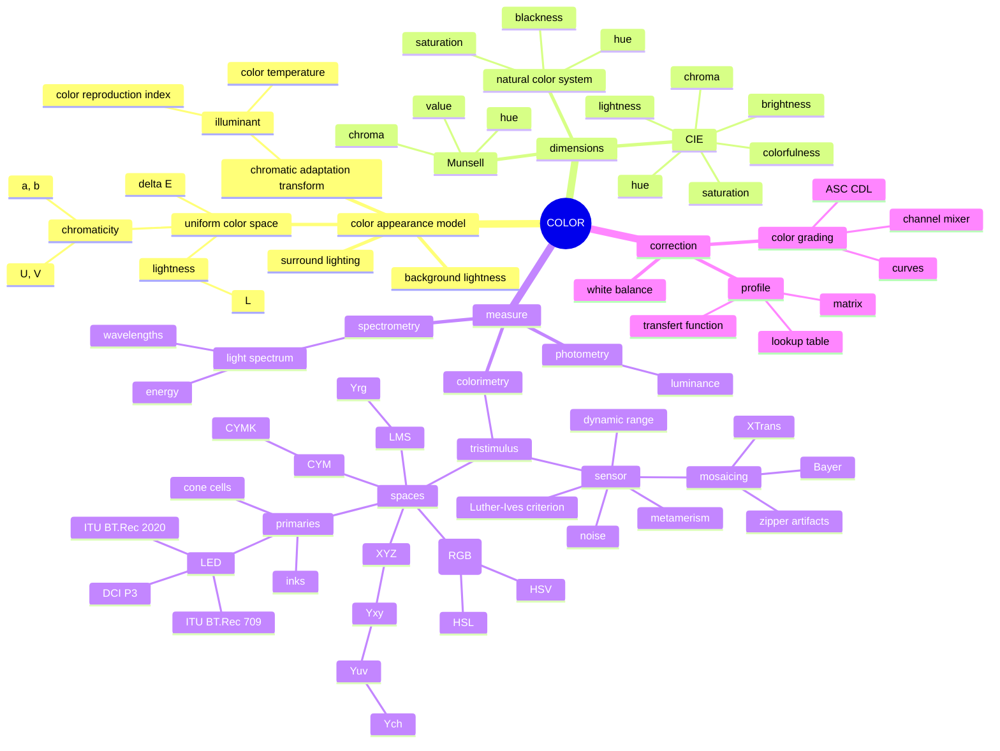

```mermaid
mindmap
  root((COLOR))
    color appearance model
      uniform color space
        chromaticity
          U, V
          a, b
        lightness
          L
        delta E
      chromatic adaptation transform
        illuminant
          color reproduction index
          color temperature
      surround lighting
      background lightness
    dimensions
      Munsell
        hue
        chroma
        value
      natural color system
        blackness
        saturation
        hue
      CIE
        lightness
        brightness
        saturation
        chroma
        colorfulness
        hue
    measure
      colorimetry
        tristimulus
          sensor
            Luther-Ives criterion
            metamerism
            dynamic range
            noise
            mosaicing
              Bayer
              XTrans
              zipper artifacts
          spaces
            rgb(RGB)
              HSV
              HSL
            LMS
              Yrg
            XYZ
              Yxy
                Yuv
                  Ych
            CYM
              CYMK
            primaries
              cone cells
              LED
                ITU BT.Rec 709
                ITU BT.Rec 2020
                DCI P3
              inks
      spectrometry
        light spectrum
          wavelengths
          energy
      photometry
        luminance
    correction
      profile
        matrix
        lookup table
        transfert function
      color grading
        ASC CDL
        channel mixer
        curves
      white balance
```
