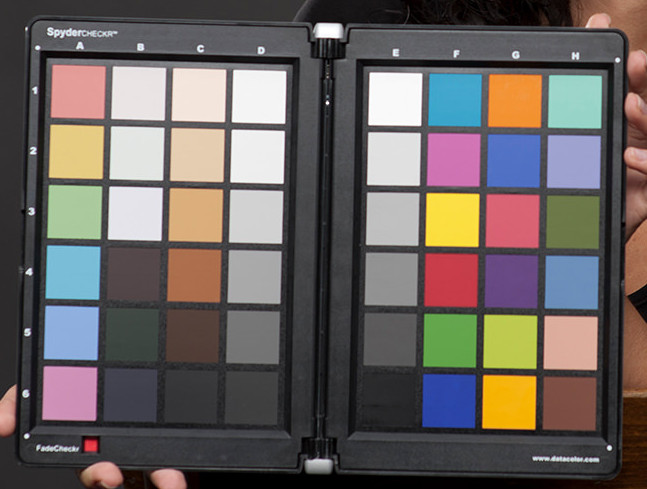
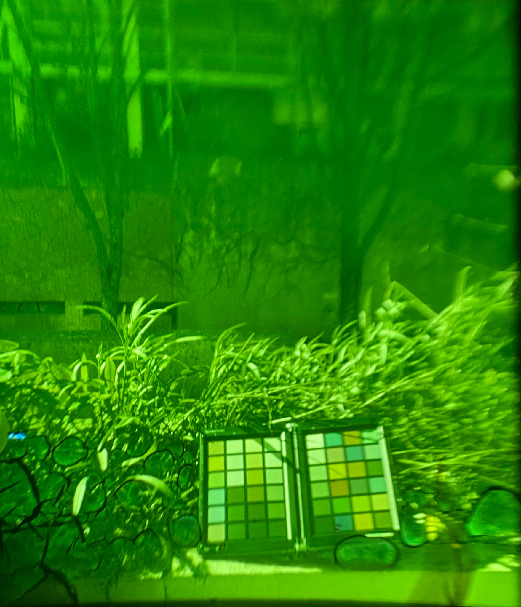
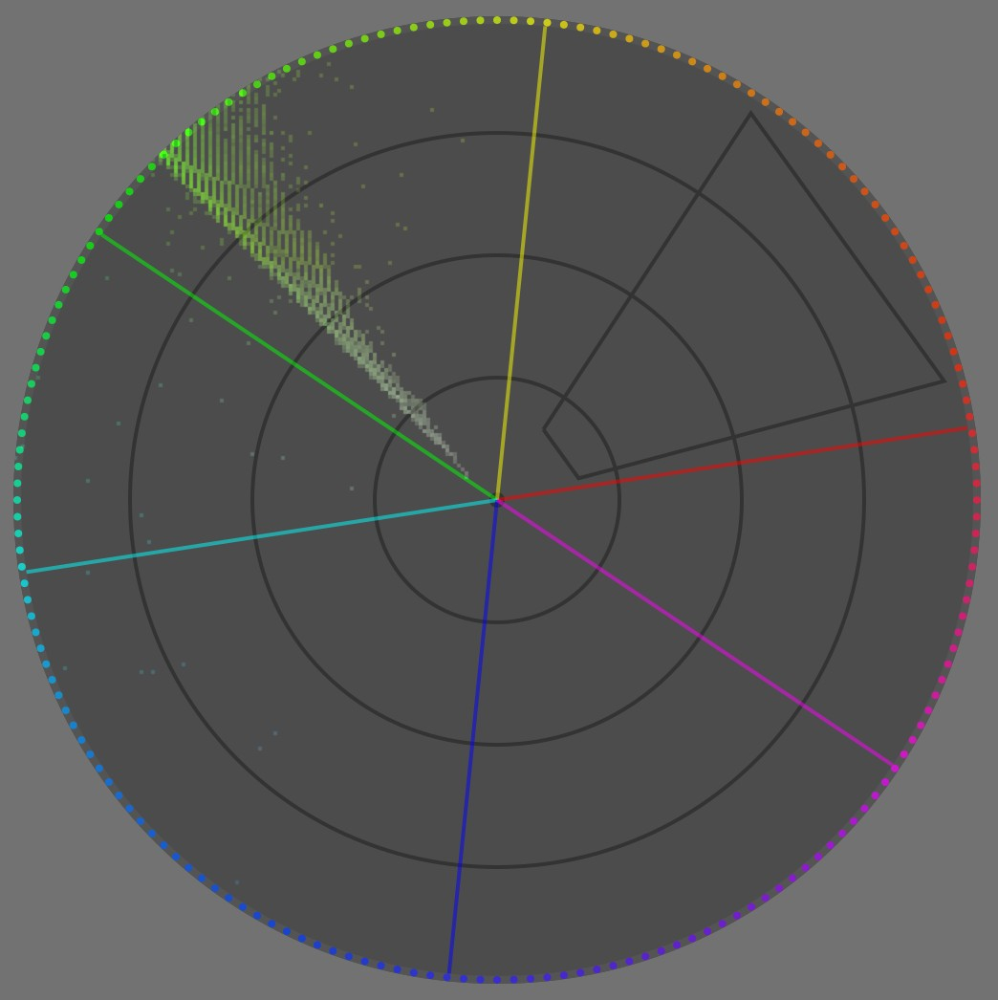
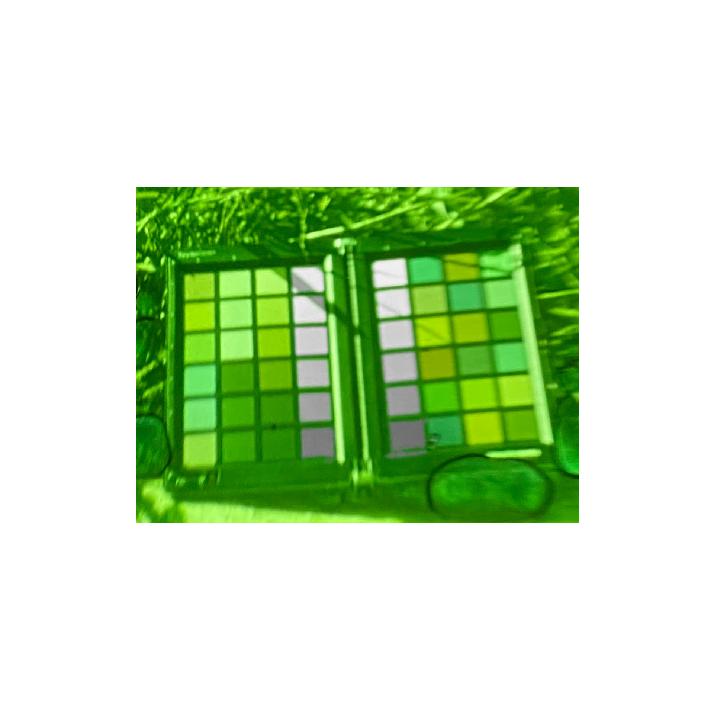
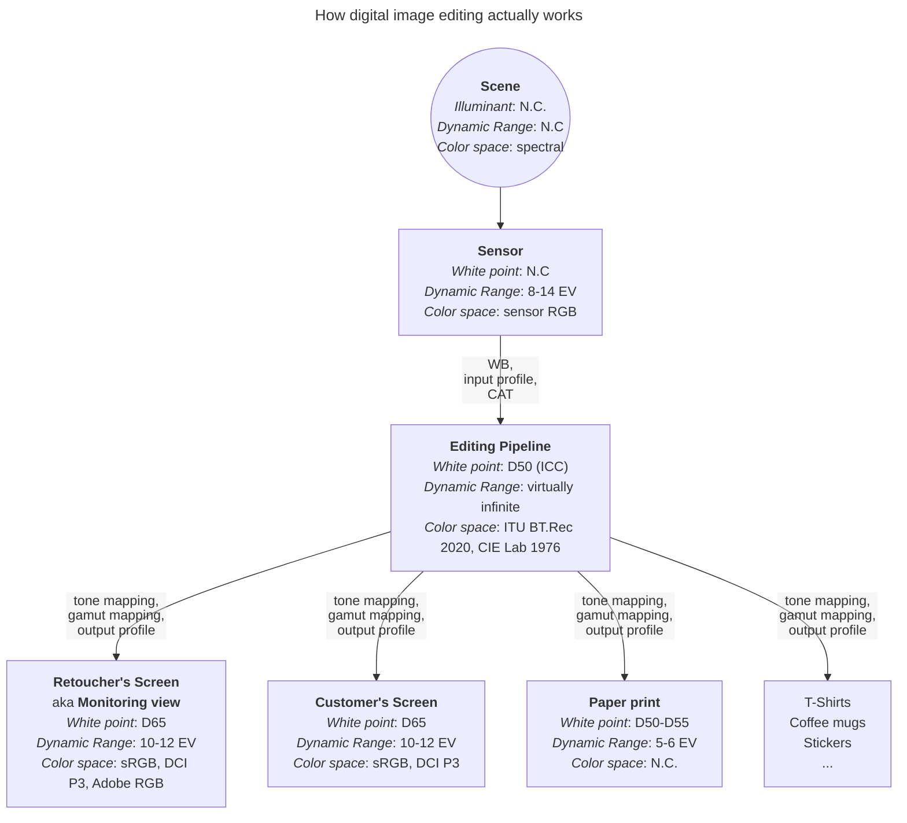
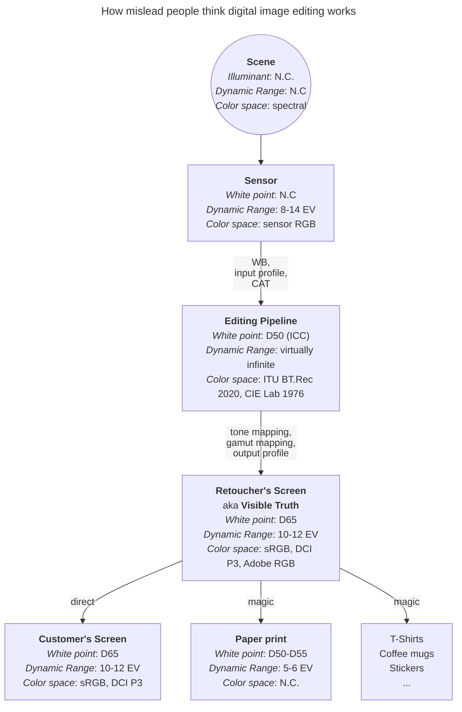
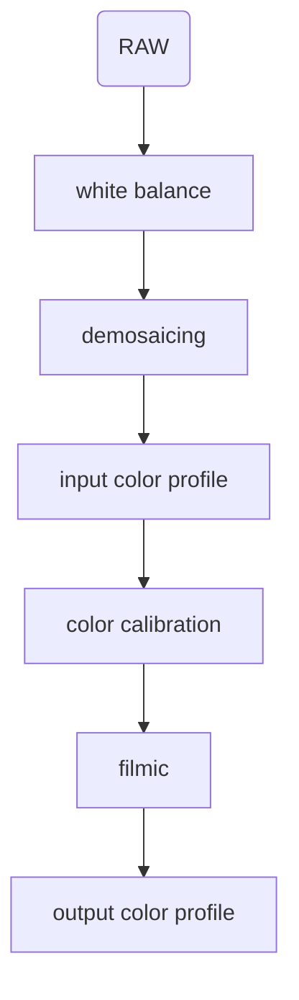

We all know what "white" is. We can picture a white sheet of paper. We know it is white because we learned it. But if you put your paper sheet under a summer sun, or a cloudy sky, or at home with those warm living-room bulbs, that white will change color. It might disturb you for the first few seconds, then you will just forget about it: your brain will adapt. But adapt (to) what ?

## Introduction

### Terms

Let's start by defining some terms and accronyms that will be used and abused here. You may skip that for now and come back later when you find the terms used in the text.

CIE
: [Commission Internationale de l'Éclairage](https://en.wikipedia.org/wiki/International_Commission_on_Illumination) (_International commission on illumination_). International authority for standardization of technical appliances, methods and workflows regarding lighting and color reproduction.

ICC
: [International Color Consortium](https://en.wikipedia.org/wiki/International_Color_Consortium). Professional association of imaging appliances vendors aiming at defining color reproduction workflows across the digital graphic chain, as to ensure color consistency between various output media (screen, paper, etc.). Color profiles respecting ICC specifications are usually dubbed "ICC profiles", which may hide the fact that non-ICC profiles exist too.

Color profile
: Computer file describing the color conversion between an arbitrary RGB space and a reference color space (usually, [CIE XYZ 1931](https://en.wikipedia.org/wiki/CIE_1931_color_space) for the 2° observer). It is often misunderstood that a color profile is not a program or an application in itself, but only a "cooking recipe" to be read and applied discretionary by a color management system (CMS — _which is a computer program_), that may be implemented in various image applications (viewers, editors, file browsers)… or not.

WB
: White balance. Generic operation aiming at rescaling light emissions such that the brightest white area, on scene, would be mapped to $RGB = (1, 1, 1)$ in any standard RGB space (sRGB, Adobe RGB, DCI P3, etc.). This relies on the property of RGB spaces to describe [additive light mixing schemes](https://en.wikipedia.org/wiki/Additive_color), and on the assumption that $RGB = (1, 1, 1)$ always encodes medium white point (paper white or LED backlighting), by design.

CAT
: Chromatic Adaptation Transform. Numerical method allowing to convert colors to account for a white point change, in a way that preserves color perception.
: CAT are used automatically before applying a color profile, if the destination color space has a different white point than the target color space. For example, Ansel (and ICC) pipeline uses D50 white point but all desktop monitors use D65 white point, so CAT is used to map D50 to D65 prior to applying an output color profile.
: CAT can be used manually to perform white balance, in a more accurate way than basic RGB rescaling, under some conditions. In that case, they become a special case of WB.

Illuminant
: Direct light source emitting the photons (aka, light) bouncing on the reflective surfaces of the scene. It is worth noting that graphic pipelines always assume one single illuminant per scene, which is not the reality faced by photographers. Sometimes, scene have more than one light source. Almost always, 3D objects will get a mix of light from the illuminant(s) and from other surfaces reflections around. Non-white surfaces bouncing light on an object can be seen as virtual illuminants that will tint typically shadows and will trigger the need for selective white balancing.

### The problem of "white"

Color scientists and software programmers alike, love to think of color as a 3D object (R/G/B, hue/saturation/brightness, etc.), expressed as 3 intensive and positive coordinates. While this has some merits in terms of light additivity (an LED screen is very much an RGB additive light scheme, by technological construction), it doesn't account for all the contextual corrections that happen in human perception: human vision is better described in terms of contrast, that is by difference between objects (or surfaces) and their neighbourhood.

For instance, see this color checker:

Now, here is the reproduction of this color checker, shot on film, where something went wrong at developing time. Stare at it for some time:

You would swear that the red patch is still red, even though the whole picture is shifted to green, right ? Worse, the "white" patch, feels white.  Well, let's see the vectorscope of this image:

Aside from some blueish noise, the whole image is fully contained within ~6° of hue centered in green. In any case, there is zero red pixel in here. If we see red, it is only because our brain does not really care about red as an absolute chromaticity, but rather extracts color patches, "computes" their differences with the neighbourhood, and then tries to make sense of these differences from a cognitive standpoint.

__This is where we need to define white for an illuminant and for a surface.__ When you coat an object with a couple of layers of white paint, you make it white. This means that, if you light it with any kind of light, the white surface will reflect and bounce the light spectrum "as-is", without favouring any band of the spectrum. Of course, it will absorb some light, only a perfect mirror would reflect close to 100 % of incoming light, but that absorption will be uniformingly scaled over all wavelengths of the spectrum, so the bounce light will be exactly the illuminant light, only less intense. The opposite would be a colored surface: this would selectively attenuate some bands of the spectrum, through [subtractive color synthesis](https://en.wikipedia.org/wiki/Subtractive_color).

The illuminant is the primary light source blasting photons on a scene (flash, light bulb, sun, clouds, etc.), including on white surfaces. So, given that a white surface reflects everything it gets, the illuminant projects its own color on a white surface. Therefore, this is as white as our scene (and subsequent image) will ever get, meaning the color of our white surface will change if we light it with daylight or with an orange bulb.

So, we tend to expect __the color of the brightest surface in a scene or in a picture__ to be the contextual "white" (contextually to our visual field), and our perceptual system uses it as a reference to make sense of all other colors around, by comparing them to that "white" reference.

Now, what happens if I make the achromatic patches manually achromatic (with regard to your current display) ?

The red patch now feels a bit less saturated and more orange, because we compare it to actual white and not green. But the context is still so overwhelmingly green, that even having true white (with regard to your display medium) within and all around the image, we still percieve that "less green" color of the red patch as somewhat red.

Also, the achromatic patches start feeling increasingly magenta as they get darker, again because of the overwhelmingly green surround. So, there is more to "white" than just being the "brightest light emission in visual field" either: immediate context. While normalizing images for the brightest light emission (aka _illuminant_) is supported in all color appearance models (CAM), through the chromatic adaptation transforms (CAT), accounting for local discrepancies (local contrast) is completly overlooked by color maths, since all CAM so far treat chromaticity as 3 positive coordinates. This will need manual tweaking to fill the gap to _perceptually-accurate_ color reproduction (see [below](#real-life-pictures-have-more-than-one-illuminant)).

What should we take from that ?

1. white is highly contextual to the illuminant,
2. white is _cognitively_ related to the illuminant, through the brightest light emission/reflection in the visual field, which may be misleading when there is no actual white surface in the field,
3. __but__ white is also somewhat contextual to the visual surrounding, aka dependent upon local color contrast,
4. __but__ digital imaging pipelines pretend color is only about positive intensities, and don't deal with color differences. Meaning the white balance tooling doesn't exactly deal with what's truly happening, but deals with a rough approximation instead. Meaning complicated cases will need to be handled manually with care.

### No rights, no wrongs, really ?

Before diving further into the hows and whys of white balancing, we should address the elephant in the room:

> But I like my pictures slightly warm, why should I neutralize the white balance and make whites achromatic ? It's an artistic choice, after all.

No, it isn't. I mean, not in the way you think. Artistic choices are always limited by technical constraints, because art is about shaping a material medium, so the rules of physics apply at every step on said medium whether you like it or not. Now, not _knowing_ the technical constraints at play will give you a wrong sense of freedom that will turn into profound frustration when things stop going your way, that is especially when images have more than one illuminant. Bad workflows can work in nice and easy situations. Good workflows give you provisions to deal with difficult situations.

The digital imaging world would largely benefit from seeing the image making process as remapping process, instead of trying to find some absolute description of images that will never have a material existence. More specifically, we can represent the remapping flowchart as follow:

But, most people still (and wrongly) think it is:

And that last flowchart is completely wrong because the retoucher's screen is not a more important medium than any other: it's no reference, no standard, it bears no truth. Output media exist in parallel, not in sequence, and the conversion between pipeline and output media are completely fluid because each have their own optical properties.

In any case, each arrow in both flowcharts represent a remapping step, while each non-rounded rectangle represents a medium, trying to reproduce the scene. A remapping is a general conversion, that can be fully or partially automated but usually requires some user to drive trade-offs, which will aim at adapting the image content for some display medium or intermediate working step. In particular, we need to remap the dynamic range (or contrast ratio), the color space gamut, and the white point, because we want to retain a consistent look throughout media that have vastly varying display abilities and properties.

For any display medium (paper, screen, diapositives, coffee mug, …), maximum luminance is reached only for a very special achromatic color: white. Think of paper… White is a built-in property of the paper (a mix of core fibers and surface coating optics), in terms of tint. As far as your inkjet printer is concerned, "white" means "don't spray ink there". Say you want your picture to look slightly warmer and you settle for amber white… You will need to coat all visible paper surface with at least _some_ yellow and red inks. Doing so will result in darkening the peak luminance, that is your "amber white" will be darker than native medium white, because of the subtractive light scheme of dyes and pigments, so you will reduce the already limited dynamic range paper can offer (5 EV for typical inkjets prints). But how do you instruct your printer to do so ? Input RGB will be clipped at 1 or 100% (or 255 if encoded as 8 bits unsigned integers), and $RGB = ( 1, 1, 1 )$ means medium white by definition of the color space (aka by design). If you try to reach "amber white" by pushing white to $RGB = ( 1.2, 1.2, 1 )$, RGB will get clipped at 1 anyway, so you might get amber gradients that break to medium white at some point. Or, if you know what you are doing, you will push white to $RGB = ( 1, 1, 0.83 )$, and therefore… reduce its luminance. This is how dynamic range connects, in an usually overlooked way, to the medium white point because the peak luminance is __always__ achromatic with regard to a medium.


__Before__: white balance normalized for nearly-achromatic whites (illuminant: daylight 3832 K).\
__After__: white balance kept warm for "artistic reasons" (illuminant: daylight 4341 K).\
The white point is kept the same between both pictures. Note how the gradient inside the Sun disc is harshly breaking to pure white at some point, near the center, on the warm interpretation, because of RGB clipping. I will propose 2 possible corrections for this below.\
Photo licensed under Creative Commons by Andreas Schneider.



Attempted fixes for the Sun disc gradient break in the warm interpretation above.\
__Before__: reducing the highlights saturation by 50 %\
__After__: reducing the white point luminance by 0.5 EV\
Note that the desaturation strategy partially falls back to neutralizing whites to achromatic, but without adapting color in shadows and midtones in a perceptual way.\
Photo licensed under Creative Commons by Andreas Schneider.



Here we try to see how the image content blends within a generous white frame using the medium white point. This simulates a paper print with white borders.\
__Before__: white balance normalized for nearly-achromatic whites (illuminant: daylight 3832 K)  with darkened white point.\
__After__: white balance kept warm for "artistic reasons" (illuminant: daylight 4341 K) with darkened white point.\
The warm interpretation has the image illuminant (Sun disc) severely clashing with the medium white, looking like an aged picture. The conflicting whites references between "paper" and image content makes it look like a clumsy amateur shot.


What should we take from that ?

1. you have no control over the medium white point, whether it is a screen backlighting or the paper tone: it is technically defined and you need to adapt to it.
2. when printing with white borders, __you need to mind the clash of white points between image content and paper borders__. This applies too for digital images that will be displayed over white backgrounds on the web,
3. you don't have a lot of latitude to de-neutralize your image white balance for artistic purposes before it starts visually clashing with paper white,
4. you will have to darken the image white point, therefore reducing the printable dynamic range, if you want to make it non-neutral (non-achromatic). Failing to do that will create clipping artifacts in smooth gradients,
5. __peak luminance is expected to be achromatic__ for all typical media: this is what ties dynamic range (or, at least, its upper bound) to a medium white point (white balance).

## How to white balance ?

### The maths of white balance

Applying a white balance is surprinsingly simple when you look at the equations: one per-channel division, one per-channel multiplication. But it's so deeply buried under misunderstood concepts and obfuscated GUI (more on this [below](http://localhost:1313/en/resources/white-balances/#gui-obfuscating-white-with-temperature)), that people got completely side-tracked by the technical distractions. So it is a great example of how 3 equations can undo the havoc that software and GUI have wrecked in user's minds over the past decades, by trying to be "intuitive".

Let's say you are in some RGB space, for example camera sensor RGB. You need to find the chromatic coordinates of your scene illuminant in this RGB space. Let's call them $R_w, G_w, B_w$. Conveniently, if you know nothing about the scene illuminant, simply getting the arithmetic mean of $R, G, B$ values of all pixels in the picture will get you fairly close. [^1] In other words, you need to know the color of the illuminant, and convert its chromaticity as RGB coordinates in your working RGB space.

[^1]: This is called the "grey world assumption". It is actually how cameras detect white balance, though nowadays they might choose to do so in some well-chosen areas of interest instead of doing it blindly on the whole image.

Then, you need to do the same for the expected (reference) white point of your RGB space. Let's call those coordinates $R_{wr}, G_{wr}, B_{wr}$.

Finally, white-balancing the picture is as simple as normalizing each pixel RGB with the scene illuminant RGB and rescaling (denormalizing) it with the target illuminant (or white point) RGB:

$$
\begin{cases}
R_{out} &= R_{in} * \dfrac{R_{wr}}{R_w}\\\\
G_{out} &= G_{in} * \dfrac{G_{wr}}{G_w}\\\\
B_{out} &= B_{in} * \dfrac{B_{wr}}{B_w}\\\\
\end{cases}
$$

See, no need for kelvin temperatures ! Those are only to confuse you in GUI. It's just rescaling pixel RGB with carefully-chosen factors.

If we apply these operations on sensor RGB, we have [input color profiles](../../doc/views/darkroom/modules/input-color-profile/) that expect a D65 illuminant to be encoded with certain RGB values: $R_{wr}G_{wr}B_{rw} = (1, 1, 1)$, by design. The $R_{w}G_{w}B_{r}$ values are then derived from the input color profile. This makes the computation even simpler:

$$
\begin{cases}
R_{out} &= \dfrac{R_{in}}{R_w}\\\\
G_{out} &= \dfrac{G_{in}}{G_w}\\\\
B_{out} &= \dfrac{B_{in}}{B_w}\\\\
\end{cases}
$$

That's what we do in Ansel's old [white balance](../../doc/views/darkroom/modules/white-balance/) module.

Now, the camera sensor RGB is vastly different from our cone cells RGB. In practice, attempting to white-balance in sensor RGB gives poor results, especially for illuminants for from D65, and special "RGB" spaces have been developed to improve the perceptual consistency of the operation over the whole color range. The Bradford, CAT02, CAT16 etc. chromatic adaptation transforms (CAT) apply the same operations but in special spaces. You can [learn more about them](https://acorn.stanford.edu/psych221/projects/2010/JasonSu/adaptation.html), their differences and specifics are beyond the scope of this article.

White-balancing through CAT happens in Ansel's [color calibration](../../doc/views/darkroom/modules/color-calibration/) module.

### White balance in Ansel

If we do a partial pipeline flowchart of the default Ansel's editing pipeline order, we get the following modules:

For Fuji XTrans sensors, the Markesteijn demosacing algorithm relies on a luma/chroma separation, which requires at least a rough white balancing step to happen earlier. This is the old [white balance](../../doc/views/darkroom/modules/white-balance/) module. But we know the result is not accurate, especially for illuminants far away from D65 (especially for low-quality artifical lighting).

The quality of the input color profile also relies on having RGB already normalized to D65. But we already know this can't be accurate either. Some Adobe products now use dual-illuminant DNG profiles, which have one input profile for D65 illuminant and one for illuminant A (incandescent bulb), and the final profile used is computed as a mix of both depending of the color temperature of the scene illuminant. Those fix the issue for daylight-ish illuminants, but still don't address the issue of colored stage lights and other energy-saving light bulbs with terrible color-rendering index (CRI).

Another, more accurate, step of white balancing was later added in [color calibration](../../doc/views/darkroom/modules/color-calibration/), using chromatic adaptation transforms (CAT16, Bradford). It can be configured automatically by extracting a profile from a color checker chart. Empirical studies have shown that the lowest color deviation, after profiling from a color checker, was achieved with color calibration after a preliminary step of white balance, in the old module, so we have retained both:

1. the _white balance_ module will normalize sensor RGB such that D65 white that would have been captured on scene would record at $RGB = (1, 1, 1 )$. If the actual scene illuminant is anything else, it will be dealt with later.
2. _input color profile_ module will convert sensor RGB to CIE XYZ 1931 color space, which acts as a glue for all later color spaces, assuming D65 illuminant (which is wrong in general),
3. _color calibration_ will convert CIE XYZ 1931 to CAT16 or Bradford "RGB" and will normalize any arbitrary scene illuminant (that is, if it's not D65) to the pipeline white point (D50, as per ICC workflow). [^5]
4. _color calibration_ can optionally apply a refinement step of the input color profile, using a channel mixer (aka a matrix color profile) whose parameters can be directly computed from a color checker in the module.

[^5]: It is worth noting than we can't directly convert sensor RGB to CAT16 or Bradford without going through CIE XYZ 1931, so we need the input color profiles to be applied first. But we know the input color profile, and therefore the conversion from sensor RGB to CIE XYZ 1931, will be wrong in general because it relies on having whatever scene "white" balanced to $(1, 1, 1)$ already. In an ideal world, we would have one input profile for each scene illuminant, but that's technically impossible. So this is why the channel mixing in _color calibration_ comes as a nice refinement step.

This dual step of white balancing is somewhat confusing for users, but has proven to yield the most accurate colors. The _color calibration_ has a diagnostic mode allowing to compute the color deviation after profiling, as a [delta E](https://en.wikipedia.org/wiki/Color_difference), from a color checker chart, you can check for yourself.

## GUI: obfuscating white with temperature

In _any_ software around, you will see a white balance setting using a temperature slider (actually, [correlated color temperature](https://en.wikipedia.org/wiki/Correlated_color_temperature)), and then tint. But you saw in the actual equation that white balance internally doesn't deal with anything else than the RGB coordinates of the illuminant, albeit projected in the special RGB space in which we perform the scaling. So, why bother with that confusing kelvin (K) temperature ? Well, there is no reason anymore except legacy.

Physicists have a special radiator, called a [black body](https://en.wikipedia.org/wiki/Black-body_radiation). It's an idealized object which, once heated at a certain temperature, will emit a known light spectrum. More interestingly, the shape of light spectrum can be _entirely predicted_ by the temperature of the black body. Remember how [RGB is a 3D reduction of a light spectrum](../../workflows/scene-referred/index.md) ? Here, it's a 1D reduction, even better ! Meaning one single number suffices to describe unambiguously a full spectrum.


Light spectra (blue, red, green curves) for black body temperatures between 3000 and 5000 K.
By <a href="//commons.wikimedia.org/wiki/User:Darth_Kule" title="User:Darth Kule">Darth Kule</a> - Own work, Public Domain, <a href="https://commons.wikimedia.org/w/index.php?curid=10555337">Link</a>


The cool property here is, until the 1990's, (home) light bulbs were all incandescent tungsten filament, which are a black body at 2855 K, standardized as _Illuminant A_ by the CIE. Then, daylight falls very close to black bodies spectra between 3000 K (sunset) and 8000 K (cloudy day). So we could reduce illuminant color to a single temperature value, which makes for a simpler GUI, although good luck explaining to the layman why color got suddently reduced to a temperature… Very few photographers understand what's going on there, so much for an "intuitive" GUI…


Illuminant color associated with black body temperature (adapted for D65 medium white).
By <a href="//commons.wikimedia.org/wiki/User:Bhutajata" title="User:Bhutajata">Bhutajata</a> - Own work, <a href="https://creativecommons.org/licenses/by-sa/4.0" title="Creative Commons Attribution-Share Alike 4.0">CC BY-SA 4.0</a>, <a href="https://commons.wikimedia.org/w/index.php?curid=44144928">Link</a>


Problems happened, first with tinted lights (stage lights & gels), second with cheap high-power bulbs (sodium vapour, halogens), then with more recent light bulbs (fluorescent, LED), which light spectrum has peaks and valleys, far from the expected smoothness of a black body spectrum. Those can't be accurately described as a single temperature value.


Light spectrum of a D65 fluorescent simulator, standardized as CIE illuminant F3.15. The sharp peaks are not expected in a black body 6500 K spectrum.
By <a href="//commons.wikimedia.org/wiki/User:Ellande" title="User:Ellande">Ellande</a> — Personal work, <a href="http://creativecommons.org/publicdomain/zero/1.0/deed.en" title="Creative Commons Zero, Public Domain Dedication">CC0</a>, <a href="https://commons.wikimedia.org/w/index.php?curid=147285708">Link</a>


To account for deviations from pure black body spectrum, another "tint" setting was added, making the description of our illuminant 2D instead of 1D. While the temperature roams the Planckian locus in a curved way, the tint allows to move away from it orthogonally.


The Planckian locus (bold curve) covers the chromaticities linked to a black body spectrum, here represented in <a href="https://en.wikipedia.org/wiki/CIE_1960_color_space">CIE 1960 UCS</a>. Daylight spectra lie very close but not exactly within the Planckian locus. For any arbitrary color, we can compute the closest correlated color temperature (CCT), using the closest point of the Planckian locus. For $\Delta_{uv} > 0.05$, that is if the color lies too far away from the bold curve, this CCT is meaningless and the CIE discourages to use it. Software developers answered "hold my beer" and added a 2nd coordinate, the tint, orthogonal (in theory) to the Planckian locus (straight lines). In practice, tint is not even that clean, it's usually a green-magenta axis.
By <a href="//commons.wikimedia.org/wiki/User:Adoniscik" title="User:Adoniscik">Adoniscik</a> - Own work, Public Domain, <a href="https://commons.wikimedia.org/w/index.php?curid=3803195">Link</a>


This could be fine, but it really isn't. Indeed, once we have the RGB coordinates of the illuminant (for example, as the camera detects it internally), finding the correlated color temperature (CCT) is done through various [approximations](https://en.wikipedia.org/wiki/Correlated_color_temperature#Approximation) (each software may use its own). The other way around, knowing the correlated color temperature, we can fetch the RGB coordinates of the illuminant through other [approximations](https://en.wikipedia.org/wiki/Planckian_locus#Approximation). Meaning that the roundtrip RGB → temperature → RGB (or, similarly, temperature → RGB → temperature) will not yield the original value. So in the event of the scene illuminant being anything but a pure black body spectrum, we stack a gross approximation of the arbitrary illuminant by a meaningless (and wrong) temperature on top of the approximation of the RGB coordinates from the temperature, all that only as an intermediate step designed to show a 1D slider in GUI (on 2D if you include tint for difficult cases), whereas all the pixel code cares about is the RGB coordinates of the illuminant anyway, which can perfectly be computed directly in RGB without going through temperature.

For this reason, Ansel has different illuminant settings in [color calibration CAT](../../doc/views/darkroom/modules/color-calibration/). If we find that the camera detected something close enough to daylight or blackbody, we automatically offer the temperature setting. Else, we default to "custom", which provides users with a 2D hue/chroma setting in [CIE Luv 1976](https://en.wikipedia.org/wiki/CIELUV) that will directly allow to define illuminant color without intermediate computation. From hue/chroma to RGB, the illuminant computation uses no approximation, so the roundtrip RGB → hue/chroma → RGB accurately yields the original values.

But the mess created by temperatures doesn't stop here. The black body model links temperatures to colors like this:


Illuminant color associated with black body temperature (adapted for D65 medium white).
By <a href="//commons.wikimedia.org/wiki/User:Bhutajata" title="User:Bhutajata">Bhutajata</a> - Own work, <a href="https://creativecommons.org/licenses/by-sa/4.0" title="Creative Commons Attribution-Share Alike 4.0">CC BY-SA 4.0</a>, <a href="https://commons.wikimedia.org/w/index.php?curid=44144928">Link</a>


Yet, all white balance temperature sliders show this:

Yes, it's reverted. Why ? Because it doesn't show the color of the illuminant, but instead an attempt to show the effect (a color shift) on the image. But… The effect of a white balance setting is to turn a non-white color to white (with regard to the white point of our current working space). So the effect should be white all along… What this colored slider _actually shows_ is how a D65 white captured on the scene would look like after applying our white balance. But why should we care about the look of a virtual D65 white from the scene that don't even exist, if our scene illuminant is not D65 (otherwise we wouldn't need white balance at all) ? It doesn't make sense.

In _color calibration_ module, temperatures are shown accordingly to the color they represent, which matches the color patch of the illuminant that can be found by sampling achromatic surfaces in the picture, using the color picker:


Disabling the _color calibration_ will show the picture shifting to the color shown in the patch.


Honoring our remapping way of thinking, this clearly shows what original color from the picture will be remapped to D50 white through the transform, instead of attempting to represent a color _shift_ with an absolute color. Problem is many users now think something is broken in this approach, being impregnated with the nonsensical one.

## Real life: pictures have more than one illuminant

It's a bit late to address another elephant in the room: the core assumption of all chromatic adaptation, __our color pipeline expects one and only one illuminant__. This makes sense, when you print on paper or display on screen: white is defined by the paper tone or by the LED backlighting. But, on the scene, unless you shoot in studio with only black/white walls, floors and ceilings, you have several "illuminants".

Let's explain that with an example. The picture below was shot mid-October, while the tree leaves were turning orange. We have an overhead of foliage, trees left and right, and grass on the ground:

- The green grass on the ground acted as a green reflector, bouncing light mostly under the chin: that's one virtual illuminant.
- The yellowish leaves overhead acted as a yellow reflector, bouncing light mostly on the cheeks and décolleté: that's another virtual illuminant.
- Then the direct sunlight pierced through the leaves, on the bright skin spots, which is the real illuminant (aka source of all photons on the scene).
- Meanwhile, all the green background was likely confusing in-camera automatic white balance detection, and we can't sample any achromatic object for reference once in our photo editor.


__Before__: no color correction, defaulting to WB detected in-camera\
__After__: color calibration from color checker, color balance done manually (details below)\
© Aurélien Pierre


So this is overall one of the most difficult setups: each feature and surface of the (3D) face is getting its light primarily from a different (real or virtual) illuminant, depending on the orientation of the surface in space, and we can't rely in general on WB auto-detection because the whole frame is biaised by foliage, although here it does a fair-enough job. Many photographers still think it is impossible to recover skin tones in this scenario, the above image proves them wrong, though it requires some virtuosity.

The trick here is first and foremost to shoot a color checker frame, to correct the green deviation as much as possible, using the _color calibration_ module. The color checker will be held in front of the subject, pointing towards the camera in such a way that it gets an average mix of all available illuminants (and hopefully no glare). So the _color calibration_ will be used to "mostly get there", trying to account for an average mix of all lights sources. The color checker will save us much manual, frustrating and time-consuming fiddling with parameters.


Applying the _color calibration_ settings (CAT and channel mixer) computed from the color checker values.\
__Before__: Illuminant detected in-camera: hue 53°, chroma 17.1 % (yellow) - delta E: average 3.47, max 7.94\
__After__: Illuminant computed from color checker: hue 67.5°, chroma 13.0 % (green) - delta E: average 2.54, max 5.36\
© Aurélien Pierre


If we had artificial objects, with sharp contours, we could then multi-instanciate _color calibration_ and mask in/out the areas we want to selectively white-balance. But here, with an human face, we have rounded surfaces seamlessly blending into each other, and that is not possible.

It is useful to recall, here, that the _color balance_ shadows lift and highlight gain are also mere RGB multiplications, exactly like our white balance. While it is mathematically the same thing, they happen in a special RGB space designed for perceptual uniformity of hues (as to improve color grading), instead of happening in a CAT space, designed specifically for white point adaptation. Nonetheless, lift and gain can be seen as local chromatic adaptation for shadows and highlights, and can be used for this purpose.

So the way to fix this picture is as follow:

1. shadows are expected to have an higher ratio of green bounce light, so turn the _shadows lift_ setting to magenta (always compensate with shifting to opponent color),
2. highlights are expected to have an higher ratio of yellow light (from autumn foliage), so turn the _highlights gain_ setting to blue,
3. the final skin tone can be adjusted using the midtones power, in _color calibration_, to soften the magenta-red shift that will most likely result from the next 2 steps. This will happen by re-introducing some yellow.
4. the direct sunlight spots on the skin can be lazily desaturated to blend, since they are so much brighter than anything else, using _filmic_ saturation (_look_ tab) and/or _color balance_ highlights saturation (_master_ tab).

In any case, fixing this kind of picture starts on the scene, by untangling how the different illuminants play out on the surfaces of your subject. It will be much easier to unroll a post-processing method once you have all the mental notes of what was going on.

## Back to artistic choices

So, you want your golden-hour amber haze ? Ok, but twisting white balance is probably not the right way to do so, because it affects all colors over the whole dynamic range.

There is an easier, better and more suited way, using a neutral white balance, and then tinting the picture using _color balance_ power:


__Before__: white balance kept warm for "artistic reasons" (illuminant: daylight 4341 K).\
__After__: white balance normalized for nearly-achromatic whites (illuminant: daylight 3832 K), then amber-red color grading using color balance power.\
This allows us to get a deeper color shift and more of that amber haze in midtones, without tampering with peak emission nor with water blue. The look is overall more natural.

