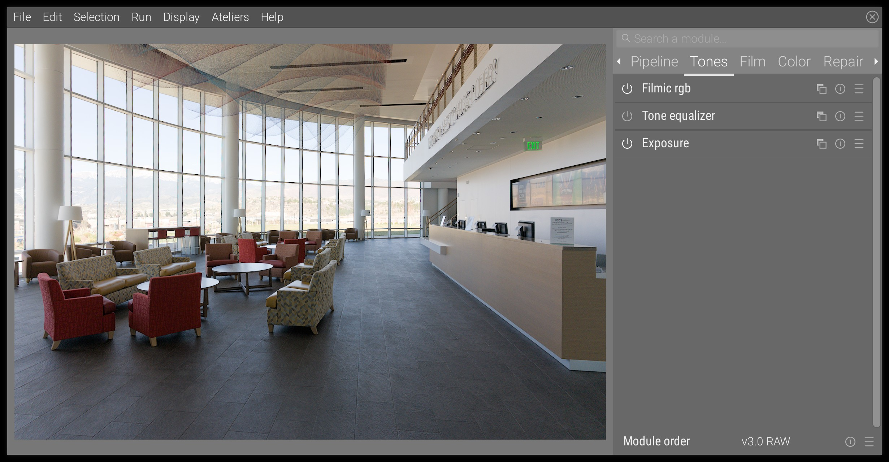
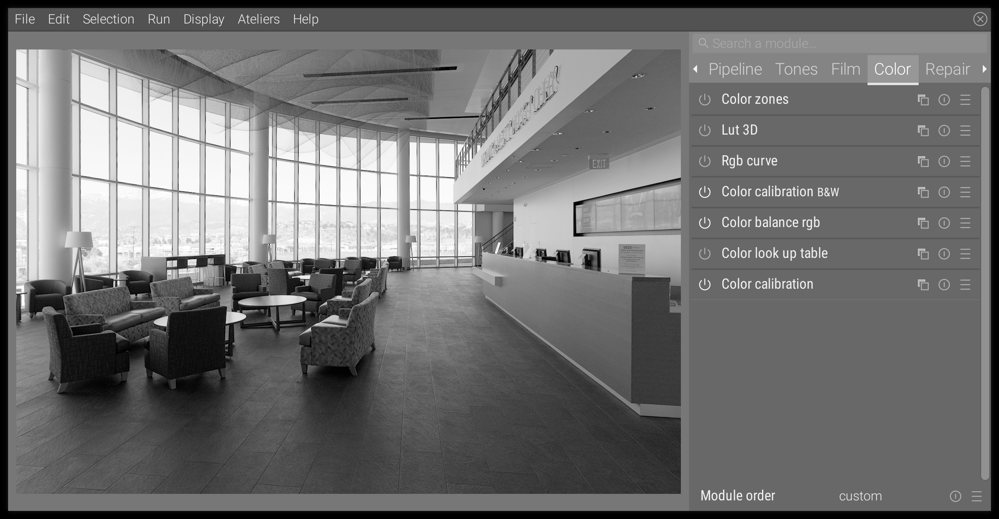
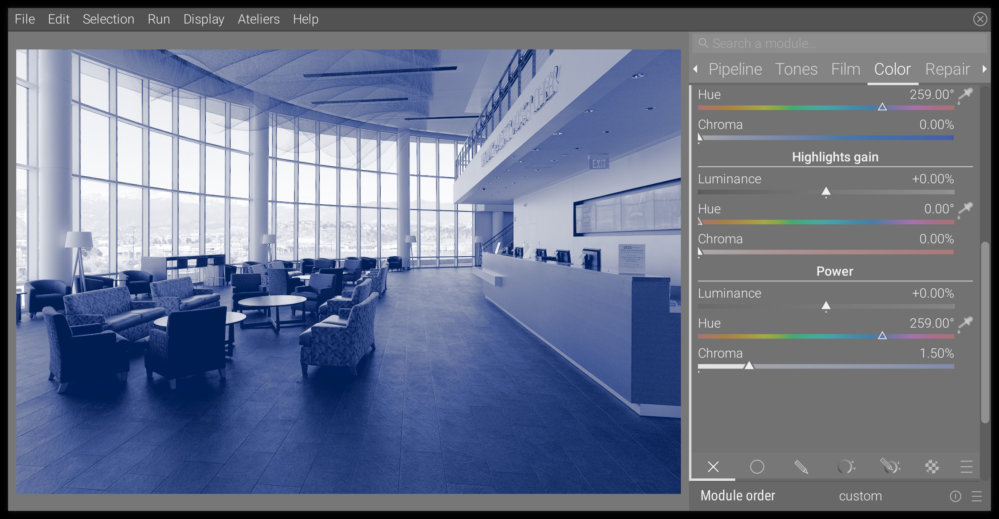
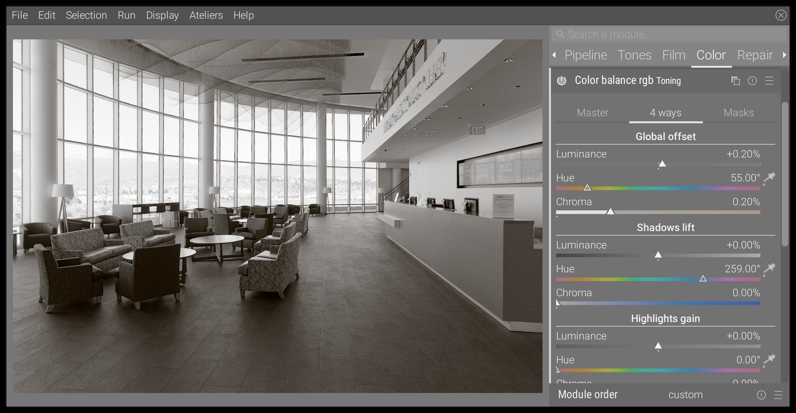
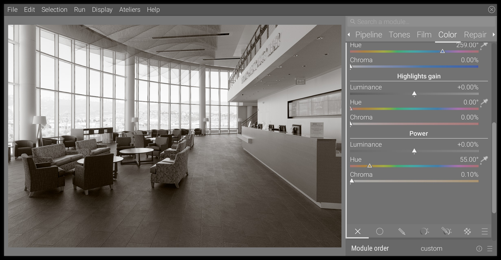
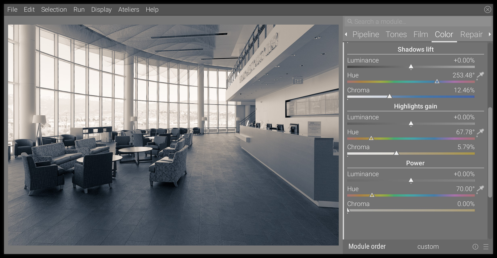

Cet article montre comment effectuer un ton monochrome sur des images numériques dans Ansel, afin d'émuler le rendu des couleurs des développements type cyanotype, platinotype, sépia et virage partiel.

## Etape 0 : préparation globale

Réglez l'exposition globale ainsi que l'exposition relative du blanc et du noir dans filmique RVB comme pour toute autre opération d'édition. Voir [retouche de base](./basic-editing.md). Voici notre image de base de Glenn Butcher :

Si vous partez d'une image couleur, vous devez la transformer en noir et blanc : la méthode recommandée est de passer par le module [calibration des couleurs](../doc/modules/processing-modules/color-calibration.md), en utilisant les presets N&B. Voici ce que nous obtenons :

## Variante 1 : cyanotype

Le cyanotype est un développement où le "noir" est remplacé par le bleu, car les halogénures d'argent typiques (qui développent le noir) sont remplacés par du ferrocyanure ferrique, qui développe le bleu.

### Étape 1 : échange du noir et bleu

Dans le module [balance couleurs rvb](../doc/modules/processing-modules/color-balance-rgb.md), allez dans l'onglet _4 voies_, et dans la section _Décalage global_, définissez une teinte de 259° pour une chroma de 1,50%. Vous devrez faire un clic droit sur le curseur de chroma, puis entrer la valeur `1,5` au clavier (le point peut-être utilisé à la place de la virgule), parce que la plage du curseur va jusqu'à 0,75%, ce qui correspond aux utilisations typiques de l'étalonnage des couleurs.

Si vous faites cela, vous remarquerez que les noirs restent neutres et ne sont pas teintés de bleu. Cela est dû au mappage interne de la gamme dans le module, qui empêche les valeurs RVB négatives, cela créerait des problèmes ultérieurs dans le pipeline. Pour forcer les noirs à être colorés, vous devrez augmenter la luminance du _Décalage global_ de la même quantité que la chroma, soit 1,50% dans cet exemple.

Voici le résultat :

À partir de là, vous pouvez affiner les réglages du _Décalage global_ à votre convenance.

### Étape 2 : ajuster le contraste

L'augmentation de la luminance du point noir, obligatoire pour pouvoir teinter le noir, réduit le contraste et donne une image plate. Pour y remédier, il faudra revenir au module filmique rvb et augmenter l'exposition du noir de la scène jusqu'à ce que la densité des parties les plus sombres vous paraisse acceptable. Voici le résultat :

### Étape 3 : régler finement les tons moyens

Le _Décalage global_ que nous avons ajusté à l'étape 1 affecte principalement les noirs et les ombres profondes. Il est possible d'orienter la diminution de la teinte vers le blanc, afin d'obtenir des tons moyens plus ou moins teintés.

Vous devrez aller dans l'onglet _Masques_ du module de balance couleurs rvb et régler le point de pivot du blanc avec le sélecteur de couleur à droite du curseur. Ceci est important pour le réglage _Puissance_ suivant. Dans un flux de travail relatif à l'affichage, où l'on sait à l'avance que le blanc est à 100%, cela ne serait pas nécessaire, mais comme nous sommes dans un [flux de travail relatif à la scène](./scene-referred.md) où le blanc peut avoir n'importe quelle valeur, nous devons le définir de manière explicite.

Ensuite, dans l'onglet _4 voies_, allez en bas, à la section _Puissance_. Ici, on utilise la même teinte que précédemment (259°) et une chroma plus ou moins intense selon le bleu que l'on veut donner aux tons moyens. C'est ce que nous obtenons :

Une fois que vous avez augmenté le bleu dans les tons moyens, vous pouvez l'adoucir légèrement dans les ombres profondes en réduisant un peu la chroma du _Décalage global_. Ajustez tout à votre goût et faites attention aux surfaces bleues plates qui pourraient indiquer une sursaturation.

### Conclusion

C'est tout. L'aspect est assez cohérent avec les cyanotypes analogiques. Vous n'avez rien à faire avec les blancs et les hautes lumières, qui sont définis par le ton du papier pour les cyanotypes analogiques. Pour un aspect plus vintage, vous pouvez choisir une teinte légèrement plus verte, autour de 257° ou même moins, et même déplacer délicatement le gain des hautes lumières vers le jaune pour simuler le vieillissement du papier.

Pour un rendu crédible, il faut absolument faire attention aux noirs neutres : il ne doit pas y en avoir. Augmenter la chroma et la luminance du _Décalage global_ jusqu'à ce qu'ils soient complètement teintés.

## Variante 2 : platinotype

Le platinotype utilise du palladium et du platine dans des proportions variables, à la place de l'halogénure d'argent. Selon les proportions de chacun, les noirs seront plus chauds ou plus froids, mais moins denses qu'avec l'halogénure d'argent. Nous opterons ici pour l'aspect le plus chaud.

Le fonctionnement est très similaire à celui de l'émulation du cyanotype, nous ne changerons que la teinte, reportez-vous donc à la section précédente pour les explications complètes.

### Étape 1 : réchauffer le noir

Nous allons utiliser des paramètres beaucoup plus doux que précédemment, c'est à dire la teinte à 55°, la chroma à 0.20% et la luminance à 0.20% dans _Décalage global_.

### Étape 2 : régler finement les tons moyens

Là encore, j'ai à peine touché aux réglages _Puissance_, avec une chroma de 0,10 % pour une teinte de 55°.

### Conclusion

Il n'y a pas d'aspect platinotypé défini, car la teinte finale dépend des proportions du mélange entre le platine et le palladium dans l'émulsion photosensible. Le résultat présenté ici est plus nuancé que la plupart des platinotypes réels que j'ai vus, à des fins éducatives. Vous pouvez le réduire d'un cran pour obtenir un résultat plus crédible en réduisant la chroma.

Le ton de sélénium peut être reproduit exactement de la même manière, seule la teinte devra être changée en violet.

## Variante 3 : sepia

Le sépia est obtenu à partir d'un tirage argentique typique où l'halogénure d'argent est transformé en sulfure, qui est plus stable et a une meilleure longévité. Il en résulte un décalage vers le brun.

La reproduction numérique du ton est très proche dans l'esprit du platinotype, seule la teinte sera légèrement différente (70° au lieu de 55°) et le décalage plus prononcé, ce qui nécessitera d'utiliser également le _Décalage des ombres_.

Les réglages proposés sont les suivants (toutes les teintes étant réglées à 70°) :

* _Décalage global_:
  * chroma : 0.20%
  * luminance : 0.20%
* _Décalage des ombres_:
  * chroma: 10%
* _Gain hautes lumières_ : ne pas toucher (mêmes réglages que précédemment)
* _Puissance_: 
  * chroma: 1.50%

Ce qui nous donne :

## Variante 4 : Virage partiel

Le virage partiel est un processus par lequel les hautes lumières et les ombres reçoivent un changement de couleur différent, les plus courants étant le sarcelle et l'orange. Il n'est pas spécifique à la tonalité monochrome et peut être utilisé pour le travail en couleur, où il devient un cas particulier d'étalonnage (plus d'informations à ce sujet dans [ressources](../resources/readings.md#color-grading)). Pour le monochrome, le virage partiel devra être très doux pour rester crédible.

En utilisant le module de balance des couleurs, il suffit d'utiliser uniquement le _Gain des hautes lumières_ et l'_Augmentation des ombres_. Voici une proposition pour la sarcelle et l'orange :

Les possibilités sont illimitées, et le typique "sarcelle et orange" doit être utilisé avec précaution car il a déjà été utilisé à outrance et de manière abusive.

## Conclusion

Vous avez peut-être remarqué que tous les tons inspirés de l'analogique (c'est-à-dire tous sauf le virage partiel) n'affectent pas les blancs. En effet, sur une impression analogique, le blanc est obtenu en laissant le papier nu, tandis que le noir et les tons moyens utilisent des pigments photosensibles.

Le noir et le blanc purs sont ignorés par le paramètre _Puissance_ du module de balance couleurs rvb, qui est une propriété de la fonction puissance (maths...). Cependant, plus vous augmentez sa chroma, plus il a d'impact sur les tons moyens très clairs et très foncés. Si jamais vous trouvez qu'il affecte trop les tons clairs, une fois que vous avez trouvé un réglage correct pour les tons moyens, vous pouvez toujours les désaturer dans l'onglet _Maître_, en utilisant la _gradation de saturation perceptuelle_ pour le canal _Hautes lumières_. En effet, la _saturation perceptuelle_ est appliquée après les réglages _4 voies_ dans le pipeline de pixels, alors que la _gradation de chroma linéaire_ est appliquée avant.

La véritable force du module de balance des couleurs est de vous permettre de régler très finement la façon dont les effets ciblent les ombres, les tons moyens et les hautes lumières, ainsi que la rapidité des transitions entre eux. Mais les grands pouvoirs s'accompagnent de grandes responsabilités, c'est certainement un outil qui demande un certain temps pour être maîtrisé.
