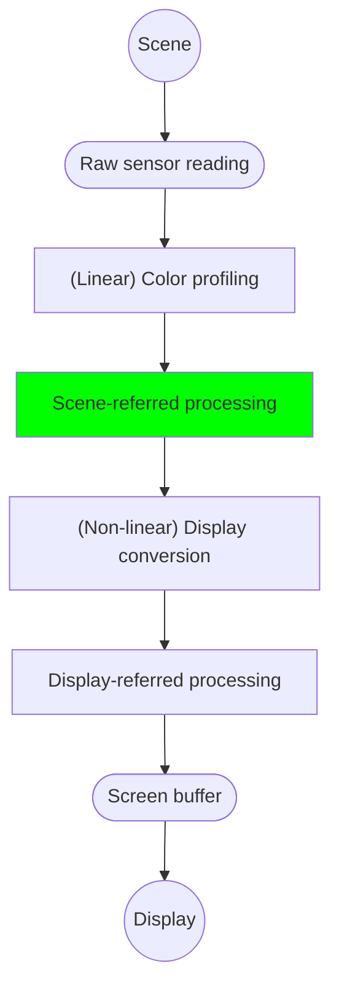
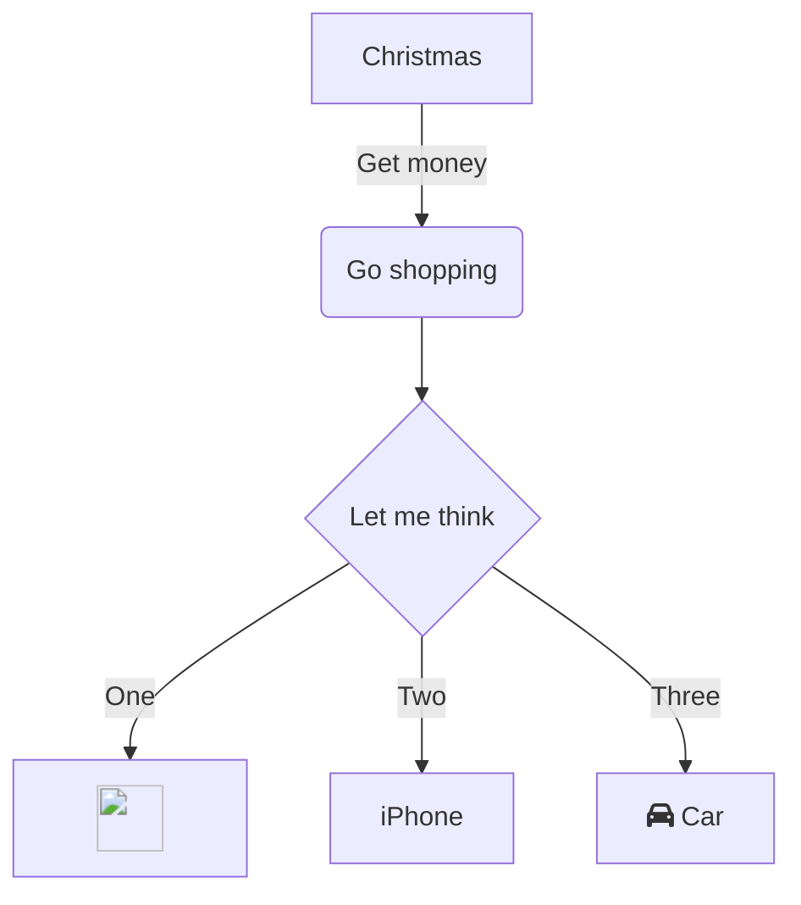

In this article, you will learn what the scene-referred workflow is, how Ansel uses it and why it benefits digital image processing at large.

<!--more-->

## Introduction

The scene-referred workflow is the backbone of the Ansel's imaging pipeline. It is a working logic that comes from the cinema industry because it is the only way to have robust, seamless, compositing (also known as *alpha blending*) and movies rely heavily on it for special effects.

If you have been using *any* kind of image processing software so far, you should be already familiar with the *display-referred* workflow, but without knowing neither its name nor what it actually implies. Explaining how *scene-referred* differs is going to be a challenge without explaining what *display-referred* was before.

## Making an image

When you take a picture of a scene, your camera sensor turns a light signal into 3 electric signals. Indeed, while the scene is a continuous collection of wavelengths (a [spectrum](https://en.wikipedia.org/wiki/Visible_spectrum)), the camera sensor splits it into an RGB [tristimulus](https://en.wikipedia.org/wiki/CIE_1931_color_space#Tristimulus_values) in a way that resembles how the [human retina](https://en.wikipedia.org/wiki/Fovea_centralis) works.

To

