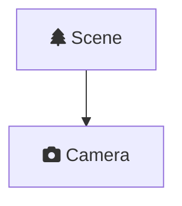
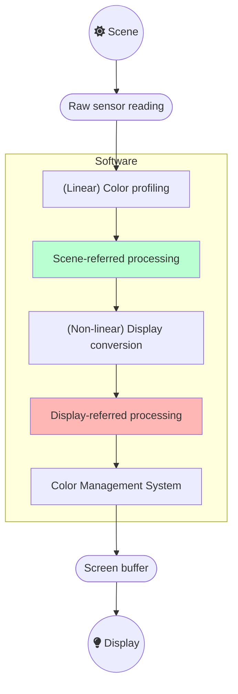
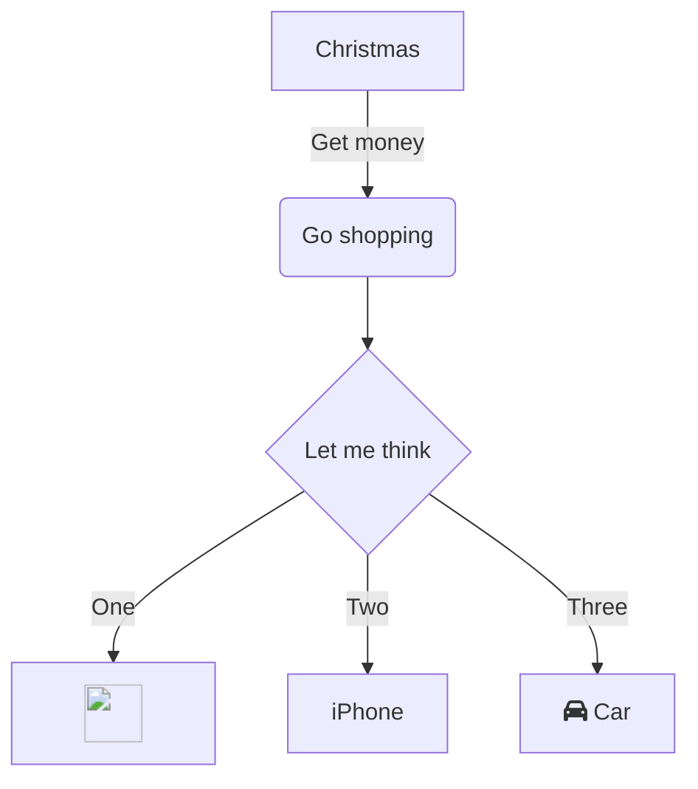

In this article, you will learn what the scene-referred workflow is, how Ansel uses it and why it benefits digital image processing at large.

<!--more-->

## Introduction

The scene-referred workflow is the backbone of the Ansel's imaging pipeline. It is a working logic that comes from the cinema industry because it is the only way to have robust, seamless, compositing (also known as *alpha blending*) and movies rely heavily on it for special effects.

If you have been using *any* kind of image processing software so far, you should be already familiar with the *display-referred* workflow, but without knowing neither its name nor what it actually implies. Explaining how *scene-referred* differs is going to be a challenge without explaining what *display-referred* was before.

## Making an image

When you take a picture of a scene, your camera sensor turns a light signal into 3 electric signals. Indeed, while the scene is a continuous collection of wavelengths (a [spectrum](https://en.wikipedia.org/wiki/Visible_spectrum)), the camera sensor splits it into an RGB [tristimulus](https://en.wikipedia.org/wiki/CIE_1931_color_space#Tristimulus_values) in a way that resembles how the [human retina](https://en.wikipedia.org/wiki/Fovea_centralis) works. The specifics are beyond the scope of this article, let us pretend the light spectrum gets splitted in 3 bands of wavelengths and each band is collapsed into an R, G, or B intensity such that the ratio of R, G and B in each pixel is a representation of the shape of the spectrum.


In the realm of raw sensor readings, the meaning of R, G, B channels is to be taken metaphorically because the sensor logic mimics the human photoreceptors linked to red, green and blue stimuli. However, the actual color primaries may not be what most people call green or blue, and anyway, sensor readings are not color but light emissions encoded. We call them RGB for consistency with the rest of the world, but in all rigor, they should be called A, B, C or 1, 2, 3 or whatever __not__ wrongly suggesting this triplet represents a color, because colors are defined only in human perceptual system and we are not there just yet.


The property of this raw RGB signal is to be scene-linear : the RGB code values are roughly proportional to the energy of the light emission. This is the closest representation we can take of a light spectrum, pending a fully spectral pipeline (as in [Manuka](https://www.wetafx.co.nz/research-and-tech/technology/manuka/)).

