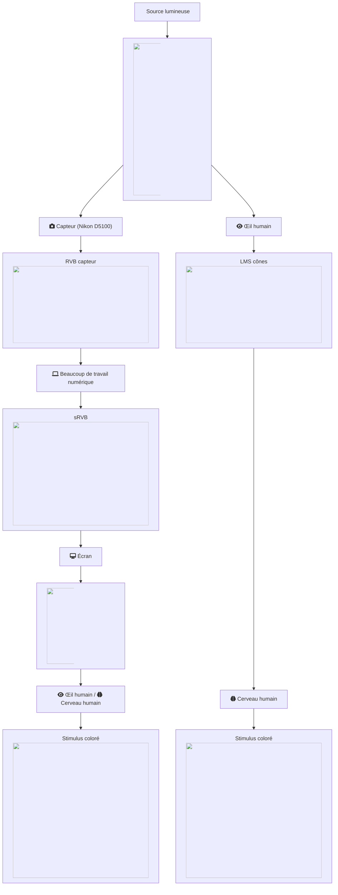
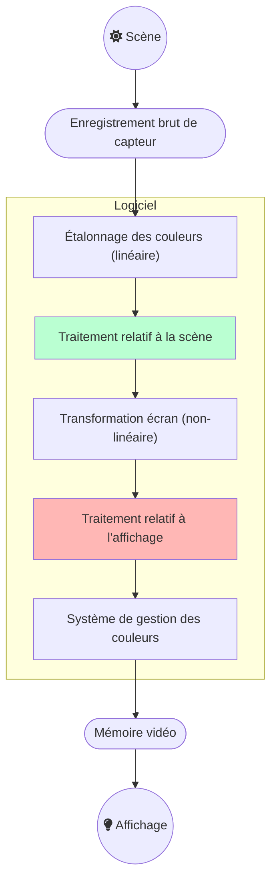
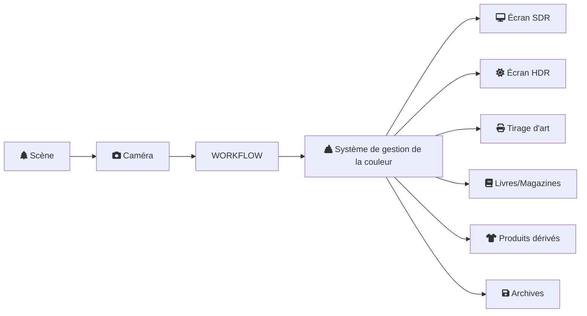

Dans cet article, vous apprendrez ce qu'est le flux de travail relatif à la scène, comment Ansel l'utilise et en quoi il profite au traitement d'image numérique en général.

<!--more-->

## Introduction

Le flux de travail relatif à la scène est la colonne vertébrale du pipeline d'imagerie d'Ansel. Il s'agit d'une logique de travail qui vient de l'industrie du cinéma car c'est la seule façon d'obtenir un _compositing_ (aussi nommé _fusion alpha_) de calques graphiques robuste et sans raccords visibles. Pour les photographes, c'est surtout pour les scènes à haute plage dynamique (HDR) (sujets en contre-jour, couchers de soleil, etc.) qu'il montre son intérêt.

Si vous avez déjà utilisé _n'importe quel_ type de logiciel de traitement d'image jusqu'à présent, vous devriez être déjà familiarisé avec le flux de travail _relatif à l'affichage_, mais sans savoir ni son nom ni ses hypothèses internes de travail. Expliquer en quoi le flux _relatif à la scène_ diffère de ce _relatif à l'affichage_ dont personne ne prononce le nom va être une gageure si l'on n'explique pas aussi ce que le flux _relatif à l'affichage_ a été avant.

## Faire une image

Quand vous prenez une photo d'une scène, le capteur de votre appareil transforme un spectre lumineux en 3 signaux électriques, de façon très semblable à ce que font les cellules cône de la rétine avant d'envoyer des influx électriques sur le nerf optique. Les détails sont hors du champ de cet article, mais prétendons que le spectre lumineux est découpé en 3 intensités R, V, B de sorte que les proportions de R, V, et B dans chaque pixel soient une assez bonne représentation de la forme du spectre.


Les graphiques ci-dessus sont générés par l'auteur à partir de données réelles. L'illuminant CIE FL1 est une ampoule fluo-compacte standard de type lumière du jour. Le « RVB humain » est produit en utilisant la réponse des cellules cônes de la rétine (LMS) pour l'observateur standard 2° CIE 2015. Le RVB capteur est produit à partir de mesures de sensibilité spectrale. La couleur réelle du spectre lumineux est un "blanc" lumière du jour (proche de D65).


On notera que le début et la fin du pipeline graphique sont un spectre lumineux qui, s'il est identique, produira le même stimulus coloré pour l'observateur[^4]. De même, les deux organes technologiques impliqués dans la capture du signal et sa restitution travaillent en RVB. Par contre, aucun espace RVB utilisé dans le pipeline ne correspond au signal LMS des cônes. Si l'on veut que l'image numérique paraisse au moins vaguement semblable à la perception humaine, nous allons devoir travailler dur pour que ça se produise, en manipulant numériquement le signal RVB brut, mais sans nécessairement se soucier de la perception au cours du processus. Il suffira d'assure la cohérence du spectre lumineux aux deux extrémités.

[^4]: Ceci suppose une plage dynamique de la scène suffisamment faible. Pour des plages dynamiques très élevées, les hautes lumières vont virer vers le jaune (virage de Bezold-Brücke), comme on peut l'observer avec le disque solaire ou les flammes, alors que le même spectre lumineux vu à une intensié plus faible apparaît rouge.

Ceci est un aspect malcompris de la photo numérique, où la manipulation numérique est souvent vue par les puristes comme un moyen de truquer ou de trafiquer le contenu, et l'image brute est souvent vue comme une sorte de vérité « neutre » ou « objective » parce qu'elle a été réalisée par une machine. L'image produite par la machine est en faite complètement fausse et la manipulation numérique est absolument nécessaire pour la faire ressembler à la scène originale malgré toutes les distorsions optiques survenues dans la caméra.

Réparer le RVB brut pour le faire ressembler plus ou moins à ce que le spectateur à perçu sur la scène requiert de manipuler les couleurs, en utilisant au moins un profil de couleur d'entrée et un ajustement de balance des blancs. Malheureusement, ceux-ci sont imprécis et ne correspondront toujours pas exactement à la vision humaine, surtout si la source de lumière de la scène n'est pas une lumière du jour naturelle (avec un spectre « plein »). Dans l'exemple ci-dessus, l'ampoule fluorescente montre un spectre pointu qui va faire apparaître certaines couleurs très particulières plus saturées et brillantes que le reste, ce qui sera très compliqué à corriger.[^3]

[^3]: La qualité d'un éclairage particulier est mesuré par son [indice de rendu des couleurs (CRI)](https://en.wikipedia.org/wiki/Color_rendering_index), qui exprime à quel point le spectre lumineux est proche d'une lumière du jour naturelle.

La propriété de ce signal RGB brut est d'être linéaire par rapport à la scène : les valeurs codées en RVB sont en gros proportionnelles à l'énergie de l'émission lumineuse. C'est donc la représentation la plus proche qu'on peut avoir du spectre lumineux, en attendant un pipeline entièrement spectral (comme dans [Manuka](https://www.wetafx.co.nz/research-and-tech/technology/manuka/)).

Malheureusement, dans la plupart des cas, on ne peut pas envoyer ce RVB linéaire directement à l'affichage de l'ordinateur, même après avoir corrigé les couleurs pour correspondre à la vision humaine, en général parce que :

1. la plage dynamique que le capteur peut enregistrer est bien plus large que ce que l'écran peut restituer,
2. pour utiliser cette plage dynamique au mieux, les fabricants d'appareil photos « sous-exposent » la scène d'environ 2/3 d'IL, ce qui fait paraître le RVB brut plutôt sombre.

En conséquence, nous devons au moins éclaircir les tons moyens et habituellement comprimer les hautes lumières, ce qui est le travail de la transformation écran.

Dans les firmwares des appareils photo et dans les applications typiques de traitement d'image, cette transformation écran est communément accomplie par une « courbe » (même si la courbe n'est que la représentation graphique de la transformation, pas la transformation elle-même) qui ressemble à ceci :




Le résultat de l'application d'une transformation écran pour écran SDR (après) par dessus le RVB brut étalonné (avant). Notez comme on a perdu du contraste local dans les hautes lumières, à cause de la compression, par souci d'éclaircir les tons moyens. Ceci est un compromis difficile à éviter sans introduire d'autres artefacts bien plus laids.


La pente de cette courbe détermine le contraste global. De nombreuses applications propriétaires vont appliquer une telle courbe sans vous le dire et sans vous laisser la désactiver, de sorte que vous n'avez aucune idée de ce qui se passe en coulisses. Certaines applications vont seulement vous laisser choisir un look de base parmi "par défaut", "neutre", "portrait", "intense", "HDR", etc. ce qui aura pour effet de charger une courbe différente. Certaines applications embarquent même la courbe directement dans le profil de couleur d'entrée.


Pour un éditeur logiciel commercial, le choix de cette courbe par défaut est crucial car il détermine la première impression que le client a en ouvrant sa photo, et cette première impression conditionne souvent le sentiment de qualité du logiciel. Cependant, les utilisateurs avancés regrettent souvent que la première étape de leur retouche doivent être annuler ou atténuer le look par défaut, ce qui n'est pas toujours facile. Vous trouverez ainsi des gens qui disent aimer « les couleurs Capture One » ou plutôt « les couleurs Lightroom », ce qui n'est rien de plus qu'un choix esthétique de l'éditeur quant au look par défaut.


## Travailler sur une image

Dans la section précédente, nous avons appris qu'il faudrait travailler, non seulement pour reconstruire une restitution crédible des couleurs à partir du RVB brut, mais aussi pour remapper correctement la plage dynamique de la scène vers l'appareil d'affichage cible. Ici, nous allons voir comment ce travail est effectivement réalisé, en étudiant spécifiquement l'étape « _Beaucoup de travail numérique_ » du diagramme de flux ci-dessus.

Si l'on généralise comment _n'importe quel_ logiciel de traitement d'image fonctionne, que ça soit les éditeurs classiques sur ordinateur, les firmwares des caméras, les applications mobiles, peu importe le flux qu'ils utilisent, on arrive à ce diagramme de flux : 

Les applications d'imagerie classiques n'utilisent pas du tout le traitement relatif à la scène, ou alors seulement pour quelques filtres techniques de reconstruction d'image, ce qui fait qu'ils passent directement de l'étalonnage des couleurs à la transformation écran. La manipulation numérique se fait seulement dans l'espace d'affichage, où le « blanc » est forcé à 100 % (ou à la valeur codée RVB `255` s'ils travaillent en RVB 8 bits), le « noir » est forcé à 0 % (ou à la valeur codée RVB `0` en RVB 8 bits), et le gris moyen est typiquement au milieu à 45-50 % (voir plus détails plus bas).

Le problème de cette logique réside dans le cycle de vie de la photo : 

Parce que le medium d'affichage cible peut maintenant être n'importe quoi, d'un T-shirt à un écran HDR, et toutes les variantes intermédiaires, nous avons besoin de différentes transformations écran pour s'adapter aux propriétés du médium cible. Mais si nous utilisons la transformation écran comme première étape de notre traitement, la changer va souvent invalider la retouche subséquente, en particulier si elle utilise des masques paramétriques. En pratique, ceci signifie que vous devez recommencer votre retouche pour chaque medium de sortie, ce qui est pénible.


Les systèmes de gestion de la couleur (CMS) typiques se basent sur les spécifications ICC v2 et ICC v4, qui sont conçues pour l'industrie de l'imprimerie, avec les faibles plages dynamiques (SDR) en tête. Ils se préoccupent seulement de convertir les pixels d'un espace RVB à un autre espace RVB mais ne gèrent pas la mise à l'échelle de la plage dynamique, l'adaptation des couleurs pour compenser les conditions de visualisation, et gèrent le mappage de gamut de façon assez grossière. Ils ne rentrent pas dans ce qu'on appelle « transformation écran » ici, et ne sont pas prêts pour le HDR, ce qui signifie que nous devons dépendre d'eux aussi peu que possible, et leur préparer un signal SDR avant de les utiliser.


Travailler dans la partie relative à la scène du pipeline signifie que l'on travaille avant la tranformation écran et que notre traitement sera insensible aux incohérences des media de sortie. Cela revient à travailler sur un traitement maître (un master) qui restera le même, peu importe la sortie, et donc à gérer les particularités de la sortie seulement lorsqu'on exporte le master. Supprimer la partie relative à l'affichage nous permet également de combiner les étapes de transformation écran et de gestion de la couleur, ce qui est très souhaitable puisqu'elles traitent toutes de la même chose : mapper le traitement maître vers le medium de sortie, en corrigeant ses particularités pour essayer de préserver l'intention d'apparence des couleurs pour le spectateur.

La difficulté de travailler dans la partie relative à la scène est que le « blanc » ne peut plus être présumé ancré à une valeur spécifique, mais il peut prendre toute valeur positive jusqu'à l'infini. Pour contourner ce manque de référence, on passe d'un pipeline défini par le blanc à un pipeline défini par le gris moyen, où le gris moyen réflectif (celui des cartes grises) est attendu à 0,18-0,20. Puisque le « blanc » HDR peut être 4 fois plus lumineux que le « blanc » SDR, la seule chose dont on est sûr, c'est que tous les systèmes d'affichage vont avoir leur gris moyen autour de 0,20 et tous seront capables de l'afficher, peu importe leur plage dynamique. Il se trouve également que les images de scènes naturelles ont la majorité de leur histogramme centré sur cette valeur.

On peut résumer les hypothèses de chaque flux de travail ci-dessous :

| Hypothèse | Relatif à la scène | Relatif à l'affichage (SDR) |
| -----------| ---------------| -----------------|
| Encodage RVB du point noir | > 0              | 0 % de la plage d'encodage           |
| Encodage RVB du point blanc | unspecified    | 100 % de la plage d'encodage      |
| Middle-grey RGB encoding| 0.18   | 18 % ou 45 % de la plage d'encodage |


Les valeurs de code RGB sont la représentation numérique de l'image à l'intérieur de l'ordinateur. Elles ne sont pas _directement_ connectées aux luminances dans le monde réel, aussi bien celles enregistrées sur la scène que celles obtenues sur l'écran de restitution. Par exemple, la luminance des pixels noirs mesurés sur un écran physique sera toujours autour de 0,1 Cd/m², alors qu'ils sont encodés `0` en RGB. Dans le flux relatif à la scène, on a souvent besoin de décaler le niveau de noir à des valeurs non-nulles pour le reconnecter à sa signification en terme de lumière.

Lorsqu'on travaille dans des espaces RVB encodés avec une [OETF](https://en.wikipedia.org/wiki/Transfer_functions_in_imaging) (improprement appelée « _gamma_ »), comme le sRGB, le Adobe RGB ou le Prophoto RGB, le gris moyen est attendu autour de 45 % de la plage d'encodage. [^1] Les applications utilisant un pipeline 8 bits en nombres entiers sont obligées d'utiliser du RVB encodé avec l'OETF pour éviter la postérisation dans les gradients. Les applications utilisant un pipeline 16 bits en nombres entiers choississent souvent de faire de même, par souci de cohérence, bien que ça ne soit pas une contrainte technique dans ce cas. Le gris moyen sera encodé à 18 % de la plage d'encodage dans les flux relatifs à l'affichage qui utilisent un RVB linéaire, nettoyé de son OETF/gamma.

[^1]: Cette propriété est massivement utilisée dans les interfaces graphiques, comme dans les [outils niveaux](https://www.cambridgeincolour.com/tutorials/levels.htm), parce qu'elle place le gris moyen effectivement au milieu de la plage noir-blanc, ce qui améliore l'utilisabilité, même si ça coûte cher sur le plan colorimétrique.

On peut à présent faire correspondre les hypothèses de chaque flux de travail sur les valeurs de code RVB avec leur signification en terme de luminance dans le monde réel :


| Hypothèse | Relatif à la scène | Relatif à l'affichage (SDR) |
| -----------| ---------------| -----------------|
| Luminance réelle du point noir | défini par l'utilisateur, dépendant de la scène | optionnellement défini dans les profils ICC |
| Luminance réelle du point blanc | défini par l'utilisateur, dépendant de la scène | 80-160 Cd/m² |
| Luminance réelle du gris moyen | carte grise   | 14-29 Cd/m² |


Les valeurs en Cd/m² de la colonne relative à l'affichage viennent des normes ISO habituelles pour le pré-presse. La luminance du point noir de l'affichage peut être optionnellement définie dans le profil ICC du medium, ce qui est souvent le cas pour les profils d'imprimante réalisés par des professionnels, en vue d'activer la [compensation du point noir](https://www.color.org/WP40-Black_Point_Compensation_2010-07-27.pdf). Comme l'OETF est décodée dans l'écran, la valeur de luminance du gris moyen est connectée à sa valeur de code RVB linéaire et sera trouvée à 18-20 % de la luminance du blanc de l'écran.

Pour le flux relatif à la scène, les luminances du noir et du blanc correspondent aux luminances minimale et maximale trouvées sur la scène. La référence du gris moyen est la pastille gris moyen d'un Color Checker (ou une carte grise) éclairée dans les mêmes conditions que le sujet de l'image. Il est donc possible de régler le gris moyen directement en échantillonnant la luminance d'une carte grise dans une photo de test.

## Bénéfices pratiques du flux relatif à la scène

Nous avons vu dans la section précédente que le flux relatif à la scène nous permet de travailler sur un traitement maître indépendamment de tout medium de sortie prédéfini. Les avantages ne s'arrêtent pas là.

D'abord, puisque le flux relatif à la scène est conçu autour de l'idée que le « blanc » n'a pas de valeur prédéfinie, il peut s'adapter à n'importe quelle plage dynamique d'entrée, ce qui veut dire que les mêmes outils et le même flux de travail peuvent être utilisés pour traiter des photos numériques, des images de synthèse ou n'importe quel type de HDR composite.

Ensuite, il s'illustre particulièrement dans les filtres numériques définis optiquement, essayant de reproduire des effets réels, comme le floutage, le défloutage, la suppression du bruit et la reconstruction de signaux. Les exemples ce-dessous montrent la différence entre appliquer un filtre de bokeh synthétique, simulant un diaphragme d'objectif, avant ou après la transformation écran.




Le résultat de l'application d'un flou d'objectif avant (relatif à la scène) ou après (relatif à l'affichage) la transformation écran. La relation de clarté entre les bulles de bokeh et l'environnement sombre est détruite et incohérente en relatif à l'affichage.


Comme le flou d'objectif affecte la lumière, et que le RVB linéaire par rapport à la scène est la plus proche représentation numérique qu'on peut avoir de la lumière réelle, il est simplement logique d'appliquer des filtres numériques définis optiquement dans la partie relative à la scène du pipeline, mais l'exemple ci-dessus confirme visuellement la validité du raisonnement.

Des effets similaires seront observés en travaillant avec des masques et le compositing alpha, lorsqu'on veut adoucir les bords des masques pour mieux les fusionner dans l'environnement (ce qui, encore une fois, est un flou).

## Comment est-ce implémenté dans Ansel ?

Ansel est capable d'utiliser à la fois le flux relatif à la scène et le flux relatif à l'affichage, car il hérite de certains modules anciens de darktable. La plupart des modules relatifs à l'affichage ont été remplacés par des équivalents relatifs à la scène, et les derniers restants devraient suivre en 2023.

Bientôt, Ansel sera entièrement relatif à la scène, ce qui permettra des transformations écran plus intelligentes, combinées avec le mappage de gamut et des extractions de profil ICC.

Il n'est généralement pas possible d'utiliser des modules prévus pour le flux relatif à l'affichage dans la partie du pipeline relative à la scène, car ils attendent un point blanc à 100 %, et vont généralement écrêter les valeurs RVB supérieures à 100 % (certains doivent le faire pour éviter des instabilités numériques dans les algorithmes). Certains attendent même un point gris à 50 %, comme les [modes de fusion](https://en.wikipedia.org/wiki/Blend_modes) alpha _écran_, _lumière douce_, _lumière dure_, _incrustation_, _éclaircir_, _assombrir_ qui traitent différemment les pixels dont les valeurs sont supérieures ou inférieures au seuil de 50 %.
