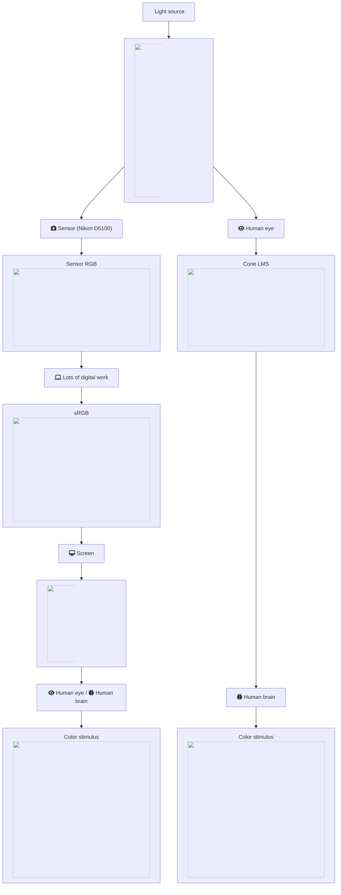
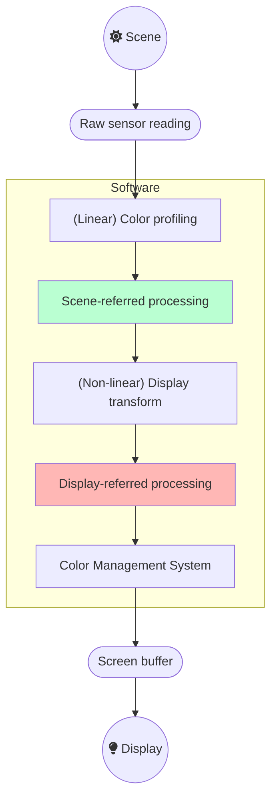
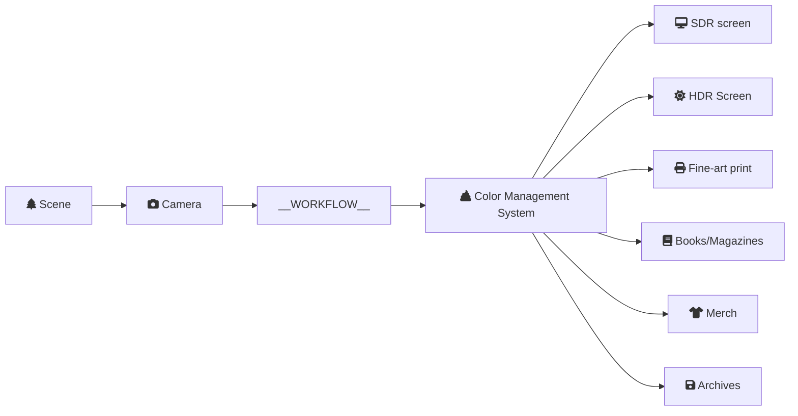

In this article, you will learn what the scene-referred workflow is, how Ansel uses it and why it benefits digital image processing at large.

## Introduction

The scene-referred workflow is the backbone of the Ansel's imaging pipeline. It is a working logic that comes from the cinema industry, because it is the only way to achieve robust, seamless compositing (also known as *alpha blending*) of layered graphics, upon which movies rely heavily to blend computer-generated special effects into real-life footage. For photographers, it is mostly for high dynamic range (HDR) scenes (backlit subject, sunsets, etc.) that it proves itself useful.

If you have been using *any* kind of image processing software so far, you should be already familiar with the *display-referred* workflow, but without knowing neither its name nor its core assumptions. Explaining how *scene-referred* differs from this unspoken _display-referred_ you are used to is going to be a challenge without explaining what *display-referred* was before.

## Making an image

When you take a picture of a scene, your camera sensor turns a light spectrum into 3 electric signals, much like the retina cone cells do it before sending electric impulses to the optical nerve. The specifics are beyond the scope of this article, but let us pretend the light spectrum gets split into three R, G, and B intensities such that the ratio of R, G and B in each pixel is a fair-enough representation of the shape of the spectrum.


The graphs above are generated by the author from real data. The CIE FL1 illuminant is a standard daylight fluorescent (energy-saving) light bulb. The "human RGB" is produced using the retina cone cells response (LMS) for the CIE 2015 2° Standard Observer. The sensor RGB is produced from spectral sensitivity measurements. The actual color of the light spectrum is a daylight "white" (close to D65).


We should note that the beginning and the end of the graphic pipeline are a light spectrum which, if identical, will produce the same color stimulus for the observer[^4]. But the light spectra are actually quite different : the large spikes from the FL1 illuminant have been smoothened once displayed on an sRGB screen. The difference between the original scene and its rendition on screen comes from the signal losses that are unavoidable when reducing a spectrum to RGB, which is designed to work only with daylight-like (smooth) spectra. This assumption is often forgotten, and the problem we see here comes at no surprise, given that the FL1 illuminant has a [CRI](https://en.wikipedia.org/wiki/Color_rendering_index) of 76 %. In fact, we can predict how a such illuminant, although technically balanced for D65, will affect color rendition:



So this illuminant will make red and purple surfaces look less saturated than they should, compared to other colored surfaces, and will also shift their hues. Blue and green surfaces will appear mostly unaffected. However, we can note that the actual perceived color of a such illuminant (that is, "the shade of white") shows no visible shift despite the spectra difference. The relative color deviation is indeed lower than 0.001 % in chromatic coordinates u'v'. This is all to show that the intrications between spectra (from the illuminant as well as from light reflected by material, colored, surfaces) and color perception are far from intuitive and clearly not easily predicted.

Similarly, both technological organs involved in the signal capture and its restitution work in RGB. But, none of the involved RGB spaces actually match the cone LMS. If we want the digital image to look remotely close to the human perception of the scene, we will need to work hard to make that happen, by digitally manipulating the raw RGB signal, but without necessarily caring about perception in the process. It will be enough to ensure the consistency of the light spectrum at both ends.

[^4]: This is assuming the dynamic range of the scene is small enough. For very high dynamic range, highlights will shift to yellow (Bezold-Brücke shift), as can be observed with the sun disc or flames, while the same spectrum at a lower intensity will appear red.

This is a misunderstood aspect of digital photography where digital manipulation is often thought by purists as faking or tampering content, and the raw image is often seen as a sort of "neutral" or "objective" truth because it was made by a machine. The image produced by the machine is actually quite off and digital manipulation is absolutely necessary to make it look like the original scene despite all the optical distortions that happened in the camera.

Fixing the raw RGB to make it look somewhat like what the viewer experienced on the scene requires to manipulate colours, using at least an input color profile and a white balance adjustment. Unfortunately, these are inaccurate and will still not exactly match human vision, especially when the light source of the scene is not a natural daylight (with a "full" spectrum). In the example above, the fluorescent bulb shows a spiky spectrum that will make some very particular colors appear more saturated and bright than the rest of them, which will be challenging to correct.[^3]

[^3]: The quality of a particular lighting is measured by its [Color Rendering Index (CRI)](https://en.wikipedia.org/wiki/Color_rendering_index), which expresses how close the light spectrum is from natural daylight.

The property of this raw RGB signal is to be scene-linear : the RGB code values are roughly proportional to the energy of the light emission. This is the closest representation we can take of a light spectrum, pending a fully spectral pipeline (as in [Manuka](https://www.wetafx.co.nz/research-and-tech/technology/manuka/)).

Unfortunately, in most cases we can't just send this linear RGB to the computer display, even after correcting colors to match human vision, usually because :

1. the dynamic range that sensors can capture is much larger than what screens can render,
2. to better use this dynamic range, camera manufacturers "under-expose" the scene by roughly 2/3 of EV, which will make the raw RGB appear quite dark.

Therefore, we need at least to brighten the mid-tones and usually to compress the highlights, which is the job of the display transform.

In camera firmwares and in typical image editing applications, this display transform is commonly achieved through a "curve" (though the curve is only the graphical representation of the transform, not the transform itself) resembling this :




The result of applying a display transform for SDR screen (after) over calibrated raw RGB (before). Note how we lost local contrast in highlights, due to the compression, for the sake of brightening mid-tones. This is a trade-off difficult to avoid without introducing other much uglier artifacts.


The slope of this curve determines the global contrast. Many proprietary applications will apply a such curve without telling you and without letting you disable it, so you may have no idea what happens backstage. Some applications only let you choose a base look between "default", "neutral", "portrait", "intense", "HDR", etc. which will load a different curve. Some applications even embed the curve in the input color profile.


For a commercial software publisher, the choice of this default curve is crucial because it determines the first impression that the customer has when opening his photo, and this first impression often conditions the feeling of quality of the software. However, advanced users often regret that the first step of their editing is to cancel or soften the default look, which is not always easy. You will find people saying they like "Capture One colors" or rather "Lightroom colors", which is nothing more than an aesthetic choice of the publisher regarding the default look.


## Working on an image

In the previous section, we learned that we would have to work to not only to reconstruct a believable color rendition from the raw RGB, but also to remap the scene dynamic range properly for the target display device. Here, we will see how this work is actually done, by studying more specifically the "_Lots of digital work_" step of the previous section flowchart.

If we generalize how _any_ image processing software works, being typical desktop editors, in-camera firmware, mobile apps, no matter what workflow they use, we come to this flowchart :

The typical image applications don't make use of the scene-referred processing at all, or only for some technical image reconstruction filters, so they go directly from the color profiling to the display transform. The digital manipulation happens solely in display space, where "white" is forced at 100 % (or the code value `255` when working in 8 bits RGB), "black" is forced at 0 % (or the code value `0` in 8 bits RGB), and middle-grey is typically in the middle at 45-50 % (see more details below).

The problem of this logic lies in the life cycle of the picture :

Because the target display medium can now be anything from a T-shirt to an HDR screen, and everything in-between, we need to use different display transforms to account for the properties of the target medium. But if we use the display transform as the first step of our editing, changing it will often void the subsequent editing, especially if it used parametric masks. This practically means you need to redo your editing for each output medium, which is tedious.


Typical color management systems (CMS) rely on the ICC v2 and ICC v4 specifications, which are designed for the printing industry with small dynamic range (SDR) in mind. They only take care of converting pixels from RGB space to RGB space but do not handle dynamic range rescaling, color adaptation to compensate for viewing conditions, and handle gamut mapping pretty coarsely. They do not fall under what we call "display transform" here, and are not ready for HDR, which means we need to rely on them as little as possible and bake them an SDR signal before using them.


Working in the scene-referred part of the pipeline means we work before the display transform and our editing will be immune to the output medium discrepancies. This is like working on a "master edit" that will stay the same, no matter the output, and then dealing with the specifics of the output when we export the master. Removing the display-referred part of the workflow allows to collapse the display transform and the color management steps, which is very desirable because they all deal with the same task : mapping the "master edit" to whatever output medium we have, by correcting its peculiarities to try and preserve the intent color appearance for the audience.

The challenge of working in the scene-referred part is that "white" can't be assumed to be anchored at a specific value anymore, but can be anything positive up to infinity. To circumvent this lack of reference, we switch from a "white-centric" pipeline to a "grey-centric" pipeline, where the reflective middle-grey (the one of the grey cards) is expected to be anchored at 0.18-0.20. Since the HDR "white" can be 4 times as bright as the SDR "white", all we know is that all devices will have a middle-grey around 0.20 and all devices will be able to display it, no matter their dynamic range. It also turns out that images of natural scenes have most of their histogram centered around this value.

We can summarize the assumption of each workflow below :

| Assumption | Scene-referred | Display-referred (SDR) |
| -----------| ---------------| -----------------|
| Black point RGB encoding| > 0              | 0 % of the encoding range               |
| White point RGB encoding| unspecified    | 100 % of the encoding range      |
| Middle-grey RGB encoding| 0.18   | 18 % our 45 % of the encoding range |


The RGB encodings are the digital representation of the image inside the computer. They are not  _directly_ connected to the real-world luminance, either recorded on the original scene or on the rendering display. For example, the luminance of black pixels measured on physical displays will be around 0.1 Cd/m², whereas will be encoded `0` in RGB. In the scene-referred workflow, we often need to offset black to non-zero RGB values to reconnect with its luminous meaning, upon which we rely.

When working in RGB spaces encoded with an [OETF](https://en.wikipedia.org/wiki/Transfer_functions_in_imaging) (wrongly dubbed "_gamma_"), like sRGB, Adobe RGB or Prophoto RGB, middle-grey is expected around 45 % of the encoding range. [^1] Applications having an 8 bit integer pipeline have to use OETF-encoded RGB to avoid posterization in gradients. Applications having a 16 bits integer pipeline often choose to do the same for consistency, although it's not a technical requirement in this case. Middle-grey will be encoded at 18 % of the encoding range in display-referred workflows that use linear RGB, that is RGB spaces stripped off of their OETF/gamma.

[^1]: This property is extensively used in graphical interfaces, like in typical [levels tools](https://www.cambridgeincolour.com/tutorials/levels.htm), because it puts the middle-grey effectively in the middle of the black-white range which makes for a nice usability, even though it comes at an high price in terms of colorimetry.

We can now match the assumptions of each workflow on the RGB code values to their meaning in terms of real-life luminance :

| Assumption | Scene-referred | Display-referred (SDR) |
| -----------| ---------------| -----------------|
| Black point actual luminance | user-defined, scene-dependent | optionally defined in ICC profiles |
| White point actual luminance | user-defined, scene-dependent | 80-160 Cd/m² |
| Middle-grey actual luminance | grey card   | 14-29 Cd/m² |


The Cd/m² values in the display-referred column come from the usual pre-print ISO standards. The black point luminance of the display can optionally be defined in the medium ICC profile, which is often the case for professionally-made printer profiles, in order to enable the [black point compensation](https://www.color.org/WP40-Black_Point_Compensation_2010-07-27.pdf). Since the OETF gets decoded inside the screen, the luminance value of middle grey is connected to the linear RVB code value and will be found at 18-20 % of the screen white luminance.

For the scene-referred workflow, black and white luminances match the minimum and maximum luminances found on the scene. The middle-grey reference is the middle-grey patch of a Color Checker (or a grey card) lit under the same conditions as the subject of the image. It is therefore possible to set the middle-grey directly from sampling the luminance of a grey card in a test photo.

## Practical benefits of the scene-referred workflow

We have seen in the previous section that the scene-referred workflow allows you to work your master edit independently from any fixed target medium. The benefits of it don't stop there.

First, because scene-referred is designed around the idea that "white" has no particular fixed value, it can scale to any input dynamic range, which means that the same tools and workflow can be used to process digital photographs, synthetic renderings or any kind of composite HDR.

Then, where it really shines is for all optically-defined digital filters trying to mimic real-life effects, like blurring, deblurring, removing noise or reconstructing signals. The example below showcases the difference it makes to apply a digital bokeh filter, simulating a lens diaphragm, before or after the display transform.




The result of applying a lens blur before (scene-referred) or after (display-referred) the display transform. The relationship in brightness between the bokeh bubbles and the dark surround is destroyed and inconsistent in display-referred.


Since lens blur happens on light, and scene-linear RGB is the closest digital representation we can have of real light, it only makes sense to apply optically-defined digital filters in the scene-linear part of the pipeline, but the above example visually confirms the validity of the reasoning.

Similar effects will be observed when working with masks and alpha compositing, when one wants to feather and smooth the edges of the masks to better blend them with the surrounding (which, again, is a blur).

## How is it implemented in Ansel ?

Ansel is able to use both the display-referred and scene-referred workflows, because it inherits some legacy modules from darktable. Most display-referred modules have been replaced by scene-referred counterparts, and the remaining ones should follow in 2023.

Soon, Ansel will be entirely scene-referred, allowing for more clever display transforms combined with gamut mapping and ICC profiles extractions.

It is generally not possible to use display-referred modules in the scene-referred part of the pipeline, because they expect a white point at 100 %, and will generally clip RGB values above 100 % (some need to do it to avoid numeric instabilities in algorithms). Some even expect a grey point at 50 %, like the alpha [blending modes](https://en.wikipedia.org/wiki/Blend_modes) _screen_, _soft light_, _hard light_, _overlay_, _dodge_, _burn_ which process differently pixels which values are greater or lower than the  50 % threshold.
